```{r setup, include=FALSE}
knitr::opts_chunk$set(echo=TRUE, tidy.opts = list(width.cutoff = 70), tidy = TRUE, message=FALSE, warning=FALSE)
```

This lesson sits at the intersection of two skills that every business analyst needs right now: knowing how to use generative AI responsibly, and knowing how to communicate data honestly through visualization. It comes before the inferential statistics modules — hypothesis testing, ANOVA, and regression — because both skills are prerequisites for using those tools well. AI will write your code and generate your charts; visualization principles determine whether those charts actually answer the right question.

We begin with **generative AI**: what it is, how it works at a conceptual level, what its limitations are, and how to use it effectively through prompt engineering. The goal is not to understand the architecture of a neural network — it is to understand what AI can do reliably, what it cannot, and what judgment you must supply. A business statistics student using AI without this foundation will produce fast, confident, and potentially wrong analysis.

We then move to **data visualization principles**: the perceptual science behind why some charts communicate and others mislead, the aesthetic channels through which data is encoded, the taxonomy of visualization failures (Good, Ugly, Bad, Wrong), seven reasoning errors that show up in real-world charts, and the relationship between correlation and causation. These concepts apply directly to the outputs AI will generate for you throughout this course.

The lesson closes with the **Kaiser Fung Trifecta Checkup** — a three-corner framework for evaluating any data visualization on question quality, data quality, and visual execution — applied as a hands-on activity in which you use AI to build a chart and then critique it systematically. The activity is designed to make the limits of AI concrete: AI almost always passes the visual corner by default; the question and data corners require your statistical judgment.

By the end of this lesson, you should be able to explain what generative AI is and is not, write effective prompts for data analysis tasks, identify hallucinations and verify AI output, apply Wilke's visualization principles to evaluate and improve charts, recognize the seven reasoning errors in real data graphics, and use the Trifecta Checkup to diagnose any visualization. This foundation will carry through every subsequent lesson in the course.

### At a Glance

-   This lesson connects two themes that run through the entire course: using AI as a tool, and communicating data honestly. Neither is optional for a modern business analyst. Pay close attention to what AI can and cannot do — especially the distinction between tasks that are mechanical (AI handles well) and tasks that require statistical judgment (AI cannot substitute for you). The same applies to visualization: a chart can be visually polished and analytically wrong at the same time.

### Lesson Objectives

-   Define generative AI and distinguish it from predictive AI, with business examples of each.
-   Explain the concept of hallucination and apply the five warning signs to evaluate AI output.
-   Write effective prompts using zero-shot, few-shot, and chain-of-thought techniques.
-   Describe the six visual aesthetics and identify which is most perceptually precise.
-   Apply Wilke's Good/Ugly/Bad/Wrong taxonomy to classify a visualization failure.
-   Identify at least four of the seven reasoning errors in a real data graphic.
-   Explain the difference between correlation and causation and name the three conditions required for the latter.
-   Apply the Kaiser Fung Trifecta Checkup to evaluate an AI-generated visualization.

### Consider While Reading

-   As you read the AI section, keep one question in mind: *what am I responsible for that the AI is not?* AI handles mechanical execution — it runs code, generates text, selects chart types. You are responsible for the question, the data, the interpretation, and the verification. Every concept in this lesson maps to one of those responsibilities.
-   In the visualization section, notice that every pitfall has an underlying perceptual or logical mechanism. Understanding why a chart misleads is more useful than memorizing a list of rules — it lets you catch problems in novel situations the rules do not cover.
-   The Kaiser Fung activity is deliberately structured so that the AI will make at least one mistake worth catching. The goal is not to produce a perfect chart; it is to practice the diagnostic thinking that turns chart generation into chart argument.

------------------------------------------------------------------------

# Understanding Generative AI

## What Is Generative AI?

**Generative AI** refers to AI systems that create new content — text, code, images, audio, and video — based on patterns learned from training data. It is distinct from **predictive AI**, which forecasts outcomes from historical data without producing new content.

| Type | Goal | Business example |
|------------------------|------------------------|------------------------|
| Generative AI | Create new content | Drafting a report, writing R code, generating chart titles |
| Predictive AI | Forecast outcomes | Customer churn model, demand forecasting, credit scoring |

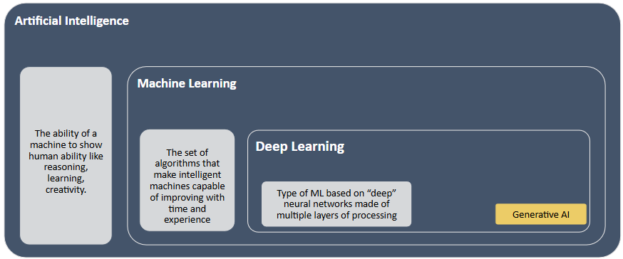

Both types are useful in a statistics course. Predictive AI is what you are building when you run a regression. Generative AI is what helps you write, code, and communicate. Understanding the difference prevents misuse.

Notable tools in a business statistics context: **ChatGPT** and **Claude** (text and code generation), **GitHub Copilot** (code completion in your editor), and **Perplexity AI** (search combined with generative synthesis).

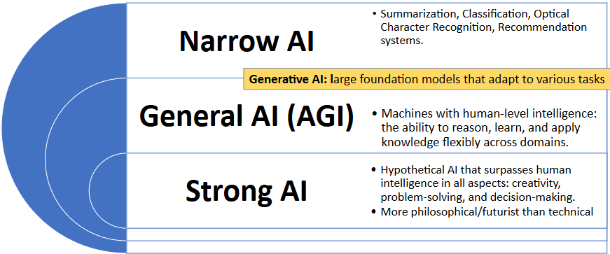

## How Generative AI Works: A Conceptual Overview

Generative AI systems — specifically **large language models (LLMs)** like GPT-4 and Claude — are trained on massive text corpora to predict the most likely next word given a sequence of prior words. This sounds simple, but at sufficient scale (billions of parameters, trillions of training tokens) it produces systems capable of reasoning, code generation, summarization, and dialogue.

Two concepts explain most of what you will observe when using these tools:

**Tokenization** — the model does not read words; it reads *tokens*, which are chunks of text (often subwords). "Unbelievable" might become `["un", "believ", "able"]`. The model learns statistical relationships between token sequences across enormous amounts of text.

**Attention mechanisms** — instead of processing text strictly left-to-right, the model can attend to any prior token when predicting the next one. This is what allows it to understand that "bank" means something different in "river bank" and "savings bank."

The key insight for a business analyst: **the model is predicting language, not computing truth.** When it writes `mean(x) = sum(x) / length(x)`, it is not running a calculation — it is recognizing that this string follows that kind of prompt in training data. Usually this is correct. Sometimes it is not.

## The Limits of Generative AI

Understanding what AI does reliably versus what it struggles with is the most practical thing in this section.

| AI handles well | Requires your judgment |
|------------------------------------|------------------------------------|
| Writing and editing code syntax | Verifying that the code answers your question |
| Generating chart boilerplate | Evaluating whether the chart is analytically honest |
| Summarizing text and documents | Checking whether the summary is accurate |
| Explaining statistical concepts | Deciding whether the explanation applies to your context |
| Formatting and structuring output | Determining whether the structure serves your audience |
| Arithmetic in simple expressions | Any multi-step calculation (AI approximates, not computes) |


This table maps directly to Kaiser Fung's Trifecta: AI handles the **V** corner (visual execution) reliably. The **Q** (question) and **D** (data) corners require you.

## LLM Hallucinations

**Hallucinations** occur when an LLM generates plausible-sounding but factually incorrect content. The model does not know it is wrong — it produces the statistically most likely continuation of the prompt, which can be entirely fabricated.

A real example: a lawyer asked ChatGPT to provide legal cases supporting an argument. The model returned several cases with plausible names, courts, years, and rulings. None of them existed. The lawyer submitted them to a federal court and faced disciplinary proceedings.

Hallucinations are not a fixable bug — they are a structural property of how language prediction works. When the correct answer is rare or absent in training data, the model produces whatever is statistically likely, not whatever is true.

**Five warning signs:**

| Warning sign | Example |
|------------------------------------|------------------------------------|
| **Unverified specificity** | Exact statistics cited without a source |
| **Invented sources** | Journal articles, court cases, or datasets that do not exist |
| **Internal contradictions** | Two claims within the same response that conflict |
| **Overconfident language** | "This is definitively true" on an uncertain or contested topic |
| **Failures of common sense** | Physically or logically impossible claims |

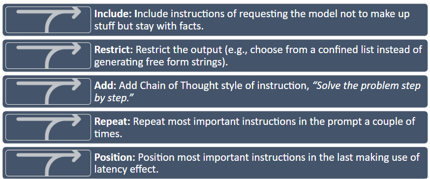

**Practical rule:** always verify AI-generated facts, citations, and calculations against an authoritative source before using them in any deliverable.

------------------------------------------------------------------------

## Prompt Engineering


**Prompt engineering** is the practice of crafting inputs to elicit reliable, specific outputs from AI systems. The core principle is direct: the quality of the prompt determines the quality of the response. A vague prompt produces a vague answer.

### Three Prompting Strategies

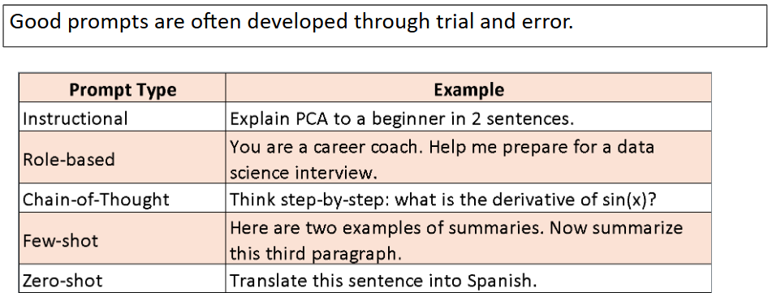

**Zero-shot prompting** — give the task with no examples. Works well for straightforward requests.

> *"Classify this customer review as positive, negative, or neutral: 'The delivery was two days late and the packaging was damaged.'"*

**Few-shot prompting** — provide a small number of labeled examples before the target. Useful when the format or classification scheme needs to be demonstrated.

> *"Classify each as positive, negative, or neutral.* *'Great service, arrived early' → positive* *'Wrong item sent' → negative* \*'Package arrived on time' → \_\_\_"\*

**Chain-of-thought prompting** — instruct the model to reason through steps before answering. Significantly improves accuracy on multi-step or ambiguous tasks.

> *"Classify the following review as positive, negative, or neutral. Think step by step: first identify the key sentiment signals, then determine the overall tone, then give your classification. Review: 'The product quality is fine but customer support never responded to my three emails.'"*

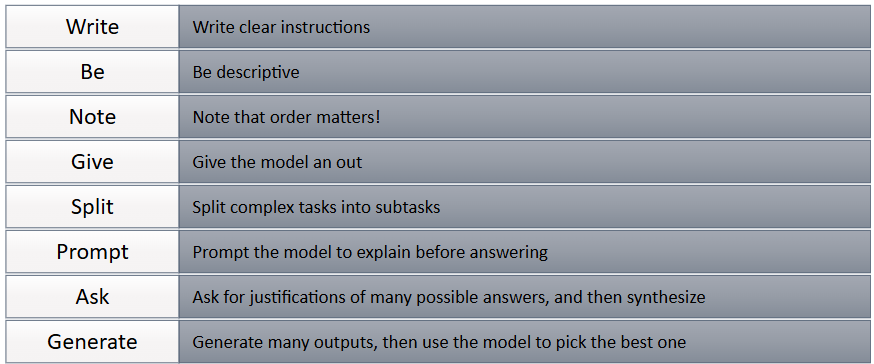

### Tips for R and Statistics Prompts

When using AI to help with R code or statistical analysis, specificity dramatically improves output quality:

| Vague prompt | Specific prompt |
|------------------------------------|------------------------------------|
| "Make a chart of my data" | "Using ggplot2, create a bar chart of mean home_value by season from zillow.csv. Use `fill` to color by season, sort bars from highest to lowest mean, and label the y-axis in dollars." |
| "Run a t-test" | "Run a two-sample t-test comparing home_value between Summer and Winter observations in zillow.csv. State the hypotheses, run `t.test()`, and interpret the p-value at α = 0.05." |
| "What does this output mean?" | "I ran `summary(lm(home_value ~ season, data=zillow))` and got these results: \[paste output\]. Explain what the Intercept, seasonSpring coefficient, and p-values mean in plain English for a non-statistician." |

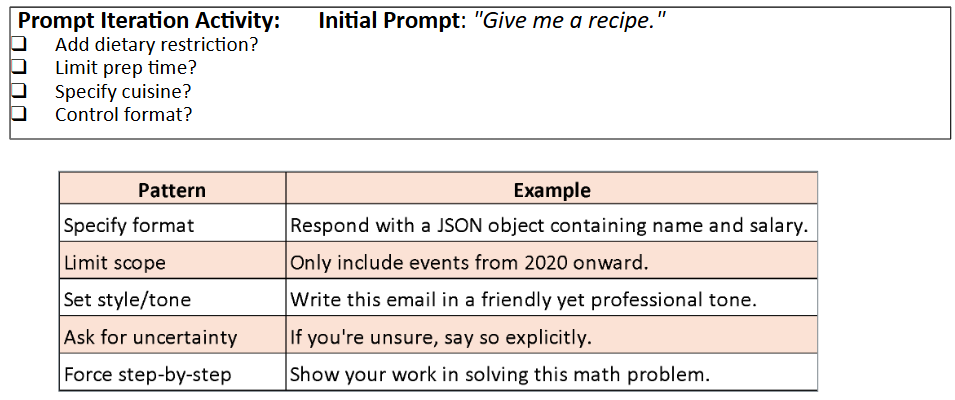

### Verifying AI Output

No AI-generated R code or statistical interpretation should be submitted without verification. Three-step check:

1.  **Run the code** — does it execute without errors?
2.  **Sanity-check the output** — do the numbers make sense given what you know about the data?
3.  **Verify the interpretation** — does the AI's explanation match the statistical meaning of the output?

Step 3 is where statistical knowledge is irreplaceable. An AI can produce a confidence interval and write a plausible-sounding sentence about it — but you need to know whether the sentence is correct.

------------------------------------------------------------------------

## Generative AI Lab

**1.** What is the fundamental difference between generative and predictive AI? Give one example of each that a marketing analyst might use, and explain which type you are building when you run a regression in this course.

::: {.callout-note collapse="true"}
### Show Answer

**Predictive AI** forecasts outcomes from historical data — a churn model that scores each customer's probability of cancellation is predictive. **Generative AI** creates new content — a tool that drafts personalized email copy for each segment is generative. When you run a regression in this course, you are building a **predictive** model: you are using past values of X to estimate Y, not generating new content. Many students assume "AI" refers only to generative tools; regression and classification models are AI too, just not the generative kind.
:::

**2.** A colleague shows you an AI-generated analysis that includes this sentence: "According to the 2023 Nielsen Consumer Confidence Index (Vol. 12, pp. 34–41), customers aged 25–34 are 2.3× more likely to switch brands after a single negative service experience." Which hallucination warning signs should you check, and what is the most efficient way to verify this claim?

::: {.callout-note collapse="true"}
### Show Answer

Two warning signs are present: **unverified specificity** (the precise multiplier of 2.3×, the specific volume and page numbers) and **invented sources** (the "Nielsen Consumer Confidence Index" with that specific citation does not correspond to a known Nielsen publication). The most efficient verification: search Nielsen's official publications database for the exact report title and volume. If it does not appear, the citation is fabricated. A secondary check: search for the specific "2.3× more likely" statistic in media coverage of Nielsen research — legitimate statistics of that precision tend to get cited widely. If neither check turns up the claim, do not use it.
:::

**3.** Rewrite the following weak prompt as a specific, well-structured prompt that would produce useful output for a business statistics course: *"Tell me about wages in my dataset."*

::: {.callout-note collapse="true"}
### Show Answer

A strong rewrite:

> "I have a dataset called zillow.csv with a numeric variable `home_value` (estimated home value in dollars) and a factor variable `season` (Fall, Spring, Summer, Winter). Using R, please: (1) calculate the mean, median, standard deviation, and IQR of `home_value` for the full dataset; (2) calculate the same statistics broken out by `season` using `group_by()` + `summarise()`; (3) run `skew()` from the semTools package to check whether `home_value` is normally distributed; and (4) write a two-sentence interpretation of what the summary statistics tell us about home value variation across seasons."

This is stronger because it names the variables, specifies the exact functions, defines the scope of the analysis (four questions, not open-ended), and asks for an interpretation — not just output.
:::

------------------------------------------------------------------------

# Data Visualization Principles

With AI established as a tool and its limits understood, we now turn to the output that AI most commonly produces in a business analytics context: data visualizations. A chart generated in seconds by AI is only as good as the statistical and perceptual principles behind its design choices. This section builds the vocabulary to evaluate, improve, and — when necessary — reject AI-generated visualizations.

## Why Good Research Methods Matter

Wilke (2019) argues that data visualization combines art and science. A visualization must accurately represent the data *and* be visually interpretable. These two requirements pull in different directions: overemphasis on design can obscure statistical honesty; overemphasis on accuracy can produce charts that nobody reads.

The purpose of the analysis shapes every design decision. Four analytical purposes demand different visualization strategies:

| Purpose | What you are trying to show | Example |
|------------------------|------------------------|------------------------|
| **Describe** | Trends, patterns, distributions in data | Bar chart of weekly active users by feature |
| **Predict** | Forecasted values or expected outcomes | Line chart projecting next quarter's sales |
| **Explain** | Causal or comparative relationships | Side-by-side chart with control vs. treatment groups |
| **Understand** | Contextual, layered patterns | Dashboard combining time, geography, and segment |

Before building any chart, know which purpose you are serving. An explanatory chart that is mistaken for a descriptive one will be misread every time.
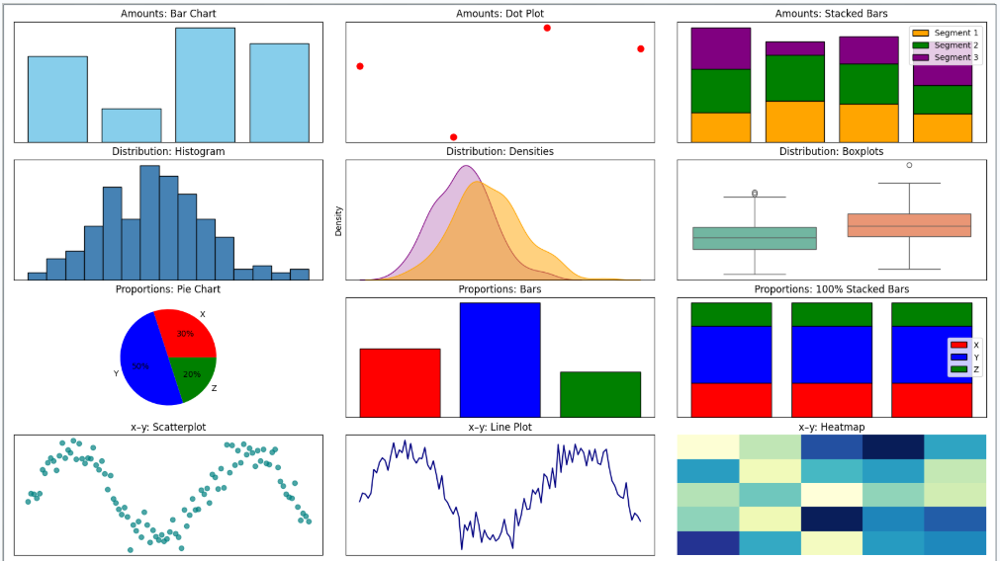


## Aesthetics and Types of Data

**Aesthetics** are the perceptual channels through which data values are communicated to the viewer. Choosing the right aesthetic for the data type is one of the most consequential design decisions.

| Aesthetic | Best for | Example |
|------------------------|------------------------|------------------------|
| **Position** | Any data; most precise | Scatter plot, bar chart — humans judge position better than any other property |
| **Color (hue)** | Categorical groups, highlights | Distinct colors for product lines or customer segments |
| **Color (value/saturation)** | Continuous quantities | Light-to-dark scale for income or temperature |
| **Size** | Magnitude | Bubble chart where circle area represents population |
| **Shape** | Categorical groups (especially when color is unavailable) | Circles, squares, triangles for group membership |
| **Line width / type** | Categories or values in line charts | Solid vs. dashed to distinguish forecast from actuals |


**Position is the most perceptually precise aesthetic.** Humans judge spatial position along a shared axis more accurately than any other visual property. When precision matters — and it usually does in business analytics — encode the key variable on a position axis.
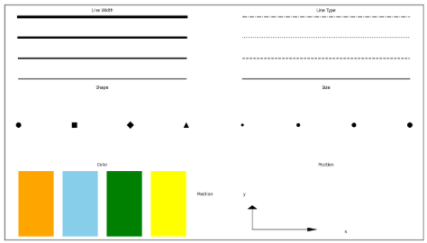


## Color in Data Visualization

Color serves three distinct purposes, and confusing them is one of the most common visualization errors:

| Purpose | When to use | Example |
|------------------------|------------------------|------------------------|
| **Distinguish categories** | Unordered nominal groups | Five brand colors in a market share chart |
| **Represent values** | Ordered quantitative data | Light-to-dark for income by ZIP code |
| **Highlight** | Drawing attention to one key element | One red bar in a chart of gray bars |

Each purpose implies a different type of color scale. Using a multi-hue rainbow scale (designed for categories) to represent continuous data distorts perception — the viewer's eye assigns arbitrary importance to the color boundaries. Using a monochromatic scale for categorical data makes groups hard to distinguish.


**Four color pitfalls to avoid:**

| Pitfall | What goes wrong | Fix |
|------------------------|------------------------|------------------------|
| Too many categories | More than \~6 distinct hues overwhelm memory | Consolidate categories or use direct labels |
| Decorative color | Colors that encode no information distract attention | Use gray as the default; add color only when it means something |
| Misleading scales | Rainbow or nonmonotonic scales distort value differences | Use sequential (light-to-dark) scales for ordered data |
| Color-vision deficiency | \~8% of men cannot distinguish red and green | Test your palette; use shape or position as a redundant cue |

A **monochromatic** scale (varying shades of one hue) encodes a single ordered dimension honestly — darker reads as "more." A **non-monochromatic** scale (multiple hues) is better for distinguishing unordered categories where no shade should appear more prominent than another.


## Evaluating Visualization Quality: Good, Ugly, Bad, Wrong

Wilke (2019) provides a four-category taxonomy for diagnosing visualization quality. These categories are mutually exclusive and cover every type of failure.

| Category | What it means | Example |
|------------------------|------------------------|------------------------|
| **Good** | Clear, accurate, honest — aesthetic choices serve the data | Well-labeled bar chart with proportional y-axis |
| **Ugly** | Aesthetic flaws, but otherwise correct and interpretable | Valid chart with poor font choices or clashing colors |
| **Bad** | Perceptually misleading — unclear, confusing, or accidentally distorted | Truncated y-axis that makes a 2% change look like a 200% change |
| **Wrong** | Mathematically or factually incorrect | Pie chart whose slices sum to 112% |


The taxonomy matters because the fix is different for each category. An **ugly** chart needs a designer; a **bad** chart needs a statistician; a **wrong** chart needs a correction before anyone sees it.

**Wrong example — Pie chart:** This chart combines two overlapping variables. Because categories are not mutually exclusive, the slices sum to more than 100% — making it mathematically invalid.

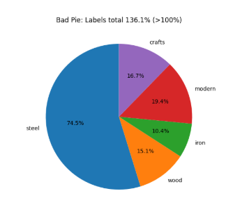

**Bad example — Bar chart of the same data:** The bar chart avoids the arithmetic error but is still **bad** — it hides the overlap between variables and leaves their relationship invisible.


**Note on AI-generated charts:** AI almost never produces **wrong** charts (arithmetic is rarely the failure) but frequently produces **bad** ones — particularly truncated axes and misleading aggregations — because it optimizes for visual plausibility rather than statistical honesty.

------------------------------------------------------------------------

## Seven Reasoning Errors in Data Visualization

Schmidt et al. (2023) examined 9,958 Twitter posts containing COVID-19 data visualizations and identified seven reasoning errors that recurred across real-world misleading charts. These errors are not hypothetical — they appeared in charts shared by journalists, public officials, and ordinary people during a high-stakes public health crisis.

| Error | What it means | Quick example |
|------------------------|------------------------|------------------------|
| **Misreading charts** | Wrong conclusions from visual distortions or misread axes | Reading a log-scale chart as if it were linear |
| **Cherry-picking** | Selecting only data points that support the desired conclusion | Showing stock performance only from the trough to the peak |
| **Arbitrary thresholds** | Benchmarks chosen without principled justification | Drawing a "danger line" at 100 because it is a round number |
| **Data quality issues** | Using incomplete or inconsistent data without disclosing limitations | Reporting case counts that reflect testing rates, not infection rates |
| **Ignoring statistical nuance** | Presenting averages that hide meaningful subgroup variation | Reporting a drug's average effect without noting it worked only in one age group |
| **Misrepresenting scientific research** | Oversimplifying or cherry-picking study findings | "Coffee prevents cancer" from one observational study |
| **False causal claims** | Inferring causation from correlation without experimental support | Concluding from a time-series overlap that A causes B |

### Arbitrary Thresholds

An arbitrary threshold is a benchmark chosen without clear justification — either as a specific number or as a visual marker on a chart — used to make a pattern appear significant when no objective threshold exists. *Example: drawing a horizontal line at 100 to imply that values below it represent "failure," when 100 was chosen for convenience rather than any analytical reason.*


### False Causal Claims

A false causal claim occurs when someone interprets a visual pattern or correlation as evidence of cause and effect without experimental or statistical support. Cherry-picking exacerbates the problem — selecting only data that fits a desired story makes the misleading pattern look more convincing.

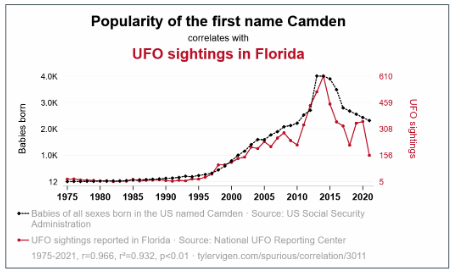

### Misreading Charts: Aspect Ratio and Coordinate Systems

The same data can tell completely different stories depending on how the chart is sized. A line chart that is very wide and short (10:1 aspect ratio) makes slopes appear flat — "gradual, steady change." The same data in a tall, narrow chart (1:2) makes slopes appear steep — "rapid, dramatic change." Neither is mathematically wrong, but both shape the conclusion the viewer draws.

Wilke recommends the **banking to 45°** principle: choose the aspect ratio so that the average slope of the lines in the chart is approximately 45 degrees. This gives the most neutral visual impression of the rate of change.


**A truncated y-axis** is the most common bad-chart pattern in business reporting. Cutting the y-axis at 94,000 instead of 0 on a chart showing visits from 94,000 to 98,000 makes a 4% change look like a near-vertical spike. For bar charts, this is never acceptable — bar height encodes magnitude relative to zero, and truncating the axis misrepresents that encoding. For line charts showing trends, non-zero axes can be defensible, but the truncation must be visually flagged.

### Cherry-Picking

Cherry-picking takes two common forms in business charts:

**Cherry-picking data points** — citing the one quarter your product outperformed while omitting the six quarters of flat performance.

**Cherry-picking time windows** — showing stock performance from the trough of a recession to the peak of a recovery to make returns look spectacular, omitting the crash that preceded the trough.

The fix is always the same: show the complete relevant time period and the complete relevant comparison group.

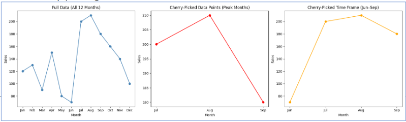

------------------------------------------------------------------------

With the common failures catalogued — visual, logical, and causal — we can now turn to what a *good* chart looks like in practice: purposeful, audience-aware, and built around a single clear finding.

## Storytelling with Data

Good visualization is not just technically correct — it is purposeful. The chart answers a specific question for a specific audience.

### The Foundation: Who, What, How

Three questions must be answered before opening any charting tool:

-   **Who** is the audience? A data scientist and a board member need different charts of the same data.
-   **What** should they know or do after seeing this? If you cannot state it in one sentence, the chart is not ready.
-   **How** will the data support that message?

Two tools force clarity:

**The Big Idea** — a single sentence that states the point of view *and* the stakes. Weak: "Sales are down." Strong: "Enterprise software sales fell 23% in Q3 because of three lost accounts representing 40% of division revenue — retaining the remaining at-risk accounts requires immediate action on pricing."

**The 3-Minute Story** — if you had three minutes with a decision-maker, what are the three things they must leave the room knowing? Everything else is exploratory.

### Exploratory vs. Explanatory Analysis

|                | Exploratory                  | Explanatory                    |
|------------------------|------------------------|------------------------|
| **Audience**   | Yourself                     | Your audience                  |
| **Purpose**    | Find patterns and hypotheses | Communicate a specific finding |
| **Volume**     | Many rough charts            | One polished chart             |
| **Annotation** | None needed                  | Essential                      |
| **Mistake**    | Spending too long here       | Presenting these to executives |

The most common mistake: presenting exploratory charts to an explanatory audience. Showing leadership 15 charts to be "thorough" is not transparency — it is transferring your analytical work to the people least equipped to do it. Find the two pearls; do not hand the audience all 200 oysters.

### The Six-Step Storytelling Workflow

| Step | What you do |
|------------------------------------|------------------------------------|
| **1. Understand the context** | Who is the audience? What decision does the chart support? |
| **2. Choose the right visual** | Match the chart type to the data and the message |
| **3. Eliminate clutter** | Remove gridlines, redundant labels, legend entries that can be replaced by direct labels |
| **4. Focus attention** | Highlight the key element with color or annotation; mute everything else |
| **5. Design with purpose** | Every choice — color, axis range, aspect ratio — should serve the message |
| **6. Tell a story** | Annotate the chart with the finding: "Departures tripled in Q3." Do not make the viewer figure it out. |

------------------------------------------------------------------------

------------------------------------------------------------------------

Before applying the storytelling framework in the lab, it is worth pausing on the reasoning error that causes the most damage in business reporting: false causal claims. Correlation and causation are often conflated in charts and presentations, and understanding the distinction precisely is what separates a statistically honest chart from a misleading one.

## Correlation vs. Causation

**Correlation** measures the strength and direction of the linear relationship between two variables. The correlation coefficient *r* ranges from −1 to +1.

| *r* value    | Interpretation                   |
|--------------|----------------------------------|
| ±0.9 to ±1.0 | Very strong linear relationship  |
| ±0.7 to ±0.9 | Strong                           |
| ±0.5 to ±0.7 | Moderate                         |
| ±0.3 to ±0.5 | Weak                             |
| 0.0 to ±0.3  | Little to no linear relationship |

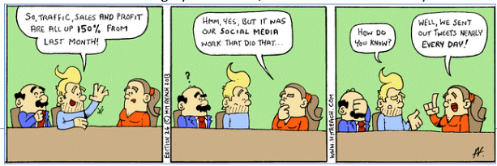

Two important caveats: correlation is sensitive to outliers (one extreme point can inflate or deflate *r* substantially), and correlation says nothing about causation — regardless of magnitude.

To establish **causation**, three conditions must all be met:

1.  A statistically significant relationship between the variables
2.  No other factors that could account for the relationship (ruling out confounds)
3.  Correct temporal ordering — the cause must precede the effect

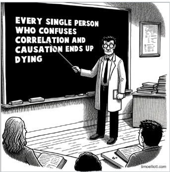

**The third variable problem (confounding)** is the most common reason correlations are misleading in business data. A third variable related to both X and Y creates a spurious association between them. Classic example: cities with more hospitals have higher death rates — not because hospitals cause death, but because illness severity and population size drive both variables simultaneously.

**The directionality problem** adds another layer: even when two variables are genuinely related, the causal direction may be unclear. Does exercise reduce anxiety, or do lower-anxiety people exercise more? Observational data cannot distinguish these.


------------------------------------------------------------------------

## Visualization Principles Lab

**1.** A bar chart shows website traffic across five marketing channels. The y-axis runs from 280,000 to 310,000 visits, making the lowest channel appear to have nearly zero traffic compared to the highest. Classify this chart using Wilke's taxonomy (Good, Ugly, Bad, Wrong) and explain the correct fix.

::: {.callout-note collapse="true"}
### Show Answer

This is **Bad** — not Wrong. The numbers are accurate, but the visual is perceptually misleading. A truncated y-axis on a bar chart distorts the encoding: bar *height* represents magnitude relative to zero, and starting the y-axis at 280,000 makes the smallest channel look negligible when the actual difference is less than 10%. Most viewers read the visual pattern before the axis — which is exactly what the truncation exploits. **Fix:** set the y-axis to start at 0 for any bar chart. If the actual range (280K–310K) is the relevant information, switch to a line chart or dot plot where a non-zero baseline is acceptable, and annotate the axis break visually.
:::

**2.** A health journalist reports: "Cities with more fast food restaurants per capita have higher obesity rates — our data from 200 cities confirms that fast food causes obesity." Identify which reasoning error(s) from Schmidt et al.'s list are present and explain the correct interpretation.

::: {.callout-note collapse="true"}
### Show Answer

Two errors are present. **False causal claims** — the journalist infers causation from an observational correlation. No experimental design is described, and no confounds are ruled out. **Ignoring statistical nuance** — the correlation across 200 cities does not establish that fast food *causes* obesity at the individual level; there are obvious confounds (income, urban density, food access, physical activity infrastructure) that are correlated with both fast food availability and obesity rates.

The correct interpretation: cities with more fast food restaurants *also tend to have* higher obesity rates. This association is worth investigating but is consistent with multiple explanations — fast food availability, socioeconomic factors, or a third variable like urban food deserts that predicts both simultaneously. Causation would require ruling out these confounds through experimental design or rigorous natural experiment methods.
:::

**3.** Write a strong Big Idea sentence for the following scenario, then identify which of the six workflow steps the analyst most likely skipped: A data team presents a chart titled "Customer Satisfaction Survey Results Q3" showing 12 metrics in a radar chart with no annotations, and the only takeaway the leadership team reaches is "some scores went up and some went down."

::: {.callout-note collapse="true"}
### Show Answer

**Strong Big Idea:** "Net Promoter Score dropped 18 points in Q3 — the sharpest single-quarter decline in two years — driven entirely by customers who contacted support more than twice, indicating that repeat service contacts are the primary driver of dissatisfaction."

**Steps most likely skipped:** Step 1 (Understand the context) — the analyst did not define what decision the chart was meant to support, so no finding was prioritized. Step 4 (Focus attention) — with 12 metrics on a radar chart and no highlighting, the viewer's eye has no guide. Step 6 (Tell a story) — no annotation communicates the key takeaway, forcing the leadership team to draw their own (weak) conclusions. A radar chart with 12 metrics is also a poor choice for Step 2 (Choose the right visual) — radar charts make comparison across categories difficult and are generally not recommended for more than 5–6 metrics.
:::

------------------------------------------------------------------------

# Kaiser Fung's Trifecta Checkup

With visualization principles established and reasoning errors named, we now have the vocabulary to evaluate visualizations systematically. Kaiser Fung's Trifecta Checkup provides a structured diagnostic that goes beyond visual style to ask whether the chart's underlying question and data are sound — the two dimensions that AI cannot assess on your behalf.

## What Is the Trifecta Checkup?

Kaiser Fung is a statistician, author of *Numbers Rule Your World*, and creator of the [Junk Charts](https://junkcharts.typepad.com) blog. He developed the **Trifecta Checkup** to address a gap in most visualization criticism: traditional frameworks (following Tufte) focus heavily on visual execution while ignoring whether the chart actually answers a meaningful question with appropriate data.

The framework evaluates every chart on three corners simultaneously:

| Corner | Question | What can go wrong |
|------------------------|------------------------|------------------------|
| **Q** | What is the question? | Vague, unanswerable, or never stated |
| **D** | What does the data say? | Wrong metric, missing groups, misleading aggregation, implied causation |
| **V** | What does the visual say? | Wrong chart type, distorted encoding, missing labels, clutter |

A chart that passes all three corners is excellent. A chart can fail any combination of the three.

## The Eight Outcomes

Every visualization falls into one of eight categories based on which corners pass (✓) or fail (✗):

| Label | Q | D | V | What it means |
|---------------|---------------|---------------|---------------|---------------|
| ✓ | ✓ | ✓ | ✓ | All three corners pass — an excellent chart |
| q | ✗ | ✓ | ✓ | Good data and visual; question is unclear or unanswerable |
| d | ✓ | ✗ | ✓ | Clear question and good visual; data do not actually answer it |
| v | ✓ | ✓ | ✗ | Clear question and good data; visual execution is poor |
| qd | ✗ | ✗ | ✓ | Good visual; both question and data fail |
| qv | ✗ | ✓ | ✗ | Good data; question and visual both fail |
| dv | ✓ | ✗ | ✗ | Clear question; data and visual both fail |
| qdv | ✗ | ✗ | ✗ | All three corners fail — nothing works |

## Why This Framework Matters for AI-Generated Charts

When you use AI to generate a chart, it will almost always produce a visually competent result. AI knows chart types, can label axes, and selects reasonable colors. **AI-generated charts tend to pass V by default.**

The failures will almost always be in **Q and D** — and these are the exact failures that require human statistical judgment:

-   AI does not know your business question; it infers it from your prompt
-   AI will use whatever data you give it without questioning whether it answers the question
-   AI may aggregate in convenient ways that are statistically misleading
-   AI cannot tell you whether your sample is biased, your time window cherry-picked, or your comparison groups incompatible

This is why the Trifecta is the right framework for AI output evaluation. You are not checking whether AI can make a pretty chart — it can. You are checking whether Q–D–V hold together.

## Worked Example

A bar chart is titled *"Social Media Usage by Age Group"* with five bars for ages 13–17, 18–29, 30–49, 50–64, and 65+. The y-axis shows "Number of Users (millions)."

**Q:** The chart seems to ask "which age group uses social media most?" but does not specify the platform, year, or definition of "usage." The question is too vague. **Q fails.**

**D:** The bars show absolute user counts, not rates. Older age groups are larger populations — raw counts inflate their apparent usage relative to younger groups. The right metric is *percentage of each age group* that uses social media. The metric is wrong for the question. **D fails.**

**V:** The y-axis starts at 0, bars are cleanly labeled, colors are distinct. The visual execution is fine. **V passes.**

**Diagnosis: qd** — the question is vague and the data metric is wrong, but the visual is well-constructed.

**Fix:** restate the question as "What share of each age group uses social media?" and switch the y-axis to percentage of population. The chart type (bar chart) remains correct for the redesign.

------------------------------------------------------------------------

# Activity: Build and Evaluate a Visualization with AI

## Overview

In this activity, you will use Claude AI to build an interactive visualization from the Zillow housing dataset (`zillow.csv`), then evaluate it systematically using the Trifecta Checkup alongside the storytelling and reasoning-error frameworks from this lesson. The goal is not to produce a perfect chart — it is to practice the critical thinking that turns a chart into an argument.

**Time:** Approximately 60–90 minutes\
**Deliverable:** A written critique plus an improved version of your chart\
**Tools:** Claude AI (claude.ai), R or your preferred environment

------------------------------------------------------------------------

## Part 1: Build a Visualization with Claude (20–25 minutes)

### Step 1 — Choose a Question First

Before opening Claude, write a specific business question about `zillow.csv` that a visualization could answer. Your question must:

-   Name the specific variables involved (home_value, rent, season, StateName, etc.)
-   Specify the comparison or relationship you want to examine
-   Have a clear audience in mind

::: callout-tip
### Your Question (write this before prompting AI)

*\[Write your question here before proceeding\]*
:::

**Strong question examples:**

-   "Do workers in Tech earn higher wages than Construction workers, and is that difference consistent across job types?"
-   "Which job titles show the widest spread in wages within each industry?"
-   "Is there a relationship between Industry and the presence of outlier wages?"

**Weak question examples** (rewrite before using):

-   "Show me wages by industry" — not a question, no comparison
-   "Tell me about the data" — too broad for a single chart
-   "Make a nice visualization" — no analytical purpose

------------------------------------------------------------------------

### Step 2 — Prompt Claude to Build the Chart

Use the following prompt structure, filling in your specific question:

```         
I am building a data visualization for a business statistics course.
My dataset is called zillow.csv and has these variables:
- RegionName (character: metro area, e.g. "New York, NY")
- StateName (character: 2-letter state abbreviation)
- home_value (numeric: estimated home value in dollars)
- rent (numeric: estimated monthly rent in dollars)
- for_sale_inventory (numeric: number of homes listed for sale)
- market_temp (numeric: market heat index)
- days_pending (numeric: median days a listing is pending)
- new_construction_sales (numeric: new construction sales count)
- income_needed (numeric: annual income needed to afford median home)
- sales_count (numeric: total home sales)
- forecast_1mo_pct, forecast_3mo_pct, forecast_12mo_pct (numeric: % change forecasts)
- year (numeric: 2018-2026)
- month (numeric: 1-12)
- season (factor: Fall, Spring, Summer, Winter)

My specific question is: [INSERT YOUR QUESTION HERE]

Please write R code using ggplot2 that creates a visualization to answer
this question. The code should:
1. Load the dataset from "data/zillow.csv"
2. Handle any missing values appropriately
3. Create a clear, well-labeled chart with a descriptive title
4. Use color to distinguish groups where helpful
5. Include a one-sentence interpretation comment in the code

Show me only the R code and one line explaining what the chart shows.
```

Run the code Claude provides in R.

------------------------------------------------------------------------

### Step 3 — Iterate Once

After seeing the first chart, send one targeted follow-up prompt to improve it. Choose one specific issue — do not ask for a general improvement.

Examples: - "The bars are hard to compare across groups. Switch to a faceted layout." - "Add the median wage as a horizontal reference line to each panel." - "Sort the bars from highest to lowest mean wage instead of alphabetically."

Run the revised code. This is your chart for evaluation.

------------------------------------------------------------------------

## Part 2: Apply the Trifecta Checkup (25–30 minutes)

Evaluate your final chart using each corner. Reference specific features of your chart in every answer.

### Corner Q — The Question

Answer in 2–4 sentences:

1.  What question does your chart appear to answer to a reader seeing it for the first time?
2.  Is that the same as the question you wrote in Step 1? Where did any drift happen?
3.  Is the question specific enough that the chart can give a definitive answer?

**Q assessment:** PASS / WEAK PASS / FAIL\
Justification: \_\_\_\_\_\_\_\_\_\_\_\_\_\_\_\_\_\_\_\_\_\_\_\_\_\_\_\_\_\_\_\_\_\_\_\_\_\_\_\_\_\_\_\_\_\_\_

------------------------------------------------------------------------

### Corner D — The Data

Answer in 3–5 sentences:

1.  Is the variable being plotted the right metric for your question? (If comparing inequality, mean wage may be worse than IQR.)
2.  Are all relevant groups represented? Would including a missing group change your conclusion?
3.  Is anything aggregated in a way that hides variation? Two groups with identical means can have very different distributions.
4.  Does the chart imply a causal claim? Is that claim supported?

**D assessment:** PASS / WEAK PASS / FAIL\
Justification: \_\_\_\_\_\_\_\_\_\_\_\_\_\_\_\_\_\_\_\_\_\_\_\_\_\_\_\_\_\_\_\_\_\_\_\_\_\_\_\_\_\_\_\_\_\_\_

------------------------------------------------------------------------

### Corner V — The Visual

Answer in 3–5 sentences:

1.  Is this the right chart type? Name one alternative and explain whether it would be better or worse.
2.  Do visual elements accurately encode data values? Check bar heights, areas, and color encoding.
3.  What is the first thing your eye goes to? Is that the most important finding?
4.  What is missing — axis label, unit, sample size, note about missing values?

**V assessment:** PASS / WEAK PASS / FAIL\
Justification: \_\_\_\_\_\_\_\_\_\_\_\_\_\_\_\_\_\_\_\_\_\_\_\_\_\_\_\_\_\_\_\_\_\_\_\_\_\_\_\_\_\_\_\_\_\_\_

------------------------------------------------------------------------

### Final Diagnosis

Assign your chart one of the eight labels: ✓, q, d, v, qd, qv, dv, or qdv.

**My chart's label:** \_\_\_\_\_\_\_

In one paragraph, explain your diagnosis. Name the specific failures and what effect each has on conclusions a reader might draw.

------------------------------------------------------------------------

## Part 3: The Fix (15–20 minutes)

Complete this sentence: *"The most important problem with my chart is \_\_\_\_\_\_\_, and fixing it would change the chart by \_\_\_\_\_\_\_."*

Then go back to Claude with a targeted prompt:

```         
My current chart shows [describe it].
The problem is [describe the exact Q, D, or V failure].
Please rewrite the code to fix this by [describe the specific change].
Keep everything else the same.
```

Run the revised code and include both versions in your submission.

------------------------------------------------------------------------

## Part 4: Reflection (10 minutes)

**1. What did Claude get right without being asked?**\
Identify one decision Claude made (labeling, chart type, aggregation, color) that was a good choice and explain why.

**2. What did Claude get wrong that required your judgment?**\
Identify the specific failure the AI made that you would not have caught without the Trifecta framework. What statistical knowledge was required to catch it?

**3. What does this tell you about using AI for data analysis?**\
Write 2–3 sentences on what role human statistical judgment plays when AI generates the analysis.

------------------------------------------------------------------------

## Submission Checklist

-   [ ] Question written before prompting AI (Part 1, Step 1)
-   [ ] Original AI-generated chart and final revised chart both included
-   [ ] Q, D, and V assessments completed with specific justifications
-   [ ] Trifecta label assigned with a paragraph-length explanation
-   [ ] All three reflection questions answered
-   [ ] R code for both chart versions included

------------------------------------------------------------------------

## Grading Rubric

| Component | Points | What earns full credit |
|------------------------|------------------------|------------------------|
| Question formulation | 10 | Specific, analytical, names variables and comparison |
| Q assessment | 15 | Identifies whether question drifted; specific chart evidence cited |
| D assessment | 20 | Identifies metric appropriateness, missing comparisons, or aggregation issues |
| V assessment | 15 | Identifies chart type fit, encoding accuracy, and one alternative with reasoning |
| Trifecta diagnosis | 10 | Correct label with paragraph linking failures to reader impact |
| The Fix | 20 | Targets the most important failure; revised chart demonstrably better |
| Reflection | 10 | Specific, not generic; names actual AI decisions; statistical reasoning evident |
| **Total** | **100** |  |

**Note:** A chart earning ✓ on all three corners is not worth more points than one earning qdv — as long as the critique is honest and accurate. You are graded on the quality of your statistical thinking, not on producing a perfect chart.

------------------------------------------------------------------------

# Summary and Review

## Using AI

Use the following prompts with a generative AI tool to explore these concepts further.

-   What is the difference between generative and predictive AI? At what point in a business analytics workflow would you use each?
-   Why do LLMs hallucinate, and why is this a structural property rather than a fixable bug? What does it tell you about the relationship between language prediction and factual accuracy?
-   Compare zero-shot, few-shot, and chain-of-thought prompting. When would you choose each for a data analysis task?
-   What are the six aesthetics in data visualization, and which is the most perceptually precise? How do you decide which aesthetic to use for which type of data?
-   What is the difference between a chart that is Bad vs. Wrong vs. Ugly in Wilke's taxonomy? Give a business example of each.
-   What are the three conditions required to establish causation? Why is a strong correlation insufficient on its own?
-   A chart passes V but fails D in Kaiser Fung's framework. Describe what this looks like in practice — what kind of chart would be visually polished but analytically misleading?
-   What specific types of failures should you expect when AI generates a data visualization? Which corners of the Trifecta are AI's weak points and why?

## Summary

This lesson covered the responsible use of generative AI and the principles of honest, effective data visualization.

| Topic | Key concepts |
|------------------------------------|------------------------------------|
| Generative vs. predictive AI | Generative creates new content; predictive forecasts from historical data; regression is predictive |
| LLM mechanics | Token prediction, not truth verification; attention mechanisms enable context-aware generation |
| AI strengths and limits | Reliable on V (visual execution, code syntax); unreliable on Q (question framing) and D (data quality) |
| Hallucinations | Structural property of language prediction; five warning signs; always verify citations and calculations |
| Prompt engineering | Zero-shot, few-shot, chain-of-thought; specificity drives output quality |
| Four visualization purposes | Describe, predict, explain, understand — each demands different design choices |
| Six aesthetics | Position (most precise), color (hue/value), size, shape, line width, line type |
| Three color purposes | Distinguish categories, represent values, highlight — use the wrong one and the chart misleads |
| Color pitfalls | Too many categories, decorative color, nonmonotonic scales, color-vision deficiency |
| Good/Ugly/Bad/Wrong | Good: accurate + clear; Ugly: aesthetic flaws only; Bad: perceptually misleading; Wrong: mathematically incorrect |
| Seven reasoning errors | Misreading, cherry-picking, arbitrary thresholds, data quality, ignoring nuance, misrepresenting research, false causal claims |
| Aspect ratio and truncation | Same data reads differently at different ratios; bar chart y-axis must start at 0 |
| Correlation coefficient | r between −1 and +1; sensitive to outliers; does not imply causation |
| Three conditions for causation | Significant relationship, no confounds, correct temporal ordering |
| Third variable problem | Confounders create spurious correlations; common in business observational data |
| Who/What/How | Three questions before any chart; if you cannot state the "what" in one sentence, stop |
| Big Idea | Point of view + stakes in one sentence; specific enough to guide every design decision |
| Exploratory vs. explanatory | Exploratory for yourself; explanatory for your audience; never present exploratory charts to decision-makers |
| Six-step workflow | Context → Visual → Eliminate clutter → Focus attention → Design with purpose → Tell a story |
| Trifecta Checkup | Q (question), D (data), V (visual); eight outcome labels; AI passes V by default; Q and D require you |

**What comes next:** This is the final lesson of the course. The tools introduced here — the Trifecta Checkup, the storytelling workflow, and the reasoning-error framework — do not replace the statistical methods you learned in earlier modules. They are how you communicate and evaluate those methods honestly. A t-test result, an ANOVA table, or a regression coefficient is only meaningful if the question was well-posed, the data are appropriate, and the output is presented without distortion. Every concept in this lesson is a lens you can apply to any analysis you produce or consume going forward — in a business meeting, in a published report, or in an AI-generated output you did not write yourself.

