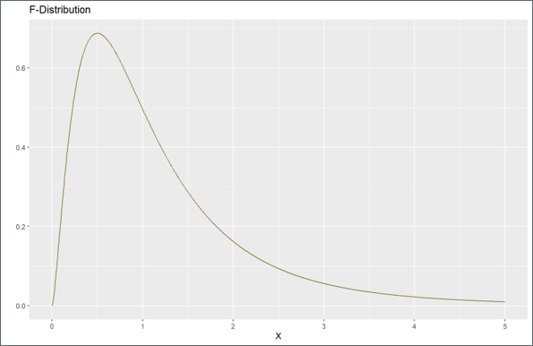
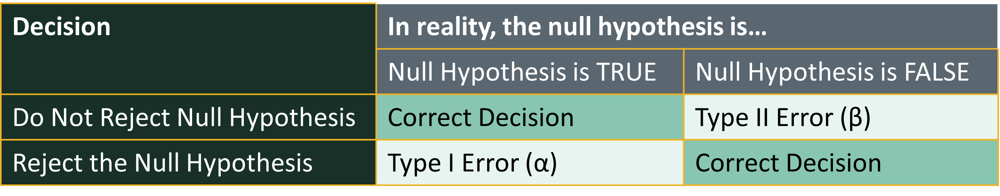
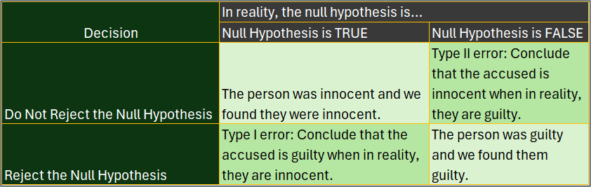
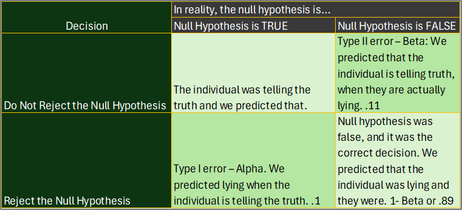
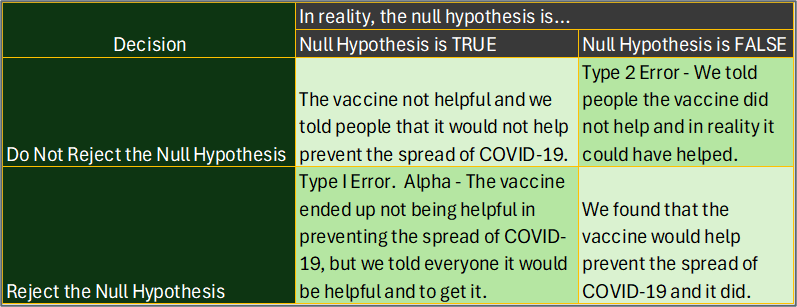
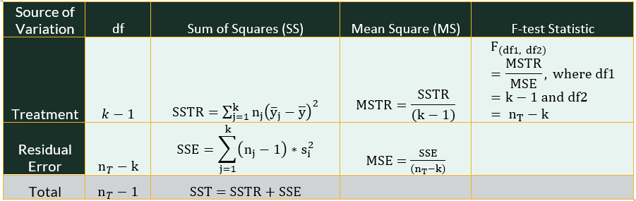
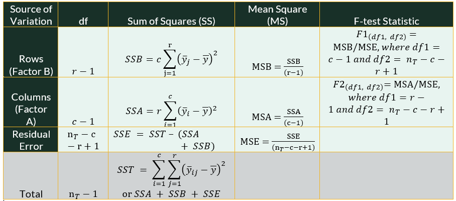
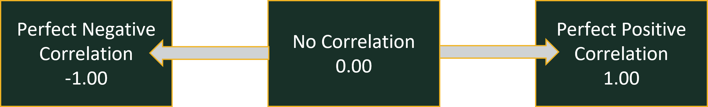
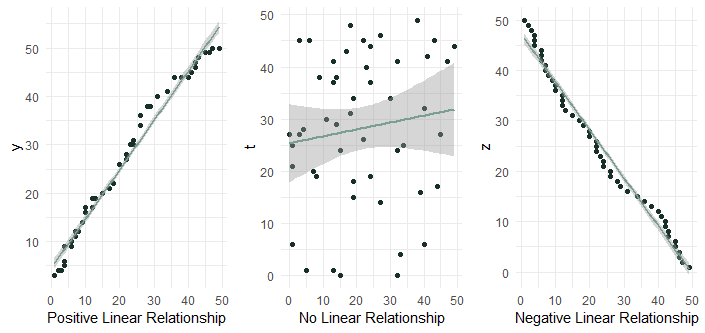
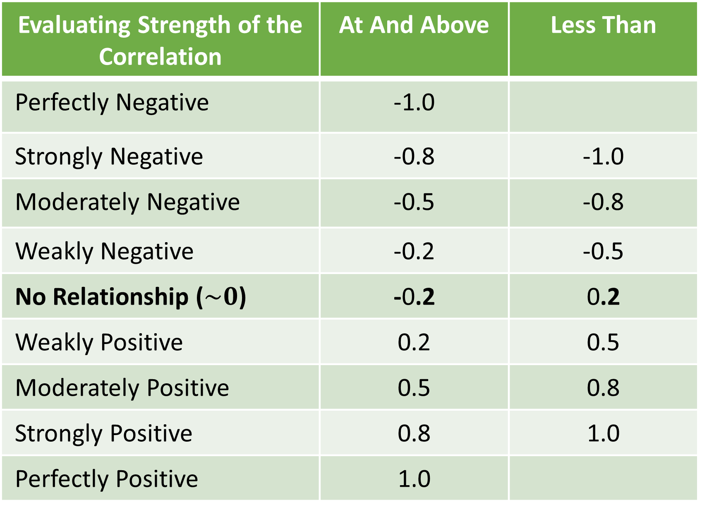

```{r setup, include=FALSE}
knitr::opts_chunk$set(echo=TRUE, tidy.opts = list(width.cutoff = 70), tidy = TRUE, message=FALSE, warning=FALSE)
```

This lesson covers two foundational tools for examining relationships in data: Analysis of Variance (ANOVA) and correlation analysis. Together, they form a complete toolkit for a day focused on group comparisons and linear relationships. For each tool, we also cover the assumptions that must be satisfied for the results to be trustworthy, what breaks when those assumptions fail, and how to test them in R.

We begin with **ANOVA**, which extends hypothesis testing beyond two groups. Where a t-test compares the means of two populations, a one-way ANOVA compares three or more, and a two-way ANOVA introduces a second grouping variable. The core question in every ANOVA is the same: is the variation in the outcome variable explained by the group structure, or is it just noise? We will work through the F-statistic, degrees of freedom, and the logic of between-group versus within-group variability. When a significant ANOVA is found, post-hoc tests — Bonferroni and Tukey HSD — tell us which specific groups differ. We also cover Type I and Type II errors here, since understanding the cost of false positives and false negatives is essential context for any hypothesis test, and ANOVA is a natural place to make those concepts concrete. Each ANOVA variant is followed by a discussion of its assumptions — normality, homogeneity of variance, and independence — and how to check them using R.

The lesson closes with **correlation analysis**, which shifts our focus from group comparisons to continuous relationships. Covariance describes the direction of the linear relationship between two numeric variables; the correlation coefficient standardizes it into a value between −1 and +1 that captures both direction and strength. We test whether a correlation is statistically significant using `cor.test()`, and we learn to visualize relationships with scatterplots before interpreting any numerical result. We also examine the assumptions behind Pearson's correlation — particularly the linearity requirement and the outsized influence of outliers — and how to detect violations. The lesson closes by connecting correlation back to the t-test and ANOVA covered earlier in the course, showing how these tools address related but distinct questions depending on whether your variables are categorical or continuous.

By the end of this lesson, you should be able to set up and conduct one- and two-way ANOVAs, run and interpret post-hoc tests, distinguish Type I from Type II error, calculate and test a correlation coefficient, explain when each tool is appropriate, and verify that the statistical assumptions for ANOVA and correlation are reasonably met before drawing conclusions. Work through every code example in your own R script alongside the reading.

### At a Glance

-   In order to succeed in this section, you will need to apply what you learned about variable types (quantitative versus categorical) and hypothesis testing in earlier lessons. We will learn how to conduct and interpret an ANOVA, which allows us to compare groups (from a categorical/factor variable) with respect to a continuous variable. Unlike the independent samples t-test covered in Module 5, which is limited to comparing two groups, the ANOVA is meant for three or more groups. We can also follow up a significant ANOVA with post-hoc tests to see which groups are different from each other with regards to the continuous variable. We then extend into correlation analysis, which quantifies the strength and direction of the linear relationship between two continuous variables.

### Lesson Objectives

-   Conduct and interpret a one-way ANOVA.
-   Choose and use post-hoc tests and contrasts.
-   Conduct and interpret a two-way ANOVA.
-   Distinguish between Type I and Type II errors and explain how each relates to alpha and sample size.
-   Calculate and interpret a correlation coefficient.
-   Conduct and interpret a hypothesis test for correlation using `cor.test()`.
-   Visualize the relationship between two continuous variables using a scatterplot.
-   Identify the assumptions of ANOVA and correlation, explain what happens when they are violated, and use R to check them.

### Consider While Reading

-   In this lesson, we continue with our discussion of both hypothesis testing and inference, but we are no longer limiting ourselves to one or two populations. ANOVA consists of the calculations that provide information about levels of variability within a model and forms a basis for calculating tests of significance. ANOVA can be conducted as a standalone analysis as we do here, and also as part of a regression analysis — a connection explored further in the Regression lesson.
-   ANOVA is used to determine if there are differences among three or more populations. In cases of only two groups, an independent samples t-test should be used as was discussed in an earlier lesson. When reading, be sure to make connections back to variable data type: with ANOVA, the grouping variable is categorical and the outcome is continuous.
-   As you move into the correlation section, notice how the question changes. ANOVA asks whether group membership explains differences in a continuous outcome. Correlation asks how two continuous variables move together. Both use hypothesis testing and p-values, but the structure of the data and the interpretation of results are different.

# Analysis of Variance (ANOVA)

-   An ANOVA is used to determine if there are differences among three or more groups. If there were only two groups, an independent samples t-test should be used.
-   In conducting an ANOVA, we utilize a completely randomized design, comparing sample means computed for each treatment to test whether the population means differ.
-   ANOVA has underlying assumptions to be met, and there are alternative methods to use when the assumptions are not met. The assumptions are extensions of those we use when comparing just two populations in a t.test:
    -   The populations are normally distributed.
    -   The population standard deviations are unknown but assumed equal.
    -   Samples are selected independently from each population.
-   Here we compare a total of $k$ populations, rather than just two. Therefore, the competing hypotheses for the one-way ANOVA:
    -   $H_0: \mu_1 = \mu_2 = \cdots= \mu_k$
    -   $H_A:$ Not all population means are equal

## Omnibus test

-   A significant result indicates the omnibus test is significant and that there is a difference between the means. This only suggests that there is at least one group difference somewhere between groups. This is not useful in determining which means are different from each other. Therefore, for the alternative hypothesis to be supported, at least one group must be different from the rest.
-   Then, if we find a significant omnibus test, we continue our analysis with planned contrasts and post-hoc tests, which determine which means are statistically significantly different from one another.

## ANOVA Methodology

-   The core idea behind ANOVA is to compare two sources of variability: how much the group means differ from each other (*between-group variability*) versus how much individual observations differ within their own groups (*within-group variability*). If the between-group variability is much larger than the within-group variability, it suggests that the group means are not all equal. This ratio forms the F-statistic.

1.  We first compute the amount of variability between the sample means. This is known as the *between-treatments estimate*, which compares the sample means to the overall mean, sometimes called the grand mean, or the average of all the values in the data set.
2.  Then, we measure how much variability there is within each sample. This is known as the *within-treatments estimate*, which is essentially a measure of error.
3.  A ratio of the first quantity to the second forms our test statistic which follows the $F_{df1,df2}$ distribution, where the degrees of freedom are calculated from the number of groups - 1 ($df_1: k-1$) and the total number of observations minus the number of groups ($df_2: n_t-k$).

-   Note an F distribution behaves differently than a z- or a t- distribution.
    -   The z-distribution shows how many sample standard deviations (SD) some value is away from the mean.
    -   The t-distribution shows how many standard errors (SE) away from the mean.
    -   The F-distribution is used to compare 2 populations’ variances. 
-   The F distribution is noted by its:
    -   Right-Skewness: The distribution is positively skewed, meaning the right tail is longer than the left tail.
    -   Non-Negative Values: The F-distribution is only defined for positive values.
    -   Shape and Degrees of Freedom: The exact shape of the F-distribution depends on the degrees of freedom. As the degrees of freedom increase, the distribution becomes less skewed and more closely approximates a normal distribution.

## Type I and Type II Errors

-   In any hypothesis test, including an ANOVA, it is important to acknowledge that there is error, and that it is possible to come up with the wrong conclusion. An important note is that we are calculating results and making conclusions based on probability calculated given the sample we have, the timing it was collected, and any biases that might have been used in designing and securing the data set. We could also be violating assumptions that make the findings less accurate if still accurate at all.\

-   Therefore, it is really important to understand the limitations of what we are doing, and that there is always error! Our main goal as analysts is to minimize error as much as possible in selecting the right parameters, and having a data set that is as unbiased as possible so that the interpretation is as accurate as possible and consistent with the population it is inferring for.

-   There are 2 types of error:

    -   Type I Error: Committed when we reject $H_0$ when $H_0$ is actually true. False Positive.
        -   Occurs with probability $\alpha$. $\alpha$ is chosen apriori.
    -   Type II Error: Committed when we do not reject $H_0$ and $H_0$ is actually false. False Negative.
        -   Occurs with probability $\beta$. Power of the Test = 1−$\beta$."For a given sample size $n$, a decrease in $\alpha$ will increase $\beta$ and vice versa."

-   Both $\alpha$ and $\beta$ decrease as $n$ increases. Therefore, an increase in sample size decreases these two types of error.

-   The two types of error can be mapped onto a hypothesis decision chart that shows the two decisions, reject $H_0$ or fail to reject $H_0$, alongside what is actually happening in reality.



-   Consider the following example of competing hypotheses that relate to the court of law.

    -   $H_0$: An accused person is innocent.
    -   $H_A$: An accused person is guilty.

-   Now, think through the consequences of making either a Type I and Type II error:

    -   Type I error (False Positive): Conclude that the accused is guilty when in reality, they are innocent.
    -   Type II error (False Negative): Conclude that the accused is innocent when in reality, they are guilty.

 - Both types of error are extremely bad!

-   In taking another example, let's look at some sample results from a polygraph. A polygraph (lie detector) is an instrument used to determine if an individual is telling the truth. These tests are considered to be 89% reliable. In other words, if an individual lies, there is a 89\$ chance that the test will detect a lie. Let there also be a 10% chance that the test erroneously detects a lie even when the individual is actually telling the truth. Consider the null hypothesis, "the individual is telling the truth," and look at all 4 options.



-   With the error conclusions from Type I and Type II error in this example, we either predicted that someone was being honest when they were telling a lie, or we called someone a liar that was telling the truth! Again, both are bad.

-   Now for a more recent example. Let's look at the vaccine designed to prevent the spread of COVID-19. Again, we cannot assume the vaccine works without a significant test, so the alternative hypothesis $H_A$ is framed as against status quo, or that the vaccine does help.

    -   $H_0$: Vaccine does not help prevent spread of COVID-19.
    -   $H_A$: Vaccine does help prevent the spread of COVID-19.\

-   Now, think through the consequences of making either a Type I and Type II error and come to the fill out the 4 boxes like I did below.



-   In this scenario, if we made a Type I error, we would make people get vaccines that were not helpful. If we made a Type II error, we would end up not administering the vaccine when in fact it actually could help prevent the spread of COVID-19. In making the decision to give the vaccine, these types of errors were weighed (along with others) and the vaccine ended up being administered because the Type II error was considered more problematic than the Type I.

-   Some tests are designed to minimize Type I error, while others are designed to minimize Type II error. Selecting alpha levels that are smaller will help reduce Type I error, but at the cost of Type II error. And again, increasing sample size reduces both error.

### Some Reasons For Error

-   Measurement error refers to the difference between a measured quantity and its true value which could be due to random error or systematic error.
    -   Random error refers to naturally occurring errors that are to be expected.
    -   Systematic error refers to miss-calibrated instruments causing error in measurement.
-   Bias — the tendency of a sample statistic to systematically over- or underestimate a population parameter.
    -   Selection bias refers to a systematic exclusion of certain groups from consideration for the sample.
    -   Non-response bias refers to a systematic difference in preferences between respondents and non-respondents to a survey or a poll.
    -   Social Desirability bias refers to a bias that refers to the systematic difference between a group’s “socially acceptable” responses to a survey or poll.

### AI and Hypothesis Error: What AI Cannot Tell You

AI output is not immune to these errors. When AI reports that an ANOVA result is significant or interprets a pattern as meaningful, it does not supply the error context — it does not tell you how likely the result is to be a false positive given your sample size, your alpha level, or whether you have run multiple comparisons without adjustment. Consider:

-   **Type I error and AI:** If you run an ANOVA on many groups simultaneously and ask AI to flag which differences are significant, it may identify comparisons with p < 0.05 without noting that running multiple comparisons inflates the false positive rate — exactly what Bonferroni and Tukey corrections are designed to address.
-   **Type II error and AI:** AI will not tell you whether your sample was large enough to detect a real effect. A non-significant result may reflect a true null — or it may reflect insufficient power. That judgment requires knowing your sample size, the expected effect size, and the desired power level, none of which AI can supply from the output alone.

The error framework you are learning in this section is precisely what you apply *after* reading AI output — not what you expect AI to apply for you.

## One-Way ANOVA

-   One-way ANOVA compares population means based on one categorical variable.

### Steps for Conducting a One-Way Anova

1.  Write the null and alternate hypotheses.
2.  Compute the F-test statistic and the probability for the test statistic (p-value).
3.  Interpret the probability and write a conclusion.
4.  If model is significant, run post-hoc tests.

### Statistics in a One-Way ANOVA Table

-   There are a number of statistics being calculated with an aov() command, with the goal of producing the F-test statistic, which corresponds to a p-value that we can interpret the same way as we did in the earlier lessons (p-value \< alpha = significant result - reject the $H_0$).



#### Explained Variance

-   In a one-way ANOVA, first, we compute the *explained variance*, which in a one-way ANOVA is the sum of squares due to treatments (SSTR), where the treatment is our grouping variable. The explained variance suggests that the variation in outcome can be explained by a model, or in our case, a grouping variable. In computing the SSTR, we square the deviation between each group mean ($\bar{y}_j$) and the grand mean $\bar{y}$ and multiply it by the sample size ($n_j$) and sum up all the values $\sum$. This leads to the following formula:

    -   $SSTR = \sum{n_j*(\bar{y}_j-\bar{y}) ^2}$

-   Degrees of freedom for the SSTR are computed by the number of groups $(k-1)$.

    -   $df_{sstr} = k-1$

-   The mean square due to treatment (MSTR) takes the value for the SSTR and divides by the treatment's degrees of freedom $(k-1)$.

    -   $MSTR = SSTR/(k-1)$

-   Above in the overall methodology, the MSTR corresponds to the *between-treatments estimate*.

#### Unexplained Variance

-   There is also a measure of *unexplained variance*, which we term error. In a one-way ANOVA, this unexplained variance refers to variability in the outcome that is not explained by the grouping variable. In the table, this error is called the sum of squares error (SSE). SSE is calculated by first multiplying the sample size of group and subtracting one ($n_j-1$), and then multiplying that number by its group variance ($\sigma^2_i$). Once all groups are calculated, we add it up ($\sum$). This leads to the following formula:

    -   $SSE = \sum^k_{j=1}{(n_j-1)*\sigma^2_j}$

-   This formula above considers the formula and definition of variance ($\sigma^2$) and simplifies the formula, which you can also use:

    -   $SSE = \sum^k_{j=1}\sum^n_{i=1}(y_{ij}-\bar{y_j})^2/(n-k)$

-   Degrees of freedom for the SSE are computed by taking the total number of observations ($n_t$) and subtracting the number of groups $(k)$.

    -   $df_{sse} = n_t-k$

-   The mean square due to error (MSE) takes the SSE and divides by the appropriate degrees of freedom ($n_t-k$).

    -   $MSE = SSE/(n_t-k)$

-   Above in the overall methodology, the MSE corresponds to the *within-treatments estimate*.

-   There is a total sum of squares (SST) being calculated in an ANOVA, which refers to the total variance (explained and unexplained). This value is calculated as the total number of observations minus 1 ($n_t-1$). We don't see it explicitly in our R output, but it is needed to help understand the full model.

#### Calculating F

-   Finally, to calculate the F-test statistic, we take the MSTR (explained variability) and divide by the MSE (unexplained variability) considering the appropriate degrees of freedom ($k-1$ and $n_t-k$).
-   A p-value is computed from that statistic mathematically by using the correct command in R.
    -   $F_{k-1,n_t-k} = MSTR/MSE$

### Subsetting Data for ANOVA

-   When running an ANOVA on a subset of your data (e.g., only certain regions or categories), it is important to use `droplevels()` after subsetting to remove any unused factor levels. If you do not, the ANOVA output — and post-hoc tests like TukeyHSD — may attempt to test groups that no longer have any observations, which causes errors or misleading results.

-   You can use `droplevels()` directly on the subsetted data frame, or use it inside a `mutate()` call on a specific column. For example:

```{r, eval=FALSE}
# After filtering to a subset of groups:
subset_data <- filter(data, Region %in% c("West", "East")) %>%
  mutate(Region = droplevels(Region))
```

-   This was introduced in Module 2 in the context of cleaning factor variables, and the same logic applies here before running an ANOVA on a subsetted dataset.

### Example of a One-Way ANOVA

-   Like the t-test, a one-way ANOVA follows 3 steps, and then includes an optional 4th step after significance is found and confirmed in step 3.

#### Step 1: Set Up Null and Alternative Hypothesis

-   The competing hypotheses for the one-way ANOVA:
    -   $H_0: \mu_{Atlanta} = \mu_{Houston}= \mu_{LosAngeles} = \mu_{SanFran} = \mu_{DC}$
    -   $H_A:$ Not all population means of congestion levels are equal among the cities

#### Step 2: Compute the F-test Statistic and p-Value

-   First, we read in the data set and give a look at what is included.

    -   Because we are using read.csv() command, we can set stringsAsFactors argument to TRUE so that the categorical variable will be coded appropriately upon download.
    -   The summary() command suggests that there is one categorical variable, "City" and one continuous variable, "CongestionRating."

    ```{r}
    congestionData <- read.csv("data/congestion.csv", stringsAsFactors = TRUE)
    summary(congestionData)
    ```

-   The aov() function in R is used to fit an analysis of variance (ANOVA) model. The aov function allows you to specify a response variable and one or more explanatory variables (factors), producing a linear model to compare group means. The aov() function assumes that the variances of the groups are equal (homoscedasticity). Therefore, this function is suitable when the assumption of equal variances is met.

```{r}
#A common set of commands that work for both a one-way and two-way ANOVA: aov() command with output in a followup command: either anova() or summary() command.
Anova1way <- aov(CongestionRating ~ City, data=congestionData)
```

-   In either command, our formula is ContinuousVariable \~ CategoricalVariable - this will allow us to see if there are group differences in CongestionRating (continuous) based on city (categorical).

    -   Take a good look at the output from these commands to compare the results.

```{r}
#anova() command works exactly the same as summary here. 
#This command is very prevalent in various textbooks and online tutorials.
summary(Anova1way)
anova(Anova1way)
```

-   Using the anova() or summary() commands, we can see the results from the ANOVA table, including the degrees of freedom (Df), sum of squares (Sum Sq), mean square (Mean Sq), F-test statistic (F value) and p-value (Pr(\>F)). It also includes asterisks (\*) symbols if there are group differences due to our categorical variable. The more asterisks you see, the smaller the significant code. There is a table for these codes within the output marked *Signif. codes*.
-   Reading the codes:
    -   If there are three asterisks, you would say that that your p-value is less than .001. If there are 2, your p-value is less than .01. 1 asterisk indicates a p-value \< .05.
    -   We never say our p-value is 0, but instead say it is less than \_\_\_.
    -   We *do not* use .1 as a significance level, although some statisticians mark a p-value less than .1 as "marginally significant". There is a big debate about this, but I agree with the general consensus, so our threshold for this class is less than .05. Anything greater than or equal to .05 is not significant.

#### Step 3: Interpret the Probability and Write a conclusion.

-   The F-test statistic is 37.251 and the p-value is \< 2.2e-16 \*\*\*. This p-value is \< all typical alpha values like .05 or .001. This value is very close to 0. We would state that our p-value is less than .001 by looking at the table and noting the three asterisks.\
-   The p-value result suggests that we support the alternative $H_A$: Not all population means are equal.
-   More specifically we reject the null hypothesis $H_0$ in support of $H_A$ and conclude that not all congestion levels are equal among the cities.

#### Step 4: If Model is Significant, Run Post-Hoc Tests

-   Pairwise comparisons: A statistical strategy for comparing different groups, often used after a statistically significant ANOVA to test hypotheses about which group means are statistically significantly different from one another.

    1.  Bonferroni Method;
    2.  TukeyHSD Method

-   There are many tests to compute pairwise comparisons. The tests tend to vary in whether they minimize Type I or Type II error, and by how much. Many of the tests change the distribution in the calculation to alter the final results.

-   Planned Comparisons: also known as a priori comparisons or planned comparisons, are a statistical technique used in the analysis of variance (ANOVA) to compare specific means based on hypotheses formulated before examining the data. Unlike post hoc tests, which compare all possible pairs of means and are conducted after data collection, planned contrasts are designed to test specific hypotheses derived from theoretical considerations or previous research.

#### Bonferroni Method

-   The Bonferroni method is a pairwise post-hoc test that is used after finding a statistically significant ANOVA. This method conducts a t-test for each pair of means and adjusts the threshold for statistical significance to ensure that there is a small enough risk of Type I error; it is generally considered a very conservative post hoc test that only identifies the largest differences between means as statistically significant.
-   The function has several arguments, such as $x =$ for the continuous variable (listed first); $g =$ for the grouping or categorical variable (listed 2nd); and the p-value adjustment, $p.adj =$, which can be set as \_\_bonf\_ for Bonferroni (listed 3rd).
-   The output is a matrix of p-values, testing each pair for group differences. A value \< alpha signifies significant group differences.
    -   Based on the output, there are no differences in congestion levels between Houston and Atlanta, San Francisco and Atlanta, and Houston and San Francisco.
    -   There are group differences in congestion levels between all other remaining groups (p-value \< alpha).

```{r}
pairwise.t.test(congestionData$CongestionRating, congestionData$City, p.adj="bonf")
```

#### Tukey HSD Method

-   The Tukey HSD method is another pairwise post-hoc test that is used after finding a statistically significant ANOVA.
-   This method is used to determine which means are statistically significantly different from each other by comparing each pair of means.
-   This method is less conservative than the Bonferroni post hoc test, which means generally less Type II error (False Negative).
-   This test is modified from the Bonferroni test using a q-distribution instead of a t-distribution to calculate the answers.
-   Using the TukeyHSD() command, we insert the Anova1way object as a parameter that we made with the aov() command above. This aov() command is required before or while running the TukeyHSD() command.

```{r}
TukeyHSD(Anova1way)
```

-   Based on the output, we find similar results to the Bonferroni test. There are no differences in congestion levels between Houston and Atlanta, San Francisco and Atlanta, and Houston and San Francisco. There are group differences in congestion levels between all other remaining groups (p-value \< alpha).

-   With the TukeyHSD() command, we can also determine which group mean is higher than the other by looking at the "diff" score. If you see a negative score than the second group listed in the output is higher than the first group listed. Ignoring the insignificant p-values \> .05, we find that both San Francisco and Washington has significantly less congestion than Los Angeles. We find that Los Angeles and Washington have a significantly higher group mean than Atlanta. Los Angeles and Washington DC also have a significantly higher group mean than Houston. Finally, Washington DC has a significantly higher group mean than San Francisco.

## Two-Way ANOVA

-   A two-way ANOVA is called a randomized block design.
-   The term “block” refers to a matched set of observations across the treatments.
-   In a two-way ANOVA, there are now three sources of variation:
    -   Row variability (due to blocks or Factor B or a first grouping variable),
    -   Column variability (due to treatments or Factor A or a second grouping variable), and,
    -   Variability due to chance or SSE.
-   In altering the methodology above, the row and column variability take place of the *between-treatment estimate* listed above, which still corresponds to *explained variance*. We still have one *within-treatment estimate* as before, or a measure of *unexplained variance*.

### Steps for Conducting a Two-Way ANOVA

1.  Write the null and alternate hypotheses for each grouping variable.
2.  Compute the F-test statistics for each grouping variable and the probability for the test statistics (2 p-values for a 2-way ANOVA).
3.  Interpret the probabilities and write a conclusion.
4.  If model is significant, run post-hoc tests.

-   The steps are the same as a one-way ANOVA listed above, with the exception that now we have 2 grouping variables, so we need 2 F-stats and 2 p-values.

### Statistics in a Two-Way ANOVA Table

-   We add another row to our ANOVA table when we move from a one-way ANOVA to a two-way ANOVA. The goal is the same, which is to produce a F-test statistic. In a two-way ANOVA, we will have two F-test statistics (one for each grouping variable). Each F-test statistic corresponds to a separate p-value that we can interpret the same way as we did in the last lessons (p-value \< alpha = significant result - reject the $H_0$). So we can find one group significant and not the other, neither significant, or both significant with one test.



#### Explained Variance

-   In a two-way ANOVA, we still start by computing the *explained variance*. Since we have an additional grouping variable, or factor, we will have two sum of squares measures, a sum of squares for factor A (SSA) and a sum of squares for factor B (SSB). Factor B is typically called a row (r) factor, while Factor A is typically called a column (c) factor. However, the order of the output will depend on the order of your formula in R.

-   The explained variance still suggests that the variation in outcome can be explained by a model, but now it will be due to the two grouping variables. In computing the SSB, we take the number of columns ($c$) and we multiply by the sum of the squared deviation between each group B mean ($\bar{y_j}$) and the grand mean $\bar{y}$.

    -   $SSB = c*\sum^r_{j=1}{(\bar{y_j}-\bar{y}) ^2}$

-   In computing SSA, we take the number of rows and we multiply that number by the sum of the squared deviation between each group A mean and the grand mean

    -   $SSA =r*\sum^c_{i=1}{(\bar{y_i}-\bar{y}) ^2}$

-   Degrees of freedom for the SSB are computed by the number of rows - 1 $(r-1)$, and the degrees of freedom for SSA are computed as the number of columns - 1 $(c-1)$.

    -   $df_{ssb} = r-1$
    -   $df_{ssa} = c-1$

-   The mean square due to Factor B (MSB) and Factor A (MSA) both take the value from the appropriate sum of squares (SSB and SSA) and divides that factors degrees of freedom $(r-1)$ or $(c-1)$.

    -   $MSB = SSB/(r-1)$
    -   $MSA = SSA/(c-1)$

#### Unexplained Variance

-   In a two-way ANOVA, there is still only one measure of *unexplained variance*, which we term residual error.

-   The SSE is calculated after deriving the total variance (SST = both explained and unexplained), and subtracting the explained variance (SSB and SSA).

    -   $SSE = SST - (SSA + SSB)$

-   Degrees of freedom for the SSE are computed by taking the total number of observations ($n_t$) and subtracting the number of rows (r) and the number of columns (c) and adding 1 $(n_t-c-r+1)$.

    -   $df_{sse} = n_t-c-r+1$

-   The mean square due to error (MSE) takes the SSE and divides by the appropriate degrees of freedom $(n_t-c-r+1)$.

    -   $MSE = SSE/(n_t-c-r+1)$

-   There is a total sum of squares (SST) being calculated mentioned above, which again refers to the total variance (explained and unexplained). To get this calculation, we take the squared deviation between each observation and the grand mean and we sum up all of our values.

-   There is also a total degrees of freedom in a two-way ANOVA, which is the total number of observations minus 1 ($n_t-1$). We don't see it explicitly in our R output, but it is needed to help understand the full model.

#### Calculating F-test Statistics

-   Finally, to calculate the 2 F-test statistics, given a two-way ANOVA, we take both the MSB (explained variability for factor B) and the MSA (explained variability for factor A) and divide both by the MSE (unexplained variability) considering the appropriate degrees of freedom ($c-1$ and $r-1$ and $n_t-c-r+1$).
-   This gives us two scores to evaluate. A p-value is computed from each F-test statistic mathematically by using the correct command in R.
    -   $F1_{c-1,n_t-c-r+1 }= MSB/MSE$
    -   $F2_{r-1,n_t-c-r+1 }= MSA/MSE$

### Using factor() Inline in ANOVA Formulas

-   In a two-way ANOVA, you can convert a variable to a factor directly inside the `aov()` formula using `factor()`. For example, if `year` is stored as a numeric variable but you want to treat it as a categorical grouping variable, you can write:

```{r, eval=FALSE}
aov(Outcome ~ GroupA * factor(year), data = mydata)
```

-   This is equivalent to converting `year` to a factor first using `as.factor()` and then passing it to `aov()`. The inline approach is convenient when you want to test a numeric variable as a categorical factor without permanently changing the variable in your dataset.

### Example of a Two-way ANOVA

-   Let's run an example to compare SAT scores to see if they are comparable from different instructors {Instructor 1, 2, and 3} and across 4 races {Asian.American, Black, Mexican.American, and White}.

#### Step 1: Set Up Null and Alternative Hypothesis

-   The competing hypotheses for the two-way ANOVA are two-fold:

-   Hypothesis 1:

    -   $H_0: \mu_{Instructor1} = \mu_{Instructor2}= \mu_{Instructor3}$
    -   $H_A:$ Not all population means of SAT scores are equal among the instructors

-   Hypothesis 2:

    -   $H_0: \mu_{Asian.American} = \mu_{Black} = \mu_{Mexical.American} =  \mu_{White}$
    -   $H_A:$ Not all population means of SAT scores are equal among races

#### Step 2: Compute the F-test Statistics and p-Values

-   Like a one-way ANOVA, in a two-way ANOVA, we start with an appropriate data set.

    -   Again, because we are using read.csv() command, we can set stringsAsFactors argument to TRUE so that the categorical variable will be coded appropriately upon download.
    -   The summary() command suggests that there are two categorical variables, "Instructor" and "Race", and one continuous variable, "SAT."

    ```{r}
    SATdata <- read.csv("data/SAT.csv", stringsAsFactors = TRUE)
    summary(SATdata)
    ```

#### Step 3: Interpret the Probabilities and Write a Conclusion

```{r}
Anova2way <- aov(SAT ~ Instructor + Race, data=SATdata) 
summary(Anova2way) 
```

-   In the ANOVA results, we find that there was no difference in SAT score based on the Instructor of record. Specifically, we find a F-test statistic of 1.084 and an associated p-value at .342. That p-value is \> alpha (.05), and therefore, we fail to reject the null hypothesis $(H_0:  \mu_{Instructor1} = \mu_{Instructor2}= \mu_{Instructor3})$.

-   We also find that Race is significant, with a F-test statistic of 286.624 and an associated p-value of \<2e-16 \*\*\*. This means that we can reject the null hypothesis and support the alternative hypothesis ($H_A:$ Not all population means of SAT scores are equal among races).

-   This means that we can conduct post-hoc tests on our Race variable. If we conduct any post-hoc tests on Instructor, we should find no differences in groups (which we already found in the ANOVA results above). This means additional testing the Instructor variable is an unnecessary step.

#### Step 4: If Model is Significant, Run Post-Hoc Tests

-   Using the pairwise.t.test() command, we can run a Bonferroni test on just race by using the command below. This result suggest that there are group differences between all groups. We can tell that because all p-values are less than alpha at .05.\

```{r}
pairwise.t.test(SATdata$SAT, SATdata$Race, p.adj="bonf")
```

-   Using the TukeyHSD() Method, we do receive output for both Race and Instructor. As expected, all p-values under the instructor grouping are well above an alpha of .05, meaning not significant (Fail to reject $H_0$).
-   Receiving similar results to the Bonferroni test with regards to Race, we find all group differences significant. Specifically, Black Americans, Mexican Americans, and White Americans scored lower on their SAT than Asian Americans. Mexican Americans and White Americans scored higher on their SAT than Black Americans. White Americans scored higher than Mexican Americans. Using this command, we can tell which group scored lower than the other by looking at the difference score "diff".

```{r}
TukeyHSD(Anova2way)
```

## Two-Way ANOVA with Interaction

-   A two-way ANOVA with interaction is a statistical test used to examine the effects of two independent categorical variables (factors) on a continuous dependent variable, while also assessing whether the effects of one factor depend on the levels of the other. This test includes three key components: main effects of each factor (how each variable influences the dependent variable independently) and the interaction effect (whether the effect of one factor changes depending on the level of the other factor). If a significant interaction is found, it suggests that the impact of one factor differs across levels of the second factor, meaning the combined influence of both factors is not simply additive. This interaction is visualized using interaction plots, where non-parallel lines indicate interaction. A two-way ANOVA with interaction assumes the same assumptions as a two-way ANOVA: normality, homogeneity of variances, and independence of observations.

### Statistics in a Two-Way with Interaction ANOVA

-   When performing a two-way ANOVA with interaction, we introduce an additional row to the ANOVA table to account for the interaction effect between the two grouping variables. The goal remains to compute F-test statistics, but now we have three F-statistics: one for each main effect and one for the interaction effect. Each F-statistic corresponds to a p-value, which we interpret as before (p-value \< alpha means a significant result, leading to rejection of $H_o$).

-   Depending on the results, we may find that only one main effect is significant, both are significant, neither is significant, or the interaction itself is significant.

-   In a two-way ANOVA with interaction, we compute the explained variance by adding a new term for the interaction sum of squares (SSAB). This measures the variance explained by the interaction of factors A and B.

#### Steps for Conducting a Two-Way ANOVA with Interaction

1.  Write the null and alternate hypotheses for each grouping variable and the interaction effect.
2.  Compute the F-test statistics for each grouping variable and the probability for the test statistics (3 p-values for a 2-way ANOVA).
3.  Interpret the probabilities and write a conclusion.
4.  If model is significant, run post-hoc tests.

#### Explained Variance

-   In a two-way ANOVA with interaction, we compute the explained variance by adding a new term for the \textbf{interaction sum of squares (SSAB)}. This measures the variance explained by the interaction of factors A and B.

-   The sum of squares for \textbf{Factor A (SSA)} and \textbf{Factor B (SSB)} are computed similarly to before:

    -   $SSB = c \sum^r_{j=1}{(\bar{y_j}-\bar{y}) ^2}$
    -   $SSA = r \sum^c_{i=1}{(\bar{y_i}-\bar{y}) ^2}$

-   The sum of squares for the \textbf{interaction effect (SSAB)} measures how much variability is explained by the combination of the two factors, beyond their individual effects:

    -   $SSAB = \sum^c_{i=1} \sum^r_{j=1} n_{ij} (\bar{y_{ij}} - \bar{y_i} - \bar{y_j} + \bar{y})^2$

-   Degrees of freedom for the SSB are computed by the number of rows - 1 $(r-1)$, and the degrees of freedom for SSA are computed as the number of columns - 1 $(c-1)$.

    -   $df_{ssb} = r-1$
    -   $df_{ssa} = c-1$
    -   $df_{ssab} = (c-1)(r-1)$

-   The \textbf{mean square} for each term is calculated by dividing the sum of squares by its respective degrees of freedom:.

    -   $MSB = SSB/(r-1)$
    -   $MSA = SSA/(c-1)$
    -   $MSAB = \frac{SSAB}{(c-1)(r-1)}$

#### Unexplained Variance

-   The residual variance (unexplained variance) is computed as before, but now it accounts for the additional interaction term:

    -   $SSE = SST - (SSA + SSB + SSAB)$

-   Degrees of freedom for the SSE are updated as well to account for the interaction term.

    -   $df_{sse} = n_t - c - r + 1 - (c-1)(r-1)$

-   The mean square due to error (MSE) also considers an update.

    -   $MSE = \frac{SSE}{n_t - c - r + 1 - (c-1)(r-1)}$

-   There is a total sum of squares (SST) being calculated mentioned above, which again refers to the total variance (explained and unexplained). To get this calculation, we take the squared deviation between each observation and the grand mean and we sum up all of our values.

#### Calculating F-test Statistics

-   To determine the significance of each effect, we compute \textbf{three} F-test statistics:

    -   $F_1 = \frac{MSB}{MSE} \quad \text{(for factor B)}$
    -   $F_2 = \frac{MSA}{MSE} \quad \text{(for factor A)}$\
    -   $F_3 = \frac{MSAB}{MSE} \quad \text{(for interaction effect)}$

-   Each F-statistic follows an ( F )-distribution with its respective degrees of freedom:

    -   $F1_{c-1,n_t-c-r+1-(c-1)(r-1)} = \frac{MSA}{MSE}$
    -   $F2_{r-1,n_t-c-r+1-(c-1)(r-1)} = \frac{MSB}{MSE}$
    -   $F3_{(c-1)(r-1),n_t-c-r+1-(c-1)(r-1)} = \frac{MSAB}{MSE}$

-   Each F-statistic is associated with a p-value, which determines significance.

    -   If the interaction effect is significant, it suggests that the effect of one factor depends on the levels of the other factor.\
    -   If the interaction is \textbf{not significant}, we interpret the main effects independently.\
    -   If the interaction is significant, \textbf{post-hoc tests} (e.g., pairwise comparisons) or \textbf{simple effects analysis} are needed to examine differences at different levels of the factors.\
    -   Visualization using \textbf{interaction plots} helps in understanding the nature of the interaction.

### Example of a Two-way ANOVA with Interaction

-   Let's use the corolla car dataset to make an example of a 2 way interaction.

```{r}
corolla <- read.csv("data/corolla.csv", stringsAsFactors = TRUE)

```

#### Step 1: Write the null and alternate hypotheses

-   For Factor B:
    -   Null Hypothesis ($H_o$): Factor B has no effect on the dependent variable.
    -   Alternative Hypothesis ($H_a$): Factor B has a significant effect on the dependent variable.
-   For Factor A:
    -   Null Hypothesis ($H_o$): Factor A has no effect on the dependent variable.
    -   Alternative Hypothesis ($H_a$): Factor A has a significant effect on the dependent variable.
-   For Interaction:
    -   Null Hypothesis ($H_o$): There is no interaction between the two factors (i.e., the effect of one factor does not depend on the level of the other factor).
    -   Alternative Hypothesis ($H_a$): There is an interaction between the two factors (i.e., the effect of one factor depends on the level of the other factor).
-   In the dataset, let's make a hypothesis between Fuel_Type and Metallic paint on Price. We would make two individual hypotheses and one interaction hypothesis between Fuel_Type and Metallic.

#### Step 2: Compute the F-test statistic for the interaction and its p-value.

-   Use an ANOVA table to obtain the F-statistic for the interaction term.
-   Compute the associated p-value to determine the significance of the interaction effect.

```{r}
ANOVAInteraction <- aov(Price~Fuel_Type * Metallic, data=corolla) 
anova(ANOVAInteraction)
```

#### Step 3: Interpret the probability and write a conclusion.

-   If the p-value for an effect is small (typically \< 0.05), reject the null hypothesis and conclude that the effect is significant.

-   If the interaction effect is significant, this means the relationship between Factor A and the dependent variable depends on the level of Factor B (or vice versa). This interaction may change how the main effects should be interpreted.

-   If the interaction is not significant, the main effects can be interpreted independently.

-   Fuel Type has a significant main effect on Price (p-value \< .05).

-   Metallic has a significant main effect on Price (p-value \< .001).

-   There is a significant interaction between Fuel_Type and Metallic on Price (p-value \< .05).

#### Step 4: If the interaction is significant, examine simple effects or conduct post-hoc tests.

-   If the interaction effect is significant, examine simple effects or run post-hoc tests.
    -   Conduct simple effects analysis, examining the effect of one factor at each level of the other factor.
    -   Use post-hoc tests (e.g., Tukey’s HSD) to compare means within the interaction groups if needed.

```{r}
TukeyHSD(ANOVAInteraction)
```

-   In the output, it looks like Fuel_Type is a weak variable. There were no group differences detected in the TukeyHSD. There is a group difference between Metallic paint (Yes vs No). There are many interaction groups significantly different as indicated by a significant p-value \< .05.

    -   Create interaction plots to visualize how the levels of one factor influence the effect of the other factor.

-   Below is a ggplot confirming the relationship. In the chart, The x-axis represents Fuel Type and the y-axis represents Price. Different lines (or colors) represent whether the car has Metallic Paint (Yes/No). If the lines are not parallel, it suggests an interaction effect. The lines are not parallel below, so there is a confirmed interaction.

```{r, message=FALSE}
library(tidyverse)
ggplot(corolla, aes(x = Fuel_Type, y = Price, color = Metallic, group = Metallic)) +
  stat_summary(fun = mean, geom = "point", size = 3) + 
  stat_summary(fun = mean, geom = "line", aes(linetype = Metallic)) +
  theme_minimal() +
  labs(title = "Fuel Type and Metallic Paint on Price",
       x = "Fuel Type",
       y = "Price",
       color = "Metallic Paint") 
```

## Assumptions of ANOVA

ANOVA produces a reliable F-statistic and p-value only when certain conditions about the data are reasonably satisfied. These assumptions are conceptually similar to those of the independent samples t-test — ANOVA is, after all, an extension of that logic to three or more groups.

### What the Assumptions Are

**Normality** means that the outcome variable is approximately normally distributed within each group. As with t-tests, this assumption is protected by the Central Limit Theorem when group sample sizes are reasonably large (roughly $n_j \geq 30$ per group). With smaller groups, the shapes of the within-group distributions matter more.

**Homogeneity of variance** (homoscedasticity) requires that the population variance is approximately equal across all groups. This is the ANOVA equivalent of the equal-variances assumption in the independent samples t-test. When this assumption is violated, the within-group estimate of error (MSE) is biased, which distorts the F-statistic. Unlike the t-test, ANOVA does not have a built-in Welch-style correction, so this assumption carries more weight.

**Independence** means that the observations within and between groups are drawn independently. If observations are clustered, matched, or correlated in any way that is not modeled, standard errors will be underestimated and the F-test will be anti-conservative.

### What Happens When Assumptions Are Violated

When **normality fails** with small group sizes, the F-distribution is no longer the correct reference distribution for your test statistic, which can inflate or deflate your p-value. With large groups, the CLT protects you and mild departures from normality have little practical impact.

When **homogeneity of variance fails**, the pooled MSE term in the denominator of the F-statistic is a blend of unequal variances, producing an inaccurate ratio. Groups with larger variances are underrepresented in the estimate and groups with smaller variances are overrepresented. This can lead to either false positives or false negatives depending on how the variance inequality maps onto group sizes. Welch's ANOVA (`oneway.test()` in R) is a direct remedy.

When **independence fails**, the same concerns as in the t-test apply: standard errors shrink, t- and F-statistics inflate, and the false positive rate rises above the nominal alpha level.

### Visualizing the Homogeneity of Variance Assumption

Equal spread across groups is as important as the location of the group means. The left panel shows groups with comparable variance — the assumption holds. The right panel shows groups with very different spreads — a sign to investigate further.

```{=html}
<div style="margin: 1.5rem 0; padding: 1.2rem 1.5rem; background: #f8f9fb; border: 1px solid #dde1e8; border-radius: 8px;">
  <p style="font-size: 0.85rem; font-weight: 600; color: #555; margin: 0 0 1rem 0; text-transform: uppercase; letter-spacing: 0.04em;">Homogeneity of Variance — Equal vs. Unequal Spread Across Groups</p>
  <svg viewBox="0 0 680 210" xmlns="http://www.w3.org/2000/svg" style="width:100%; max-width:680px; display:block; margin:0 auto;">
    <!-- Equal variances label -->
    <text x="170" y="16" text-anchor="middle" font-size="11" fill="#1a6b3a" font-weight="600">Equal Variances — Assumption Met ✓</text>
    <!-- Group A -->
    <path d="M30,185 C30,185 50,183 65,170 C80,157 88,130 95,105 C100,88 102,75 105,66 C108,75 110,88 115,105 C122,130 130,157 145,170 C160,183 180,185 180,185 Z" fill="#c8ecd5" stroke="#1a6b3a" stroke-width="1.3"/>
    <text x="105" y="198" text-anchor="middle" font-size="9" fill="#444">Group A</text>
    <!-- Group B -->
    <path d="M130,185 C130,185 150,183 165,170 C180,157 188,130 195,105 C200,88 202,75 205,66 C208,75 210,88 215,105 C222,130 230,157 245,170 C260,183 280,185 280,185 Z" fill="#c8ecd5" stroke="#1a6b3a" stroke-width="1.3"/>
    <text x="205" y="198" text-anchor="middle" font-size="9" fill="#444">Group B</text>
    <!-- Group C -->
    <path d="M230,185 C230,185 250,183 265,170 C280,157 288,130 295,105 C300,88 302,75 305,66 C308,75 310,88 315,105 C322,130 330,157 345,170 C360,183 380,185 380,185 Z" fill="#c8ecd5" stroke="#1a6b3a" stroke-width="1.3"/>
    <text x="305" y="198" text-anchor="middle" font-size="9" fill="#444">Group C</text>

    <!-- Divider -->
    <line x1="395" y1="20" x2="395" y2="195" stroke="#ccc" stroke-width="1" stroke-dasharray="4,3"/>

    <!-- Unequal variances label -->
    <text x="540" y="16" text-anchor="middle" font-size="11" fill="#9b2226" font-weight="600">Unequal Variances — May Violate ✗</text>
    <!-- Group A narrow -->
    <path d="M405,185 C405,185 415,183 420,175 C426,165 428,140 430,105 C431,88 431.5,75 432,66 C432.5,75 433,88 434,105 C436,140 438,165 444,175 C450,183 460,185 460,185 Z" fill="#f8d0d0" stroke="#9b2226" stroke-width="1.3"/>
    <text x="432" y="198" text-anchor="middle" font-size="9" fill="#444">Group A</text>
    <!-- Group B medium -->
    <path d="M455,185 C455,185 470,183 480,172 C492,158 498,132 504,105 C508,88 510,75 512,66 C514,75 516,88 520,105 C526,132 532,158 544,172 C556,183 570,185 570,185 Z" fill="#f8d0d0" stroke="#9b2226" stroke-width="1.3"/>
    <text x="512" y="198" text-anchor="middle" font-size="9" fill="#444">Group B</text>
    <!-- Group C wide -->
    <path d="M548,185 C548,185 560,182 572,170 C586,154 595,125 604,100 C610,83 613,72 615,64 C617,72 620,83 626,100 C635,125 644,154 658,170 C672,182 685,185 685,185 Z" fill="#f8d0d0" stroke="#9b2226" stroke-width="1.3"/>
    <text x="616" y="198" text-anchor="middle" font-size="9" fill="#444">Group C</text>
  </svg>
  <p style="font-size: 0.8rem; color: #666; margin: 0.8rem 0 0 0; font-style: italic;">When group widths (variances) differ substantially, the MSE denominator in the F-statistic becomes unreliable. Welch's ANOVA or a data transformation may be needed.</p>
</div>
```

### Testing Assumptions in R

R provides easy tools for checking all three ANOVA assumptions before finalizing conclusions.

**Normality within each group** can be assessed with a histogram per group or with the Shapiro-Wilk test applied to each group separately. With large groups, a Q-Q plot is often sufficient.

```r
# Shapiro-Wilk by group (for small-to-moderate n)
tapply(outcome_variable, grouping_variable, shapiro.test)

# Q-Q plot
qqnorm(residuals(anova_model))
qqline(residuals(anova_model))
```

**Homogeneity of variance** is most commonly tested with Levene's test, available in the `car` package. A p-value above .05 means we cannot reject the assumption of equal variances.

```r
library(car)
leveneTest(outcome_variable ~ grouping_variable, data = mydata)
# p > .05: variances are not significantly different — assumption holds
```

If Levene's test is significant, consider Welch's ANOVA as an alternative to `aov()`:

```r
oneway.test(outcome_variable ~ grouping_variable, data = mydata, var.equal = FALSE)
```

**Independence** must be assessed from the study design, not from the data itself. If there is reason to believe observations within groups are correlated (e.g., repeated measures, nested sampling), a mixed-effects model or repeated-measures ANOVA is more appropriate.

::: {.callout-tip}
### Robustness of ANOVA
ANOVA is generally considered robust to mild violations of normality, especially with balanced designs (equal or roughly equal group sizes) and group sizes above 15–20. It is more sensitive to violations of homogeneity of variance, particularly when group sizes are unequal — the combination of unequal variances *and* unequal group sizes is the most problematic scenario.
:::

## choose() command

-   The choose(n, k) function in R calculates the number of ways to choose k items from a set of n items without regard to order. It answers the question: "How many different groups of k can I make from n items?" For example, choose(5, 2) equals 10, meaning you can make 10 different pairs from a group of 5 items.

-   The Combination function counts the number of ways to choose objects from a total of objects. The order in which the objects are listed does not matter.

-   Since repetition is not allowed, we use $C(n,x) = (n)!/((n-x!)*x!)$

-   When performing Tukey's Honest Significant Difference (TukeyHSD) test for post-hoc analysis, pairwise comparisons are made between all possible pairs of group means. The total number of comparisons depends on the number of groups and can be calculated using the choose function. The choose function conceptually relates to TukeyHSD because it tells you how many pairwise comparisons will be tested based on the number of groups.

    -   In post hoc tests, x is always 2.
    -   If you have 4 groups (A, B, C, D), choose(4, 2) = 6, meaning 6 pairwise comparisons are made: A-B, A-C, A-D, B-C, B-D, and C-D.

-   You can also calculate the factorial of a number using the factorial function in base R.

```{r}
n <- 4
#C(4,2) = 4!/2!*(4-2)!
#manually
(4*3*2*1)/((2*1)*(2*1))
#with the factorial function
factorial(4)/(factorial(4-2)*factorial(2))
```

-   A quick check on how many pairs we can expect in our post-hoc output, we can use the choose() command. We always only check 2 groups at a time, so the 2nd argument should remain a 2.
-   If we have 4 races, we would use 4,2 inside the command as shown below. This means we should see 6 p-value statistics for 6 pairwise tests.\

```{r}
#with choose function
choose(4,2)
```

-   We had 3 instructors, so we would use 3,2 inside the command as shown below. If this variable was significant, we should see 3 p-value statistics for 3 pairwise tests.

```{r}
choose(3,2)
```

With ANOVA, we have been asking whether group membership explains differences in a continuous outcome variable. Correlation shifts that question: instead of comparing groups, we now ask how two continuous variables move together. The tools change, but the underlying logic of hypothesis testing — null hypothesis, test statistic, p-value, conclusion — carries forward exactly as before.


# Correlation

## Covariance

-   Covariance ($s_{xy}$ or $cov_{xy}$) is a numerical measure that describes the direction of the linear relationship between two variables, x and y and reveals the direction of that linear relationship.
-   The formula for covariance is as follows:
    -   $cov_{xy} = \sum^n_{i=1}(x_i-m_x)*(y_i-m_y)/(n-1)$
    -   Where $x_i$ and $y_i$ are the observed values for each observation, $m_x$ and $m_y$ are the mean values for each variable, $i$ represents an individual observation, and $n$ represents the sample size.

```{r}

x <- c(3, 8, 5, 2)
y <- c(12, 14, 8, 4)

devX <- x-mean(x)
devY <- y-mean(y)

covXY <- sum(devX * devY)/(length(x)-1); covXY

#We can verify this by using cov() function in R.
cov(x,y)
```

## Correlation Coefficient

-   A correlation coefficient ($r_{xy}$) describes both the direction and strength of the relationship between $x$ and $y$. $r_{xy} = cov_{xy}/(s_x s_y)$ or using the standardized formula in the book:
    -   $r_{xy} = \sum^n_{i=1}(z_x*z_y)/(n-1)$

```{r}
#Calculated manually
covXY/(sd(x)*sd(y))

#We can verify this by using cor() function in R.
cor(x,y)

```

### Rules for the Correlation Coefficient

-   The correlation coefficient has the same sign as the covariance; however, its value ranges between −1 and +1 whereas $-1 \le r_{xy} \le +1$.
-   The absolute value of the coefficient reflects the strength of the correlation. So a correlation of −.70 is stronger than a correlation of +.50.



## Interpreting the Direction of the Correlation

-   Negative correlations occur when one variable goes up and the other goes down.
-   No correlation happens when there is no discernible pattern in how two variables vary.
-   Positive correlations occur when one variable goes up, and the other one also goes up (or when one goes down, the other one does too); both variables move together in the same direction.



### Scatterplots to Visualize Relationship

-   Let's do an example to first visualize the data, and then to calculate the correlation coefficient.

-   First, read in a .csv called *DebtPayments.csv*. This data set has 26 observations and 4 variables:

    -   A character variable with a bunch of metropolitan areas listed;
    -   An integer numeric debt;
    -   A numeric variable Income;
    -   A numeric variable Unemployment.

```{r}
Debt_Payments <- read.csv("data/DebtPayments.csv")
str(Debt_Payments)
```

-   Next, plot the relationship between 2 continuous variables.

    -   There are a few ways to write the plot command using ggplot. We went over these in the Data Visualization lesson. Again we said:
    -   Layer 1: ggplot() command with aes() command directly inside of it pointing to x and y variables.
    -   Layer 2: geom_point() command to add the observations as indicators in the chart.
    -   Layer 3 or more: many other optional additions like labs() command (for labels) or stat_smooth() command to generate a regression line.

    ```{r, fig.alt="Scatterplot Using ggplot2 Generated by R"}
    Debt_Payments %>% ggplot(aes(Income, Debt))+ 
      geom_point(color="#183028", shape=2) + 
      stat_smooth(method="lm", color="#789F90") + 
      theme_minimal()
    ```

-   In the above plot, there is a strong positive relationship (upward trend) that should be confirmed with a correlation test.

-   In a second example below, we look at Unemployment as the X variable. This scatterplot is much more difficult to use in determining whether the correlation will be significant. It looks negative, but there is not a strong linear trend to the data. This will also need to be confirmed with a correlation test.

```{r, fig.alt="Scatterplot Using ggplot2 Generated by R"}
Debt_Payments %>% ggplot(aes(Unemployment, Debt))+
  geom_point(color="#183028", shape=2) + 
  stat_smooth(method="lm", color="#789F90") + 
  theme_minimal()
```

-   In many scatterplots using big data, the observations are too numerous to see a good relationship. In that case, the statistical test can trump this visual aid. However, in a lot of cases the scatterplot does help visualize the relationship between 2 continuous variables.

### Interpreting the Strength of the Correlation

-   Statisticians differ on what is called a strong correlation versus weak correlation, and it depends on the context. A .9 may be required for a strong correlation in one field, and a .5 in another. Generally speaking in business, the absolute value of a correlation .8 or above is considered strong, between .5 and .8 is considered moderate, and between .2 and .5 is considered weak.
-   The following is consistent with what is most generally used:



## Interpreting the Significance of the Correlation

-   Correlation values should be tested alongside a p-value to confirm whether or not there is a correlation. The null is tested using a t-distribution specifically testing whether $r = 0$ or not, like the one-sample t-test section from the lesson 6.
-   The null and alternative are listed below.
    -   $H_0$: There is no relationship between the two variables ($r = 0$).
    -   $H_A$: There is a relationship between the two variables ($r \neq 0$).
-   Even small correlations can be significant: In large datasets, even a small correlation, like .1, can be statistically significant due to the increased power that comes with a high sample size. It's important to interpret both the strength of the correlation and its practical significance in context.

#### Statistical significance answers the question: "Is the effect real?“

-   Statistical Significance:

-   A result is statistically significant if it is unlikely to have occurred by random chance, given a pre-defined threshold (usually p \< 0.05).

-   With larger sample sizes, even very small effects can become statistically significant because larger samples reduce variability. For example, a correlation of 0.1 can be statistically significant with enough data.

-   Practical Significance:

-   Practical significance answers the question: "Is the effect meaningful?“

-   Practical significance refers to the real-world importance or relevance of a result. It asks, "Does this effect matter in practice?“

-   Even if a result is statistically significant, it may not be large enough to have a meaningful impact on business decisions or outcomes.

### cor.test() Command

-   The cor() command gives you just the correlation coefficient. This command can be useful if you are testing many correlations at one time. In the below statement, I can use $cor(Variable1, Variable2)$ to see the correlation between 2 continuous variables.

```{r}
cor(Debt_Payments$Income, Debt_Payments$Debt) 
```

-   The cor.test() command tests the hypothesis whether $r=0$ or not. This command comes with a p-value and t-test statistic (along with the correlation coefficient).

```{r}
cor.test(Debt_Payments$Income, Debt_Payments$Debt)
```

-   This test shows a strong positive correlation of .8675 (\>.8) which is significant. Our p-value is 9.66e-09 or \< .001 alpha level. This suggests that we reject the null hypothesis and support the alternative that $r \neq 0$ which confirms a correlation is present.
-   We also see a confidence interval listed. It suggests that we are 95% confident that the correlation is between .723 and .939.

```{r}
cor.test(Debt_Payments$Income, Debt_Payments$Unemployment)
```

-   This test shows a moderate negative correlation of -.534 (between .5 and .8 in absolute value), which is significant. Our p-value is 0.004928 or \< .01 alpha level. This suggests that we reject the null hypothesis and support the alternative that $r \neq 0$ which confirms a correlation is present.
-   We also see a confidence interval listed. It suggests that we are 95% confident that the correlation is between -.765 and -.185. This confidence interval is wider than the one listed above. This is due to the noise in the relationship we noted in the scatterplot - the correlation is weaker, the relationship does not look as linear, the confidence decreases. Even though this is true, we must note that we still found a significant correlation.

## Additional Examples

```{r}
library(ISLR)
data("Credit")
summary(Credit)

attach(Credit)

cor.test(Rating, Income) #0.7913776 moderate and positive

cor.test(Rating, Balance) #0.8636252 strong and positive

cor.test(Rating, Limit) #0.9968797 strong and positive
##almost perfectly linear 
ggplot(Credit, aes(Rating, Limit))+geom_point()

cor.test(Rating, Education) #-0.03013563 no correlation

cor.test(Rating, Age) #0.103165 - between -.2 and .2 - so no relationship even though p-value < .05 -- p-value fails at .01 level. 
ggplot(Credit, aes(Rating, Age))+geom_point()+stat_smooth(method="lm")


cor.test(Rating, Cards) #0.05323903 
ggplot(Credit, aes(Rating, Cards))+geom_point()+stat_smooth(method="lm")


```

## Comparing to t.test and ANOVA

-   A t-test examines if there is a significant difference in the means of two groups on a dependent variable. For example, whether males and females differ in their credit ratings, where a correlation measures the strength and direction of a linear relationship between two continuous variables, such as Rating and Income.
-   An independent t-test requires a categorical independent variable (e.g., Gender) with two levels and a continuous dependent variable (e.g., Rating), where a correlation requires two continuous variables.
-   Both can provide insights into relationships in the dataset, but they address different questions. An independent t-test evaluates mean differences (group comparisons), while correlation evaluates relationships (continuous covariation). \* A significant t-test does not imply a strong correlation between the grouping variable and the dependent variable; the correlation would depend on the coding of the categorical variable and the distribution of data

```{r}
## -- Example of an independent t.test using same dataset
t.test(Rating~Gender, data=Credit) ##no group differences
ggplot(Credit, aes(Gender, Rating)) + geom_boxplot()

t.test(Rating~Married, data=Credit)##no group differences
ggplot(Credit, aes(Married, Rating)) + geom_boxplot()


```

-   An ANOVA tests for significant differences in the means of three or more groups on a dependent variable. For example, whether credit ratings differ across ethnic groups, where a correlation examines the strength of the relationship between two continuous variables.
-   An Anova requires a categorical independent variable (with three or more levels) and a continuous dependent variable, where a correlation requires two continuous variables.
-   ANOVA focuses on group comparisons (e.g., Rating differences across Ethnicity), while correlation looks at how two variables change together.A significant ANOVA could suggest that the categorical grouping variable explains some variance in the dependent variable, but this variance is not quantified as a relationship strength (as correlation would provide).

```{r}
## -- Example of An ANOVA using same dataset
anova1 <- aov(Rating~Ethnicity, data=Credit)
anova(anova1) #no group differences - no need for a post hoc test. 
ggplot(Credit, aes(Ethnicity, Rating, fill=Ethnicity)) + geom_boxplot(show.legend=FALSE)
```

## Correlation, Causation, and AI

Correlation measures the strength and direction of the linear relationship between two variables. The correlation coefficient *r* ranges from −1 to +1.

| *r* value    | Interpretation                   |
|--------------|---------------------------------||
| ±0.9 to ±1.0 | Very strong linear relationship  |
| ±0.7 to ±0.9 | Strong                           |
| ±0.5 to ±0.7 | Moderate                         |
| ±0.3 to ±0.5 | Weak                             |
| 0.0 to ±0.3  | Little to no linear relationship |

Two important caveats: correlation is sensitive to outliers (one extreme point can inflate or deflate *r* substantially), and correlation says nothing about causation — regardless of magnitude.


To establish **causation**, three conditions must all be met:

1.  A statistically significant relationship between the variables.
2.  No other factors that could account for the relationship (ruling out confounds).
3.  Correct temporal ordering — the cause must precede the effect.


**The third variable problem (confounding)** is the most common reason correlations are misleading in business data. A third variable related to both X and Y creates a spurious association between them. Classic example: cities with more hospitals have higher death rates — not because hospitals cause death, but because illness severity and population size drive both variables simultaneously.

**The directionality problem** adds another layer: even when two variables are genuinely related, the causal direction may be unclear. Does exercise reduce anxiety, or do lower-anxiety people exercise more? Observational data cannot distinguish these.


**AI and false causal claims:** When AI interprets a correlation result, watch for causal language. Phrases like “X affects Y,” “X leads to Y,” or “X causes Y” in AI output should be challenged unless an experiment or controlled design supports them. AI pattern-matches on how correlational findings are described in its training data, and that language is very often causal even when the evidence is only associational. A strong *r* value never licenses a causal claim — that judgment belongs to you.

**Some technical limitations to keep in mind:**

-   The correlation coefficient captures only *linear* relationships. Two variables can be strongly related in a non-linear way (U-shaped, threshold, etc.) and still show r ≈ 0.
-   The correlation coefficient may not be a reliable measure in the presence of outliers.
-   Lack of significance does not mean a variable X has no relationship with Y; it might suggest a more complex or non-linear relationship.

## Assumptions of Correlation Analysis

Pearson's correlation coefficient ($r$) and the significance test in `cor.test()` rest on specific assumptions. When these are met, $r$ accurately captures the linear relationship and the associated p-value is trustworthy. When they are violated, $r$ can be misleading even if the test reports significance.

### What the Assumptions Are

**Linearity** is the most fundamental assumption: the relationship between the two variables should be approximately linear — meaning the data should follow a straight-line trend rather than a curve, U-shape, or other non-linear pattern. Pearson's $r$ is specifically a measure of *linear* association. Two variables can be strongly related in a curved way and still yield $r \approx 0$.

**Normality (bivariate)** means that the two variables are jointly normally distributed — roughly, that for any value of X, the distribution of Y values is approximately normal, and vice versa. In practice, with moderate to large samples, this assumption is not critical. With small samples, extreme departures from normality (heavy skew, multimodality) can distort the correlation estimate and inflate Type I error.

**No influential outliers**: a single extreme observation can dramatically inflate or deflate $r$, giving an entirely misleading picture of the typical relationship. Pearson's $r$ is not robust to outliers.

**Independence** means each pair of $(x, y)$ observations was collected independently from the others. Autocorrelated data (e.g., time series) or clustered sampling can produce artificially inflated correlations.

### What Happens When Assumptions Are Violated

When **linearity fails**, $r$ underestimates the true strength of the relationship. A U-shaped pattern, for example, can produce $r \approx 0$ even when the variables are perfectly related — the increasing and decreasing halves cancel out. The remedy is to visualize the data first and consider transforming variables or using a non-linear correlation measure (Spearman's $\rho$).

When **outliers are present**, a single data point can pull the regression line — and therefore $r$ — strongly in its direction. The reported $r$ may reflect one anomalous observation rather than the bulk of the data. Always inspect a scatterplot before interpreting $r$.

When **normality fails with small samples**, the p-value from `cor.test()` can be unreliable. Spearman's rank correlation (`cor.test(method = "spearman")`) is a distribution-free alternative.

### Visualizing the Linearity Assumption

Pearson's $r$ is designed for straight-line relationships. The left panel shows a linear relationship where $r$ is a valid summary. The right panel shows a curved relationship where $r$ would be misleading.

```{=html}
<div style="margin: 1.5rem 0; padding: 1.2rem 1.5rem; background: #f8f9fb; border: 1px solid #dde1e8; border-radius: 8px;">
  <p style="font-size: 0.85rem; font-weight: 600; color: #555; margin: 0 0 1rem 0; text-transform: uppercase; letter-spacing: 0.04em;">Linearity — The Core Assumption of Pearson's Correlation</p>
  <svg viewBox="0 0 680 200" xmlns="http://www.w3.org/2000/svg" style="width:100%; max-width:680px; display:block; margin:0 auto;">
    <!-- Left: Linear -->
    <text x="170" y="16" text-anchor="middle" font-size="11" fill="#1a6b3a" font-weight="600">Linear Relationship — r is Valid ✓</text>
    <rect x="20" y="22" width="300" height="155" rx="4" fill="white" stroke="#dde1e8" stroke-width="1"/>
    <!-- Linear trend line -->
    <line x1="40" y1="162" x2="300" y2="40" stroke="#1a6b3a" stroke-width="1.5" stroke-dasharray="5,3"/>
    <!-- Scatter dots roughly along line -->
    <circle cx="52" cy="158" r="3.5" fill="#2d6a4f" opacity="0.7"/>
    <circle cx="70" cy="148" r="3.5" fill="#2d6a4f" opacity="0.7"/>
    <circle cx="88" cy="135" r="3.5" fill="#2d6a4f" opacity="0.7"/>
    <circle cx="100" cy="130" r="3.5" fill="#2d6a4f" opacity="0.7"/>
    <circle cx="120" cy="118" r="3.5" fill="#2d6a4f" opacity="0.7"/>
    <circle cx="140" cy="108" r="3.5" fill="#2d6a4f" opacity="0.7"/>
    <circle cx="155" cy="100" r="3.5" fill="#2d6a4f" opacity="0.7"/>
    <circle cx="175" cy="90" r="3.5" fill="#2d6a4f" opacity="0.7"/>
    <circle cx="195" cy="82" r="3.5" fill="#2d6a4f" opacity="0.7"/>
    <circle cx="215" cy="72" r="3.5" fill="#2d6a4f" opacity="0.7"/>
    <circle cx="235" cy="62" r="3.5" fill="#2d6a4f" opacity="0.7"/>
    <circle cx="258" cy="53" r="3.5" fill="#2d6a4f" opacity="0.7"/>
    <circle cx="280" cy="45" r="3.5" fill="#2d6a4f" opacity="0.7"/>
    <text x="170" y="193" text-anchor="middle" font-size="9.5" fill="#333">Points follow a straight-line trend; r captures this well</text>

    <!-- Right: Non-linear -->
    <text x="510" y="16" text-anchor="middle" font-size="11" fill="#9b2226" font-weight="600">Non-linear (Curved) — r is Misleading ✗</text>
    <rect x="360" y="22" width="300" height="155" rx="4" fill="white" stroke="#dde1e8" stroke-width="1"/>
    <!-- Curved trend -->
    <path d="M375,162 Q510,30 645,162" stroke="#9b2226" stroke-width="1.5" fill="none" stroke-dasharray="5,3"/>
    <!-- Scatter dots on U-curve -->
    <circle cx="382" cy="158" r="3.5" fill="#ae2012" opacity="0.7"/>
    <circle cx="400" cy="140" r="3.5" fill="#ae2012" opacity="0.7"/>
    <circle cx="420" cy="115" r="3.5" fill="#ae2012" opacity="0.7"/>
    <circle cx="440" cy="90" r="3.5" fill="#ae2012" opacity="0.7"/>
    <circle cx="460" cy="70" r="3.5" fill="#ae2012" opacity="0.7"/>
    <circle cx="480" cy="58" r="3.5" fill="#ae2012" opacity="0.7"/>
    <circle cx="510" cy="50" r="3.5" fill="#ae2012" opacity="0.7"/>
    <circle cx="540" cy="58" r="3.5" fill="#ae2012" opacity="0.7"/>
    <circle cx="560" cy="72" r="3.5" fill="#ae2012" opacity="0.7"/>
    <circle cx="580" cy="90" r="3.5" fill="#ae2012" opacity="0.7"/>
    <circle cx="600" cy="115" r="3.5" fill="#ae2012" opacity="0.7"/>
    <circle cx="620" cy="140" r="3.5" fill="#ae2012" opacity="0.7"/>
    <circle cx="638" cy="158" r="3.5" fill="#ae2012" opacity="0.7"/>
    <text x="510" y="193" text-anchor="middle" font-size="9.5" fill="#333">U-shape gives r ≈ 0 even though the relationship is strong</text>
  </svg>
  <p style="font-size: 0.8rem; color: #666; margin: 0.8rem 0 0 0; font-style: italic;">Always visualize with a scatterplot before computing r. A near-zero correlation does not mean no relationship — it means no <em>linear</em> relationship.</p>
</div>
```

### Testing Assumptions in R

```r
# 1. Scatterplot — always do this first
ggplot(mydata, aes(x = var1, y = var2)) +
  geom_point() +
  stat_smooth(method = "lm")   # A curved pattern around the line signals non-linearity

# 2. Normality check for each variable
shapiro.test(mydata$var1)
shapiro.test(mydata$var2)

# 3. Spearman's correlation — no normality or linearity assumption required
cor.test(mydata$var1, mydata$var2, method = "spearman")
```

If the scatterplot reveals a curved relationship, consider transforming one or both variables (e.g., log transformation) to linearize it before applying Pearson's $r$, or switch to Spearman's $\rho$, which measures monotonic (consistently increasing or decreasing) relationships rather than strictly linear ones.

::: {.callout-tip}
### The cardinal rule
Always look at the scatterplot first. No correlation coefficient — no matter how large or how small — should be interpreted without visual inspection of the data. The scatterplot will reveal outliers, non-linearity, clusters, and other features that $r$ alone will not.
:::

# Review and Practice

## Using AI

Use the following prompts with our chatbot (bottom right of this page) to explore more about ANOVA analysis.

**ANOVA concepts:**

-   Explain how ANOVA is used to compare group means. What are the assumptions of ANOVA, and how do we interpret the F-statistic and p-value?

-   Walk me through the steps of conducting a one-way ANOVA. Explain how to use the aov() function in R and how to interpret the results, including the F-statistic and p-value.

-   Describe how to conduct a two-way ANOVA in R. What are the key differences between one-way and two-way ANOVA, and how do we interpret multiple F-statistics?

-   What are post-hoc tests, and why are they important after conducting an ANOVA? How do the TukeyHSD and Bonferroni methods differ in terms of reducing Type I and Type II errors?

-   Explain Type I and Type II errors in the context of hypothesis testing. How do these errors relate to the significance level (alpha) and the power of a test?

-   Given an R output from the aov() or anova() function, explain how to interpret the degrees of freedom, sum of squares, mean square, F-statistic, and p-value.

-   Provide a step-by-step guide to performing a one-way ANOVA in R using the aov() function. Include code examples and explain how to interpret the summary output.

-   Compare the TukeyHSD and Bonferroni post-hoc tests. Which one is more conservative, and how do they help in reducing error in multiple comparisons?

------------------------------------------------------------------------

**Correlation and causation concepts:**

-   Explain the difference between covariance and correlation. How do you interpret the direction and strength of a correlation coefficient?

-   What is covariance, and how does it describe the relationship between two variables? Provide an example with a simple dataset. Describe Pearson's correlation coefficient. How do you calculate it, and what does it tell you about the relationship between two variables?

-   Explain how to create a scatterplot using ggplot2 in R to visualize the relationship between two continuous variables. How can you add a regression line to assess the linearity of the relationship?

-   How can you use the cor.test() function in R to conduct a hypothesis test for correlation? What do the p-value and confidence interval indicate in the context of correlation?

-   How do you interpret the strength and direction of a correlation? What is considered a strong, moderate, or weak correlation in the context of business data?

-   What are the three conditions required to establish causation? Why is a strong correlation insufficient on its own, and what role does the third variable (confounding) problem play?

-   What are some challenges of visualizing relationships between variables when dealing with big data, and how can statistical tests help when scatterplots are not effective?

-   Discuss the limitations of correlation analysis. Why is it important to be cautious when interpreting correlation as causation?

**Prompting AI effectively for ANOVA and correlation tasks:**

| Vague prompt | Specific prompt |
|-----------------------------------|-----------------------------------------|
| "Run an ANOVA" | "Run a one-way ANOVA comparing `home_value` across the four levels of `season` in `zillow.csv`. State the null and alternative hypotheses, run `aov()` and `summary()`, and interpret the F-statistic and p-value at α = 0.05. If the result is significant, run `TukeyHSD()` and identify which season pairs differ." |
| "Test correlation" | "Using `zillow.csv`, run `cor.test()` to test whether there is a statistically significant linear relationship between `income_needed` and `home_value`. State the hypotheses, report the correlation coefficient and p-value, and interpret both. Note any concerns about directionality or confounding." |

**AI causal language warning:** When AI interprets ANOVA or correlation results, watch carefully for language like “season *affects* home values” or “income *drives* home prices.” These are causal claims. Your results are observational — they establish association and group differences, not causation. If AI uses causal language, correct the interpretation: “seasons are *associated with* differences in home values” or “income needed and home value are *correlated*.”

## ANOVA Lab

**A marketing analyst** wants to test whether average customer satisfaction scores differ across four store locations (North, South, East, West). She collected satisfaction ratings (1–10 scale) from random samples at each location. Without running any code, identify the correct test, state the null and alternative hypotheses, and write the `aov()` command she would use given a data frame called `stores` with columns `Satisfaction` and `Location`.

::: {.callout-note collapse="true"}
### Show Answer

**Correct test:** One-way ANOVA — she is comparing a continuous outcome (satisfaction score) across more than two groups defined by a single categorical variable (Location).

-   $H_0: \mu_{North} = \mu_{South} = \mu_{East} = \mu_{West}$ (all population mean satisfaction scores are equal)
-   $H_A:$ Not all population mean satisfaction scores are equal

``` r
anova_model <- aov(Satisfaction ~ Location, data = stores)
summary(anova_model)
```

The formula `Satisfaction ~ Location` tells R to model the continuous outcome (Satisfaction) as a function of the categorical grouping variable (Location). The `summary()` command produces the ANOVA table with the F-statistic and p-value.
:::

**Interpret** the following one-way ANOVA output. State whether the result is significant at $\alpha = 0.05$, write a plain-English conclusion, and explain whether a post-hoc test is needed and why.

```         
            Df Sum Sq Mean Sq F value   Pr(>F)
Location     3  142.8   47.60   8.34   0.0001 ***
Residuals   96  548.2    5.71
```

::: {.callout-note collapse="true"}
### Show Answer

**Significance:** The p-value (0.0001) is less than $\alpha = 0.05$, so we reject the null hypothesis. The result is significant at the 0.001 level (three asterisks).

**Plain-English conclusion:** There is statistically significant evidence that not all store locations have the same mean customer satisfaction score. At least one location's mean satisfaction differs from the others.

**Post-hoc test:** Yes — a post-hoc test is needed. The omnibus F-test only tells us that *some* difference exists somewhere among the four groups. It does not identify *which* pairs of locations differ. Running `TukeyHSD()` or `pairwise.t.test()` with Bonferroni correction will pinpoint which specific location pairs are significantly different from each other.

**Degrees of freedom check:** $df_\text{treatment} = k - 1 = 4 - 1 = 3$ ✓ and $df_\text{error} = n_t - k = 100 - 4 = 96$ ✓, so the total sample size is 100.
:::

**A researcher** conducts a two-way ANOVA to examine the effect of teaching method (Lecture, Flipped, Hybrid) and class size (Small, Large) on student exam scores. The R output shows: teaching method F = 6.21 (p = 0.003), class size F = 1.84 (p = 0.179). Write the two sets of hypotheses, state which effects are significant at $\alpha = 0.05$, and explain what each conclusion means in practical terms.

::: {.callout-note collapse="true"}
### Show Answer

**Hypothesis 1 — Teaching Method:**

-   $H_0: \mu_{Lecture} = \mu_{Flipped} = \mu_{Hybrid}$ (teaching method has no effect on exam scores)
-   $H_A:$ Not all population mean exam scores are equal across teaching methods

**Hypothesis 2 — Class Size:**

-   $H_0: \mu_{Small} = \mu_{Large}$ (class size has no effect on exam scores)
-   $H_A: \mu_{Small} \neq \mu_{Large}$ (class size does affect exam scores)

**Results:**

-   **Teaching method is significant** (p = 0.003 \< 0.05): We reject $H_0$ and conclude that exam scores differ across at least one pair of teaching methods. A post-hoc test would identify which methods differ.
-   **Class size is not significant** (p = 0.179 \> 0.05): We fail to reject $H_0$. There is no statistically significant evidence that class size (Small vs. Large) affects exam scores, holding teaching method constant.

**Practical interpretation:** How you teach appears to matter; how many students are in the room, at least in this sample, does not appear to significantly change outcomes.
:::

**Explain** the difference between a Type I and Type II error using the following scenario: a company is testing whether a new production process reduces the defect rate compared to the current process.

-   State the null and alternative hypotheses.
-   Describe the real-world consequence of each type of error.
-   Explain what happens to each error type as sample size increases.

::: {.callout-note collapse="true"}
### Show Answer

**Hypotheses:**

-   $H_0$: The new process does not reduce the defect rate (no improvement).
-   $H_A$: The new process does reduce the defect rate.

**Type I Error (False Positive) — rejecting** $H_0$ when it is actually true: The company concludes the new process reduces defects when in reality it does not. Consequence: the company invests in rolling out a new process that offers no actual improvement, wasting time and money.

**Type II Error (False Negative) — failing to reject** $H_0$ when it is actually false: The company fails to detect that the new process genuinely does reduce defects. Consequence: the company sticks with the inferior process, continuing to produce defective units and missing out on quality improvements.

**As sample size increases:** Both $\alpha$ (Type I error rate, set by the analyst) and $\beta$ (Type II error rate) decrease as $n$ increases because larger samples provide more precise estimates and reduce uncertainty. Increasing $n$ is the most reliable way to reduce both errors simultaneously. Reducing $\alpha$ alone (e.g., from 0.05 to 0.01) lowers the Type I error rate but increases $\beta$ — making it harder to detect a real effect.
:::

**A one-way ANOVA** on four groups (k = 4) returns a significant result. A researcher runs TukeyHSD and gets the following output (condensed):

```         
          diff    p adj
B-A      1.20    0.312
C-A      3.45    0.001
D-A     -0.80    0.641
C-B      2.25    0.048
D-B     -2.00    0.089
D-C     -4.25    0.000
```

How many pairwise comparisons are there — verify this using `choose(4, 2)` — and based on the output, which pairs are significantly different at $\alpha = 0.05$? For the pairs that are significant, identify the direction of the difference.

::: {.callout-note collapse="true"}
### Show Answer

**Number of comparisons:** `choose(4, 2) = 6` — with four groups, there are always $\frac{4!}{2!(4-2)!} = 6$ unique pairwise comparisons. ✓ The output shows all six.

**Significant pairs** (p adj \< 0.05):

| Pair | p adj | Direction                                            |
|------|-------|------------------------------------------------------|
| C–A  | 0.001 | C has a higher mean than A (diff = +3.45)            |
| C–B  | 0.048 | C has a higher mean than B (diff = +2.25)            |
| D–C  | 0.000 | C has a higher mean than D (diff = −4.25, so D \< C) |

**Non-significant pairs** (p adj ≥ 0.05): B–A, D–B, and D–C are... wait — D–C has p = 0.000, so it *is* significant. Non-significant: B–A (p = 0.312) and D–B (p = 0.089).

**Summary interpretation:** Group C consistently stands out — it is significantly higher than A, B, and D. Groups A, B, and D do not significantly differ from each other. If these were store locations, Location C would be the clear high performer worth investigating further.
:::

## Correlation Lab

**State** whether each pair of variables below would likely produce a positive correlation, negative correlation, or near-zero correlation. Briefly justify each.

-   

    a.  Hours of study per week and final exam score.

-   

    b.  Temperature outside and hot coffee sales at a café.

-   

    c.  A person's shoe size and their IQ score.

-   

    d.  Number of absences in a semester and final course grade.

::: {.callout-note collapse="true"}
### Show Answer

-   **a. Positive correlation.** More study time is generally associated with higher exam scores — both variables tend to move in the same direction.
-   **b. Negative correlation.** As temperature rises, demand for hot coffee tends to decrease — the variables move in opposite directions.
-   **c. Near-zero correlation.** There is no meaningful linear relationship between physical foot size and cognitive ability. Any correlation in a sample would likely be noise.
-   **d. Negative correlation.** More absences are associated with lower grades — as one increases, the other tends to decrease.
:::

**Given** the following small dataset, calculate the correlation coefficient by hand using $r_{xy} = cov_{xy} / (s_x \cdot s_y)$. The covariance is provided.

| Observation | x (ad spend, \$000s) | y (sales, \$000s) |
|-------------|----------------------|-------------------|
| 1           | 2                    | 5                 |
| 2           | 4                    | 9                 |
| 3           | 6                    | 11                |
| 4           | 8                    | 15                |
| 5           | 10                   | 18                |

$\bar{x} = 6$, $\bar{y} = 11.6$, $cov_{xy} = 13.0$, $s_x = 3.162$, $s_y = 4.827$

Interpret the result using the strength guidelines for business data (strong: \|r\| ≥ 0.8, moderate: 0.5–0.8, weak: 0.2–0.5).

::: {.callout-note collapse="true"}
### Show Answer

$$r_{xy} = \frac{cov_{xy}}{s_x \cdot s_y} = \frac{13.0}{3.162 \times 4.827} = \frac{13.0}{15.25} \approx 0.853$$

**Interpretation:** A correlation of 0.853 indicates a **strong positive** linear relationship between advertising spend and sales. As advertising spend increases, sales tend to increase substantially. Since $|r| > 0.8$, this clears the threshold for a strong relationship in a business context.

**Verify in R:**

``` r
x <- c(2, 4, 6, 8, 10)
y <- c(5, 9, 11, 15, 18)
cor(x, y)
```
:::

**A `cor.test()`** returns the following output. Interpret every component — the test statistic, degrees of freedom, p-value, correlation estimate, and confidence interval — and write a complete conclusion sentence.

```         
    Pearson's product-moment correlation

t = 5.892, df = 23, p-value = 0.000005
alternative hypothesis: true correlation is not equal to 0
95 percent confidence interval:
 0.587  0.902
sample estimates:
      cor 
 0.775
```

::: {.callout-note collapse="true"}
### Show Answer

**t = 5.892:** The test statistic measuring how many standard errors the observed correlation of 0.775 is from zero. A value this large is very unlikely if the true correlation were zero.

**df = 23:** Degrees of freedom for the correlation test = $n - 2 = 25 - 2 = 23$, so the sample had 25 paired observations.

**p-value = 0.000005:** The probability of observing a correlation this strong (or stronger) if the true population correlation were zero is essentially zero. Far below any conventional $\alpha$.

**cor = 0.775:** A moderate-to-strong positive linear relationship between the two variables.

**95% CI \[0.587, 0.902\]:** We are 95% confident the true population correlation lies between 0.587 and 0.902. The interval does not include zero, which is consistent with the significant p-value. The interval is moderately wide, reflecting 25 observations — a larger sample would narrow it.

**Complete conclusion:** The mean systolic blood pressure (or whichever variables are being tested) showed a statistically significant moderate-to-strong positive correlation ($r = 0.775$, $t(23) = 5.892$, $p < 0.001$). We are 95% confident the true population correlation falls between 0.587 and 0.902.
:::

**A researcher reports** a correlation of $r = 0.12$ between two variables, with a sample size of $n = 850$, and finds $p < 0.001$. A colleague argues this is an important finding. Another colleague disagrees. Who is right, and what concept explains the disagreement?

::: {.callout-note collapse="true"}
### Show Answer

**Both have a point, but the skeptical colleague is closer to correct in a practical sense.**

The concept at the heart of this disagreement is the distinction between **statistical significance and practical significance**.

With $n = 850$, the test has very high statistical power — it can detect even tiny correlations as statistically significant because the standard error of the correlation is extremely small. A correlation of 0.12 being "significant" simply means we are confident the true correlation is not exactly zero. It says nothing about the *size* or *importance* of the relationship.

**Practical significance:** $r = 0.12$ means that variable X explains $r^2 = 0.0144$ — about 1.4% — of the variance in variable Y. In almost any business context, a relationship that accounts for 1.4% of variability would not be considered actionable or meaningful, regardless of how small the p-value is.

**The takeaway:** In large samples, always look at the *magnitude* of the correlation alongside the p-value. A tiny but statistically significant correlation is not the same as a strong or useful one.
:::

**A scatterplot** of two variables shows a clear curved (U-shaped) pattern, but `cor.test()` returns $r = 0.03$ and $p = 0.71$. A student concludes there is no relationship between the variables. What is wrong with this conclusion, and what does it illustrate about the limitations of the correlation coefficient?

::: {.callout-note collapse="true"}
### Show Answer

**The student's conclusion is incorrect.** There is clearly a relationship — the scatterplot shows a strong U-shaped pattern. The problem is that the correlation coefficient ($r$) measures only **linear** relationships. A U-shaped (quadratic) pattern has roughly equal increases on the left side and decreases on the right side, which cancel out when computing $r$, producing a value near zero.

**What this illustrates:**

-   The correlation coefficient is a measure of *linear* association only. A value of $r \approx 0$ does not mean no relationship — it means no *linear* relationship.
-   Always **visualize the data with a scatterplot before** interpreting a correlation coefficient. The scatterplot would have immediately revealed the curved pattern.
-   A near-zero correlation with a clear non-linear pattern is a case where the correlation coefficient actively misleads. The lack of significance is a limitation of the tool, not a property of the data.

**The fix:** Transforming one of the variables (e.g., using $x^2$ as a predictor in regression) or using a non-linear model would capture the relationship that $r$ missed.
:::

## Interactive R Lesson: ANOVA and Correlation {#interactive-anova-lesson}

::: {.callout-note}
This lesson covers one-way and two-way ANOVA with post-hoc tests, and correlation analysis. All examples use datasets from the ISLR package — the same package used in the regression lesson.

**First-time load:** The interactive R environment may take 10–20 seconds to initialize. Once the Run Code buttons become active, you are ready to go.
:::

```{webr-r}
#| label: anova-setup
#| context: setup
#| message: true
Carseats <- ISLR::Carseats
Wage     <- ISLR::Wage
Credit   <- ISLR::Credit
```

---

### Part 1: One-Way ANOVA — Carseats

A one-way ANOVA tests whether the means of three or more groups are equal. The null hypothesis is that all group means are equal; the alternative is that at least one differs.

The `Carseats` dataset from ISLR contains sales data for child car seats at 400 store locations. `ShelveLoc` has three levels — Bad, Good, and Medium — representing the quality of the shelving location in the store.

**Explore the Carseats dataset:**

```{webr-r}
#| label: carseats-summary
summary(Carseats[, c("Sales", "ShelveLoc", "Price", "Income")])
```

::: {.callout-tip}
`Sales` is unit sales in thousands at each location. `ShelveLoc` is our grouping variable — we want to know whether shelf placement quality affects sales.
:::

**Does shelf location affect car seat sales?**

```{webr-r}
#| label: carseats-anova
# H0: mean Sales is equal across all three ShelveLoc groups
# HA: at least one ShelveLoc group has a different mean Sales
model1 <- aov(Sales ~ ShelveLoc, data = Carseats)
anova(model1)
```

::: {.callout-note}
The p-value is well below 0.001 — we reject H₀ and conclude that shelf location significantly affects sales. The omnibus F-test tells us *something* differs but not *which* groups. That requires a post-hoc test.
:::

**Run Tukey's HSD to identify which shelf locations differ:**

```{webr-r}
#| label: carseats-tukey
TukeyHSD(model1)
ggplot(Carseats, aes(x = ShelveLoc, y = Sales, fill = ShelveLoc)) +
  geom_boxplot(show.legend = FALSE) +
  labs(title = "Car Seat Sales by Shelf Location",
       x = "Shelf Location", y = "Sales (thousands)")
```

::: {.callout-tip}
All three pairwise comparisons should be significant — Good locations sell substantially more than Medium, which sell more than Bad. The positive diff scores confirm the direction.
:::

---

### Part 2: One-Way ANOVA — Wage by Education

**Does education level affect wage?**

The `Wage` dataset contains wage and demographic information for 3,000 male workers in the Mid-Atlantic region. `education` has five ordered levels from `1. < HS Grad` through `5. Advanced Degree`.

```{webr-r}
#| label: wage-edu-anova
summary(Wage[, c("wage", "education")])
# H0: mean wage is equal across all education levels
# HA: at least one education level has a different mean wage
model2 <- aov(wage ~ education, data = Wage)
anova(model2)
```

**Run Tukey's HSD and visualize:**

```{webr-r}
#| label: wage-edu-tukey
TukeyHSD(model2)
ggplot(Wage, aes(x = education, y = wage, fill = education)) +
  geom_boxplot(show.legend = FALSE) +
  labs(title = "Wage by Education Level",
       x = "Education", y = "Wage ($000s)") +
  theme(axis.text.x = element_text(angle = 15, hjust = 1))
```

::: {.callout-note}
Education level is a significant predictor of wage. Most adjacent pairs differ significantly — each step up in education is associated with meaningfully higher pay. The boxplot reveals increasing medians and widening spreads at higher education levels.
:::

---

### Part 3: Two-Way ANOVA — Wage by Education and Job Class

A two-way ANOVA tests whether two categorical variables each independently affect a continuous outcome. Each factor has its own null hypothesis, F-statistic, and p-value.

**Does wage depend on both education level and job class (Industrial vs. Information)?**

```{webr-r}
#| label: twoway-wage-anova
# H0 (education): all education groups have equal mean wage
# H0 (jobclass):  Industrial and Information workers have equal mean wage
model3 <- aov(wage ~ education + jobclass, data = Wage)
anova(model3)
```

::: {.callout-note}
Two F-statistics and two p-values — one for each factor. Both education and jobclass are expected to be significant, meaning each independently explains variation in wage. A two-way ANOVA with `+` tests main effects only — to test whether the *interaction* between education and jobclass matters, use `education * jobclass` instead.
:::

**Run Tukey's HSD and visualize:**

```{webr-r}
#| label: twoway-wage-tukey
TukeyHSD(model3)
ggplot(Wage, aes(x = jobclass, y = wage, fill = education)) +
  geom_boxplot() +
  labs(title = "Wage by Job Class and Education",
       x = "Job Class", y = "Wage ($000s)")
```

::: {.callout-tip}
The Tukey output has two sections — one for education pairwise comparisons and one for jobclass. Information sector workers earn significantly more than Industrial workers even after accounting for education level.
:::

---

### Part 4: Correlation — Wage and Credit Datasets

Correlation measures the strength and direction of the linear relationship between two continuous variables. The correlation coefficient $r$ ranges from −1 to +1.

**Does age predict wage?**

```{webr-r}
#| label: cor-wage
head(Wage[, c("wage", "age", "year", "education")])
cor(Wage$age, Wage$wage)
cor.test(Wage$age, Wage$wage)
ggplot(Wage, aes(x = age, y = wage)) +
  geom_point(alpha = 0.2, color = "steelblue") +
  stat_smooth(method = "lm", color = "red") +
  labs(title = "Age vs. Wage",
       x = "Age (years)", y = "Wage ($000s)")
```

::: {.callout-note}
The correlation between age and wage is positive but moderate — older workers earn more on average, but age alone explains only a fraction of wage variation. The p-value confirms the relationship is statistically significant. Notice the wide scatter in the plot — age is a real but weak predictor by itself.
:::

**Does credit limit predict credit rating?**

```{webr-r}
#| label: cor-credit
cor(Credit$Limit, Credit$Rating)
cor.test(Credit$Limit, Credit$Rating)
ggplot(Credit, aes(x = Limit, y = Rating)) +
  geom_point(alpha = 0.4, color = "darkorange") +
  stat_smooth(method = "lm", color = "red") +
  labs(title = "Credit Limit vs. Credit Rating",
       x = "Credit Limit ($)", y = "Credit Rating")
```

::: {.callout-note}
The correlation between `Limit` and `Rating` is very strong and positive — nearly 1. This means these two variables move almost perfectly together. In regression, having two predictors with a correlation this high causes multicollinearity — they are measuring nearly the same thing and cannot both be included reliably in the same model.
:::

---

## Scored Quiz: ANOVA and Correlation {#anova-quiz}

```{=html}
<div id="ps512-anova-quiz" style="font-family: Georgia, serif; max-width: 720px; margin: 2rem auto; background: #fafaf8; border: 1px solid #ddd; border-radius: 8px; padding: 2rem;">

  <h3 style="margin-top:0; font-size:1.2rem; background:#2c6fad; color:#ffffff; padding:0.8rem 1.2rem; border-radius:6px 6px 0 0; margin:-2rem -2rem 1.5rem -2rem;">
    ANOVA and Correlation Quiz
  </h3>

  <div id="aquiz-progress" style="font-size:0.85rem; color:#444; margin-bottom:1.5rem;">Question 1 of 10</div>

  <!-- Q1 -->
  <div class="aquiz-q" id="aq1" style="display:block">
    <p style="font-weight:600; color:#1a1a1a; margin-bottom:1rem;">1. The alternative hypothesis in a one-way ANOVA states:</p>
    <label class="aquiz-option"><input type="radio" name="aq1" value="a"> All group means are equal.</label><br>
    <label class="aquiz-option"><input type="radio" name="aq1" value="b"> At least one group mean differs from the others.</label><br>
    <label class="aquiz-option"><input type="radio" name="aq1" value="c"> Every group mean is different from every other group mean.</label><br>
    <label class="aquiz-option"><input type="radio" name="aq1" value="d"> The largest group mean is significantly higher than the smallest.</label>
    <div class="aquiz-feedback" id="afb1"></div>
  </div>

  <!-- Q2 -->
  <div class="aquiz-q" id="aq2" style="display:none">
    <p style="font-weight:600; color:#1a1a1a; margin-bottom:1rem;">2. A significant omnibus ANOVA result tells you:</p>
    <label class="aquiz-option"><input type="radio" name="aq2" value="a"> Every pair of groups is significantly different.</label><br>
    <label class="aquiz-option"><input type="radio" name="aq2" value="b"> At least one group differs — a post-hoc test is needed to identify which ones.</label><br>
    <label class="aquiz-option"><input type="radio" name="aq2" value="c"> The largest group mean is significantly different from the smallest.</label><br>
    <label class="aquiz-option"><input type="radio" name="aq2" value="d"> The null hypothesis is proven true for all but one group.</label>
    <div class="aquiz-feedback" id="afb2"></div>
  </div>

  <!-- Q3 -->
  <div class="aquiz-q" id="aq3" style="display:none">
    <p style="font-weight:600; color:#1a1a1a; margin-bottom:1rem;">3. In the Carseats ANOVA, the correct R code to test whether <code>ShelveLoc</code> affects <code>Sales</code> is:</p>
    <label class="aquiz-option"><input type="radio" name="aq3" value="a"> <code>aov(ShelveLoc ~ Sales, Carseats)</code></label><br>
    <label class="aquiz-option"><input type="radio" name="aq3" value="b"> <code>aov(Sales ~ ShelveLoc, Carseats)</code></label><br>
    <label class="aquiz-option"><input type="radio" name="aq3" value="c"> <code>lm(Sales ~ ShelveLoc, Carseats)</code></label><br>
    <label class="aquiz-option"><input type="radio" name="aq3" value="d"> <code>t.test(Sales ~ ShelveLoc, Carseats)</code></label>
    <div class="aquiz-feedback" id="afb3"></div>
  </div>

  <!-- Q4 -->
  <div class="aquiz-q" id="aq4" style="display:none">
    <p style="font-weight:600; color:#1a1a1a; margin-bottom:1rem;">4. In TukeyHSD output, a negative <code>diff</code> score between two groups means:</p>
    <label class="aquiz-option"><input type="radio" name="aq4" value="a"> The comparison is not significant.</label><br>
    <label class="aquiz-option"><input type="radio" name="aq4" value="b"> The second group listed has a higher mean than the first group listed.</label><br>
    <label class="aquiz-option"><input type="radio" name="aq4" value="c"> The first group listed has a higher mean than the second group listed.</label><br>
    <label class="aquiz-option"><input type="radio" name="aq4" value="d"> The two groups are equal.</label>
    <div class="aquiz-feedback" id="afb4"></div>
  </div>

  <!-- Q5 -->
  <div class="aquiz-q" id="aq5" style="display:none">
    <p style="font-weight:600; color:#1a1a1a; margin-bottom:1rem;">5. In the Wage two-way ANOVA with <code>education + jobclass</code>, the output shows two significant p-values. This means:</p>
    <label class="aquiz-option"><input type="radio" name="aq5" value="a"> Education and jobclass interact with each other.</label><br>
    <label class="aquiz-option"><input type="radio" name="aq5" value="b"> Each factor independently explains a significant portion of wage variation, above and beyond the other factor.</label><br>
    <label class="aquiz-option"><input type="radio" name="aq5" value="c"> The model is overfit and should be simplified.</label><br>
    <label class="aquiz-option"><input type="radio" name="aq5" value="d"> Both factors must be combined into a single variable before the ANOVA is valid.</label>
    <div class="aquiz-feedback" id="afb5"></div>
  </div>

  <!-- Q6 -->
  <div class="aquiz-q" id="aq6" style="display:none">
    <p style="font-weight:600; color:#1a1a1a; margin-bottom:1rem;">6. In the Carseats one-way ANOVA, all three pairwise Tukey comparisons between ShelveLoc groups are significant. What does this tell you?</p>
    <label class="aquiz-option"><input type="radio" name="aq6" value="a"> The ANOVA was not necessary — a t-test would have been sufficient.</label><br>
    <label class="aquiz-option"><input type="radio" name="aq6" value="b"> Every shelf location differs from every other — Bad, Medium, and Good each produce significantly different mean sales.</label><br>
    <label class="aquiz-option"><input type="radio" name="aq6" value="c"> The result is a Type I error — three significant comparisons is suspicious.</label><br>
    <label class="aquiz-option"><input type="radio" name="aq6" value="d"> The Tukey test is only valid when all pairwise comparisons are significant.</label>
    <div class="aquiz-feedback" id="afb6"></div>
  </div>

  <!-- Q7 -->
  <div class="aquiz-q" id="aq7" style="display:none">
    <p style="font-weight:600; color:#1a1a1a; margin-bottom:1rem;">7. A two-way ANOVA with <code>aov(wage ~ education + jobclass, Wage)</code> produces how many F-statistics?</p>
    <label class="aquiz-option"><input type="radio" name="aq7" value="a"> One — for the combined effect of education and jobclass.</label><br>
    <label class="aquiz-option"><input type="radio" name="aq7" value="b"> Two — one for education and one for jobclass.</label><br>
    <label class="aquiz-option"><input type="radio" name="aq7" value="c"> Three — one for each level of jobclass.</label><br>
    <label class="aquiz-option"><input type="radio" name="aq7" value="d"> Five — one for each level of education.</label>
    <div class="aquiz-feedback" id="afb7"></div>
  </div>

  <!-- Q8 -->
  <div class="aquiz-q" id="aq8" style="display:none">
    <p style="font-weight:600; color:#1a1a1a; margin-bottom:1rem;">8. The correlation between <code>Limit</code> and <code>Rating</code> in the Credit dataset is approximately 0.997. This means:</p>
    <label class="aquiz-option"><input type="radio" name="aq8" value="a"> A weak positive relationship — the two variables are barely related.</label><br>
    <label class="aquiz-option"><input type="radio" name="aq8" value="b"> A near-perfect positive relationship — both variables move almost identically together.</label><br>
    <label class="aquiz-option"><input type="radio" name="aq8" value="c"> No linear relationship between the two variables.</label><br>
    <label class="aquiz-option"><input type="radio" name="aq8" value="d"> Credit Limit causes Credit Rating to increase.</label>
    <div class="aquiz-feedback" id="afb8"></div>
  </div>

  <!-- Q9 -->
  <div class="aquiz-q" id="aq9" style="display:none">
    <p style="font-weight:600; color:#1a1a1a; margin-bottom:1rem;">9. <code>cor.test()</code> returns a p-value of 0.0000001 and r = 0.12 with n = 850. The correct interpretation is:</p>
    <label class="aquiz-option"><input type="radio" name="aq9" value="a"> A strong and practically important relationship — both r and p confirm this.</label><br>
    <label class="aquiz-option"><input type="radio" name="aq9" value="b"> Statistically significant but practically weak — r = 0.12 explains only about 1.4% of the variance, which is not meaningful in most contexts.</label><br>
    <label class="aquiz-option"><input type="radio" name="aq9" value="c"> Not significant — a small r always means a non-significant test.</label><br>
    <label class="aquiz-option"><input type="radio" name="aq9" value="d"> The result is inconclusive because n = 850 is too large.</label>
    <div class="aquiz-feedback" id="afb9"></div>
  </div>

  <!-- Q10 -->
  <div class="aquiz-q" id="aq10" style="display:none">
    <p style="font-weight:600; color:#1a1a1a; margin-bottom:1rem;">10. A scatterplot shows a clear U-shaped pattern but <code>cor.test()</code> returns r ≈ 0 and p = 0.70. The correct conclusion is:</p>
    <label class="aquiz-option"><input type="radio" name="aq10" value="a"> There is no relationship between the two variables.</label><br>
    <label class="aquiz-option"><input type="radio" name="aq10" value="b"> There is no linear relationship, but the scatterplot reveals a non-linear relationship that r cannot detect.</label><br>
    <label class="aquiz-option"><input type="radio" name="aq10" value="c"> The scatterplot is misleading — always trust the correlation coefficient over the visual.</label><br>
    <label class="aquiz-option"><input type="radio" name="aq10" value="d"> The sample size is too small to detect the relationship.</label>
    <div class="aquiz-feedback" id="afb10"></div>
  </div>

  <!-- Navigation -->
  <div style="display:flex; gap:1rem; margin-top:1.5rem; align-items:center; flex-wrap:wrap;">
    <button id="aquiz-prev" onclick="aquizNav(-1)" style="display:none; padding:0.5rem 1.2rem; background:#6c757d; color:white; border:none; border-radius:5px; cursor:pointer; font-size:0.95rem;">← Previous</button>
    <button id="aquiz-next" onclick="aquizNav(1)" style="padding:0.5rem 1.2rem; background:#4a90d9; color:white; border:none; border-radius:5px; cursor:pointer; font-size:0.95rem;">Next →</button>
    <button id="aquiz-submit" onclick="asubmitQuiz()" style="display:none; padding:0.5rem 1.4rem; background:#27ae60; color:white; border:none; border-radius:5px; cursor:pointer; font-size:0.95rem; font-weight:600;">Submit Quiz</button>
  </div>

  <div id="aquiz-score" style="display:none; margin-top:1.5rem; padding:1rem 1.5rem; border-radius:6px; font-size:1rem;"></div>
</div>

<style>
.aquiz-option { display:block; margin:0.4rem 0; cursor:pointer; padding:0.4rem 0.6rem; border-radius:4px; transition:background 0.15s; color:#1a1a1a; }
.aquiz-option:hover { background:#ddeeff; border:1px solid #2c6fad; }
.aquiz-feedback { margin-top:0.8rem; padding:0.6rem 1rem; border-radius:5px; font-size:0.9rem; display:none; }
.acorrect-fb { background:#d4edda; color:#155724; border-left:4px solid #27ae60; }
.aincorrect-fb { background:#f8d7da; color:#721c24; border-left:4px solid #e74c3c; }
</style>

<script>
const aAnswers = {
  aq1:'b', aq2:'b', aq3:'b', aq4:'b', aq5:'b',
  aq6:'b', aq7:'b', aq8:'b', aq9:'b', aq10:'b'
};
const aHints = {
  aq1:  "The alternative in ANOVA is that 'at least one' mean differs — not that all are different from each other. A single outlier group is enough to reject H₀.",
  aq2:  "The omnibus F-test only tells you something differs somewhere. Post-hoc tests like TukeyHSD() are needed to identify the specific pairs.",
  aq3:  "aov() uses Y ~ X format: the outcome (Sales) on the left, the grouping variable (ShelveLoc) on the right, followed by the dataset.",
  aq4:  "A negative diff means the first group listed has a lower mean than the second. For example, diff for 'Good-Bad' being positive means Good > Bad.",
  aq5:  "Two significant p-values mean each factor independently explains wage variation. This is the main value of two-way ANOVA — you can assess each predictor's contribution while controlling for the other.",
  aq6:  "When all pairwise Tukey comparisons are significant, every group is meaningfully different from every other. ShelveLoc is a strong predictor — each level of shelf quality produces a distinct sales outcome.",
  aq7:  "A two-way ANOVA with + produces one F-statistic per grouping variable — two total. Using * instead of + would add a third for the interaction term.",
  aq8:  "r = 0.997 is a near-perfect positive correlation — Limit and Rating move almost identically. In regression this would cause severe multicollinearity. Note: high correlation does not imply causation.",
  aq9:  "With n = 850, even tiny correlations become statistically significant. r = 0.12 means r² ≈ 0.014 — only 1.4% of variance explained. Statistical significance ≠ practical importance.",
  aq10: "r only measures linear association. A U-shaped pattern cancels out — increases on the left offset decreases on the right, producing r ≈ 0. Always visualize first."
};
let acurrent = 1;
const atotal = 10;

function aquizNav(dir) {
  document.getElementById('aq' + acurrent).style.display = 'none';
  acurrent += dir;
  document.getElementById('aq' + acurrent).style.display = 'block';
  document.getElementById('aquiz-progress').textContent = 'Question ' + acurrent + ' of ' + atotal;
  document.getElementById('aquiz-prev').style.display = acurrent > 1 ? 'inline-block' : 'none';
  document.getElementById('aquiz-next').style.display = acurrent < atotal ? 'inline-block' : 'none';
  document.getElementById('aquiz-submit').style.display = acurrent === atotal ? 'inline-block' : 'none';
}

function asubmitQuiz() {
  let score = 0;
  for (let i = 1; i <= atotal; i++) {
    const sel = document.querySelector('input[name="aq' + i + '"]:checked');
    const fb  = document.getElementById('afb' + i);
    document.getElementById('aq' + i).style.display = 'block';
    if (sel && sel.value === aAnswers['aq' + i]) {
      score++;
      fb.className = 'aquiz-feedback acorrect-fb';
      fb.textContent = '✓ Correct! ' + aHints['aq' + i];
    } else {
      fb.className = 'aquiz-feedback aincorrect-fb';
      fb.textContent = '✗ ' + (sel ? 'Not quite. ' : 'No answer selected. ') + aHints['aq' + i];
    }
    fb.style.display = 'block';
  }
  document.getElementById('aquiz-prev').style.display = 'none';
  document.getElementById('aquiz-next').style.display = 'none';
  document.getElementById('aquiz-submit').style.display = 'none';
  document.getElementById('aquiz-progress').textContent = 'Quiz complete';
  const sd = document.getElementById('aquiz-score');
  const pct = Math.round((score / atotal) * 100);
  sd.style.display = 'block';
  sd.style.background = pct >= 70 ? '#d4edda' : '#fff3cd';
  sd.style.borderLeft  = pct >= 70 ? '4px solid #27ae60' : '4px solid #f39c12';
  sd.style.color        = pct >= 70 ? '#155724' : '#856404';
  sd.innerHTML = '<strong>Your Score: ' + score + ' / ' + atotal + ' (' + pct + '%)</strong><br>' +
    (pct === 100 ? 'Excellent work — perfect score!' :
     pct >= 70  ? 'Good work! Review any missed questions above.' :
                  'Keep reviewing the lesson material above, then try again.');
}
</script>
```

::: {.callout-note}
No need to submit this quiz anywhere. This exercise is for your benefit to help you learn R.
:::

## Summary

This lesson covered group comparison with ANOVA, linear association with correlation, and the assumptions that make both analyses trustworthy:

| Topic | Key concepts |
|------------------------------------|------------------------------------|
| ANOVA overview | F-statistic, between-group vs. within-group variability, omnibus test |
| Type I and Type II errors | False positive/negative, alpha, beta, power, sample size |
| One-way ANOVA | `aov()`, `summary()`, `anova()`, degrees of freedom, SSTR, SSE, MSTR, MSE |
| Post-hoc tests | Bonferroni (`pairwise.t.test()`), Tukey HSD (`TukeyHSD()`), Type I vs. Type II tradeoff |
| Two-way ANOVA | Two grouping variables, SSA, SSB, two F-statistics, `droplevels()` |
| Two-way ANOVA with interaction | Interaction term SSAB, three F-statistics, interaction plots |
| ANOVA assumptions | Normality, homogeneity of variance, independence; `leveneTest()`, `oneway.test()` as Welch alternative |
| choose() | Counting pairwise comparisons, `choose(k, 2)` |
| Covariance | Direction of linear relationship, `cov()` |
| Correlation coefficient | Strength and direction, range −1 to +1, `cor()` |
| Correlation significance | `cor.test()`, t-distribution, p-value, confidence interval |
| Scatterplots | `ggplot2`, `geom_point()`, `stat_smooth(method="lm")` |
| Practical vs. statistical significance | Effect size vs. p-value, large-sample caution |
| Limitations of correlation | Linearity only, outlier sensitivity, correlation ≠ causation |
| Correlation assumptions | Linearity, bivariate normality, no influential outliers, independence; `shapiro.test()`, Spearman's $\rho$ as alternative |

**What comes next:** The Regression lesson picks up directly from correlation. Where correlation describes the strength and direction of the relationship between two continuous variables, regression uses that relationship to build a predictive model — estimating a slope and intercept so that we can forecast values of the outcome variable. Regression carries its own set of assumptions (linearity, independence of errors, homoscedasticity, normality of residuals, no multicollinearity) that extend naturally from what you learned here. The goodness-of-fit measures introduced there (R², adjusted R², RSE) build on the sum-of-squares logic covered in this lesson.
