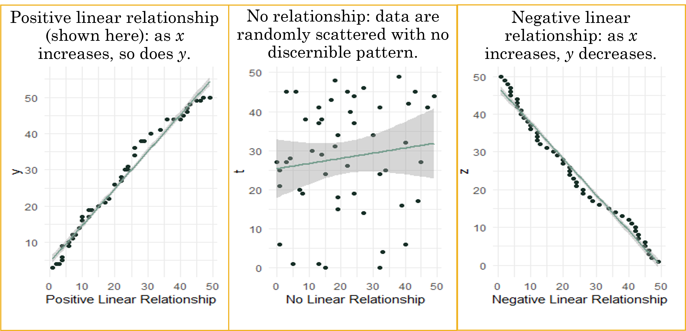

```{r setup, include=FALSE}
knitr::opts_chunk$set(echo=TRUE, message=FALSE, warning=FALSE)
```

Data rarely arrives ready for analysis. Before any modeling or visualization can happen, we typically spend considerable time inspecting, cleaning, and reshaping raw data — a process sometimes called data wrangling. This lesson walks you through that process using dplyr, a core package in R's tidyverse that provides a concise, readable set of functions for manipulating data frames and tibbles.

By the end of this lesson, you will be able to evaluate variables, identify data quality issues, and prepare a dataset so that every variable is in the correct form for analysis. The techniques covered include: - Sorting data - Selecting variables - Filtering data - Counting data - Handling missing values - Summarizing data - Grouping data

# Data Types and Coercion

Before cleaning or transforming a dataset, you need to confirm that R is treating each variable as the correct type. A variable stored as text when it should be numeric will silently break calculations; a number stored as a factor will produce the wrong chart. This section covers how to identify data types and how to convert between them — skills you will use immediately in the dplyr examples that follow.

## Evaluating Data Types

-   A data type of a variable specifies the type of data that is stored inside that variable. R is Called a Dynamically Typed Language, meaning that a variable itself is not declared of any data type. Rather it receives the data type of the R object that is assigned to it. We can change a variable’s data type if we want through coercion, but it will inherit one based on the object assigned to it. We will learn some common ways to do this in the data preparation section.
-   Evaluating data types in R is crucial for understanding and managing datasets effectively, as different data types require specific handling and operations. R provides several functions to identify and evaluate data types, such as class() to check an object's class, typeof() to determine its internal storage mode, and is.numeric(), is.character(), or is.factor() to test for specific types. These functions help ensure that data is in the correct format for analysis or modeling tasks. For instance, numeric data types are essential for calculations, while factors or characters are used for categorical data.
-   There are a number of data types in R that are common to programming and statistical analysis.
    -   Factor (Nominal or Ordinal)
    -   Numeric (Real or Discrete (Integer))
    -   Character
    -   Logical
    -   Date

## Coercing Data Types

-   In R, coercion is the process of converting one data type to another, often done automatically by R when necessary. For example, if you combine numeric and character data in a vector, R will coerce the numeric values to characters, as seen in c(1, "A"), which results in c("1", "A"). Coercion can also be done manually using functions like as.numeric() or as.factor() to change data types explicitly.
-   To determine whether a variable is numeric or categorical (factor), you can use the class() function. For example, if you have a variable age, running class(age) will tell you if it is stored as "numeric" or "factor". Numeric variables represent quantities, such as continuous or discrete numbers, while categorical variables represent groups or categories, typically stored as factors. For example, a variable with levels like "Male" and "Female" would be a categorical (factor) variable.
-   Sometimes when you read in a dataset all the variables are already in the correct type. Other times, you need to force it into the type you need to conduct the analysis through a process called coercion.

### Factor Data Type

-   Factor data types can be ordinal or nominal. Ordinal and nominal variables are both types of categorical variables but differ in their characteristics. Ordinal variables have a meaningful order or ranking among categories (e.g., "low," "medium," "high"), but the intervals between ranks are not necessarily equal. Nominal variables, on the other hand, represent categories without any inherent order (e.g., "red," "blue," "green"). Understanding this distinction is essential for selecting appropriate statistical methods, as ordinal variables often allow for rank-based analyses, while nominal variables do not.
    -   Ordinal: Contain categories that have some logical order (e.g. categories of age).
    -   Nominal: Have categories that have no logical order (e.g., religious affiliation and marital status).
-   R will treat each unique value of a factor as a different level.

#### Ordinal Variable

-   Ordinal data may be categorized and ranked with respect to some characteristic or trait.
    -   For example, instructors are often evaluated on an ordinal scale (excellent, good, fair, poor).
    -   A scale allows us to code the data based on order, assuming equal distance between scale items (aka likert items).
    -   You can make an ordinal factor data type in R or you can convert the order to meaningful numbers.
-   To recode numbers in R, we would code poor to excellent = 1, 2, 3, 4 respectively.
-   The recode() function from the dplyr package within the tidyverse ecosystem is used to replace specific values in a vector or variable with new values.
-   It allows you to map old values to new ones in a simple and readable manner.

```{r, tidy=FALSE}
library(tidyverse)
# Take a vector representing evaluation scores, named evaluate 
evaluate <- c("excellent", "good", "fair", "poor", "excellent", "good")

data <- data.frame(evaluate)
data <- data %>%
     mutate(evaluate = recode(evaluate,
            "excellent" = 4,
            "good" = 3,
            "fair" = 2,
            "poor" = 1))
data

```

#### Nominal Variable

-   With nominal variables, data are simply categories for grouping.
-   For example, coding race/ethnicity might have a category value of White, Black, Native American, Asian/Pacific Islander, Other.
-   Qualitative values may be converted to quantitative values for analysis purposes. + White = 1, Black = 2, etc. This conversion to numerical representation of the category would be needed to run some analysis.
    -   Sometimes, R does this on our behalf depending on commands used.
-   We can force a variable into a factor data type using the as.factor() command.
-   If we use the read.csv() command, we can sometimes do this by setting an argument $stringsAsFactors=TRUE$. We will do this later in the lesson.

### Numeric Data Type

-   The as.numeric() function in R is used to convert data into numeric format, allowing for mathematical and statistical operations. It takes an input vector, such as characters or factors, and attempts to coerce it into numeric values. For instance, as.numeric(c("1", "2", "3")) returns a numeric vector of 1, 2, and 3. If applied to factors, it returns the underlying integer codes, not the original levels, so caution is needed to avoid misinterpretation. When conversion is not possible (e.g., as.numeric("abc")), it results in NA with a warning.

-   A numerical data type is a vector of numbers that can be Real or Integer, where continuous (Real) variables can take any value along some continuum, and integers take on whole numbers.

-   Two ways to create:

    -   We can create a numeric variable by ensuring our value we assign is a number!
    -   We can force a variable into an real number data type by using the as.numeric() command.

    ```{r}
    # Assign Rhode Island limit for medical marijuana in ounces per person
    kOuncesRhode <- 2.5
    #Identify the data type 
    class(x = kOuncesRhode) 
    ```

-   Discrete (Integer) Variables: In R, integer discrete data types represent whole numbers, making them ideal for scenarios where only non-fractional values are meaningful, such as counts, rankings, or categorical levels encoded as numbers. Integer values are stored more efficiently than numeric (floating-point) values, providing performance benefits in memory usage and computations. Integers can be explicitly created using the L suffix (e.g., x \<- 5L) or by coercing other data types with as.integer(). Operations on integers, such as arithmetic, comparisons, or indexing, behave consistently with their discrete nature. Integer data types are particularly useful for tasks like looping, array indexing, or when working with data where precision beyond whole numbers is unnecessary or irrelevant.

-   For an example of a discrete variable, we could collect information on the number of children in a family or number of points scored in a basketball game.

```{r}
# Assign the value of 4 to a constant called kTestInteger and set as an integer
kTestInteger <- as.integer(4)
class(kTestInteger) #Confirm the data type is an integer 

#Use as.integer() to truncate the variable ouncesRhode
Trunc <- as.integer(kOuncesRhode); Trunc

```

### Character Data Type

-   The character data type in R is used to store text or string data, making it essential for handling names, labels, descriptions, or any non-numeric information. Character data is represented as sequences of characters enclosed in quotes (e.g., "hello" or 'world').
-   Character data types can be wrapped in either single or double quotation marks (e.g, "hello" or 'hello').
-   Character data types can include letters, words, or numbers that cannot logically be included in calculations (e.g., a zip code).
    -   A quick example is below that shows how to assign a character value to a variable.

```{r}
# Make string constants 
Q1 <- "A"
Q2 <- 'B'
# Check the data type
class(x = Q1)
```

### Logical Data Type

-   Logical data types in R represent values that are either TRUE or FALSE, often used for conditional operations and data filtering. Logical values can be the result of comparisons (e.g., x \> 10) or explicitly assigned. Logical vectors are particularly useful in subsetting data; for instance, data\[data\$column \> 5, \] selects rows where the column values are greater than 5. Logical operators like & (and), \| (or), and ! (not) allow for more complex conditions. Logical data is also essential in control structures such as if, else, and loops. By enabling dynamic and conditional programming, logical types play a key role in efficient data manipulation and analysis.

    -   A quick example is below that shows how to assign a logical value to a variable.

    ```{r}
    # Store the result of 6 > 8 in a constant called kSixEight
    kSixEight <- 6 > 8 
    # Can use comparison tests with the following == >= <= > < <> != 
    kSixEight # Print kSixEight
    # Determine the data type of kSixEight
    class(x = kSixEight)
    ```

### Nominal Example with Dataset

```{r, message=FALSE}
library(tidyverse)
gss.2016 <- read_csv(file = "data/gss2016.csv") 
```

```{r}
#Examine the variable types with summary and class functions.
summary(gss.2016)
class(gss.2016$grass) #Check the data type.
gss.2016$grass <- as.factor(gss.2016$grass) #Turn to a factor.
class(gss.2016$grass) #Confirming it is now correct.
```

### Numerical Example with Dataset

-   We need to ensure data can be coded as numeric before using the as.numeric() command. For example, to handle the variable age, it seems like numerical values except one value of "89 OR OLDER". If as.numeric() command was used on this variable, it would put all the 89 and older observations as NAs. To force it to be a numerical variable, and keep that the sample participants were the oldest value, we need to recode it and then use the as.numeric() command to coerce it into a number.
-   Recoding the 89 and older to 89 does cause the data to lack integrity in its current form because it will treat the people over 89 years old as 89. But, we are limited here because this needs to be a numerical variable for us to proceed. We will learn a step later on in this section to transform the age variable into categories so that we bring back our data integrity.

```{r}
class(gss.2016$age)
#Recode "89 OR OLDER" into just "89"
gss.2016$age <- recode(gss.2016$age, "89 OR OLDER" = "89")
# Convert to numeric data type
gss.2016$age <- as.numeric(gss.2016$age) 
summary(gss.2016) #Conduct final check confirming correct data types
```

# Common dplyr Functions

## Arrange

-   Sorting or arranging the dataset allows you to specify an order based on variable values.
-   Sorting allows us to review the range of values for each variable, and we can sort based on a single or multiple variables.
-   Notice the difference between sort() and arrange() functions below.
    -   The sort() function sorts a vector.
    -   The arrange() function sorts a dataset based on a variable.
-   To conduct an example, read in the data set called gig.csv from your working directory.

```{r}
library(tidyverse)

gig <- read.csv("data/gig.csv", stringsAsFactors = TRUE, na.strings="")
dim(gig)
head(gig)
```

-   Using the arrange() function, we add the dataset, followed by a comma and then add in the variable we want to sort. This arranges from small to large.

-   Below is code to rearrange data based on Wage and save it in a new object.

```{r}
sortTidy <- arrange(gig, Wage)
head(sortTidy)
```

-   We can apply a desc() function inside the arrange function to re-sort from high to low like shown below.

```{r}
sortTidyDesc <- arrange(gig, desc(Wage))
head(sortTidyDesc)
```

## Subsetting and Filtering

-   Subsetting or filtering a data frame is the process of indexing, or extracting a portion of the data set that is relevant for subsequent statistical analysis. Subsetting allows you to work with a subset of your data, which is essential for data analysis and manipulation. One of the most common ways to subset in R is by using square brackets \[\]. We can also use the filter() function from tidyverse.

-   We use subsets to do the following:

    -   View data based on specific data values or ranges.
    -   Compare two or more subsets of the data.
    -   Eliminate observations that contain missing values, low-quality data, or outliers.
    -   Exclude variables that contain redundant information, or variables with excessive amounts of missing values.

-   When working with data frames, you can subset by rows and columns using two indices inside the square brackets: data\[row, column\]. For example, if you have df \<- data.frame(a = 1:3, b = c("X", "Y", "Z")), df\[1, 2\] would return the value "X", which is the first row and second column. If you want the entire first row, you would use df\[1, \], and to get the second column, you’d use df\[, 2\].

-   You can also use logical conditions to subset. For instance, x\[x \> 20\] would return all values in x greater than 20, and in a data frame, you could filter rows where a certain condition holds, such as df\[df\$a \> 1, \], which returns rows where column a has values greater than 1.

-   Let's do an example using the customers.csv file we read in earlier as customers in the last lesson. Base R provides several methods for subsetting data structures. Below uses base R by using the square brackets dataset\[row, column\] format.

```{r, results='hide'}
customers <- read.csv("data/customers.csv", stringsAsFactors = TRUE)

#To subset, note the dataset[row,column] format
#Results hidden to save space, but be sure to try this code in your .R file. 
#Data in 1st row
customers[1,] 
#Data in 2nd column
customers[,2] 
#Data for 2nd column/1st observation (row)
customers[1,2] 
#First 3 columns of data
customers[,1:3] 
```

-   One of the most powerful and intuitive ways to subset data frames in R is by using the filter() function from the dplyr package, which is part of the tidyverse. Tidyverse is extremely popular when filtering data.
-   The filter function is used to subset rows of a data frame based on certain conditions.
-   The below example filters data by the College variable when category values are "Yes" and saves the filtered dataset into an object called college.

```{r}
#Filtering by whether the customer has a "Yes" for college. 
#Saving this filter into a new object college which you should see in your global environment. 
college <- filter(customers, College == "Yes")
#Showing first 6 records of college - note the College variable is all Yes's. 
head(college)
```

-   Using the filter command, we can add filters pretty easily by using an & for and, or an \| for or. The statement below filters by College *and* Income and save the new dataset in an object called twoFilters.

```{r}
twoFilters <- filter(customers, College == "Yes" & Income < 50000)
head(twoFilters)
```

-   Next, we can do an *or* statement. The example below uses the filter command to filter by more than one category in the same field using the \| in between the categories.

```{r}
TwoRaces <- filter(customers, Race == "Black" | Race == "White")
head(TwoRaces)
```

-   The str_detect() function is used to detect the presence or absence of a pattern (regular expression) in a string or vector of strings. It returns a logical vector indicating whether the pattern was found in each element of the input vector.
-   Using str_detect it with a filter function allows you to pull observations based on the inclusion of a string pattern.

```{r}
Birthday2000 <- filter(customers, str_detect(BirthDate, "1985"))
```

## Select

-   In R, the select() function is part of the dplyr package, which is used for data manipulation. The select() function is specifically designed to subset or choose specific columns from a data frame. It allows you to select variables (columns) by their names or indices.
-   Both statements below select Income, Spending, and Orders variables from the customers dataset and form them into a new dataset called smallData.

```{r}
smallData <- select(customers, Income, Spending, Orders)
head(smallData)
```

## Piping (Chaining) Operator

-   The pipe operator takes the output of the expression on its left-hand side and passes it as the first argument to the function on its right-hand side. This enables you to chain multiple functions together, making the code easier to understand and debug.
-   If we want to keep our code tidy, we can add the piping operator (%\>%) to help combine our lines of code into a new object or overwriting the same object.
-   This operator allows us to pass the result of one function/argument to the other one in sequence.
-   The below example uses a `select()` function to pull Income, Spending, and Orders variables from the customers dataset and save it as a new object called `smallData`. It is an identical request to the one directly above, but written with the piping operator.

```{r}
smallData <- customers %>% select(Income, Spending, Orders)
```

## Counting

-   Counting allows us to gain a better understanding and insights into the data.

-   This helps to verify that the data set is complete or determine if there are missing values.

-   In R, the length() function returns the number of elements in a vector, list, or any other object with a length attribute. It essentially counts the number of elements in the specified object.

```{r}
#Gives the length of Industry
length(gig$Industry)
```

-   For counting using tidyverse, we typically use the filter and count function together to filter by a value or state and then count the filtered data.
-   In the function below, I use the piping operator to link together the filter and count functions into one command.
-   Note that we need a piping operator (%\>%) before each new function that is part of the chunk.

```{r}
# Counting with a Categorical Variable
# Here we are filtering by Automotive Industry and then counting the number and saving it in a new object called countAuto
countAuto <- gig %>%
     filter(Industry=="Automotive") %>%
     count()
countAuto #190
```

-   Below, we are filtering by Wage and the counting.

```{r}
# Counting with a Numerical Variable
# We could also save this in an object. 
gig %>%
  filter(Wage > 30) %>%
  count() ##536
```

-   We learned that there are 190 employees in the automotive industry and there are 536 employees who earn more than \$30 per hour.

-   We could also calculate the number of people with wages under or equal to 30.

```{r}
#We find 68 Wages under or equal to 30
WageLess30 <- gig %>%
  filter(Wage <= 30) %>%
  count() #
WageLess30
```

-   How many Accountants are there in the Job Category of the gig data set. The answer is shown below. Use filter and count to calculate this answer.

```{r, echo=FALSE}
gig %>%
     filter(Job=="Accountant") %>%
     count()
## 83 Accountants
```

## Handling Missing Data

-   Missing data is a common issue in data analysis and can arise for various reasons, such as data collection errors, non-responses in surveys, or data corruption. In R, handling missing data is crucial to ensure accurate and reliable analysis. Missing values are typically represented by NA (Not Available) in R.

-   Missing data needs to be closely evaluated and verified within each variable whether the data is truly blank, has no answer, or is marked with a character value such as the text N/A.

-   Missing data needs to be closely evaluated to see if the missing value is meaningful or not. If the variable that has many missing values is deemed unimportant or can be represented using a proxy variable that does not have missing values, the variable may be excluded from the analysis.

-   After a data set is loaded, there are three common strategies for dealing with missing values.

1.  The omission strategy recommends that observations with missing values be excluded from subsequent analysis.

2.  The imputation strategy recommends that the missing values be replaced with some reasonable imputed values. For example, imputing missing values using techniques like mean/median substitution or regression models can be considered.

    -   Numeric variables: replace with the average.
    -   Categorical variables: replace with the predominant category.

3.  Ignore your missing data if the function works without it.

    -   When you ignore missing data because your function works without it, the missing values are typically excluded from the calculations by default. In R, many functions, such as mean(), sum(), or lm(), have arguments like na.rm = TRUE to explicitly remove missing values during computation. Ignoring missing data can simplify the analysis, but it comes with potential consequences.

-   The choice of approach depends on the nature of the missingness, which can be categorized as Missing Completely at Random, Missing at Random, or Missing Not at Random. Addressing missing data appropriately is essential to maintain the validity of statistical analyses and avoid biases.

### Limitations of Using a Missing Data Technique

-   Recommended Closer Evaluation of Missing Data

-   There are limitations of the techniques listed above (omission, imputation, and ignore).

-   Reduction in Sample Size: Ignoring missing data leads to a smaller effective sample size, which may reduce the power of your analysis and the reliability of the results.

-   Bias: If the missing data are not Missing Completely at Random, ignoring them may introduce bias. For example, if specific groups or patterns are overrepresented in the remaining data, the results may not generalize to the full dataset.

-   Distorted Metrics: Calculations that ignore missing values (e.g., averages, sums) might not reflect the true population parameters, especially if the missing data are systematically different from the observed data. In addition, if a large number of values are missing, mean imputation will likely distort the relationships among variables, leading to biased results.

-   Incorrect Inferences: Ignoring missing data without considering its nature could lead to incorrect conclusions, as the analysis only reflects the subset of available data.

-   Consider a dataset used to predict factors that lead to intubation due to COVID-19. Suppose one variable, "Number of pregnancies," contains missing data (NAs) for all men, as the question is not applicable to them. If we were to compare this variable with another, "Intubated due to COVID-19: Yes/No," simply omitting the rows with blanks (NAs) could lead to the exclusion of an entire gender, distorting the analysis. In this case, a different approach to handling missing data would be more appropriate to ensure the dataset remains representative. Additionally, if a value is not blank but is considered missing for analysis purposes, the data should be consistently processed (e.g., mutated or recoded) to align with the chosen technique for handling true missing values.

### na.rm

-   The na.rm parameter in R is a convenient way to handle missing values (NA) within functions that perform calculations on datasets. The parameter stands for "NA remove" and, when set to TRUE, instructs the function to exclude missing values from the computation.

```{r}
y <- c(1, 2, NA, 3, 4, NA)
# These lines runs, but do not give you anything useful.
sum(y) 
mean(y)
```

-   Many functions in R include parameters that will ignore NAs for you.

-   sum() and mean() are examples of this, and most summary statistics like median() and var() and max() also use the na.rm parameter to ignore the NAs. Always check the help to determine if na.rm is a parameter.

```{r}
sum(y, na.rm=TRUE) 
mean(y, na.rm=TRUE)
# na.omit removes the NAs from the vector of dataset. Here, it works for removing NAs from the vector.  
y <- na.omit(y) 
```

### na.rm with a Dataset

-   Using a dataset, we need the \_data$variable_ format, like mean(data$column, na.rm = TRUE) calculates the mean of the non-missing values in the specified column or variable. This approach is straightforward and useful when the presence of missing values would otherwise cause an error or return an NA result.

```{r}
summary(gig)
mean(gig$Wage, na.rm=TRUE)
```

### is.na()

-   In R, the is.na() function is used to check for missing (NA) values in objects like vectors, data frames, or arrays. It returns a logical vector of the same length as the input object, where TRUE indicates a missing value and FALSE indicates a non-missing value.

```{r}
#Counts the number of all NA values in the entire dataset
CountAllBlanks <- sum(is.na(gig)); CountAllBlanks 

#Gives the observation number of the observations that include NA values
which(is.na(gig$Industry))

#Produces a dataset with observations that have NA values in the Industry field. 
ShowBlankObservations <- gig %>%
     filter(is.na(Industry))
ShowBlankObservations

#Counts the number of observations that have NA values in the Industry field. Industry is categorical, so we can count values based on it. 
CountBlanks <- sum(is.na(gig$Industry)); CountBlanks 

#Counts the number of observations that have NA values in the Wage field. 
CountBlanks <- sum(is.na(gig$Wage)); CountBlanks 

```

### na_if()

-   The na_if() function in tidyr is used to replace specific values in a column with NA (missing) values. This function can be particularly useful when you want to standardize missing values across a dataset or when you want to replace certain values with NA for further data processing

```{r}
TurnNA <- gig %>%
     mutate(Job = na_if(Job, "Other"))
head(TurnNA)
```

### na.omit() vs. drop_na()

-   Both functions return a new object with the rows containing missing values removed.

-   na.omit() is a base R function, so it doesn't require any additional package installation where drop_na() requires loading the tidyr package, which is part of the tidyverse ecosystem.

-   drop_na() fits well into tidyverse pipelines, making it easy to integrate with other tidyverse functions where na.omit() can also be used in pipelines but might require additional steps to fit seamlessly.

```{r}
#install.packages("Amelia")
library(Amelia)
data("africa")
summary(africa)
summary(africa$gdp_pc)
summary(africa$trade)

africa1 <- na.omit(africa)
summary(africa1)

##to drop all at once. 
africa2 <- africa %>% drop_na()
summary(africa2)

```

-   You try to load the airquality dataset from base R and look at a summary of the dataset.

    -   Sum the number of NAs in airquality.
    -   Omit all the NAs from airquality and save it in a new data object called airqual and take a new summary of it.

    ```{r, echo=FALSE}
    data("airquality")
    summary(airquality)
    sum(is.na(airquality))
    #37 + 7
    airqual <- na.omit(airquality)
    #153-111
    summary(airqual)
    ```

## Summarize

-   The summarize() command is used to create summary statistics for groups of observations in a data frame.
-   In R, summary() and summarize() serve different purposes. summary() is part of base R and gives a quick overview of data, returning descriptive statistics for each column. For example, summary(mtcars) provides the min, max, median, and mean for numeric columns and counts for factors. It’s useful for a broad snapshot of your dataset.
-   In contrast, summarize() (or summarise()) is from the dplyr package and allows for custom summaries. For instance, mtcars %\>% summarize(avg_mpg = mean(mpg), max_hp = max(hp)) returns the average miles per gallon and the maximum horsepower. It’s more flexible and is often used with group_by() for grouped calculations. In conclusion, summary() gives automatic overviews, while summarize() is better for tailored summaries.
-   In the example below, we can summarize more than one thing into tidy output.

```{r}
gig %>%
     drop_na() %>% 
     summarize(mean.days = mean(Wage),
               sd.days = sd(Wage),
               var.days = var(Wage),
               med.days = median(Wage),
               iqr.days = IQR(Wage))

```

## Group_by

-   group_by is used for grouping data by one or more variables. When you use group_by() on a data frame, it doesn't actually perform any computations immediately. Instead, it sets up the data frame in such a way that any subsequent operations are performed within these groups
-   summarize() is often used in combination with group_by() to calculate summary statistics within groups

```{r}
##summarize data by Industry variable. 
groupedData <- gig %>%
     group_by(Industry) %>%
     summarize(meanWage = mean(Wage))
groupedData

##same function with na's dropped. 
groupedData <- gig %>%
     drop_na() %>%
     group_by(Industry) %>%
     summarize(meanWage = mean(Wage))
groupedData

```

## case_when()

One of the most common data preparation tasks is creating or transforming variables based on conditions — for example, converting a numeric score into a letter grade, or grouping continuous values into labeled categories. The case_when() function from the dplyr package is used to create new variables based on multiple conditions. It works like a series of if...else if...else statements and is especially useful for assigning values based on ranges or logical categories. - The case_when() and recode() functions in R both allow you to transform or recode values in a vector, but they differ in flexibility and use cases. recode() is best for straightforward value replacement, where each input value maps directly to a new value—such as turning "good" into 3. - In contrast, case_when() is more flexible and powerful, allowing you to specify complex conditional logic, including comparisons and ranges (e.g., x \> 100 \~ "High"). case_when() evaluates conditions in order and is particularly useful when the transformation depends on logical expressions rather than exact matching. For categorical data that maps cleanly one-to-one, recode() is convenient; for anything requiring conditional logic, case_when() is preferred.

```{r, echo=FALSE, include=TRUE}
#data <- data %>%
#  mutate(NewVariable = case_when(
#    condition1 ~ value1,
#    condition2 ~ value2,
#    TRUE ~ default_value  # optional default
```

-   From recoding to ordinal Variables

```{r}
evaluate <- c("excellent", "good", "fair", "poor", "excellent", "good")
data <- data.frame(evaluate)

dataRecode <- data %>%
     mutate(evaluate = recode(evaluate,
            "excellent" = 4,
            "good" = 3,
            "fair" = 2,
            "poor" = 1))
```

-   If we alter this to a case_when, we would include the following.

```{r}
dataCase_When <- data %>%
  mutate(evaluate = case_when(
    evaluate == "excellent" ~ 4,
    evaluate == "good" ~ 3,
    evaluate == "fair" ~ 2,
    evaluate == "poor" ~ 1,
    TRUE ~ NA_real_  # for safety in case of unexpected values
  ))
dataCase_When
```

-   If we were to give a range, we could do that with case_when using the \>, \< or \>= or \<= signs. An example is below.

```{r}
# Sample vector of numbers
score <- c(9, 6, 3, 8, 5, 10, 2)

# Categorize using case_when
category <- case_when(
  score > 8        ~ "High",
  score >= 5       ~ "Medium",
  score < 5        ~ "Low"
)

# Combine into a data frame to view
df <- data.frame(score, category); df

```

With the recoding tools covered — `recode()` for direct value replacement and `case_when()` for conditional logic — we now move to the core `dplyr` verbs for manipulating full datasets. These functions form the backbone of day-to-day data preparation in R.

## Mutate

-   mutate() is part of the dplyr package, which is used for data manipulation. The mutate() function is specifically designed to create new variables (columns) or modify existing variables in a data frame. It is commonly used in data wrangling tasks to add calculated columns or transform existing ones.
-   One example is below, but note that there are many things you can do with the mutate function.

```{r}
#making a new variable called calculation that multiplies gdp_pc by infl variables in the africa1 dataset. 
africa.mutated <- mutate(africa1, calculation = gdp_pc * infl)
head(africa.mutated)
```

-   Below is an example with the iris dataset, which is part of base R.

```{r}
data("iris")
##Selecting 2 variables from the iris dataset: Sepal.Length and Petal.Length
selected_data <-  select(iris, Sepal.Length, Petal.Length)
head(selected_data)
# Filter rows based on a condition: Species = setosa
filtered_data <-  filter(iris, Species == "setosa")
head(filtered_data)
# Arrange rows by the Sepal.Length column
arranged_data <-  arrange(iris, Sepal.Length)
# Create a new column by mutating the data by transforming Petal.Width to the log form. 
mutated_data <- mutate(iris, Petal.Width_Log = log(Petal.Width))
```

# Advanced Visualization

## Single Variable Visualization with Data Prep

The histogram, density plot, and boxplot covered in the Descriptive Statistics lesson worked with clean, ready-to-plot data. The examples here show the more common real-world workflow: a variable arrives with numeric codes, missing value sentinels, or incorrect data types that must be fixed before the chart will make sense. Cleaning comes first — visualization follows.

-   Let's start an example from scratch using a real dataset. We examine the `AUQ300` variable from the nhanes survey, which represents gun use.
-   We load the full dataset and clean all the relevant variables at once so the same `nhanes.clean` object can be used throughout this section and in the full example below.

```{r}
nhanes <- read.csv("data/nhanes2012.csv")
```

```{r, results='hide'}
head(nhanes)
```

```{r}
summary(nhanes$AUQ300) 
```


### Recode Variable if Needed

-   `AUQ300` needs to be a factor variable with 1 equaling *Yes* and 2 equaling *No*. We use `recode_factor()` inside `mutate()`.
-   `recode_factor()` transforms the levels of a categorical variable into a new set of labels.
-   `recode()` is generic and applies to numeric, categorical, or text data.
-   We select and recode all six variables of interest in a single pipeline so the object is ready for both the bar chart examples below and the full multi-variable example later.

```{r, warning=FALSE}
nhanes.clean <- nhanes %>%
  dplyr::select(AUQ300, AUQ310, AUQ320, AUQ060, AUQ070, AUQ080) %>%
  mutate(AUQ300 = recode_factor(AUQ300, '1' = 'Yes', '2' = 'No')) %>%
  mutate(AUQ310 = recode_factor(AUQ310,
           '1' = "1 to less than 100",
           '2' = "100 to less than 1000",
           '3' = "1000 to less than 10k",
           '4' = "10k to less than 50k",
           '5' = "50k or more",
           '7' = "Refused",
           '9' = "Don't know")) %>%
  mutate(AUQ060 = recode_factor(AUQ060, '1' = 'Yes', '2' = 'No')) %>%
  mutate(AUQ070 = recode_factor(AUQ070, '1' = 'Yes', '2' = 'No')) %>%
  mutate(AUQ080 = recode_factor(AUQ080, '1' = 'Yes', '2' = 'No')) %>%
  mutate(AUQ320 = recode_factor(AUQ320,
           '1' = 'Always', '2' = 'Usually',
           '3' = 'About half the time', '4' = 'Seldom', '5' = 'Never'))
summary(nhanes.clean)
```

### Get Bar Roughly Plotted

```{r, fig.alt = "Bar Graph of AUQ300 Variable (Gun Use) Generated by R"}
# Without piping operator
ggplot(nhanes.clean, aes(x = AUQ300)) + geom_bar()
#With piping operator
nhanes.clean %>%
  ggplot(aes(x = AUQ300)) + geom_bar()
```

### Add Functions to Clean Chart

-   Use `drop_na()` to remove missing values from the variable before plotting so they do not appear as a category.
-   Add axis labels with `labs(x = ..., y = ...)`.

```{r tidy=FALSE, fig.alt = "Bar Graph of AUQ300 Variable with labels"}
nhanes.clean %>%
  drop_na(AUQ300) %>%
  ggplot(aes(x = AUQ300)) + geom_bar() +
  labs(x = "Gun use", y = "Number of participants")
```

-   From the bar graph, we can see that almost double the number of people have not fired a firearm for any reason compared to those who have.

### Adding Color

-   When `fill` is mapped to a variable inside `aes()`, ggplot assigns a distinct color to each category automatically.

```{r tidy=FALSE, fig.alt = "Bar Graph of AUQ300 Variable with color"}
nhanes.clean %>%
  drop_na(AUQ300) %>%
  ggplot(aes(AUQ300, fill=AUQ300)) +
  geom_bar() +
  labs(x = "Gun use", y = "Number of participants", 
       subtitle = "Filled inside the aes()") 
```

### Data Prep and Then Visualized

This example walks through cleaning the `gss.2016` dataset and then plotting the result, showing how data preparation and visualization connect in practice.

```{r, message=FALSE}
gss.2016 <- read.csv(file = "data/gss2016.csv")
```

The `grass` variable captures whether respondents believe marijuana should be legal, but it arrives as a character and contains placeholder codes (`"DK"`, `"IAP"`) that need to be converted to `NA`. The `age` variable has the value `"89 OR OLDER"` which prevents numeric coercion. We handle all of this in a single pipeline and create an age category variable at the end.

```{r}
gss.2016.cleaned <- gss.2016 %>%
  mutate(grass = as.factor(grass)) %>%
  mutate(grass = na_if(x = grass, y = "DK")) %>%
  mutate(grass = na_if(x = grass, y = "IAP")) %>%
  mutate(grass = droplevels(x = grass)) %>%
  mutate(age = recode(age, "89 OR OLDER" = "89")) %>%
  mutate(age = as.numeric(x = age)) %>%
  mutate(age.cat = as.factor(case_when(
       age < 30 ~ "< 30",
       age >= 30 & age <= 59 ~ "30 - 59",
       age >= 60 & age <= 74 ~ "60 - 74",
       age >= 75 ~ "75+",
       TRUE ~ NA_character_
  )))
summary(gss.2016.cleaned)
```

With the data cleaned, we can plot directly. `geom_bar()` counts observations automatically — no need to pre-compute frequencies. `drop_na()` removes missing values so they don't appear as a bar category.

```{r}
ggplot(gss.2016.cleaned, aes(grass)) + geom_bar()
```

```{r, fig.alt = "Bar Graph Generated by R"}
gss.2016.cleaned %>% 
     drop_na() %>%
     ggplot(aes(grass)) + geom_bar(fill=c("red", "blue")) + 
     labs(x = "Should marijuana be legal", y="Frequency of Responses")
```

### Edit The Graphic

-   We can expand to include the `age.cat` variable on the x axis, with bars filled by `grass` category.

```{r}
gss.2016.cleaned %>% 
     drop_na() %>%
     ggplot(aes(age.cat, fill=grass)) + geom_bar() + labs(x="Age Category", y="Frequency of responses")
```

-   Add `position = "dodge"` to place the bars side by side (grouped) rather than stacked.

```{r}
gss.2016.cleaned %>% 
     drop_na() %>%
     ggplot(aes(age.cat, fill=grass)) + geom_bar(position="dodge") + labs(x="Age Category", y="Frequency of responses")
```

-   We can further edit to show percentages on the y axis using `after_stat(count)`.

```{r, fig.alt = "Grouped Bar Graph Generated by R"}
gss.2016.cleaned %>% 
     drop_na() %>%
     ggplot(aes(age.cat, y = 100*(after_stat(count))/sum(after_stat(count)), 
                fill=grass)) + 
     geom_bar(position = 'dodge')+  
     theme_minimal()+ 
     labs(x = "Age Category",y = "Percent of responses")
```

## MultiVariable Data Visualization

Now that we can clean and prepare data, we can start to visualize it. The goals of this section are to explore patterns based on groups or between two or more variables. Visualization is one of the most important steps in any analysis — it helps you understand your data quickly, catch problems early, and communicate findings clearly.

Histograms, density plots, and boxplots for a single continuous variable were covered in the Descriptive Statistics lesson, and single-variable bar charts requiring data preparation are in the section above. This section focuses entirely on **two-variable charts**: grouped and stacked bar charts for two categorical variables, boxplots across groups, and scatterplots for two continuous variables.

```{r, message=FALSE}
library(tidyverse)
```

::: callout-note
Recall that ggplot2 builds charts in layers using `+` — each layer adds a geometry, label, or theme on top of the last. The same layering concepts from the Descriptive Statistics lesson apply to every chart in this section.
:::

-   Combinations of 2 variable types for graphing:
    -   Two categorical / factor variables.
    -   One categorical / factor and one continuous / numeric variable.
    -   Two continuous / numeric variables.

### Bar Graphs for Two Categorical Variables

-   There are two formats available: **Grouped** and **Stacked**.

```{r, echo=FALSE}
countsDF <- mtcars %>% 
     group_by(vs, gear) %>%
     count()
countsDF

ggplot(countsDF, aes(x = gear, y = n, fill = factor(vs))) +
  geom_bar(stat = "identity", position = "dodge") +
  labs(title = "Grouped") + 
  scale_fill_manual(values = c("darkblue", "red"),
                    labels = c("vs-0", "vs-1")) 

ggplot(countsDF, aes(x = gear, y = n, fill = factor(vs))) +
  geom_bar(stat = "identity") +
  labs(title = "Stacked") + 
  scale_fill_manual(values = c("darkblue", "red"),
                    labels = c("vs-0", "vs-1")) 
```

### Grouped Bar Graph

-   A grouped bar graph allows comparison of multiple sets of data items, with a single color used to denote a specific series across all sets.
-   Use `group_by()` and `count()` to generate frequencies first, then plot with `stat = "identity"` and `position = "dodge"`.

```{r fig.alt = "Grouped Bar Graph Generated by R"}
mtcars <- mtcars %>% 
    mutate(vs=as.factor(vs)) %>% 
    mutate(gear=as.factor(gear))

countsDF <- mtcars %>% 
    group_by(vs, gear) %>%
    count()
summary(countsDF)
    
ggplot(countsDF, aes(x = gear, y = n, fill = vs)) +
     geom_bar(stat = "identity", position = "dodge") +
     labs(title = "Grouped Car Distribution by Gears and VS",
     x = "Number of Gears", y = "Count") +
     theme_minimal()
```

### Stacked Bar Graph

-   A stacked bar graph extends the standard bar chart to two categorical variables by dividing each bar into sub-bars, one per level of the second variable.
-   Remove the `position = "dodge"` argument to stack instead of group.

```{r tidy=FALSE, fig.alt = "Stacked Bar Graph Generated from ggplot2 by R"}
ggplot(countsDF, aes(x = gear, y = n, fill = vs)) +
  geom_bar(stat = "identity") +
  labs(title = "Stacked Car Distribution",
       x = "Number of Gears",
       y = "Count") +
  theme_minimal()
```

### Bar Graph for Continuous Across Groups

-   Instead of counting observations, we can display a continuous variable (like mean) for each group.
-   Use `group_by()` and `summarise()` to calculate the group statistic first, then pass it to `geom_bar(stat = "identity")`.

```{r message=FALSE}
avg_mpg <- mtcars %>%
  group_by(gear, vs) %>%
  summarise(mpg = mean(mpg, na.rm = TRUE))
```

```{r tidy=FALSE, fig.alt = "Grouped Bar Graph Generated from ggplot2 by R"}
ggplot(avg_mpg, aes(gear, mpg, fill = vs)) +
  geom_bar(stat = "identity", position = "dodge") +
  ggtitle("Average MPG by VS and Gear")
```

```{r}
ggplot(avg_mpg, aes(gear, mpg, fill = vs)) +
     geom_bar(stat = "identity", position = "dodge", color="black") +  
     ggtitle("Average MPG by VS and Gear")+
     scale_fill_manual(values=c("yellow", "brown"))
```

### Boxplot for Continuous Across Groups

-   When a grouping variable is added to a boxplot, we get one boxplot per group. This allows direct comparison of distributions across categories.
-   The categorical variable must be a factor before plotting.

```{r tidy=FALSE, fig.alt = "Boxplot Generated from ggplot2 by R"}
mtcars %>%
  ggplot(aes(x = gear, y = mpg, fill = gear)) +
  geom_boxplot(show.legend = FALSE) +
  scale_fill_manual(values = c("gray", "red", "blue")) +
  theme_minimal()
```

```{r}
mtcars %>%
     ggplot(aes(x = vs, y = mpg, fill = vs)) +
     geom_boxplot(show.legend = FALSE) +
     scale_fill_manual(values = c("gray", "red")) +
     theme_minimal() 
```

### Scatterplot for Two Continuous Variables

-   A scatterplot is used to determine if two continuous variables are related.
    -   Each point is a pairing: $(x_1, y_1), (x_2, y_2),$ etc.
-   Our goal with a scatterplot is to characterize the relationship visually — positive, negative, or not existent.



-   Let's work a clean example examining the relationship between income and years of education.

```{r, fig.alt = "Scatterplot Generated by R"}
Edu <- read.csv("data/education.csv")
plot(Edu$Income ~ Edu$Education, ylab = "Income", xlab = "Education")
```

-   Working with ggplot:
    -   Layer 1: `ggplot()` with `aes()` pointing to x and y variables.
    -   Layer 2: `geom_point()` to add the observation points.
    -   Additional layers: `labs()`, `geom_smooth()`, and others.

```{r, fig.alt = "Scatterplot Generated from ggplot2 by R"}
ggplot(Edu, aes(x=Education, y=Income)) +
     geom_point() +
     labs(y= "Income", x = "Education") 
```

-   We can add a trendline using `geom_smooth(method = "lm")` to fit a linear regression line and visualize the direction of the relationship.

```{r, fig.alt = "Scatterplot With geom_smooth lm method Generated from ggplot2 by R"}
ggplot(Edu, aes(x=Education, y=Income)) +
    geom_point() +
    labs(y= "Income", x = "Education") +
    geom_smooth(method="lm", color="#789F90")
```

-   Let's look at a few more examples using `mtcars` and see if the relationship is positive, negative, or not existent.

```{r, fig.alt = "Scatterplot examples in R"}
ggplot(mtcars, aes(x=disp, y=mpg))+ 
  geom_point() + 
  geom_smooth(method="lm", color="#789F90")
```

```{r, fig.alt = "Scatterplot examples in R"}
ggplot(mtcars, aes(x=hp, y=mpg))+ geom_point() +
  geom_smooth(method="lm", color="#789F90")
```

```{r, fig.alt = "Scatterplot examples in R"}
ggplot(mtcars, aes(x=qsec, y=mpg))+geom_point() + geom_smooth(method="lm", color="#789F90")
```

-   When one of the variables is categorical rather than continuous, a boxplot is more appropriate than a scatterplot. If `cyl` is treated as numeric, only one boxplot appears. Converting it to a factor fixes this.

```{r, fig.alt = "ggplot2 Example with Incorrect Data Type"}
ggplot(mtcars, aes(cyl, mpg)) + geom_point() + geom_smooth(method="lm")
```

```{r, fig.alt = "ggplot2 Example with Boxplot"}
ggplot(mtcars, aes(cyl, mpg)) + geom_boxplot()
```

```{r}
mtcars <- mtcars %>% 
     mutate(cyl = as.factor(cyl))
ggplot(mtcars, aes(cyl, mpg)) + geom_boxplot()
```

## Full Example

The following examples tie together data preparation and visualization using two real public health datasets. Each one requires cleaning before plotting — the nhanes dataset uses numeric codes that need recoding, and the BRFSS dataset has sentinel values that must be converted to NA before the distributions make sense.

### nhanes Dataset example

-   The nhanes dataset includes auditory health variables alongside gun use variables, making it an interesting case for exploring relationships between two categorical variables.

-   Variables: `AUQ060/070/080` measure ability to hear across a room; `AUQ300/310/320` relate to firearm use and hearing protection.

-   `nhanes.clean` was fully prepared in the Bar Graph with Data Wrangling section above with all six variables recoded and ready to use.

-   NA values are left in and handled on a chart-by-chart basis using `drop_na()` so we do not unnecessarily reduce the dataset.

```{r}
nhanes.clean %>% 
  drop_na(AUQ310) %>% drop_na(AUQ060) %>% 
  ggplot(aes(x=AUQ310, fill=AUQ060)) + geom_bar(position="dodge") + 
  labs(x="How many rounds fired", title="Hearing Whisper vs. Rounds Fired", y="Frequency")

nhanes.clean %>% 
  drop_na(AUQ320) %>% drop_na(AUQ060) %>% 
  ggplot(aes(x=AUQ320, fill=AUQ060)) + geom_bar(position="dodge") + 
  labs(x="Wear hearing protection", title="Hearing Whisper vs. Hearing Protection Use", y="Frequency")
```

-   Try running the other variable combinations on your own to see what patterns you can find.

### brfss Dataset Example

The BRFSS (Behavioral Risk Factor Surveillance System) dataset illustrates how data preparation and visualization come together. The qualitative variable `TRNSGNDR` requires coercion and recoding before it can be plotted; the continuous variable `PHYSHLTH` needs its sentinel codes cleaned before analysis. This example ties together the coercion, `mutate()`, and visualization skills from this lesson.

-   The full codebook where this screenshot is taken is brfss_2014_codebook.pdf.


```{r}
brfss <- read.csv("data/brfss.csv")
summary(brfss)
```

#### Qualitative Variable

-   To look at an example, the one below seeks to understand the healthcare issue in reporting gender based on different definitions. The dataset is part of the Behavioral Risk Factor Surveillance System (brfss) dataset (2014), which includes lots of other variables besides reported gender.

```{r}
#Summarize the TRNSGNDR variable
summary(object = brfss$TRNSGNDR) 
#Find frequencies 
table(brfss$TRNSGNDR) 
```

-   Since this table is not very informative, we need to do some edits.
-   Check the class of the variable to see the issue with analyzing it as a categorical variable.

```{r}
class(brfss$TRNSGNDR)
```

-   Because `TRNSGNDR` is stored as numeric, it needs to be converted to a factor before recoding. The `mutate()` pipeline below handles the coercion and recoding in a single step.

```{r tidy=FALSE}
brfss.cleaned <- brfss %>% 
  mutate(TRNSGNDR = as.factor(TRNSGNDR)) %>%
  mutate(TRNSGNDR = recode_factor(TRNSGNDR,
      '1' = 'Male to female',
      '2' = 'Female to male',
      '3' = 'Gender non-conforming',
      '4' = 'Not transgender',
      '7' = 'Not sure',
      '9' = 'Refused'))
```

-   We can use the levels() command to show the factor levels made with the mutate() command above.

```{r}
levels(brfss.cleaned$TRNSGNDR)
```

-   Check the summary.

```{r}
summary(brfss.cleaned$TRNSGNDR)
```

-   Take a good look at the table to interpret the frequencies in the output above. The highest percentage was the "NA's" category, followed by "Not transgender". Removing the NA's moved the "Not transgender" category to over 97% of observations.

#### Quantitative Variable

-   Let's use the cleaned dataset to make more changes to the continuous variable PHYSHLTH. In the codebook, it looks like the data is most applicable to the first 2 categories. The 1-30 days coding and the 88 coding, which means 0 days of physical illness and injury.
    -   Using cleaned data, we need to prep the variable a little more before getting an accurate plot.
    -   Specifically, we need to null out the 77 and 99 values and make sure the 88 coding is set to be 0 for 0 days of illness and injury.

```{r, fig.alt = "Histogram Generated by R of PHYSHLTH variable"}
brfss.cleaned <- brfss %>% 
  mutate(TRNSGNDR = recode_factor(TRNSGNDR,
      '1' = 'Male to female',
      '2' = 'Female to male',
      '3' = 'Gender non-conforming',
      '4' = 'Not transgender',
      '7' = 'Not sure',
      '9' = 'Refused')) %>%
  #Turn the 77 values to NA's. 
  mutate(PHYSHLTH = na_if(PHYSHLTH, y = 77)) %>%
  #Turn the 99 values to NA's. 
  mutate(PHYSHLTH = na_if(PHYSHLTH, y = 99)) %>%
  #Recode the 88 values to be numeric value of 0. 
  mutate(PHYSHLTH = recode(PHYSHLTH, '88' = 0L))


```

#### Histogram

-   The histogram showed most people have between 0 and 10 unhealthy days per 30 days.

-   Next, evaluate mean, median, and mode for the PHYSHLTH variable after ignoring the blanks.

```{r}
mean(brfss.cleaned$PHYSHLTH, na.rm=TRUE)
median(brfss.cleaned$PHYSHLTH, na.rm=TRUE)
names(x = sort(x = table(brfss.cleaned$PHYSHLTH), decreasing = TRUE))[1]
```

-   While the mean is higher at 4.22, the median and most common number is 0.

```{r}
## Spread to Report with the Mean
var(brfss.cleaned$PHYSHLTH, na.rm=TRUE)
sd(brfss.cleaned$PHYSHLTH, na.rm=TRUE)
##Spread to Report with Median
summary(brfss.cleaned$PHYSHLTH, na.rm=TRUE)
range(brfss.cleaned$PHYSHLTH, na.rm=TRUE)
max(brfss.cleaned$PHYSHLTH, na.rm=TRUE)-min(brfss.cleaned$PHYSHLTH, na.rm=TRUE)
IQR(brfss.cleaned$PHYSHLTH, na.rm=TRUE)
```

```{r}
library(semTools)
# Plot the data
brfss.cleaned %>% 
  ggplot(aes(PHYSHLTH)) + geom_histogram()
# Calculate Skewness and Kurtosis
skew(brfss.cleaned$PHYSHLTH)
kurtosis(brfss.cleaned$PHYSHLTH)

```

-   The skew results provide a z of 607.905 (6.079054e+02) which is much higher than 7 (for large datasets). This indicates a clear right skew which means the data is not normally distributed.
-   The kurtosis results are also very leptokurtic with a score of 478.063.

# Review and Practice

## Using AI

Use the following prompts with a generative AI tool like ChatGPT to explore data visualization with `ggplot2` further.

-   How can I modify the appearance of a ggplot bar chart to include custom colors for each bar, and what are the best practices for choosing colors in data visualization?

-   What is the role of layering in ggplot, and how can adding multiple layers, such as labels, themes, and lines, improve the readability of a plot?

-   When should a density plot be used instead of a histogram, and how does each visualization help in understanding the distribution of continuous data?

-   How can I use a boxplot in R to identify and visualize outliers in my dataset, and what additional steps should I take to handle these outliers?

-   How can I create a scatter plot in ggplot to explore relationships between two continuous variables, and how do I add a trendline to help interpret the results?

-   What are the steps for creating a grouped bar chart in ggplot, and how does this visualization help in comparing multiple categories or groups within a dataset?

## Data Types and Coercion Lab

**1.** What R function would you use to check the data type of a column? Write the command to check the type of the `Age` column in a dataset called `survey`.

::: {.callout-note collapse="true"}
### Show Answer

``` r
class(survey$Age)
```
:::

**2.** A dataset has a `Rating` column stored as character with values `"1"`, `"2"`, `"3"`. Write the code to convert it to numeric.

::: {.callout-note collapse="true"}
### Show Answer

``` r
survey$Rating <- as.numeric(survey$Rating)
class(survey$Rating)  # confirm: "numeric"
```
:::

**3.** An instructor evaluation column contains `"excellent"`, `"good"`, `"fair"`, `"poor"`. Write a `mutate()` pipeline using `recode()` to convert these to 4, 3, 2, 1 respectively and store them as integers.

::: {.callout-note collapse="true"}
### Show Answer

``` r
library(tidyverse)
survey <- survey %>%
  mutate(Rating = recode(Rating,
    "excellent" = 4L,
    "good"      = 3L,
    "fair"      = 2L,
    "poor"      = 1L))
```
:::

**4.** Load `dataprep.csv` as `houseprices`. The `BuildDay` column contains dates stored as character strings (e.g., `"1986-08"`). Use the `lubridate` package to convert it to a proper date type, then confirm the conversion with `class()`.

``` r
# Your code here
```

::: {.callout-note collapse="true"}
### Show Answer

``` r
library(lubridate)
houseprices <- read.csv("data/dataprep.csv")
houseprices$BuildDay <- ym(houseprices$BuildDay)  # "1986-08" is year-month format
class(houseprices$BuildDay)  # "Date"
head(houseprices$BuildDay)
```

`ym()` parses year-month formatted strings. After conversion, `BuildDay` is a proper `Date` column that R can sort, filter, and compute differences on correctly.
:::

## Using dplyr Lab

Use the `dataprep.csv` dataset loaded as `houseprices`.

``` r
houseprices <- read.csv("data/dataprep.csv")
```

**1.** Filter the dataset to show only houses with 5 or more bedrooms. Save the result as `filtered` and count the observations.

::: {.callout-note collapse="true"}
### Show Answer

``` r
filtered <- filter(houseprices, Beds >= 5)
nrow(filtered)  # 9 houses
```

9 houses have 5 or more bedrooms.
:::

**2.** Arrange the full dataset by `Price` in descending order. Save as `ArrangedData` and print the head. What is the highest price?

::: {.callout-note collapse="true"}
### Show Answer

``` r
ArrangedData <- arrange(houseprices, desc(Price))
head(ArrangedData)
```

The highest price is **\$840,000** — it will appear in the first row.
:::

**3.** Using a single pipeline, filter to houses with at least 3 bedrooms, select only `Price`, `Beds`, and `Sqft`, and arrange by `Price` descending.

::: {.callout-note collapse="true"}
### Show Answer

``` r
houseprices %>%
  filter(Beds >= 3) %>%
  select(Price, Beds, Sqft) %>%
  arrange(desc(Price))
```
:::

Continue using `houseprices`.

**1.** Create a new categorical variable called `HouseSizeCategory` using `case_when()`: - Small: Sqft \< 2000 - Medium: Sqft between 2000 and 3000 (inclusive) - Large: Sqft \> 3000

::: {.callout-note collapse="true"}
### Show Answer

``` r
houseprices <- houseprices %>%
  mutate(HouseSizeCategory = case_when(
    Sqft < 2000             ~ "Small",
    Sqft >= 2000 & Sqft <= 3000 ~ "Medium",
    Sqft > 3000             ~ "Large"
  ))
```
:::

**2.** Calculate the frequency of each `HouseSizeCategory` using `table()`. List the count for each category.

::: {.callout-note collapse="true"}
### Show Answer

``` r
table(houseprices$HouseSizeCategory)
```

Large: 14 \| Medium: 25 \| Small: 40
:::

**3.** Calculate the average `Price` and average `Sqft` grouped by `HouseSizeCategory`. Fill in the table below with your results.

``` r
# Your code here
```

| HouseSizeCategory | avg_price | avg_sqft |
|-------------------|-----------|----------|
| Large             |           |          |
| Medium            |           |          |
| Small             |           |          |

::: {.callout-note collapse="true"}
### Show Answer

``` r
houseprices %>%
  group_by(HouseSizeCategory) %>%
  summarise(avg_price = mean(Price, na.rm = TRUE),
            avg_sqft  = mean(Sqft,  na.rm = TRUE))
```

| HouseSizeCategory | avg_price | avg_sqft    |
|-------------------|-----------|-------------|
| Large             | \$574,786 | 3,370 sq ft |
| Medium            | \$596,696 | 2,488 sq ft |
| Small             | \$457,568 | 1,505 sq ft |
:::

## Visualization Lab

For this lab, switch to the `dataviz.csv` coffee dataset rather than the datasets used in the teaching examples above. Load it as `coffee`. It contains 1,311 coffee quality reviews with variables including `Country.of.Origin`, `Processing.Method`, `TotalScore`, `Flavor`, and `Aroma`, among others. Use the `scores` vector for the outlier question.

``` r
coffee <- read.csv("data/dataviz.csv")
```

**1.** Create a bar chart showing the count of reviews by `Country.of.Origin`. Because many countries appear, filter to the top 6 countries first using `dplyr`. Give it a custom fill color and a `theme_minimal()`. What do you observe?

::: {.callout-note collapse="true"}
### Show Answer

``` r
library(tidyverse)
top6 <- coffee %>%
  count(Country.of.Origin, sort = TRUE) %>%
  slice_head(n = 6) %>%
  pull(Country.of.Origin)

coffee %>%
  filter(Country.of.Origin %in% top6) %>%
  ggplot(aes(x = reorder(Country.of.Origin, -table(Country.of.Origin)[Country.of.Origin]),
             fill = Country.of.Origin)) +
  geom_bar(show.legend = FALSE) +
  theme_minimal() +
  labs(title = "Coffee Reviews by Country (Top 6)",
       x = "Country", y = "Number of Reviews")
```

Mexico leads with 236 reviews, followed by Colombia (183) and Guatemala (181). The distribution is right-skewed — a few countries dominate the dataset.
:::

**2.** Make a density plot of `TotalScore`. Add a vertical dashed line at the mean. Then run `skew()` and `kurtosis()` from `semTools`. Is `TotalScore` skewed? Does the visual agree with the statistics?

::: {.callout-note collapse="true"}
### Show Answer

``` r
# Filter out the extreme low values (data quality issue — a few scores near 0)
coffee_clean <- filter(coffee, TotalScore > 50)

ggplot(coffee_clean, aes(x = TotalScore)) +
  geom_density(fill = "steelblue", alpha = 0.5) +
  geom_vline(aes(xintercept = mean(TotalScore)), color = "red", linetype = "dashed") +
  labs(title = "Density Plot of Coffee Total Score", x = "Total Score")

library(semTools)
skew(coffee_clean$TotalScore)
kurtosis(coffee_clean$TotalScore)
```

`TotalScore` is left-skewed — the mean (≈82.2) is slightly below the median (≈82.5), and the distribution has a longer tail to the left. The density plot will show the peak shifted right with a tail extending left.
:::

**3.** Make a boxplot of `TotalScore` (using `coffee_clean`). Do any outliers appear? Then use the `scores` vector below to manually verify outlier detection using the IQR method.

``` r
scores <- c(55, 56, 58, 60, 62, 65, 66, 67, 70, 120)
```

::: {.callout-note collapse="true"}
### Show Answer

``` r
# Boxplot
ggplot(coffee_clean, aes(x = TotalScore)) +
  geom_boxplot(fill = "lightblue", color = "navy") +
  labs(title = "Boxplot of Coffee Total Score", x = "Total Score")

# Manual outlier detection on the scores vector
Q1   <- quantile(scores)[2]; Q1     # 58.50
Q3   <- quantile(scores)[4]; Q3     # 66.75
IQRv <- IQR(scores); IQRv           # 8.25
LB   <- Q1 - 1.5 * IQRv; LB        # 46.12
UB   <- Q3 + 1.5 * IQRv; UB        # 79.12
scores[scores < LB | scores > UB]   # 120 is an outlier
```

Q1: 58.50 \| Q3: 66.75 \| IQR: 8.25 \| Lower bound: 46.12 \| Upper bound: 79.12 \| Outlier: **120**

The `TotalScore` boxplot will show outliers at the low end — a handful of very low scores (the data quality issues) appear as individual points well below the whisker.
:::

**4.** Create three different charts using the `coffee` dataset (or `coffee_clean`). Try at least one chart type not yet used in this lab. Write your three commands below and note what each reveals.

::: {.callout-note collapse="true"}
### Show Answer

Many correct answers are possible. For example:

``` r
# Histogram of Flavor scores
ggplot(coffee_clean, aes(Flavor)) +
  geom_histogram(binwidth = 0.1, fill = "goldenrod", color = "white") +
  labs(title = "Distribution of Flavor Scores")

# Bar chart of Processing Method
coffee %>%
  filter(Processing.Method != "") %>%
  ggplot(aes(x = Processing.Method, fill = Processing.Method)) +
  geom_bar(show.legend = FALSE) +
  theme_minimal() +
  labs(title = "Reviews by Processing Method", x = "Method", y = "Count") +
  theme(axis.text.x = element_text(angle = 30, hjust = 1))

# Scatterplot of Aroma vs Flavor
ggplot(coffee_clean, aes(x = Aroma, y = Flavor)) +
  geom_point(alpha = 0.3, color = "darkgreen") +
  geom_smooth(method = "lm", color = "red") +
  labs(title = "Aroma vs. Flavor Rating")
```

Washed / Wet is by far the most common processing method. Aroma and Flavor show a strong positive relationship — coffees rated highly on aroma tend to score well on flavor too.
:::

## Interactive R Lesson: Data Preparation with dplyr {#interactive-dataprep-lesson}

::: callout-note
You will use `filter()`, `select()`, `arrange()`, `mutate()`, the pipe operator, and `geom_point()` on the Auto dataset — all in the browser. Work through each section, then take the scored quiz.

**First-time load:** The interactive R environment below may take 10–20 seconds to initialize on your first visit. This is normal — R is loading in your browser. Once ready, the "Run Code" buttons will become active.
:::

```{webr-r}
#| label: dataprep-setup
#| context: setup
library(dplyr)
library(ggplot2)
Auto <- read.csv("data/Auto.csv")
```

### Part 1: Loading and Summarizing Data

Hello again! Dr. Schlosser here. This lesson covers data preparation using dplyr. We will work with the Auto dataset, which contains information on cars including mpg, horsepower, weight, acceleration, and more.

**Summarize the Auto dataset:**

```{webr-r}
#| label: auto-summary
summary(Auto)
```

::: callout-tip
`summary()` is part of base R and gives you a quick overview — min, max, mean, median, and quartiles for numeric variables. Note that the data is mostly numerical.
:::

------------------------------------------------------------------------

### Part 2: Subsetting with Square Brackets

Before using dplyr functions, you can subset a data frame using `[rows, columns]` — base R syntax that is useful for quick slices.

**Produce the first 4 rows of all columns:**

```{webr-r}
#| label: bracket-subset
Auto[1:4, ]
```

::: callout-tip
`Auto[1:4, ]` means rows 1 through 4, and the empty space after the comma means all columns. The structure `dataset[rows, columns]` is the general pattern.
:::

------------------------------------------------------------------------

### Part 3: filter() — Subsetting Rows by Condition

The `filter()` function from dplyr is more powerful than bracket subsetting for conditional row selection.

**Filter cars where horsepower is above 100:**

```{webr-r}
#| label: filter-hp
AutoFilter <- filter(Auto, horsepower > 100)
summary(AutoFilter$horsepower)
```

::: callout-note
Notice the minimum of `AutoFilter$horsepower` is above 100 — the filter worked. An alternate way to write the same thing using the pipe operator is:

``` r
AutoFilter <- Auto %>% filter(horsepower > 100)
```

Both produce identical results. The pipe operator (`%>%`) passes the left-hand object as the first argument to the right-hand function — making chains of operations easier to read.
:::

------------------------------------------------------------------------

### Part 4: select() — Choosing Columns

`select()` lets you pull specific variables from a dataset, creating a smaller, focused data frame.

**Select horsepower, acceleration, and year:**

```{webr-r}
#| label: select-cols
AutoSelect <- select(Auto, horsepower, acceleration, year)
summary(AutoSelect)
```

::: callout-tip
Notice that `AutoSelect` now contains only your three chosen columns. This is useful before running analysis so you are not carrying around variables you do not need.

If you encounter conflicts with `MASS::select()`, add `dplyr::` before the function: `dplyr::select(Auto, horsepower, acceleration, year)`.
:::

------------------------------------------------------------------------

### Part 5: arrange() — Sorting Data

`arrange()` sorts a data frame by one or more variables. By default it sorts ascending (smallest to largest).

**Sort by weight ascending and descending:**

```{webr-r}
#| label: arrange-both
sortedByWeight     <- arrange(Auto, weight)
sortedByWeightDesc <- arrange(Auto, desc(weight))
head(sortedByWeight)
head(sortedByWeightDesc)
```

::: callout-tip
`desc()` wraps the variable name inside `arrange()` to reverse the sort order. You should see the heaviest cars at the top now.
:::

------------------------------------------------------------------------

### Part 6: mutate() — Creating New Variables

`mutate()` adds new columns or modifies existing ones. It is commonly used to recode variables or create calculated fields.

**Create a new `mpg_category` variable using `ifelse()`:**

```{webr-r}
#| label: mutate-mpg
AutoMutate <- mutate(Auto, mpg_category = ifelse(mpg > 30, "high", "low"))
summary(AutoMutate)
```

::: callout-tip
`ifelse(condition, value_if_true, value_if_false)` is a vectorized if-else. Any car with `mpg > 30` is labeled `"high"`, all others `"low"`. Notice `mpg_category` now appears as a new column in the summary.
:::

------------------------------------------------------------------------

### Part 7: Scatterplot — Visualizing Two Continuous Variables

A scatterplot shows the relationship between two continuous variables. Our goal is to characterize the relationship by visual inspection — positive, negative, or no relationship.

**Scatterplot of Horsepower vs. MPG:**

```{webr-r}
#| label: scatter-basic
ggplot(Auto, aes(x = horsepower, y = mpg)) +
  geom_point() +
  labs(title = "Horsepower vs MPG", x = "Horsepower", y = "MPG")
```

**Add a linear trend line using `stat_smooth(method="lm")`:**

```{webr-r}
#| label: scatter-smooth
ggplot(Auto, aes(x = horsepower, y = mpg)) +
  geom_point(alpha = 0.5, color = "steelblue") +
  stat_smooth(method = "lm", color = "red") +
  labs(title = "Horsepower vs MPG with Trend Line",
       x = "Horsepower", y = "MPG")
```

::: callout-tip
`stat_smooth(method = "lm")` adds a straight linear model line. Without `method="lm"` you get a curved loess line instead. The downward slope here indicates a **negative relationship** — higher horsepower cars tend to have lower mpg.
:::

**Now try the Credit dataset relationship — Limit vs. Rating:**

```{webr-r}
#| label: scatter-credit
Credit <- read.csv("data/Credit.csv")
ggplot(Credit, aes(x = Limit, y = Rating)) +
  geom_point(alpha = 0.4) +
  stat_smooth(method = "lm", color = "blue") +
  labs(title = "Credit Limit vs. Rating",
       x = "Limit", y = "Rating")
```

::: callout-note
As Rating increases, so does the credit Limit — there is a **positive relationship** between the two variables. The upward slope of the trend line confirms this.
:::

------------------------------------------------------------------------

## Scored Quiz: Data Preparation {#dataprep-quiz}

```{=html}
<div id="ps512-dp-quiz" style="font-family: Georgia, serif; max-width: 720px; margin: 2rem auto; background: #fafaf8; border: 1px solid #ddd; border-radius: 8px; padding: 2rem;">

  <h3 style="margin-top:0; font-size:1.2rem; background:#2c6fad; color:#ffffff; padding:0.8rem 1.2rem; border-radius:6px 6px 0 0; margin:-2rem -2rem 1.5rem -2rem;">
    Data Preparation Quiz
  </h3>

  <div id="dpquiz-progress" style="font-size:0.85rem; color:#444; margin-bottom:1.5rem;">Question 1 of 6</div>

  <!-- Q1 -->
  <div class="dpquiz-q active" id="dpq1">
    <p style="font-weight:600; color:#1a1a1a; margin-bottom:1rem;">1. What does <code>Auto[1:4, ]</code> return?</p>
    <label class="dpquiz-option"><input type="radio" name="dpq1" value="a"> The first 4 columns of all rows.</label><br>
    <label class="dpquiz-option"><input type="radio" name="dpq1" value="b"> The first 4 rows and all columns.</label><br>
    <label class="dpquiz-option"><input type="radio" name="dpq1" value="c"> Rows where the index value is between 1 and 4.</label><br>
    <label class="dpquiz-option"><input type="radio" name="dpq1" value="d"> A summary of 4 variables.</label>
    <div class="dpquiz-feedback" id="dpfb1"></div>
  </div>

  <!-- Q2 -->
  <div class="dpquiz-q" id="dpq2" style="display:none">
    <p style="font-weight:600; color:#1a1a1a; margin-bottom:1rem;">2. <code>AutoFilter &lt;- filter(Auto, horsepower &gt; 100)</code> and <code>AutoFilter &lt;- Auto %&gt;% filter(horsepower &gt; 100)</code> produce:</p>
    <label class="dpquiz-option"><input type="radio" name="dpq2" value="a"> Different results — the pipe version includes NAs.</label><br>
    <label class="dpquiz-option"><input type="radio" name="dpq2" value="b"> Identical results — the pipe just passes Auto as the first argument.</label><br>
    <label class="dpquiz-option"><input type="radio" name="dpq2" value="c"> Different results — filter() sorts the data, the pipe does not.</label><br>
    <label class="dpquiz-option"><input type="radio" name="dpq2" value="d"> An error — you cannot use filter() without the pipe.</label>
    <div class="dpquiz-feedback" id="dpfb2"></div>
  </div>

  <!-- Q3 -->
  <div class="dpquiz-q" id="dpq3" style="display:none">
    <p style="font-weight:600; color:#1a1a1a; margin-bottom:1rem;">3. What is the purpose of <code>select(Auto, horsepower, acceleration, year)</code>?</p>
    <label class="dpquiz-option"><input type="radio" name="dpq3" value="a"> Filter rows where horsepower, acceleration, and year meet a condition.</label><br>
    <label class="dpquiz-option"><input type="radio" name="dpq3" value="b"> Create a new dataset containing only those three columns.</label><br>
    <label class="dpquiz-option"><input type="radio" name="dpq3" value="c"> Sort the Auto dataset by three variables.</label><br>
    <label class="dpquiz-option"><input type="radio" name="dpq3" value="d"> Rename the three variables.</label>
    <div class="dpquiz-feedback" id="dpfb3"></div>
  </div>

  <!-- Q4 -->
  <div class="dpquiz-q" id="dpq4" style="display:none">
    <p style="font-weight:600; color:#1a1a1a; margin-bottom:1rem;">4. To sort the Auto dataset by weight from largest to smallest, you would write:</p>
    <label class="dpquiz-option"><input type="radio" name="dpq4" value="a"> <code>arrange(Auto, weight)</code></label><br>
    <label class="dpquiz-option"><input type="radio" name="dpq4" value="b"> <code>arrange(Auto, asc(weight))</code></label><br>
    <label class="dpquiz-option"><input type="radio" name="dpq4" value="c"> <code>arrange(Auto, desc(weight))</code></label><br>
    <label class="dpquiz-option"><input type="radio" name="dpq4" value="d"> <code>sort(Auto, decreasing = TRUE)</code></label>
    <div class="dpquiz-feedback" id="dpfb4"></div>
  </div>

  <!-- Q5 -->
  <div class="dpquiz-q" id="dpq5" style="display:none">
    <p style="font-weight:600; color:#1a1a1a; margin-bottom:1rem;">5. <code>mutate(Auto, mpg_category = ifelse(mpg &gt; 30, "high", "low"))</code> does which of the following?</p>
    <label class="dpquiz-option"><input type="radio" name="dpq5" value="a"> Filters the dataset to keep only rows where mpg > 30.</label><br>
    <label class="dpquiz-option"><input type="radio" name="dpq5" value="b"> Adds a new column called mpg_category with values "high" or "low" based on mpg.</label><br>
    <label class="dpquiz-option"><input type="radio" name="dpq5" value="c"> Replaces the mpg column with a character version.</label><br>
    <label class="dpquiz-option"><input type="radio" name="dpq5" value="d"> Removes all rows where mpg is missing.</label>
    <div class="dpquiz-feedback" id="dpfb5"></div>
  </div>

  <!-- Q6 -->
  <div class="dpquiz-q" id="dpq6" style="display:none">
    <p style="font-weight:600; color:#1a1a1a; margin-bottom:1rem;">6. A scatterplot of Limit vs. Rating shows an upward-sloping trend line. This indicates:</p>
    <label class="dpquiz-option"><input type="radio" name="dpq6" value="a"> A negative relationship — as Limit increases, Rating decreases.</label><br>
    <label class="dpquiz-option"><input type="radio" name="dpq6" value="b"> No relationship between the two variables.</label><br>
    <label class="dpquiz-option"><input type="radio" name="dpq6" value="c"> A positive relationship — as Limit increases, Rating also tends to increase.</label><br>
    <label class="dpquiz-option"><input type="radio" name="dpq6" value="d"> Right skew in the Rating variable.</label>
    <div class="dpquiz-feedback" id="dpfb6"></div>
  </div>

  <div style="display:flex; gap:1rem; margin-top:1.5rem; align-items:center; flex-wrap:wrap;">
    <button id="dpquiz-prev" onclick="dpquizNav(-1)" style="display:none; padding:0.5rem 1.2rem; background:#6c757d; color:white; border:none; border-radius:5px; cursor:pointer;">← Previous</button>
    <button id="dpquiz-next" onclick="dpquizNav(1)" style="padding:0.5rem 1.2rem; background:#4a90d9; color:white; border:none; border-radius:5px; cursor:pointer;">Next →</button>
    <button id="dpquiz-submit" onclick="dpsubmitQuiz()" style="display:none; padding:0.5rem 1.4rem; background:#27ae60; color:white; border:none; border-radius:5px; cursor:pointer; font-weight:600;">Submit Quiz</button>
  </div>

  <div id="dpquiz-score" style="display:none; margin-top:1.5rem; padding:1rem 1.5rem; border-radius:6px; font-size:1rem;"></div>
</div>

<style>
.dpquiz-option { display:block; margin:0.4rem 0; cursor:pointer; padding:0.4rem 0.6rem; border-radius:4px; transition:background 0.15s; color:#1a1a1a; }
.dpquiz-option:hover { background:#ddeeff; border:1px solid #2c6fad; }
.dpquiz-feedback { margin-top:0.8rem; padding:0.6rem 1rem; border-radius:5px; font-size:0.9rem; display:none; }
</style>

<script>
const dpAnswers = { dpq1:'b', dpq2:'b', dpq3:'b', dpq4:'c', dpq5:'b', dpq6:'c' };
const dpHints = {
  dpq1: "The [rows, columns] syntax: 1:4 in the rows position selects rows 1–4, and the empty space after the comma means all columns.",
  dpq2: "The pipe operator (%>%) passes the object on the left as the first argument to the function on the right — the two forms are exactly equivalent.",
  dpq3: "select() subsets columns. It creates a new dataset containing only the variables you name.",
  dpq4: "arrange() sorts ascending by default. Wrapping the variable in desc() reverses the order to descending (largest first).",
  dpq5: "mutate() adds or modifies columns. ifelse() assigns 'high' when mpg > 30 and 'low' otherwise — creating a new categorical column.",
  dpq6: "An upward-sloping trend line means as x increases, y also tends to increase — that is a positive relationship."
};
let dpcurrent = 1;
const dptotal = 6;

function dpquizNav(dir) {
  document.getElementById('dpq' + dpcurrent).style.display = 'none';
  dpcurrent += dir;
  document.getElementById('dpq' + dpcurrent).style.display = 'block';
  document.getElementById('dpquiz-progress').textContent = 'Question ' + dpcurrent + ' of ' + dptotal;
  document.getElementById('dpquiz-prev').style.display = dpcurrent > 1 ? 'inline-block' : 'none';
  document.getElementById('dpquiz-next').style.display = dpcurrent < dptotal ? 'inline-block' : 'none';
  document.getElementById('dpquiz-submit').style.display = dpcurrent === dptotal ? 'inline-block' : 'none';
}

function dpsubmitQuiz() {
  let score = 0;
  for (let i = 1; i <= dptotal; i++) {
    const sel = document.querySelector('input[name="dpq' + i + '"]:checked');
    const fb  = document.getElementById('dpfb' + i);
    document.getElementById('dpq' + i).style.display = 'block';
    if (sel && sel.value === dpAnswers['dpq' + i]) {
      score++;
      fb.className = 'dpquiz-feedback correct-fb';
      fb.textContent = '✓ Correct! ' + dpHints['dpq' + i];
    } else {
      fb.className = 'dpquiz-feedback incorrect-fb';
      fb.textContent = '✗ ' + (sel ? 'Not quite. ' : 'No answer selected. ') + dpHints['dpq' + i];
    }
    fb.style.display = 'block';
  }
  document.getElementById('dpquiz-prev').style.display = 'none';
  document.getElementById('dpquiz-next').style.display = 'none';
  document.getElementById('dpquiz-submit').style.display = 'none';
  document.getElementById('dpquiz-progress').textContent = 'Quiz complete';
  const sd = document.getElementById('dpquiz-score');
  const pct = Math.round((score / dptotal) * 100);
  sd.style.display = 'block';
  sd.style.background = pct >= 70 ? '#d4edda' : '#fff3cd';
  sd.style.borderLeft  = pct >= 70 ? '4px solid #27ae60' : '4px solid #f39c12';
  sd.style.color       = pct >= 70 ? '#155724' : '#856404';
  sd.innerHTML = '<strong>Your Score: ' + score + ' / ' + dptotal + ' (' + pct + '%)</strong><br>' +
    (pct === 100 ? 'Excellent — perfect score!' :
     pct >= 70  ? 'Good work! Review any missed questions above.' :
                  'Keep reviewing the lesson, then try again.');
}
</script>
```

::: callout-note
No need to submit this quiz anywhere. This exercise is for your benefit to help you learn R.\*
:::

------------------------------------------------------------------------

## Summary

In this lesson, we worked through the full data preparation and visualization workflow in R. We began with data types and coercion — understanding how R stores variables as factors, numeric, character, and logical types, and how to convert between them using as.factor(), as.numeric(), and recode(). We also covered date conversion using the lubridate package with the dataprep.csv dataset.

The core of the lesson covered the dplyr toolkit: arrange() to sort data, filter() to subset rows, select() to choose columns, and the pipe operator (%\>%) to chain operations cleanly. We used count() and length() to tally observations, worked through the full range of missing data techniques including na.rm, is.na(), na_if(), na.omit(), and drop_na(), and used summarise() and group_by() to compute grouped statistics. case_when() and mutate() handle recoding and creating new variables.

The visualization section is organized by complexity. Single-variable bar charts that require data cleaning (recoding factor levels, handling missing values) are covered first using the nhanes and GSS datasets — these show how data preparation and visualization connect in practice. Multi-variable charts follow: grouped and stacked bar charts for two categorical variables, boxplots by group, and scatterplots with `geom_smooth()` for two continuous variables. Full worked examples using the nhanes and BRFSS datasets tie everything together.

**What comes next:** The Hypothesis Testing lesson introduces t-tests — the first formal inferential tool in the course. The visualization and reasoning-error principles from this lesson apply directly: a t-test result is only meaningful if the question was well-posed, the data are appropriate, and the output is communicated honestly. The Trifecta Checkup extends naturally to interpreting statistical output: does the analysis answer the right question, with the right data, communicated clearly?
