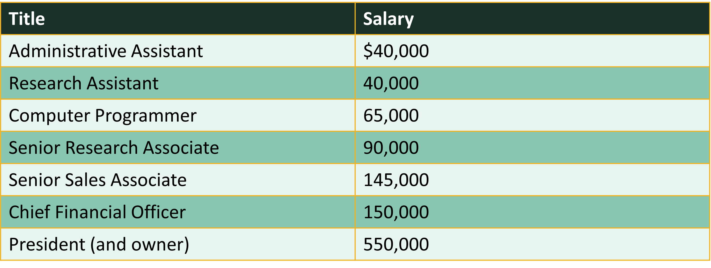
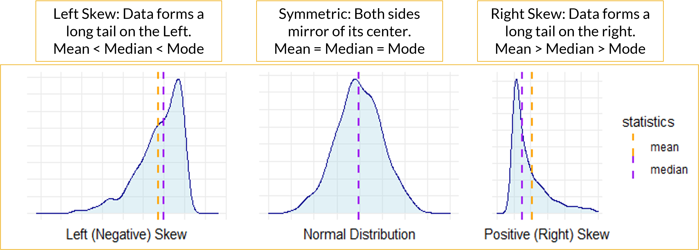
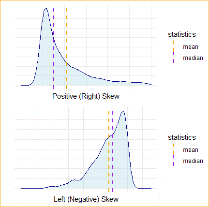
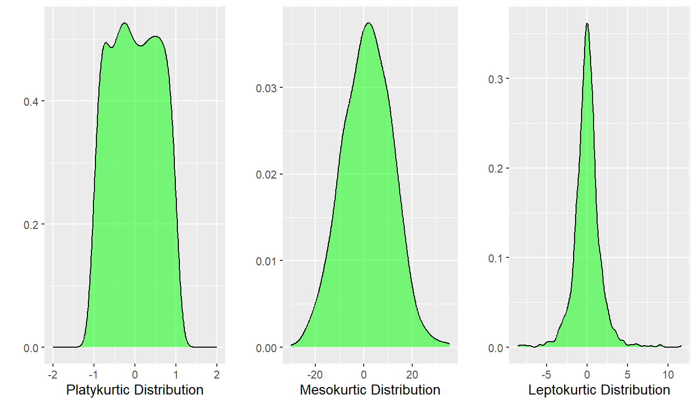
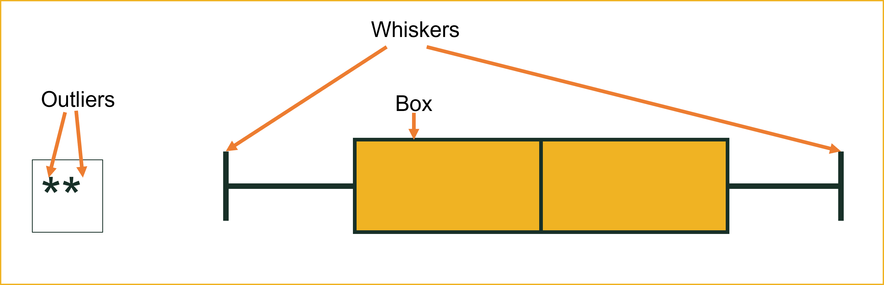

```{r setup, include=FALSE}
knitr::opts_chunk$set(echo=TRUE, tidy.opts = list(width.cutoff = 70, message=FALSE, warning=FALSE), tidy = TRUE, message=FALSE, warning=FALSE)

# Load all libraries here so they are available throughout the entire document
library(tidyverse)
library(semTools)


```

This lesson covers how to summarize and visualize descriptive statistics for both quantitative and qualitative data in R. Descriptive statistics are the foundation of every analysis — before modeling, testing, or drawing conclusions, you must understand what your data looks like, where it centers, how spread out it is, and whether any unusual patterns or values are present.

We begin with **summarizing quantitative data**: measuring central tendency (mean, median, mode) and spread (standard deviation, variance, skewness, kurtosis, range, IQR). The choice of which measure to use is not arbitrary — skewed distributions and outliers make the mean unreliable, and the same data can tell very different stories depending on which statistics you report. We work through a salary example to make this concrete, then extend to a real customer dataset.

We then move to **visualizing quantitative variables**: histograms reveal distribution shape and connect directly to the skewness and kurtosis statistics; density plots provide a smoothed view of the same shape with a mean reference line; and boxplots summarize the five-number summary while flagging potential outliers as individual points. These three charts complement each other — the histogram shows the overall shape, the boxplot isolates the center and tails, and the density plot is best for comparing groups or overlaying a reference.

The second half of the lesson shifts to **qualitative (categorical) data**: calculating frequencies, proportions, and cumulative distributions using `table()`, `prop.table()`, and `cumsum()`, and visualizing results with bar charts and pie charts using `ggplot2`. Bar charts are the workhorse for categorical data; pie charts are available but harder to read accurately.

By the end of this lesson, you should be able to choose the appropriate measures of central tendency and spread for any quantitative variable, assess normality using skewness and kurtosis z-scores, identify and investigate outliers visually and numerically, construct frequency tables for categorical variables, and produce publication-quality charts using `ggplot2`. Work through every code example in your own R script alongside the reading.

### At a Glance

-   In order to succeed in this lesson, you need to understand that descriptive statistics serve one purpose: to summarize data honestly. That means choosing the right measure for the distribution in front of you — not just defaulting to the mean — and using visualizations to confirm what the numbers report. Pay close attention to the relationship between skewness, outliers, and the choice of mean versus median, and to how each chart type (histogram, density, boxplot, bar chart) reveals a different aspect of the data.

### Lesson Objectives

-   Calculate and interpret mean, median, and mode for quantitative variables.
-   Identify when each measure of central tendency is appropriate based on distribution shape.
-   Calculate and interpret standard deviation, variance, range, and IQR.
-   Assess skewness and kurtosis using `skew()` and `kurtosis()` from `semTools` and interpret z-scores against sample-size thresholds.
-   Identify and compute outlier bounds using the 1.5 × IQR rule.
-   Produce and interpret histograms, density plots, and boxplots using `ggplot2`.
-   Calculate frequency tables, relative frequencies, and cumulative distributions for categorical variables.
-   Produce and interpret bar charts and pie charts using `ggplot2`.

### Consider While Reading

-   As you work through this lesson, keep asking: *which summary is honest for this data?* The salary example at the start is designed to show how the mean can mislead when outliers are present — that instinct should carry through every variable you analyze.
-   The workflow throughout is intentionally sequential: compute central tendency first, then assess spread and shape, then visualize to confirm. The histograms and boxplots you build are not decorations — they are the check on whether the numbers you computed accurately describe the data.
-   When you reach the skewness and kurtosis section, pay attention to the sample-size thresholds for interpreting z-scores. The same z-value that is fine in a large sample may indicate a real problem in a small one.

The goal of this lesson is to teach you how to summarize and visualize descriptive statistics for both quantitative and qualitative data in R. To do this well, we need to understand the difference between quantitative and qualitative data and examine data in context — context tells us how the data was collected and what it is meant to represent. In any analysis, it is critically important to understand your data before modeling or drawing conclusions.

For quantitative data, you should understand how to describe a variable's center (mean, median, mode), visualize its shape with a histogram, density plot, or boxplot, and quantify its spread (variance, standard deviation, skewness, kurtosis, IQR). For qualitative data, you should know how to calculate frequencies, proportions, and cumulative distributions, and display results clearly using bar charts and pie charts.

# Summarizing Quantitative Data

-   Summarizing Quantitative Data is the process of reducing a large set of numbers down to a small set of meaningful values that describe what is typical, how spread out the data is, and what shape the distribution takes.
-   Rather than reporting every observation, we use statistics to tell the story of the data in a few key numbers.
-   Three questions every summary should answer:
    -   What is typical? Central tendency — mean, median, mode
    -   How spread out is it? Variability — standard deviation, IQR, range
    -   What shape is it? Distribution — skewness, kurtosis, histograms
-   Why this matters with AI in the picture: AI computes summaries. You decide which summary is honest, and you explain what it means.

AI can generate all of these statistics instantly. What it cannot do is tell you which ones are appropriate for your data, or what the numbers mean in context. A mean wage of \$42 means something very different depending on whether the data is symmetric or heavily skewed by a few executives. Choosing the right summary and interpreting it correctly is the analytical judgment this section is building.

## Defining and Calculating Central Tendency

-   We will cover four measures in this section:
    -   Mean: Data is symmetric, no extreme outliers
    -   Median: Data is skewed or outliers are present
    -   Mode: Data is categorical, or you need the most common value
    -   Percentile: You need to describe relative position within the data

### Using the Mean

-   The mean() function in R is a versatile tool for calculating the arithmetic average of a numeric vector. The arithmetic mean or simply the mean is a primary measure of central location. It is often referred to as the average.

-   The sample mean $\bar{x}$ is the sum of all values divided by the number of observations $n$.

-   $$\bar{x} = \frac{\sum_{i=1}^{n} x_{i}}{n}$$

-   Consider the salaries of employees at a company: 

-   We can use the mean() command to calculate the mean in R.

```{r}
# Create Vector of Salaries
salaries <- c(40000, 40000, 65000, 90000, 145000, 150000, 550000)
# Calculate the mean using the mean() command
mean(salaries)
```

-   Note that due to at least one *outlier* this mean does not reflect the typical salary - more on that later.
-   If we edit our vector to include NAs, we have to account for this. This is a common way to handle NAs in functions that do not allow for them.

```{r}
salaries2 <- c(40000, 40000, 65000, 90000, 145000, 150000, 550000, NA, NA)
# Notice that it does not work without na.rm
mean(salaries2)
# Add in na.rm parameter to get it to produce the mean with no NAs. 
mean(salaries2, na.rm = TRUE)
```

-   Note that there are other types of means like the weighted mean or the geometric mean.
-   The weighted mean uses weights to determine the importance of each data point of a variable. It is calculated by $\bar{x}_w = \frac{\sum_{i=1}^{n} w_i x_i}{\sum_{i=1}^{n} w_i}$, where $w_i$ are the weights associated to the values.
-   An example is below.

```{r}
values <- c(4, 7, 10, 5, 6)
weights <- c(1, 2, 3, 4, 5)
weighted_mean <- weighted.mean(values, weights)
weighted_mean
```

### Using the Median

-   The median is another measure of central location that is not affected by outliers.
-   When the data are arranged in ascending order, the median is:
    -   The middle value if the number of observations is odd, or
    -   The average of the two middle values if the number of observations is even.
-   Consider the sorted salaries of employees presented earlier which contains an odd number of observations.
-   On the same salaries vector created above, use median() command to calculate the median in R.

```{r}
# Calculate the median using the median() command
median(salaries)
```

-   Now compare to the mean and note the large difference in numbers signifying that at least one outlier is most likely present.
-   Specifically, if the mean and median are different, it is likely the variable is skewed and contains outliers.

```{r}
mean(salaries)
```

-   For another example, consider the sorted data below that contains an even number of values.

```{r}
GrowthFund <- c(-38.32, 1.71, 3.17, 5.99, 12.56, 13.47, 16.89, 16.96, 32.16, 36.29)
```

-   When data contains an even number of values, the median is the average of the 2 sorted middle numbers (12.56 and 13.47).

```{r}
median(GrowthFund) 
(12.56 + 13.47) / 2

# The mean is still the average
mean(GrowthFund) 
```

### Using the Mode

-   The mode is another measure of central location.
-   The mode is the most frequently occurring value in a data set.
-   The mode is useful in summarizing categorical data but can also be used to summarize quantitative data.
-   A data set can have no mode, one mode (unimodal), two modes (bimodal) or many modes (multimodal).
-   The mode is less useful when there are more than three modes.

### Example of Function with Salary Variable

-   While this is a small vector, when working with a large dataset and a function like sort(x = table(salaries), decreasing = TRUE), appending \[1:5\] is a way to focus on the top results after the frequencies have been computed and sorted. Specifically, table(salaries) calculates the frequency of each unique salary, sort(..., decreasing = TRUE) orders these frequencies from highest to lowest, and \[1:5\] selects the first five entries in the sorted list. This is useful when the dataset contains many unique values, as it allows you to quickly identify and extract the top 5 most frequent salaries, providing a concise summary without being overwhelmed by the full distribution.

-   Consider the salary of employees presented earlier. 40,000 appears 2 times and is the mode because that occurs most often.

```{r}
# Try this command with and without it. 
sort(x = table(salaries), decreasing = TRUE)[1:5]
```

### Finding No Mode

-   Look at the sort(table()) commands with the GrowthFund Vector we made earlier.
-   I added a 1:5 in square brackets at the end of the statement to produce the 3 highest frequencies found in the vector.

```{r}
sort(table(GrowthFund), decreasing = TRUE)[1:5]
```

-   Even if you use this command, you still need to evaluate the data more systematically to verify the mode. If the highest frequency of the sorted table is 1, then there is no mode.

## Defining and Calculating Spread

-   Spread is a measure of distance values are from the central value.
-   Each measure of central tendency has one or more corresponding measures of spread.
-   Mean: use variance or standard deviation to measure spread.
-   skewness and kurtosis help measure spread as well.
-   Median: use range or interquartile range (IQR) to measure spread.
-   Mode: use the index of qualitative variation to measure spread.
-   Not formally testing here with a function.

### Spread to Report with the Mean

#### Evaluating Skewness

-   Skewness is a measure of the extent to which a distribution is skewed.
-   Can evaluate skewness visually with histogram.
-   A histogram is a visual representation of a frequency or a relative frequency distribution.
-   Bar height represents the respective class frequency (or relative frequency).
-   Bar width represents the class width.



#### Skewed Distributions: Median Not Same as Mean

-   Sometimes, a histogram is difficult to tell if skewness is present or if the data is relatively normal or symmetric.
-   If Mean is less than Median and Mode, then the variable is Left-Skewed.
-   If the Mean is greater than the Median and Mode, then the variable is Right-Skewed.
-   If the Mean is about equal to the Median and Mode, then the variable has a symmetric distribution.
-   In R, we can easily look at mean and median with the summary() command.



-   Mean is great when data are normally distributed (data is not skewed).
-   Mean is not a good representation of skewed data where outliers are present.
-   Adding together a set of values that includes a few very large or very small values like those on the far left of a left-skewed distribution or the far right of the right-skewed distribution will result in a large or small total value in the numerator of Equation and therefore the mean will be a large or small value relative to the actual middle of the data.
-   There are a number of ways to check for skewness. The skewness() function from the e1071 package and the skew() function from the semTools package both measure skewness, but they differ slightly in how they scale the result.
-   By default, e1071::skewness() uses a sample-based formula (dividing by $n$). In contrast, semTools::skew() uses Mardia's definition and is more commonly applied in structural equation modeling contexts.
-   As a result, the values may differ slightly, especially for small samples or skewed distributions. Both are valid but should be used consistently depending on the analytical context.

#### Using skewness command from e1071

-   A standard calculation of skewness using the mean is based on the third standardized moment of a distribution. The formula is:

$$\text{Skewness} = \frac{1}{n} \sum_{i=1}^{n} \left( \frac{x_i - \bar{x}}{s} \right)^3$$

where:

-   $x_i$ = each observation
-   $\bar{x}$ = sample mean
-   $s$ = sample standard deviation
-   $n$ = sample size
-   This formula measures the asymmetry of the distribution:
    -   Positive skew (right-skewed): longer tail on the right
    -   Negative skew (left-skewed): longer tail on the left
    -   Zero skew: symmetric distribution

```{r}
e1071::skewness(salaries) 
## a positive number indicates a longer tail to the right. 
```

#### Using skew() Command from semTools

-   We will use the skew() command from the semTools package.
-   The install.packages() command is commented out below, but install it one time on your R before commenting it out.

```{r}
# install.packages("semTools")  # run once, then comment out
# library(semTools)             # already loaded in setup chunk
```

-   After the package is installed and loaded, run the skew() command on the salaries vector made above.

```{r}
skew(salaries) 
```

#### Interpreting the skew() Command Results

-   se = standard error
-   z = skew/se
-   If the sample size is small (n \< 50), z values outside the –2 to 2 range are a problem.
-   If the sample size is between 50 and 300, z values outside the –3.29 to 3.29 range are a problem.
-   For large samples (n \> 300), using a visual is recommended over the statistics, but generally z values outside the range of –7 to 7 can be considered problematic.
-   Salary: Our sample size was small, \<50, so the z value of 2.496 in regards to the salary vector indicates there is a problem with skewness.
-   GrowthFund: We can check the skew of GrowthFund.

```{r}
skew(GrowthFund)
```

-   GrowthFund was also considered a small sample size, so the same -2/2 thresholds are used. Here, our z value is -1.78250137, which is in normal range. This indicates there is no problem with skewness.

#### Kurtosis in Evaluating Mean Spread

-   Kurtosis is the sharpness of the peak of a frequency-distribution curve or more formally a measure of how many observations are in the tails of a distribution.

-   The formula for kurtosis is as follows:

$$\text{Kurtosis} = \frac{n(n+1)}{(n-1)(n-2)(n-3)} \sum \left( \frac{(X_i - \bar{X})^4}{s^4} \right) - \frac{3(n-1)^2}{(n-2)(n-3)}$$

Where:

-   $n$ is the sample size
-   $X_i$ is each individual value
-   $\bar{X}$ is the mean of the data
-   $s$ is the standard deviation
-   A normal distribution will have a kurtosis value of three, where distributions with kurtosis around 3 are described as mesokurtic, significantly higher than 3 indicate leptokurtic, and significantly under 3 indicate platykurtic.
-   The kurtosis() command from the semTools package subtracts 3 from the kurtosis, so we can evaluate values by comparing them to 0. Positive values will be indicative to a leptokurtic distribution and negative will indicate a platykurtic distribution. To see if kurtosis (leptokurtic or platykurtic) is significant, we confirm them by first evaluating the z-score to see if the variable is normal or not. The same cutoff values from skew also apply for the z for small, medium, and large sample sizes in kurtosis.



-   The rules of determining problematic distributions with regards to kurtosis are below.
    -   If the sample size is small (n \< 50), z values outside the –2 to 2 range are a problem.
    -   If the sample size is between 50 and 300, z values outside the –3.29 to 3.29 range are a problem.
    -   For large samples (n \> 300), using a visual is recommended over the statistics, but generally z values outside the range of –7 to 7 can be considered problematic.
    -   If kurtosis is found, then evaluate the excess kur score to see if it is positive or negative to determine whether it is leptokurtic or platykurtic.

```{r}
# z-value is 3.0398, which is > 2 indicating leptokurtic
# Small sample size: range is -2 to 2
kurtosis(salaries)

# z-value is 2.20528007, which is > 2 indicating leptokurtic 
# Small sample size: range is -2 to 2
kurtosis(GrowthFund)
```

## Examples from the Customer Dataset

Load the customers.csv dataset as customers. It contains 10 variables: CustID, Sex, Race, BirthDate, College, HHSize, Income, Spending, Orders, and Channel.

```{r}
customers <- read.csv("data/customers.csv")

# Noted sample size at 200 observations or a medium sample size. 
# Using threshold –3.29 to 3.29 to assess normality. 

# -3.4245446445 is below -3.29 so kurtosis is present
# Negative kurtosis value indicates platykurtic
kurtosis(customers$Spending)
ggplot(customers, aes(Spending)) + 
  geom_histogram(binwidth = 100, fill = "pink", color = "black")
semTools::skew(customers$Spending) ## normal indicating no skewness

# Normal: 2.977622119 is in between -3.29 and 3.29
kurtosis(customers$Income) 
ggplot(customers, aes(Income)) + 
  geom_histogram(binwidth = 10000, fill = "pink", color = "black")
semTools::skew(customers$Income) # Skewed right

# -3.7251961028 is below -3.29 so kurtosis is present
# Negative kurtosis value indicates platykurtic
kurtosis(customers$HHSize)
ggplot(customers, aes(HHSize)) + 
  geom_histogram(binwidth = 1, fill = "pink", color = "black")
semTools::skew(customers$HHSize) # normal

# Normal: -0.20056607 is in between -3.29 and 3.29 
kurtosis(customers$Orders)
ggplot(customers, aes(Orders)) + 
  geom_histogram(binwidth = 5, fill = "pink", color = "black")
semTools::skew(customers$Orders) ## skewed right
```

### Spread to Report with the Median

-   Range = Maximum Value – Minimum Value.
    -   Simplest measure.
    -   Focuses on Extreme values.
    -   Use commands diff(range()) or max() – min().
-   IQR: Difference between the first and third quartiles.
    -   Use IQR() command or quantile() command.

```{r}
summary(customers$Spending, na.rm = TRUE)
diff(range(customers$Spending, na.rm = TRUE))
max(customers$Spending, na.rm = TRUE) - min(customers$Spending, na.rm = TRUE)
IQR(customers$Spending, na.rm = TRUE)
```

### Spread to Report with the Mode

-   While there is no great function to test for spread, you can look at the data and see if it is concentrated around 1 or 2 frequencies. If it is, then the spread is distorted towards those high frequency values.

------------------------------------------------------------------------

With central tendency and spread established numerically, the next step is to confirm what those numbers are telling you visually. Histograms, density plots, and boxplots each reveal a different aspect of the distribution — and together they should be consistent with the skewness and kurtosis statistics computed above.

# Visualizing Quantitative Variables

The examples in this section use the `descriptives.csv` dataset. Load it now so it is available for all charts below.

```{r}
descriptive_data <- read.csv("data/descriptives.csv")
```

Graphs for a Single Continuous Variable. A continuous variable refers to a variable that can take any value over a range of values.

A continuous variable needs to be numeric, and could be integer type or numeric type in R. Just like with graphs that include categorical variables, it is beneficial to do any data cleaning and investigation into the variable(s) before you begin.

This may require recoding the variable to coerce it to the appropriate data type and/or renaming it to something meaningful if needed.

It is also beneficial to make sure the numerical variable is indeed supposed to be numerical (as opposed to a factor). For instance, you commonly see numbers listed for categories like the Yes/No coded as a 1/2.

With central tendency, the next step is to visualize the distribution. The three charts below — histogram, density plot, and boxplot — each reveal a different aspect of a numeric variable's shape, and they connect directly to the skewness and kurtosis statistics above.

-   We will see the following:
    -   Histograms
    -   Density Plots
    -   Boxplots

## Layering in ggplot

-   Layering is a fundamental concept in ggplot2 that allows you to build complex visualizations by adding different components (or "layers") on top of each other. Each layer can represent different types of data, aesthetics, or annotations.
-   Benefits of Layering:
    -   Separation of Plot Components: Each layer can handle a different part of the plot.
    -   Customization and Enhancement: By adding multiple layers, you can customize labels, colors, annotations, and theme elements independently.
    -   Modularity: Layering makes it easier to add, remove, or modify parts of the plot without changing the entire structure.
    -   Combining Data Sources: Different layers can use different datasets or aesthetics, which is useful when you need to overlay one dataset on top of another.

## Using ggplot() command

A histogram displays the distribution of a **continuous (numeric) variable** by grouping values into bins and counting how many observations fall in each bin. It is the best first chart to make when you want to understand the shape, center, and spread of a numeric variable.

Layering means building the histogram step by step: `ggplot()` and `aes()` set up the canvas and map the variable to the x-axis, `geom_histogram()` adds the bars, and `labs()` applies the title and axis labels — each `+` adds a new layer on top of the last.

Inside aes(), writing x = Spending and Spending are equivalent — ggplot2 assumes the first unnamed argument maps to the x-axis, so both forms produce the same plot. Using x = makes the mapping more explicit and is easier to read, especially once you start adding y =, fill =, and other aesthetics alongside it.

## Histograms

-   A histogram is a graphical representation of the distribution of numerical data.
-   It consists of a series of contiguous rectangles, or bars, where the area of each bar corresponds to the frequency of observations within a particular range or bin of values.
-   The x-axis typically represents the range of values being measured, while the y-axis represents the frequency or count of observations falling within each range.
-   Histograms are commonly used in statistics and data analysis to visualize the distribution of a dataset and identify patterns or trends.
-   They are particularly useful for understanding the central tendency, variability, and shape of the data distribution - this includes our observation of skewness.
-   Works much better with larger datasets.

```{r}
# The simplest way to draw a histogram in base R is hist(). For a quick look at CustomerValue:
hist(descriptive_data$CustomerValue, 
     main = "Customer Value Distribution",
     xlab = "Customer Value",
     col  = "steelblue")
```

`geom_histogram()` from ggplot2 gives more control. The key parameter is `binwidth` — experiment to find a width that shows the shape without too much noise:

-   `binwidth =` controls bar width. Too narrow produces noise; too wide hides the shape.
-   A roughly symmetric histogram suggests normality. A long tail to the right indicates right skew.
-   These histograms connect directly to the skewness statistics above — the chart lets you *see* what those numbers measure.

```{r}
ggplot(descriptive_data, aes(x = CustomerValue)) +
  geom_histogram(binwidth = 15, fill = "steelblue", color = "white") +
  labs(title = "Distribution of Customer Value",
       x = "Customer Value", y = "Count")
```

A right-skewed example shows what a problematic distribution looks like visually — compare to `DeliveryTime`:

```{r}
ggplot(descriptive_data, aes(x = DeliveryTime)) +
  geom_histogram(binwidth = 25, fill = "tomato", color = "white") +
  labs(title = "Distribution of Delivery Time",
       x = "Delivery Time (days)", y = "Count")

skew(descriptive_data$DeliveryTime)
```

## Density Plot

A density plot is a smoothed version of a histogram. Instead of bins, it draws a continuous curve that represents the estimated distribution of the variable. It is particularly useful for comparing the shape of distributions or overlaying multiple groups.

Layering means `ggplot()` and `aes()` set up the canvas and map the variable to the x-axis, `geom_density()` draws the smoothed curve, `geom_vline()` overlays a dashed vertical line at the mean, and `labs()` adds the title and axis labels.

The area under the curve represents the probability of values falling within a given range. Useful parameters include `color =` for the line color, `fill =` to color the area under the curve, and `alpha =` to set transparency (0 = invisible, 1 = solid).

```{r, fig.alt = "Density Chart with Mean Line Generated by R"}
set.seed(1)
x <- rnorm(1000, mean = 10, sd = 2)
df <- data.frame(x)
ggplot(df, aes(x)) +
  geom_density(color = "darkblue", fill = "lightblue", alpha = .5) + 
  geom_vline(aes(xintercept = mean(x)),
             color = "red", linetype = "dashed", lwd = 1)
```

Working with a real dataset uses the same approach — pass the variable directly into `aes()`. Here we use `CustomerValue` from the `descriptives.csv` dataset:

```{r}
ggplot(descriptive_data, aes(x = CustomerValue)) +
  geom_density(fill = "lavender", color = "purple", alpha = 0.6) +
  geom_vline(aes(xintercept = mean(CustomerValue, na.rm = TRUE)),
             color = "red", linetype = "dashed") +
  labs(title = "Distribution of Customer Value",
       x = "Customer Value",
       y = "Density")
```

-   `alpha =` sets transparency (0 = invisible, 1 = solid). A value around 0.5–0.6 is typical.
-   The dashed vertical line marks the mean, making it easy to see whether the distribution is symmetric around it or pulled to one side.
-   If the curve has a longer tail to the right and the mean sits to the right of the peak, the variable is right-skewed.

## Boxplot and Outliers

A boxplot summarizes the **distribution** of a continuous variable visually using five key values: the minimum, first quartile (Q1), median, third quartile (Q3), and maximum. It also flags potential outliers as individual points beyond the whiskers.



The five values displayed in a boxplot are:

-   **Median (Q2)**: the line inside the box — the middle value.
-   **Q1**: the left/bottom edge of the box — 25th percentile.
-   **Q3**: the right/top edge of the box — 75th percentile.
-   **IQR**: the width of the box (Q3 − Q1) — the middle 50% of the data.
-   **Whiskers**: extend to 1.5 × IQR beyond Q1 and Q3.
-   **Outliers**: any point beyond the whiskers is plotted individually as a dot.

```{r}
GrowthFund <- c(-38.32, 1.71, 3.17, 5.99, 12.56, 13.47, 16.89, 16.96, 32.16, 36.29)
GrowthFund <- as.data.frame(GrowthFund)
```

-   The `quantile()` function returns the five-point summary. The 25th percentile is Q1 and the 75th percentile is Q3.

```{r}
QuanData <- quantile(GrowthFund$GrowthFund); QuanData
```

### What is an outlier?

An outlier is an observation that falls unusually far from the rest of the data. What counts as "unusually far" depends on the method being used — there is no single universal definition. In a boxplot, a value is flagged as an outlier if it falls more than 1.5 × IQR below Q1 or above Q3.

Other methods use different thresholds: Z-scores flag values beyond ±2 or ±3 standard deviations from the mean, and some statistical tests apply their own cutoffs entirely. This means the same data point could be considered an outlier by one method but not another, so the choice of method matters.

Regardless of how they are identified, outliers are not automatically errors — they may be legitimate extreme values, data entry mistakes, or observations from a different population — and they should always be investigated before deciding whether to keep or remove them.

## Boxplot With Outliers: DeliveryTime

`DeliveryTime` contains several unusually large values — deliveries that took far longer than the typical customer experience. These show up as individual points beyond the right whisker.

```{r boxplot-with-outliers}
ggplot(descriptive_data, aes(x = DeliveryTime)) +
  geom_boxplot(fill = "lightcoral", color = "darkred") +
  labs(title = "Boxplot of Delivery Time (Outliers Present)",
       x = "Delivery Time (minutes)") +
  theme_minimal()
```

```{r delivery-summary}
summary(descriptive_data$DeliveryTime)
IQR(descriptive_data$DeliveryTime, na.rm = TRUE)
```

Notice that the mean will be pulled to the right by those extreme values — this is exactly when the **median** is the better measure of central tendency. The bulk of deliveries cluster between roughly 75 and 130 minutes, but a handful of extreme delays are distorting the picture.

------------------------------------------------------------------------

## Boxplot Without Outliers: CustomerValue

`CustomerValue` tells a different story — values are spread relatively evenly with no individual points plotted beyond the whiskers.

```{r boxplot-no-outliers}
ggplot(descriptive_data, aes(x = CustomerValue)) +
  geom_boxplot(fill = "lightblue", color = "navy") +
  labs(title = "Boxplot of Customer Value (No Outliers)",
       x = "Customer Value Score") +
  theme_minimal()
```

```{r customervalue-summary}
summary(descriptive_data$CustomerValue)
IQR(descriptive_data$CustomerValue, na.rm = TRUE)
```

Here the median line sits near the center of the box, the whiskers are roughly equal in length, and no individual points appear beyond them. This is the signature of a roughly symmetric distribution with no extreme values — a case where the **mean** is a reliable summary.

------------------------------------------------------------------------

## Side-by-Side Comparison

Placing both variables together makes the contrast immediate.

```{r side-by-side}
#| fig-width: 8
#| fig-height: 4

descriptive_long <- descriptive_data %>%
  select(DeliveryTime, CustomerValue) %>%
  pivot_longer(cols = everything(),
               names_to = "Variable",
               values_to = "Value")

ggplot(descriptive_long, aes(x = Value, fill = Variable)) +
  geom_boxplot(color = "gray30", alpha = 0.7) +
  facet_wrap(~Variable, scales = "free_x") +
  scale_fill_manual(values = c("DeliveryTime" = "lightcoral",
                               "CustomerValue" = "lightblue")) +
  labs(title = "With Outliers (DeliveryTime) vs. Without (CustomerValue)",
       x = "Value") +
  theme_minimal() +
  theme(legend.position = "none")
```

------------------------------------------------------------------------

## Detecting Outliers Numerically: DeliveryTime

We can confirm what the boxplot shows by computing the bounds directly.

```{r detect-outliers}
Q1 <- quantile(descriptive_data$DeliveryTime, 0.25)
Q3 <- quantile(descriptive_data$DeliveryTime, 0.75)
IQRvalue   <- IQR(descriptive_data$DeliveryTime, na.rm = TRUE)
OutlierValue <- IQRvalue * 1.5

LowerBound <- Q1 - OutlierValue; LowerBound
UpperBound <- Q3 + OutlierValue; UpperBound

# Will learn about filter, select, arrange in data prep.
# The key operator here is | meaning OR — a delivery time is flagged if it is
# either suspiciously short (below the lower bound) or suspiciously long (above 
# the upper bound). Both ends of the distribution are checked in a single filter.
outliers <- descriptive_data %>%
  filter(DeliveryTime < LowerBound | DeliveryTime > UpperBound) %>%
  select(DeliveryTime) %>%
  arrange(desc(DeliveryTime))

outliers
```

-   $\text{Lower bound} = Q1 - 1.5 \times IQR$
-   $\text{Upper bound} = Q3 + 1.5 \times IQR$
-   Any value outside these bounds is flagged as an outlier.

The outliers identified here are the same points visible as individual dots in the boxplot above — the numeric method and the visual method agree. Remember: being flagged as an outlier does not mean the value is wrong. Each one should be investigated before deciding whether to keep or remove it.

------------------------------------------------------------------------

Quantitative variables have now been fully described and visualized. We now turn to qualitative (categorical) variables. The tools change — frequencies and proportions replace means and standard deviations — but the goal is the same: describe what is typical and how concentrated or spread out the data is across categories.

# Summarizing Qualitative Data

-   Qualitative data is information that cannot be easily counted, measured, or easily expressed using numbers.
    -   Nominal variables: a type of categorical variable that represents discrete categories or groups with no inherent order or ranking
        -   gender (male, female)
        -   marital status (single, married, divorced)
        -   eye color (blue, brown, green)
    -   Ordinal variables: categories possess a natural order or ranking
        -   a Likert scale measuring agreement with a statement (e.g., strongly disagree, disagree, neutral, agree, strongly agree)
-   A frequency distribution shows the number of observations in each category for a factor or categorical variable.
-   Guidelines when constructing frequency distribution:
    -   Classes or categories are mutually exclusive (they are all unique).
    -   Classes or categories are exhaustive (a full list of categories).
-   To calculate frequencies, first, start with a variable that has categorical data.

```{r}
# Create a vector with some data that could be categorical
Sample_Vector <- c("A", "B", "A", "C", "A", "B", "A", "C", "A", "B")
# Create a data frame with the vector
data_example <- data.frame(Sample_Vector)
```

-   To count the number of each category value, we can use the table() command.
-   The output shows a top row of categories and a bottom row that contains the number of observations in the category.

```{r}
# Create a table of frequencies
frequencies <- table(data_example$Sample_Vector); frequencies
```

-   Relative frequency is how often something happens divided by all outcomes.
-   The relative frequency is calculated by $f_i/n$, where $f_i$ is the frequency of class $i$ and $n$ is the total frequency.
-   We can use the prop.table() command to calculate relative frequency by dividing each category's frequency by the sample size.

```{r}
# Calculate proportions
proportions <- prop.table(frequencies)
```

-   The cumulative relative frequency is given by $cf_i/n$, where $cf_i$ is the cumulative frequency of class $i$.
-   The cumsum() function calculates the cumulative distribution of the data.

```{r}
# Calculate cumulative frequencies
cumulfreq <- cumsum(frequencies)
# Calculate cumulative proportions
cumulproportions <- cumsum(prop.table(frequencies))
```

-   The rbind() function is used to combine multiple data frames or matrices by row. The name "rbind" stands for "row bind". Since the data produced by the table is in rows, we can use rbind to link them together.

```{r}
# Combine into table
frequency_table <- rbind(frequencies, proportions, cumulfreq, cumulproportions)
# Print the table
frequency_table
```

-   We can transpose a table using the t() command, which flips the dataset.

```{r}
TransposedData <- t(frequency_table)
TransposedData
```

-   Finally, sometimes we need to transform our calculations into a dataset.
-   The as.data.frame function is used to coerce or convert an object into a data frame.

```{r}
TransposedData <- as.data.frame(TransposedData)
TransposedData
```

------------------------------------------------------------------------

With frequency tables established, the natural next step is to display categorical distributions visually. Bar charts and pie charts serve the same purpose for categorical variables that histograms do for continuous ones — making the shape of the distribution immediately readable.

# Visualizing Qualitative Variables

With quantitative variables fully described and visualized, we now turn to qualitative (categorical) variables. Rather than histograms and boxplots, categorical variables are best displayed using bar charts and pie charts — each bar or slice represents one category, with height or area proportional to its frequency.

-   A categorical variable has categories that are either ordinal (with a logical order) or nominal (with no logical order).
-   Categorical variables need to be set as the factor data type in R to be analyzed and visualized correctly.
-   Some common graphing options for a single categorical variable:
    1.  Bar graph
    2.  Pie chart
-   In any graph, it is beneficial to do any data cleaning and investigation into the variable(s) before you begin. With categorical variables, this may require recoding the factor(s) of interest.

::: callout-note
The layering concept introduced in `## Layering in ggplot` above applies to all ggplot2 charts, including the bar charts and pie charts in this section. Each `+` adds another layer — graph type, labels, colors, and themes all stack the same way.
:::

## Bar Graph

A bar graph depicts the frequency or relative frequency for each category of a qualitative variable as a bar rising vertically from the horizontal axis. It is often used to examine similarities and differences across categories. Before making a bar chart, the variable should be coded as a factor.

```{r, echo=FALSE}
Categories <- c("Never married", "Married", "Separated", "Widowed", "Divorced")
Value      <- c(89028651, 127892670, 4912426, 15230473, 28767947)
barp       <- data.frame(Categories, Value)
options(scipen = 999)
ggplot(barp, aes(x = Categories, y = Value, fill = Categories)) +
  geom_bar(stat = "identity") +
  labs(x = "Marital Status",
       y = "Estimate of Marital Status (15 years and older)") +
  ggtitle("2020: ACS 5-Year Estimates Data Profiles from data.census.gov/")
```

### geom_bar()

-   Create a bar graph using the `ggplot()` command.
-   `ggplot()` works in layers, so you will routinely see the `+` symbol to kick off a new layer.
-   Using ggplot, we always include the `aes()` command first inside `ggplot()`. The `aes()` command describes the variables being used.
    -   First layer: `ggplot()` and `aes()` — calls the dataset and variables.
    -   Second layer: Graph type — `geom_bar()`.
    -   Additional layers: `labs()` for labels and titles; themes; `geom_text()`.

### Pertinent Parameters to geom_bar()

-   **stat="identity"**: Specifies that the actual values in the data should be plotted directly, rather than having ggplot count observations. Use this when your y values are already computed.
-   **position="dodge"**: When plotting two categorical variables, setting `position="dodge"` places bars side by side instead of stacked.
-   **show.legend = FALSE**: Hides the legend for a layer when the color is already clear from the axis labels.
-   **scale_fill_manual()**: Allows you to manually define the colors used for filled bars.

```{r}
GoUp         <- .54285
GoDown       <- .03809
RemainStable <- .34285
NoOpinion    <- .07619

data_frame <- data.frame(
     Category   = c("Go Up", "Go Down", "Remain Stable", "No Opinion"),
     Percentage = c(GoUp, GoDown, RemainStable, NoOpinion)
)

MarketShare <- ggplot(data_frame, aes(x = Category, y = Percentage, fill = Category)) +
     geom_bar(stat = "identity", show.legend = FALSE) +
     labs(title = "How do you expect R's market share to change?",
          x = "Opinion Category",
          y = "Percentage (%)") +
     theme_minimal() +
     geom_text(aes(label = Percentage), vjust = -0.5, size = 4) + 
     scale_fill_manual(values = c("red", "blue", "purple", "green"))

MarketShare
```

## Pie Chart

-   A pie chart is a segmented circle whose segments portray the relative frequencies of a qualitative variable.
-   Pie charts are available in R but are generally not recommended because comparing slice sizes is harder than comparing bar heights. Bar graphs are preferred for most categorical data.

```{r}
fbi.deaths       <- read.csv("data/fbi_deaths.csv", stringsAsFactors = TRUE)
fbi.deaths.small <- fbi.deaths[c(3, 4, 5, 6, 7), ]
fbi.deaths.small <- fbi.deaths.small %>%
  rename(Weapon = X)
summary(fbi.deaths.small)
```

```{r tidy=FALSE, fig.alt = "Pie Chart Generated by R"}
ggplot(fbi.deaths.small, aes(x = "", y = X2016, fill = Weapon)) +
  geom_col() + 
  coord_polar("y", start = 0) + 
  theme_void() 
```

# Summary and Review

## Using AI

Use the following prompts with a generative AI tool like ChatGPT to explore descriptive statistics further.

-   What is the difference between mean, median, and mode in describing data distributions, and how can each be used to understand the shape of a distribution?
-   How do mean and median help identify whether a distribution is skewed, and what does it tell us about the dataset?
-   Can you explain how the mean, median, and mode behave in normal, positively skewed, and negatively skewed distributions?
-   What are standard deviation (SD) and variance, and how do they measure the spread of data in a distribution?
-   Explain the differences between range, interquartile range (IQR), and standard deviation in describing the variability in a dataset.
-   How does a high standard deviation or variance affect the interpretation of a dataset compared to a low standard deviation?
-   What is skewness, and how does it affect the shape of a distribution? How can we identify positive and negative skew?
-   How is kurtosis defined in the semTools package in R, and what does it tell us about the tails of a distribution?
-   How would you compare and contrast the roles of skewness and kurtosis in identifying the shape and behavior of a distribution?

## Quantitative Data Lab

Use the `descriptive_data` dataset loaded earlier in this lesson. It contains the following quantitative variables: `ServiceScore`, `DeliveryTime`, `ReturnRate`, and `CustomerValue`. Make sure `tidyverse` and `semTools` are loaded.

**1.** Compute the mean and median for both `ServiceScore` and `DeliveryTime`. Based on the relationship between those two values for each variable, which one appears skewed and which appears symmetric? Which measure of central tendency is more appropriate for each?

::: {.callout-note collapse="true"}
### Show Answer

``` r
mean(descriptive_data$ServiceScore);   median(descriptive_data$ServiceScore)
mean(descriptive_data$DeliveryTime);   median(descriptive_data$DeliveryTime)
```

`ServiceScore`: mean ≈ 50.0, median = 50 — nearly identical, indicating a symmetric distribution. The mean is a reliable summary here.

`DeliveryTime`: mean is notably higher than the median, indicating right skew — a few very long deliveries are pulling the mean upward. The **median** is the more appropriate measure of center for `DeliveryTime`.
:::

**2.** Run `skew()` and `kurtosis()` from `semTools` on `ServiceScore` and `DeliveryTime`. Record the z-values for each and interpret them using the correct threshold for this sample size (n = 200).

::: {.callout-note collapse="true"}
### Show Answer

``` r
skew(descriptive_data$ServiceScore);     kurtosis(descriptive_data$ServiceScore)
skew(descriptive_data$DeliveryTime);     kurtosis(descriptive_data$DeliveryTime)
```

With n = 200, the relevant threshold is **±3.29**.

`ServiceScore`: both z-values fall well within ±3.29 — approximately symmetric and mesokurtic. Ready to use in analyses that assume normality.

`DeliveryTime`: the skewness z-value exceeds 3.29 — significant right skew confirmed. The kurtosis z-value is also elevated, indicating heavy tails (leptokurtic). `DeliveryTime` should be transformed before use in parametric analyses.
:::

**3.** Calculate the standard deviation, variance, IQR, and range for `ServiceScore` and `ReturnRate`. Then explain: if both variables had similar means, what would a much larger standard deviation for one of them tell you?

::: {.callout-note collapse="true"}
### Show Answer

``` r
sd(descriptive_data$ServiceScore);    var(descriptive_data$ServiceScore)
IQR(descriptive_data$ServiceScore);   diff(range(descriptive_data$ServiceScore))

sd(descriptive_data$ReturnRate);      var(descriptive_data$ReturnRate)
IQR(descriptive_data$ReturnRate);     diff(range(descriptive_data$ReturnRate))
```

`ServiceScore`: SD ≈ 4.88, IQR ≈ 8, range 40–59. Scores are tightly clustered around the mean — very consistent.

`ReturnRate`: SD ≈ 1.00, IQR ≈ 1.33, range −3.24 to 2.50. The range is stretched by two low outliers, but the bulk of values sit in a tight band near zero.

If both variables had similar means, a much larger SD for one would indicate that individual values are spread further from the center — more variability and less predictability in that variable.
:::

**4.** Compute the IQR-based outlier bounds for `DeliveryTime` and list any flagged values. Does finding an outlier mean that value is wrong?

::: {.callout-note collapse="true"}
### Show Answer

``` r
Q1  <- quantile(descriptive_data$DeliveryTime, 0.25)
Q3  <- quantile(descriptive_data$DeliveryTime, 0.75)
IQR_val     <- IQR(descriptive_data$DeliveryTime, na.rm = TRUE)
lower_bound <- Q1 - 1.5 * IQR_val
upper_bound <- Q3 + 1.5 * IQR_val

descriptive_data[descriptive_data$DeliveryTime < lower_bound |
                 descriptive_data$DeliveryTime > upper_bound, "DeliveryTime"]
```

Values above the upper bound are flagged as outliers — these are deliveries that took substantially longer than the typical range. Being flagged does not mean a value is wrong. Each outlier should be investigated: it could be a legitimate extreme case (an unusually complex delivery), a data entry error, or a record from a different population entirely. That judgment requires context, not just a formula.
:::

**5.** Create a histogram of `ServiceScore` (binwidth = 5) and a separate histogram of `DeliveryTime` (binwidth = 25), each with an informative title and a non-black fill. Compare the shapes — does each histogram match what the skewness statistics showed?

::: {.callout-note collapse="true"}
### Show Answer

``` r
ggplot(descriptive_data, aes(x = ServiceScore)) +
  geom_histogram(binwidth = 5, fill = "mediumseagreen", color = "white") +
  labs(title = "Distribution of Service Score", x = "Service Score", y = "Count")

ggplot(descriptive_data, aes(x = DeliveryTime)) +
  geom_histogram(binwidth = 25, fill = "tomato", color = "white") +
  labs(title = "Distribution of Delivery Time", x = "Delivery Time", y = "Count")
```

`ServiceScore` should appear roughly symmetric with no tail — consistent with the near-zero skewness z-score. `DeliveryTime` should show a clear right tail with most values clustered at lower times and a few stretching far to the right — matching the significant positive skewness z-value. This is the intended workflow: compute the statistics first, then confirm visually.
:::

**6.** Create boxplots for `ServiceScore` and `DeliveryTime`. For each, identify whether outliers appear as individual points. Then explain what the relative lengths of the whiskers tell you about symmetry.

::: {.callout-note collapse="true"}
### Show Answer

``` r
ggplot(descriptive_data, aes(x = DeliveryTime)) +
  geom_boxplot(fill = "tomato", color = "darkred") +
  labs(title = "Boxplot of Delivery Time", x = "Delivery Time")

ggplot(descriptive_data, aes(x = ServiceScore)) +
  geom_boxplot(fill = "mediumseagreen", color = "darkgreen") +
  labs(title = "Boxplot of Service Score", x = "Service Score")
```

`ServiceScore`: no outlier points visible, whiskers roughly equal in length — a symmetric distribution. `DeliveryTime`: individual points plotted beyond the right whisker confirm the outliers identified numerically in Question 4. The right whisker is much longer than the left, visually showing the right skew.

Unequal whisker lengths are a fast visual signal: if the right whisker is longer, the upper values are more spread out — right skew. If the left is longer, the data is left-skewed. Symmetric distributions have roughly equal whiskers.
:::

**7.** Create a density plot of `CustomerValue` with a dashed vertical line at the mean. Based on where the mean line falls relative to the peak, is the distribution symmetric or skewed?

::: {.callout-note collapse="true"}
### Show Answer

``` r
ggplot(descriptive_data, aes(x = CustomerValue)) +
  geom_density(fill = "steelblue", color = "navy", alpha = 0.5) +
  geom_vline(aes(xintercept = mean(CustomerValue, na.rm = TRUE)),
             color = "red", linetype = "dashed") +
  labs(title = "Density of Customer Value", x = "Customer Value", y = "Density")
```

The mean line should sit close to the peak of the distribution. If the mean falls slightly to the right of the peak, a mild right skew is present — consistent with the mean (≈96.6) being slightly higher than the median (≈94). A symmetric distribution would show the mean sitting exactly at the peak.
:::

## Qualitative Data Lab

Use the `descriptive_data` dataset. The two qualitative variables are `EngagementLevel` (high, medium, low) and `LoyalCustomer` (yes, no).

**1.** Build a complete frequency summary for `EngagementLevel`: frequency, relative frequency, cumulative frequency, and cumulative proportion. Combine them into a single transposed data frame, then fill in the table below from your output.

::: {.callout-note collapse="true"}
### Show Answer

``` r
frequencies      <- table(descriptive_data$EngagementLevel)
proportions      <- prop.table(frequencies)
cumulfreq        <- cumsum(frequencies)
cumulproportions <- cumsum(prop.table(frequencies))
frequency_table  <- rbind(frequencies, proportions, cumulfreq, cumulproportions)
TransposedData   <- as.data.frame(t(frequency_table))
TransposedData
```

| Category | Frequency | Proportion | Cumul. Freq | Cumul. Prop |
|----------|-----------|------------|-------------|-------------|
| high     | 53        | 0.265      | 53          | 0.265       |
| low      | 67        | 0.335      | 120         | 0.600       |
| medium   | 80        | 0.400      | 200         | 1.000       |

Medium engagement is most common at 40.0% of customers.
:::

**2.** Run the same frequency analysis on `LoyalCustomer`. What percentage of customers are loyal? Which `rbind()` row tells you this most directly?

::: {.callout-note collapse="true"}
### Show Answer

``` r
frequencies      <- table(descriptive_data$LoyalCustomer)
proportions      <- prop.table(frequencies)
cumulfreq        <- cumsum(frequencies)
cumulproportions <- cumsum(prop.table(frequencies))
frequency_table  <- rbind(frequencies, proportions, cumulfreq, cumulproportions)
as.data.frame(t(frequency_table))
```

43.5% of customers are loyal (yes) and 56.5% are not (no). The `proportions` row gives this most directly — it divides each frequency by the total, producing the relative share of each category without any extra calculation.
:::

**3.** Create a bar chart of `EngagementLevel` showing counts, then a second version showing proportions on the y-axis. What does switching from counts to proportions change about what the chart communicates?

::: {.callout-note collapse="true"}
### Show Answer

``` r
# Counts
ggplot(descriptive_data, aes(x = EngagementLevel)) +
  geom_bar(fill = "steelblue", color = "white") +
  labs(title = "Customer Count by Engagement Level",
       x = "Engagement Level", y = "Count")

# Proportions
ggplot(descriptive_data, aes(x = EngagementLevel, y = after_stat(prop), group = 1)) +
  geom_bar(fill = "steelblue", color = "white") +
  scale_y_continuous(labels = scales::percent) +
  labs(title = "Proportion of Customers by Engagement Level",
       x = "Engagement Level", y = "Proportion")
```

The shape is identical — bars have the same relative heights. The difference is interpretability: counts tell you how many customers are in each group (useful when the total sample size matters), while proportions tell you the share of the whole (easier to compare across datasets of different sizes). Use proportions when you want to communicate relative importance rather than raw volume.
:::

**4.** Create a grouped bar chart with `EngagementLevel` on the x-axis and bars colored by `LoyalCustomer`. Use `position = "dodge"` and add a `scale_fill_manual()` with two colors of your choice. What pattern do you see in the loyalty split across engagement levels?

::: {.callout-note collapse="true"}
### Show Answer

``` r
ggplot(descriptive_data, aes(x = EngagementLevel, fill = LoyalCustomer)) +
  geom_bar(position = "dodge", color = "white") +
  labs(title = "Engagement Level by Loyalty Status",
       x = "Engagement Level", y = "Count", fill = "Loyal Customer") +
  scale_fill_manual(values = c("no" = "tomato", "yes" = "steelblue"))
```

Non-loyal customers outnumber loyal customers within every engagement level: high (27 no vs. 26 yes), low (39 no vs. 28 yes), medium (47 no vs. 33 yes). Loyal customers are a consistent minority across all three groups — engagement level alone does not appear to strongly separate loyal from non-loyal customers.
:::

## Summary

This lesson covered descriptive statistics for both quantitative and qualitative data in R:

| Topic | Key concepts |
|----|----|
| Central tendency — mean | `mean()`, `weighted.mean()`; best when distribution is symmetric; sensitive to outliers |
| Central tendency — median | `median()`; preferred when data is skewed or outliers are present; not affected by extremes |
| Central tendency — mode | `sort(table(), decreasing=TRUE)`; most useful for categorical data or identifying the most common value |
| Skewness | `skew()` from `semTools`; z-score thresholds: ±2 (n \< 50), ±3.29 (n 50–300), ±7 (n \> 300) |
| Kurtosis | `kurtosis()` from `semTools`; same z-score thresholds; leptokurtic (positive) vs. platykurtic (negative) |
| Variance and standard deviation | `var()`, `sd()`; paired with mean; measure average deviation from center |
| Range and IQR | `diff(range())`, `IQR()`, `quantile()`; paired with median; IQR is the middle 50% of data |
| Outlier detection | Lower bound = Q1 − 1.5 × IQR; upper bound = Q3 + 1.5 × IQR; flagged ≠ wrong |
| Histograms | `geom_histogram(binwidth=)`; reveals shape, center, and spread; connect visually to skewness |
| Density plots | `geom_density()`; smoothed histogram; use `geom_vline()` to overlay the mean |
| Boxplots | `geom_boxplot()`; five-number summary (min, Q1, median, Q3, max); outliers plotted individually |
| Frequency tables | `table()`, `prop.table()`, `cumsum()`; combined with `rbind()`, `t()`, `as.data.frame()` |
| Bar charts | `geom_bar()` for counts; `after_stat(prop)` for proportions; `position="dodge"` for grouped bars |
| Pie charts | `coord_polar("y")`; available but bar charts are preferred for accurate comparison |

**What comes next:** The Data Preparation lesson introduces the tools needed to clean and reshape data before analysis — filtering rows, selecting columns, recoding variables, handling missing values, and reshaping between wide and long formats using `dplyr`. The summary statistics and charts in this lesson are only meaningful on clean data, so data preparation is the essential next step.
