::: callout-important
# A Note on These Materials

This course book is a living document. Content, code examples, and tools are reviewed and updated each year to reflect the evolving landscape of business analytics and data science. The version you are reading reflects the most recent revision at the time of publication, but specific chapters, libraries, or examples may be updated before or during the course. Always refer to the version posted on Blackboard for the most current content. If you notice an error or have a suggested improvement, please let your instructor know. Many aspects of this material will be further clarified and expanded upon during sessions to help address any gaps.

This site used Google Analytics 4 only to measure aggregate page views and session engagement. Advertising features, remarketing, and demographic reporting were not used. User consent was handled through Google Consent Mode before analytics cookies were enabled.
:::


# Why R?

-   In an Business Statistics course, we teach R because it is a powerful, flexible tool widely used in business analytics for data analysis and visualization. R allows students to apply theoretical concepts to real-world datasets, enhancing their understanding through hands-on practice. Its rich ecosystem of packages, like ggplot2 for visualization and dplyr for data manipulation, makes it ideal for tackling the types of problems analysts face in the field. Additionally, R promotes reproducibility and collaboration through features like R Markdown and RStudio Projects, which align with industry standards. By learning R, students not only gain valuable technical skills but also build a strong foundation for advanced analytics and decision-making in their careers.

-   R is a mature, industry-standard statistical language used across academia, healthcare, finance, and data science. R scripts document exactly what was done to the data — making your analysis reproducible, auditable, and gradable.

-   Easily installed, state-of-the-art, and it is free and open source and supported by a well-established R Community.

-   R can be used with RStudio, which is a graphical user interface that allows you to do the following:

    -   write, edit, and execute code;
    -   generate, view, and store plots;
    -   manage files, objects and data frames;
    -   integrate with version control systems.

-   This R Community helps in the development of R resources

    -   A package is developed by R users to do one specific thing or a set of related things that could store a collection of functions, data, and code.
    -   A library is the place where the package is located on your computer.
    -   A repository is a central location where many developed packages are located and available for download. There are 3 big repositories, but we use Comprehensive R Archive Network, or CRAN, which is R’s main repository with over 223,596 packages available.

# Installing R

## Installing R on Windows

-   Open an internet browser and go to <https://www.r-project.org/>.
-   Click CRAN hyperlink underneath Download on the left.
-   Select a CRAN location (a mirror site) and click the corresponding link. I selected O-cloud. This brings you to the following link: <https://cloud.r-project.org/>
-   Click on the "Download R for Windows" link at the top of the page if you have a Windows computer.\
-   Click on the "install R for the first time" link at the top of the page.
-   Click "Download R for Windows" and save the executable file somewhere on your computer.
-   Run the .exe file
-   Accept all defaults and follow the installation instructions
-   Now that R is installed, you need to download and install RStudio.

## Installing R on a Mac

-   Open an internet browser and go to <https://www.r-project.org/>.
-   Click CRAN hyperlink underneath Download on the left.
-   Select a CRAN location (a mirror site) and click the corresponding link. I selected O-cloud. This brings you to the following link: <https://cloud.r-project.org/>
-   Click on the "Download R for (Mac) OS X" link at the top of the page.
-   Click on the file containing the latest version of R under "Files."
-   Save the .pkg file, double-click it to open, and follow the installation instructions.
-   Accept the license agreement and all subsequent defaults
-   When the installation completes, click Close.
-   Now that R is installed, you need to download and install RStudio.

# Installing R Studio

## Downloading RStudio For Mac or PC

-   Go to the following URL: <https://posit.co/download/rstudio-desktop/>.
-   Click the Download button for Install RStudio.
-   It should recognize your operating system. If you see different an Installers for Supported Platforms section, click the version that is appropriate for your operating system. When the download is complete, run the install program, accepting all defaults.
-   Note, RStudio might conflict with some Mac antivirus programs. Ensure your antivirus is not blocking it from installing. Only worry about this if you have difficulty installing the program.

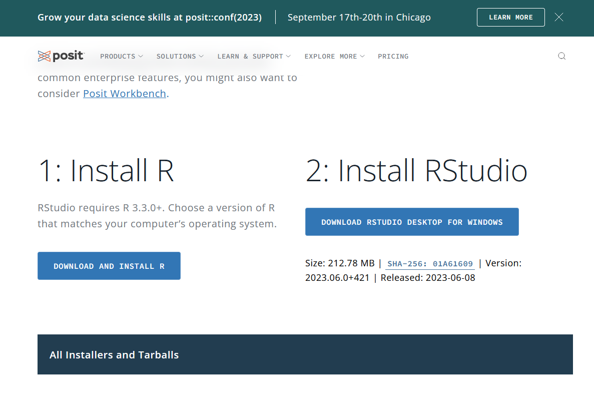

# Take Your First Look at R

-   On the right, two windows, each with tabs
    -   There are many ways to customize the look of RStudio for accessibility purposes with a couple being the following:
        -   You can resize the windows using the splitters.
        -   You can maximize/restore the windows within the left/right panels using the familiar Windows controls in the upper-right of each window.
-   On the left, the Console Window reproduces the R environment.
    -   Observe the command line with the $>$ symbol.

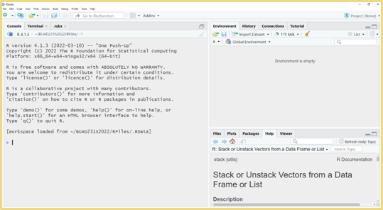

# Project Files

-   A RStudio project is a way to organize your work by creating a self-contained environment for your files, scripts, and outputs.
    -   The RStudio project file sits in the root directory, with the extension .Rproj.
    -   When your RStudio session is running through the project file (.Rproj), the current working directory points to the root folder where that .Rproj file is saved.
-   Key Features
    -   Keeps all related files in one folder.
    -   Automatically sets the working directory to the project folder.
    -   Simplifies managing file paths ("data/myfile.csv" instead of a full path).

<iframe width="560" height="315" src="https://www.youtube.com/embed/Oe4o3xJGJgI?si=7h-tMOlRwRFDbBQT" title="YouTube video player" frameborder="0" allow="accelerometer; autoplay; clipboard-write; encrypted-media; gyroscope; picture-in-picture; web-share" referrerpolicy="strict-origin-when-cross-origin" allowfullscreen>

</iframe>

-   Creating a project for our class. Projects are great because they aid in your organization technique.
-   You will find that some professors are not insistent on making a project for their class, but it is helpful to still do to organize your materials. You will have a lot of code in this program!
-   To create a project click $File > New Project - New Directory > New Project$ and save your project to a place on your computer (not the cloud).

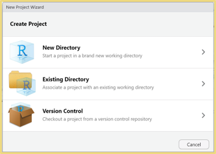

# R Script files

-   Entering and running code at the R command line is effective and simple. However, each time you want to execute a set of commands, you have to re-enter them at the command line. Nothing saves for later.
-   Complex commands are particularly difficult causing you to re-entering the code to fix any errors typographical or otherwise. Fortunately, you can make a .R script file to solve this issue.
-   A .R script is simply a text file containing a set of commands and comments. The script can be saved and used later to rerun the code. The script can also be documented with comments and edited again and again to suit your needs.\
-   Create your first R Script file within your Project for testing purposes.
    -   Go to File \> New File \> R Script
    -   Save this file as MyFirstRscript.R in your project folder you just made. You should see this new file under Files like mine is in the bottom right panel. As we create new files, continue to save them into your project folder.
-   On the .R file presented to the left, comments are added as denoted by the hashtag which you can type or push ctrl + shift + c.
-   If you type in your console, it will not save it for later. However, if you save code in this R Script file, you can open your file at a later date to rerun your code. Also, as we move through the class, feel free to document all your notes in your .R file via \# called comments. More on comments later.

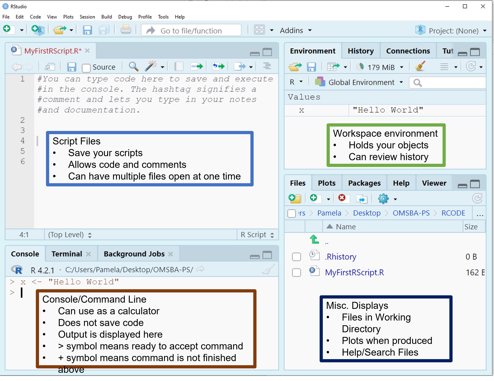

# Using R More Effectively

## Customizing RStudio

-   Customizing RStudio through global options allows you to create a coding environment that aligns with your workflow and personal preferences. By tailoring settings such as appearance, pane layout, and editor behavior, you can improve productivity, enhance readability, and streamline your data analysis process. These adjustments not only make coding more efficient but also help you avoid common pitfalls, like workspace clutter or inconsistent settings. RStudio is highly flexible, so take the time to explore and experiment with its options to make the platform work best for you.

<iframe width="560" height="315" src="https://www.youtube.com/embed/cmg2q-mG1iI?si=arnYLqFAIH6oZ30U" title="YouTube video player" frameborder="0" allow="accelerometer; autoplay; clipboard-write; encrypted-media; gyroscope; picture-in-picture; web-share" referrerpolicy="strict-origin-when-cross-origin" allowfullscreen>

</iframe>

-   What are Global Options
    -   Settings in RStudio that let you personalize the environment to suit your workflow.
-   Why change global options?
    -   Improve productivity by tailoring RStudio to your preferences.
    -   Enhance readability and usability of code and outputs.
    -   Create a consistent environment across projects.
-   Where to Find Global Options:
    -   Go to Tools \> Global Options in the RStudio menu.
-   Key Settings to Adjust
    -   Global Options \> General: You can set your general information including your default working directory (when not in a project).Set your R Version if appropriate.
    -   Global Options \> Code: Enable auto-complete, or soft-wrap for easier coding.
    -   Global Options \> Appearance: You can customize the appearance to a theme that accommodates your learning style and visual preferences.
    -   Global Options \> Spelling: You can turn on a spell check.


## Quick Keys in R

-   There are a lot of quick keys in R to make you able to use it faster and more effectively. You may look over these and try on your own.

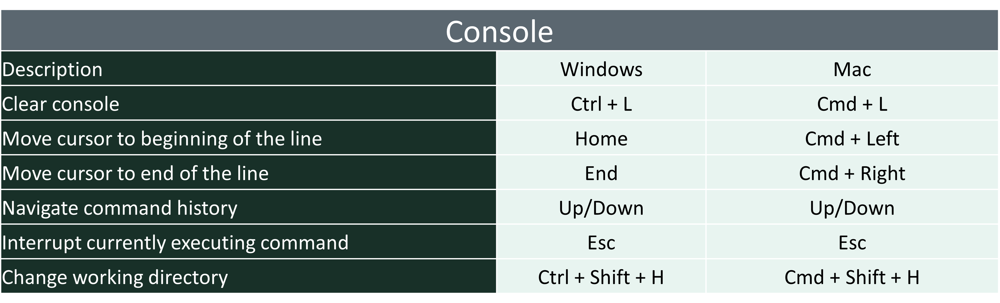

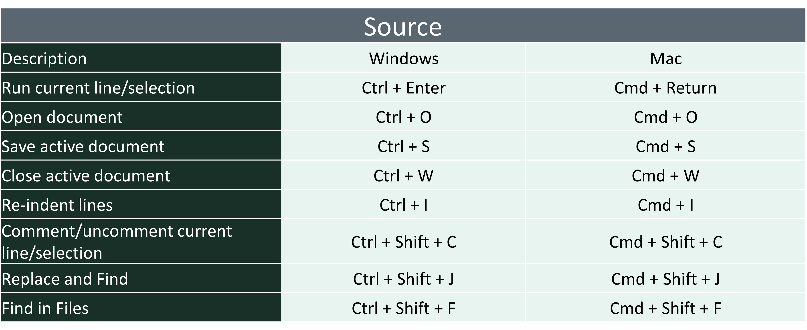

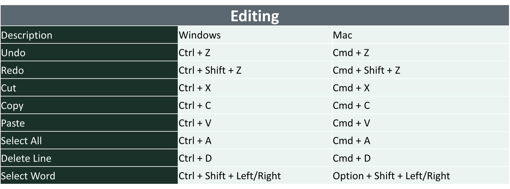

## Getting Help in R

-   There are lots of ways to get help in R.
-   In R, use the help search box to find information on a function, parameter, or package.
    -   ?mean
    -   help.search(‘swirl’)
    -   help(package = ‘MASS’)
    -   ?install.packages

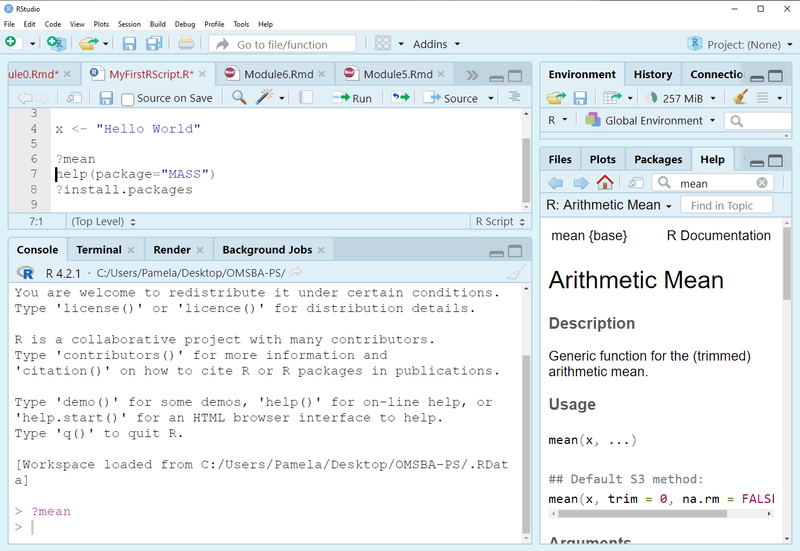

-   You should try to look up the tapply command to see what it does.
    -   Use ?tapply in your .R file to pull up tapply() command or type tapply in the Help box. \* Formally, you should see that the command applies a function to each cell of a ragged array, that is to each (non-empty) group of values given by a unique combination of the levels of certain factors. This means that the command does some math calculation (mean, sum, etc.) on a continuous variable after dividing the data by group.
-   The format is tapply(x, index, and fun), where x is a continuous variable, index is a grouping variable or factor, and fun is a function like mean.
-   More on that function later in the first lessons.

# Accessing Data Files for the Course

-   To download the data sets, go to our Canvas datasets page and download them to your computer
-   Once downloaded, unzip the file by right-clicking and selecting "Extract All", and then move the subfolder named data to your working directory.
-   In the example below, my project folder for the class is called BUAD512A and the subfolder that contains all the data files is called data. You can put your folder anywhere on the hard drive of your computer, but do not download it to places on the cloud like OneDrive.


-   We will use a number of data files plus more for homework/projects, so be prepared to use these files throughout the class.

# Introduction to RMarkdown

-   R Markdown (RMD) files are a versatile format that combines plain text, code, and output to create dynamic and reproducible documents.
-   Benefits of Using RMD Files:
    -   Reproducibility: Combining code and output ensures that the document is reproducible. Any changes in the data or analysis can be quickly updated.
    -   Integration: RMD files seamlessly integrate with R, allowing you to run and display results from your analysis within the same document.
    -   Flexibility: You can produce various types of reports, including static documents and dynamic documents.
    -   Collaboration: Being that RMD files are plain text, they are easy to share and version control with tools like Git.
-   RMD files have many options, but generally are composed of the following:
    -   yaml Header
    -   markdown Text
    -   Code Chunks
    -   Output Formats
    -   Visualization and Plots

## yaml Header

-   The YAML header is located at the beginning of the RMD file and contains metadata about the document, such as the title, author, date, and output format. Here is an example of a YAML header:

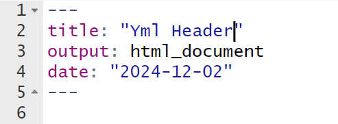

## markdown Text

-   Markdown is a lightweight markup language with plain text formatting syntax. In an RMD file, you use Markdown to format the text, create lists, headers, links, and more. For example:

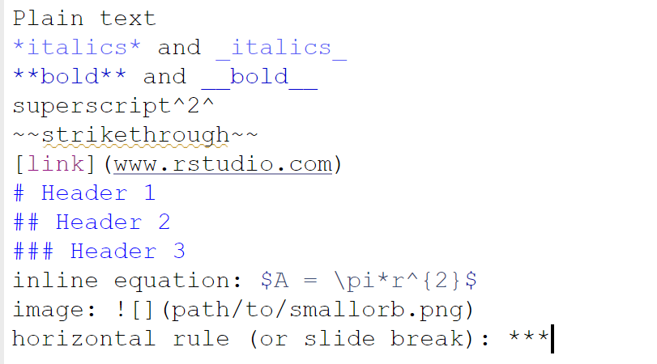

## Code Chunks

-   Code chunks allow you to embed R (or other languages) code within the document. These chunks are executed when the document is rendered, and their output is included in the final document. Code chunks are defined with triple backticks and the language, like this:

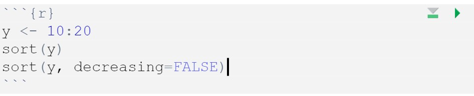

-   Chunk output can be customized with knitr options, arguments set in the {} of a chunk header.
    -   include = FALSE prevents code and results from appearing in the finished file. R Markdown still runs the code in the chunk, and the results can be used by other chunks.
    -   echo = FALSE prevents code, but not the results from appearing in the finished file. This is a useful way to embed figures.
    -   message = FALSE prevents messages that are generated by code from appearing in the finished file.
    -   warning = FALSE prevents warnings that are generated by code from appearing in the finished.
    -   fig.cap = "..." adds a caption to graphical results.

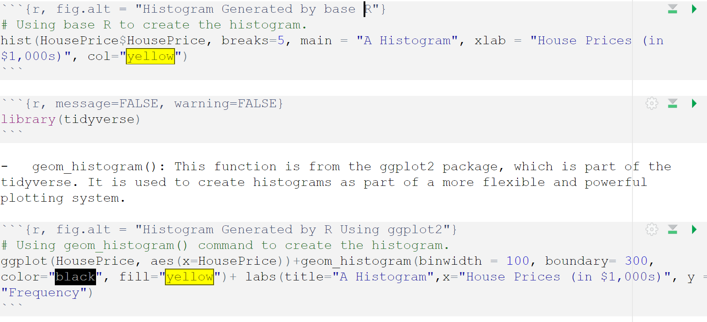

## Output Formats

-   RMD files can be rendered into various output formats including HTML, PDF, and Word documents. The output format is specified in the YAML header. To generate the final document, you use the knit function in RStudio or call rmarkdown::render() in your R script.

## Visualization and Plots

-   RMD files can include visualizations and plots. For example, you can create and embed a plot using the ggplot2 package.

library(ggplot2) ggplot(mpg, aes(x=displ, y=hwy)) + geom_point()

```{r}

library(ggplot2)
ggplot(mpg, aes(x=displ, y=hwy)) + geom_point()

```

## Using RMD for Homework

-   You will be asked to edit an RMarkdown (.Rmd) file to process your R assignments in this course. This requires you to answer the assignment questions in .R and copy your answer to the appropriate R chunk in the .Rmd file, or answer the questions directly in the .Rmd file. To complete this process successfully, follow these steps:

    -   A .Rmd file will be linked on each applicable assignment page in Canvas. These files contain the instructions for each individual the assessment. Using RStudio, open the .Rmd file (which can be downloaded from Canvas into your working directory).
    -   Inside the .Rmd file, you will see R chunks. This is where you will put your answers. Do not delete the …{r} or the … at the end of the chunk. Those characters signifies what type of chunk you have (an R chunk) and needs beginning characters and closing characters to work.
    -   Once you complete your tasks, select knit to make the .pdf file.
    -   After you knit, you can find the .pdf file in your working directory. You can open it to verify that all of your answers are included.
    -   If your .Rmd file won't knit, you should submit your .Rmd file instead of the .pdf file. While this will cost you points on the assignment, it will still allow your instructor to evaluate the rest of the code.

## Packages Required for RMD to Work

-   RMarkdown requires updated packages for formatting and when saving as .pdf documents, a latex extension is also required so that it properly reads the formulas in the problems. Download the .R file on Canvas and follow the instructions provided to use RMarkdown. You may also watch the tutorial video on Canvas for specific information on how to set up R Markdown Files.


-   To use RMarkdown most efficiently, make sure your version of R is the latest by checking the website. If it is not, then take the time to get the latest version of the software. Second, make sure your files are not on the cloud, including OneDrive. If so, then decouple at least your desktop with OneDrive so you can work off the cloud. Finally, run the lines below one at a time. Once the packages are done installing, then restart your computer. Finally, open RStudio and run a blank RMarkdown file. If this file knits, then your homework should knit as long as there are no other errors.

```{r, eval=FALSE}
install.packages("rmarkdown")
install.packages("knitr")
install.packages("formatR")
tinytex::install_tinytex()  # Select Y when/if it asks down in the console.
```

-   You may only need to update one of these packages. However, since they are all connected, running these commands ensures that they are all up to date with minimal troubleshooting.

-   If you are having difficulty knitting to pdf, feel free to publish it in a .html and print the .html to a .pdf. I just ask that the final uploaded document with answers be a pdf. To do this, click the drop down arrow on the Knit option and select Knit to HTML.

## Troubleshooting RMD FIles

-   The videos on Canvas offer a walk through of how to use RMD files successfully in this course. Understanding how to use RMD files is essential to your success on assignments in this course. Please note that these videos will not show you the specific homework questions or specific answers. The files you will see in the following videos are for demonstration purposes only. Course homework assignments change regularly, so the specific contents of the files shown in the videos will likely differ from those you will see for your assignments.

-   Lack of Syntax Errors:

    -   R Markdown files may fail to knit without providing clear syntax error messages.
    -   To troubleshoot, run each code chunk interactively in RStudio to identify and fix errors before knitting.
    -   Pay attention to any warnings or messages in the console as they may indicate potential issues.

-   Using Relative Links to Datasets:

    -   If the .Rmd file relies on external datasets, ensure that file paths are specified using relative links.
    -   Relative links ensure portability, allowing the .Rmd file to work on different systems without modification.
    -   For example, if a dataset is in a subfolder, use a path like data \<- read.csv("data/my_dataset.csv").
    -   Always verify that the dataset exists in the specified location relative to the working directory.

-   Including Necessary Libraries:

    -   Functions from external libraries will fail if the required libraries are not loaded.
    -   At the beginning of the .Rmd file, load all necessary libraries explicitly using library() calls, e.g., library(tidyverse).
    -   Ensure that all libraries used in the document are installed beforehand by running install.packages() if needed.
    -   Loading libraries early prevents errors during knitting and avoids confusing error messages.

<iframe width="560" height="315" src="https://www.youtube.com/embed/0icaDnh52Wo?si=ePQX3Pk11EJ-tcTe" title="YouTube video player" frameborder="0" allow="accelerometer; autoplay; clipboard-write; encrypted-media; gyroscope; picture-in-picture; web-share" referrerpolicy="strict-origin-when-cross-origin" allowfullscreen>

</iframe>

# Summary

-   At the end of this section, you should have downloaded and browsed R in RStudio. You should have looked at the quick keys in R to make editing your R documents easier. You should set up a project folder for the course where you want to on your computer, and made your first .R script file located in that project folder. You should have tried a line of code or two as presented. Finally, you should have looked around the RStudio environment and found the help tab.
