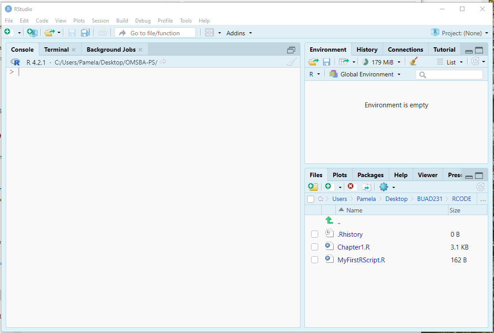
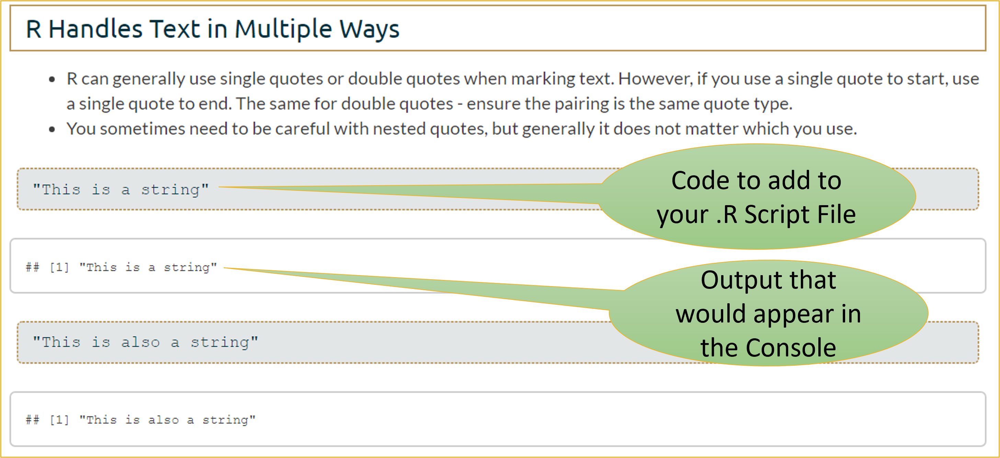
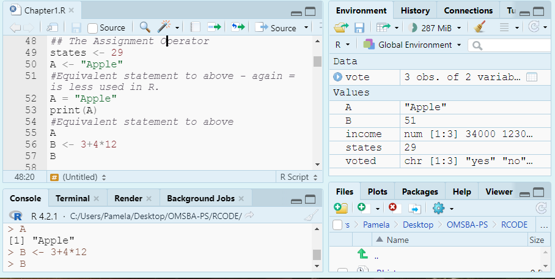
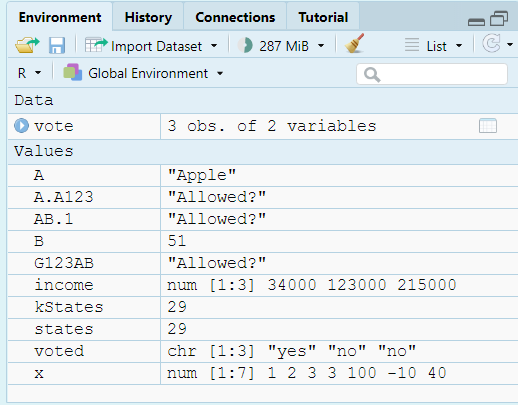
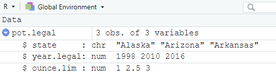
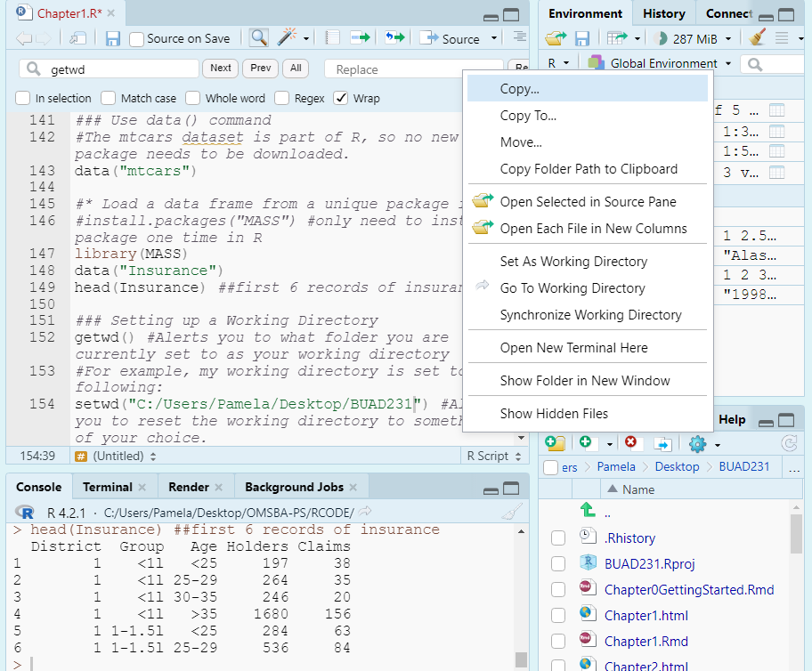

```{r setup, include=FALSE}
knitr::opts_chunk$set(echo=TRUE, tidy.opts = list(width.cutoff = 70), tidy = TRUE, message=FALSE, warning=FALSE)
```

This lesson introduces R and RStudio — the statistical computing environment used throughout this course. By the end, you will be able to navigate RStudio, write and run R code, create and name objects, load data from external files, understand R's core data types, and handle missing values.

We begin with **the foundations of statistics and AI**: what descriptive and inferential statistics are, where AI fits into each branch, and what it means to be fluent in R in an age when AI can write code on demand. Understanding the "why" behind each command is what separates an analyst from someone who just runs code.

We then move to **setting up and using R**: creating script files, writing comments and a prolog, performing arithmetic, assigning values to objects, naming those objects consistently, working with built-in functions, installing and loading packages, and troubleshooting errors. These are the mechanical building blocks every subsequent lesson relies on.

The lesson continues with **entering and loading data**: building vectors, matrices, and data frames from scratch, setting a working directory, and reading in external files with `read.csv()` and `read_csv()`. Understanding the difference between absolute and relative file paths — and why relative paths are preferred — is a practical skill that prevents a large share of beginner errors.

We close with two critical data-quality topics: **data types** and **missing data**. R assigns a type to every variable — factor, numeric, integer, character, logical, or date — and the wrong type causes silent errors that look fine but produce wrong results. Missing data is equally common in real datasets and requires a deliberate strategy: omit, impute, or handle with `na.rm`. Neither topic is glamorous, but both are essential before any analysis can be trusted.

By the end of this lesson, you should be comfortable writing and running basic R code, loading a dataset, checking and correcting variable types, and identifying and handling missing values. Work through every code example in your own `.R` script file alongside the reading.

### At a Glance

-   In order to succeed in this lesson, you will need to have both R and RStudio downloaded and open. The only way to learn R is to use it — type every code example yourself rather than just reading it. Pay attention not just to *what* you are typing but *why* the code is written that way, and what other forms would produce the same result.
-   This is a statistics course, and R is a statistical computing tool. The two are inseparable here. Every command you learn connects to a statistical concept, and understanding that connection is what makes the code meaningful rather than mechanical.

### Lesson Objectives

-   Explain the difference between descriptive and inferential statistics and identify where AI assists versus where human judgment is required.
-   Create and run an R script file with a prolog, comments, and code.
-   Assign values to objects using the `<-` operator and follow consistent naming conventions.
-   Use built-in functions with single and multiple arguments, including default values.
-   Install and load packages; access functions using the `library::function()` syntax.
-   Troubleshoot common R errors using a systematic approach.
-   Create vectors, matrices, and data frames from scratch.
-   Set a working directory and load data using `read.csv()` and `read_csv()`.
-   Identify and correct variable data types using `str()`, `class()`, and coercion functions.
-   Handle missing values using `na.rm`, `is.na()`, `na.omit()`, and `drop_na()`.

### Consider While Reading

-   R has a steep learning curve, but the curve flattens fast once you start recognising patterns. Every error message is information — read it before asking AI to fix it. Every function has a help page — check it before guessing at arguments.
-   As you read, notice how the lesson is structured as a workflow: set up → write code → create data → load data → fix types → handle missing values. Each section is a prerequisite for the next. By the time you reach missing data, you will have seen every piece needed to make sense of it.
-   AI tools like ChatGPT and GitHub Copilot can write R code for you. The goal of this lesson is to build enough understanding that you can *read, verify, and own* that code — not just run it and hope for the best.

## What is Statistics?

-   Statistics is the methodology of extracting useful information from a data set.
-   Numerical results are not very useful unless they are accompanied with clearly stated actionable business insights.
-   To do good statistical analysis, you must do the following:
    -   Find the right data.
    -   Use the appropriate statistical tools.
    -   Clearly communicate the numerical information in written language.
-   With knowledge of statistics:
    -   Avoid risk of making uninformed decisions and costly mistakes.
    -   Differentiate between sound statistical conclusions and questionable conclusions.
-   Data and analytics capabilities have made a leap forward.
    -   Growing availability of vast amounts of data.
    -   Improved computational power.
    -   Development of sophisticated algorithms.
    -   The rise of Generative AI.

### Definition of AI

-   Artificial Intelligence (AI) is the development of computer systems that can perform tasks that typically require human intelligence — things like recognizing patterns, making decisions, understanding language, and generating content.
-   For the purposes of this course, the most relevant category is generative AI (tools like ChatGPT, Claude, and GitHub Copilot), which can produce text, code, and analysis in response to natural language prompts.

### Two Main Branches of Statistics

-   Descriptive Statistics - collecting, organizing, and presenting the data.
-   Inferential Statistics - drawing conclusions about a population based on sample data from that population.
    -   A population consists of all items of interest.
    -   A sample is a subset of the population.
    -   A sample statistic is calculated from the sample data and is used to make inferences about the population parameter.
-   Reasons for sampling from the population:
    -   Too expensive to gather information on the entire population.
    -   Often impossible to gather information on the entire population.

#### Descriptive Statistics and AI

-   Descriptive Statistics is where AI currently dominates. Tools like ChatGPT, Copilot, and R's own AI-assisted packages can collect data via APIs, clean and wrangle it, generate summary statistics, and produce polished visualizations faster than any human. When you ask AI to "summarize this dataset," it's doing descriptive work. The output is only as good as the data fed in, but the mechanical execution is largely automated.

#### Inferential Statistics and AI

-   Inferential Statistics is where human judgment remains essential, and AI actually introduces new complications. Consider:
    -   Who defines the population? If you're studying customer behavior, do you mean all customers, all potential customers, all customers in a region? AI won't ask this question — it will answer whatever you give it. Defining the population of interest is a business and conceptual judgment call, not a computation.
    -   Is the sample representative? AI can run a regression or t-test in seconds, but it cannot tell you whether your sample was collected with selection bias, convenience sampling, or missing key subgroups. That requires domain knowledge and critical thinking.
    -   What do the inferences actually mean? A p-value of 0.03 in a business context means something different from one in a clinical trial. Translating statistical conclusions into actionable decisions — and communicating uncertainty honestly to a non-technical audience — is still entirely a human skill.

### Reasons for sampling from the population

-   Too expensive to gather information on the entire population.
-   Often impossible to gather information on the entire population.
-   AI models are themselves built on samples — no training dataset captures all human knowledge, all languages, or all possible situations. This is why AI has blind spots, biases, and confidently wrong answers. The same sampling limitations we study in this course apply directly to the tools you use every day.

### AI vs. Statistics

-   Statistics is a branch of mathematics focused on collecting, analyzing, and interpreting data under uncertainty. AI systems, particularly modern ones, are largely built on statistical methods — machine learning models are essentially very complex statistical models trained on large datasets. So, statistics isn't separate from AI; it's foundational to it.
-   AI vs. Machine Learning — Machine learning is a subset of AI where systems learn from data rather than being explicitly programmed with rules. Most of what powers tools like ChatGPT falls here.
-   AI vs. a calculator — A calculator executes exactly what you tell it. An AI system infers, predicts, and generates — which makes it more powerful and also less predictable. It can be wrong with great confidence.

### R Comes with Assistance

-   R’s community is vast, and you can always seek information from the community to try to help you with a R related issue.
-   AI tools like ChatGPT and GitHub Copilot can also assist with R syntax and debugging — but the analyst must understand, verify, and take ownership of every line of code submitted.

### R is Called a Dynamically Typed Language

R figures out a variable's data type automatically based on whatever you assign to it. You can change it, but you don't have to declare it upfront like in some other languages.

### What makes you fluent in R — with or without AI:

-   Troubleshooting (AI helps, but you must read the error)
-   The Environment — AI can assist if you share your context, but you must know what to share and why
-   Assignment operator
-   Sequences
-   Built-in functions
-   Reading data
-   Packages
-   Conditional statements
-   Rendering output
-   Writing functions
-   Prompting and verifying AI-generated code


# Setting up R

## R Script Files

-   Using R Script Files:
    -   A .R script is simply a text file containing a set of commands and comments. The script can be saved and used later to rerun the code. The script can also be documented with comments and edited again and again to suit your needs.
-   Using the Console
    -   Entering and running code at the R command line is effective and simple. However, each time you want to execute a set of commands, you must re-enter them at the command line. Nothing saves for later.
-   Complex commands are particularly difficult, forcing you to re-enter the code to fix any errors — typographical or otherwise. R script files help to solve this issue.

### Create a New R Script File

-   To save your notes from this lesson, create a .R file named module1.R and save it to your project file you made in the last class.
-   There are a couple of parts to this module, and we can add code for the entire module in one file so that our code is stacked nicely together.\
-   For each new module, start a new file and save it to your project folder.



------------------------------------------------------------------------

With R installed and a script file open, it is time to start writing code. This section introduces the core mechanics of the R language: comments, arithmetic, objects, naming conventions, built-in functions, packages, and how to troubleshoot when something goes wrong.

# Using R

## Text in R

### Comments

-   Use comments to organize and explain your code in R scripts by including 1 or more than 1 hashtag.

-   Aim to write clear, self-explanatory code that minimizes the need for excessive comments.

-   Add helpful comments where necessary to ensure anyone, including your future self, can understand and run the code.

-   If something doesn’t work, avoid deleting it immediately. Instead, comment it out while troubleshooting or exploring alternatives.

-   Essentially, we add comments to our code to document our work and add notes to our self or to others.

```{r}
# This is a comment for documentation or annotation
```

-   Add the code above to your R file and run each line using Ctl + Enter (PC) or Cmd + Return (MAC) or select all lines and click Run.
-   Take note that nothing prints in the console after running a comment.

### A Prolog

-   A prolog is a set of comments at the top of a code file that provides information about what is in the file. It also names the files and resources used that facilitates identification. Including a prolog is considered coding best practice.
-   On your own R Script File, add your own prolog following the template as shown.
-   An informal prolog is below:

```{r, tidy=FALSE}

####################################
# Project name: Module 1
# Project purpose: To create an R script file to learn about R. 
# Code author name: [Enter Your Name]
# Date last edited: [Enter Date Here]
# Data used: NA
# Libraries used: NA
####################################

```

-   Then, as we work through our .R script and add data files or libraries to our code, we go back and edit the prolog.


### String

-   In R, a *string* is a sequence of characters enclosed in quotes, used to represent text data.
-   R accepts single quotes or double quotes when marking a *string*. However, if you use a single quote to start, use a single quote to end. The same for double quotes - ensure the pairing is the same quote type.
-   You sometimes need to be careful with nested quotes, but generally it does not matter which you use.

```{r}
'This is a string'

"This is also a string"
```

## Note on R Markdown

-   These files were formatted with RMarkdown. RMarkdown is a simple formatting syntax for authoring documents of a variety of types, including PowerPoint and html files.
-   On the document, RMarkdown prints the command and then follows the command with the output after 2 hashtags.
-   In your R Script File, you only need to type in the command and then run your code to get the same output as presented here.



## Running Commands

-   There are a few ways to run commands via your .R file.
    -   You can click Ctr + Enter on each line (Cmd + Return on a Mac).
    -   You can select all the lines you want to run and select Ctr + Enter (Cmd + Return on a Mac).
    -   You can select all the lines you want to run and select the run button as shown in the Figure.


-   Now that I have asked you to add a couple lines of code, after this point, when R code is shown on this file, you should add it to your .R script file along with any notes you want. I won't explicitly say - "add this code."

## R is an Interactive Calculator

-   An important facet of R is that it should serve as your sole calculator.
-   Try these commands in your .R file by typing them in and clicking Ctr + Enter on each line for a PC and Cmd + Return on a Mac computer.

```{r}
3+4
3*4
3/4
3+4*100^2
```

-   Take note that order of operations holds in R:

-   The order of operations in R, as in mathematics, determines the sequence in which expressions are evaluated. This follows the standard rules often remembered by the acronym PEMDAS: Parentheses, Exponents, Multiplication and Division, and Addition and Subtraction (from left to right). Parentheses have the highest precedence and are used to group expressions, ensuring they are evaluated first. Operators with the same level of precedence, like multiplication and division, are evaluated from left to right. When in doubt, use parentheses to make the evaluation order explicit and improve the readability of your code.

    -   Parentheses ()
    -   Exponents \^ and $**$
    -   Division $/$, Multiplication $*$, modulo, and integer division
    -   Addition + and Subtraction -

-   

    -   In R, modulo (%%) and integer division (%/%) also follow the order of operations, with both being evaluated after multiplication, division, and exponentiation, but before addition and subtraction.

-   This means that modulo and integer division have the same priority level as multiplication and division, where modulo is just the remainder.

```{r}
# Start with the full expression — what does R see?
2 + 3 * 5 - 7^2 %% 4 + (5 / 2)

# Step 1: Parentheses first
5 / 2          # = 2.5
# Expression is now: 2 + 3 * 5 - 7^2 %% 4 + 2.5

# Step 2: Exponents
7^2            # = 49
# Expression is now: 2 + 3 * 5 - 49 %% 4 + 2.5

# Step 3: Multiplication
3 * 5          # = 15
# Expression is now: 2 + 15 - 49 %% 4 + 2.5

# Step 4: Modulo (same level as multiplication/division, left to right)
49 %% 4        # = 1  (49 divided by 4 leaves remainder 1)
# Expression is now: 2 + 15 - 1 + 2.5

# Step 5: Addition and subtraction, left to right
2 + 15         # = 17
17 - 1         # = 16
16 + 2.5       # = 18.5

# Confirm R agrees:
print(2 + 3 * 5 - 7^2 %% 4 + (5 / 2))
## [1] 18.5
```

## Creating Objects

-   Entering and Storing Variables in R requires you to make an assignment.
    -   We use the assignment operator '\<-' to assign a value or expression to a variable.
    -   We typically do not use the = sign in R even though it works because it also means other things in R.
-   Some examples are below to add to your .R file.

```{r}
states <- 29
A <- "Apple"
#Equivalent statement to above - again = is less used in R. 
A = "Apple" 
print(A)
#Equivalent statement to above
A 
B <- 3+4*12
B
```



## Naming Objects

-   Line length limit: 80
-   Always use a consistent way of annotating code.
-   *Camel case* is capitalizing the first letter of each word in the object name, with the exception of the first word.
-   *Dot case* puts a dot between words in a variable name while camel case capitalizes each word in the variable name.
-   Object names appear on the left of assignment operator. We say an object receives or is assigned the value of the expression on the right.

1.  Naming Constants: A Constant contains a single numeric value.

-   The *recommended* format for constants is starting with a “k” and then using camel case. (e.g., kStates).

2.  Naming Functions: Functions are objects that perform a series of R commands to do something in particular.

-   The *recommended* format for Functions is to use Camel case with the first letter capitalized. (e.g., MultiplyByTwo).

3.  Naming Variables: A Variable is a measured characteristic of some entity.

-   The *recommended* format for variables is to use either the dot case or camel case. e.g., filled.script.month or filledScriptMonth.

-   A valid variable name consists of letters, numbers, along with the dot or underline characters.

-   A variable name must start with a letter, or the dot when not followed by a number.

-   A variable cannot contain spaces.

-   Variable names are case sensitive: x is different from X just as Age is different from AGE.

-   The value on the right must be a number, string, an expression, or another variable.

-   Some Examples Using Variable Rules:

```{r}
AB.1 <- "Allowed?"
#Does not follow rules - not allowed
#Try the statement below with no hashtag to see the error message
#.123 <- "Allowed?"  
A.A123 <- "Allowed?"
G123AB <- "Allowed?"
#Recommended format for constants
kStates <- 29 
```

The naming conventions above can be summarised as:

| Object type | Convention | Example |
|------------------------|------------------------|------------------------|
| Constant (single value) | `k` + CamelCase | `kStates`, `kMaxRetries` |
| Function | CamelCase, first letter capitalised | `MultiplyByTwo`, `CleanData` |
| Variable / column | dot.case or camelCase | `filled.script.month`, `filledScriptMonth` |
| Dataset / data frame | Short, lowercase or camelCase | `gig`, `gss.2016`, `potLegal` |

-   Different R coders have different preferences, but consistency is key in making sure your code is easy to follow and for others to read. In this course, we will generally use the recommendation in the text which are listed above.
-   We tend to use one letter variable names (i.e., x) for placeholders or for simple functions (like naming a vector).

## Built-in Functions

-   R has thousands of built-in functions including those for summary statistics. Below, we use a few built-in functions with constant numbers. The sqrt(), max(), and min() functions compute the square root of a number, and find the maximum and minimum numbers in a vector.

```{r}
sqrt(100)
max(100,200,300)
min(100,200,300)
```

-   We can also create variables to use within built-in functions.

-   Below, we create a vector x and use a few built-in functions as examples.

    -   The sort() function sorts a vector from small to large.

    ```{r}
    x<-c(1,2,3,3,100,-10,40) #Creating a Vector x
    sort(x) #Sorting the Vector x from Small to Large
    max(x) #Finding Largest Element of Vector x
    min(x) #Finding Smallest Element of Vector x
    ```

### Built-in Functions: Setting an Argument

-   The standard format to a built-in function is functionName(argument)
    -   For example, the square root function structure is listed as sqrt(x), where x is a numeric or complex vector or array.

```{r}
#Here, we are setting a required argument x to a value of 100. When a value is set, it turns it to a parameter of the function.
sqrt(x=100)  
#Because there is only one argument and it is required, we can eliminate its name x= from our function call. This is discussed below. 
sqrt(100) 
```

-   There is a little variety in how we can write functions to get the same results.
-   A parameter is what a function can take as input. It is a placeholder and hence does not have a concrete value. An argument is a value passed during function invocation.
-   There are some default values set up in R in which arguments have already been set.
-   There are a few functions with no parameters like Sys.time() which produces the date and time. If you are not sure how many parameters a function has, you should look it up in the help.

### Default Values

-   There are many default values set up in R in which arguments have already been set to a particular value or field.
-   Default values have been set when you see the = value in the instructions. If we don’t want to change it, we don’t need to include it in our function call.
-   When only one argument is required, the argument is usually not set to have a default value.

### Built-in Functions: Using More than One Argument

-   For functions with more than one parameter, we must determine what arguments we want to include, and whether a default value was set and if we want to change it. Default values have been set when you see the = value in the instructions. If we don’t want to change it, we don’t need to include it in our function call.
    -   For example, the default S3 method for the seq() function is listed as the following: seq(from = 1, to = 1, by = ((to - from)/(length.out - 1)),length.out = NULL, along.with = NULL, ...)
    -   Default values have been set on each parameter, but we can change some of them to get a meaningful result.
    -   For example, we set the from, to, and by parameter to get a sequence from 0 to 30 in increments of 5.

```{r}
#We can use the following code. 
seq(from = 0, to = 30, by = 5)  
```

-   We can simplify this function call even further:

    -   If we use the same order of parameters as the instructions, we can eliminate the *argument=* from the function.
    -   Since we do list the values to the arguments in same order as the function is defined, we can eliminate the from=, to=, and by= to simplify the statement.

    ```{r}
    #Equivalent statement as above
    seq(0, 30, 5) 
    ```

-   If you leave off the by parameter, it defaults at 1.

```{r}
# Leaving by= to default value of 1
seq(0,30)
```

-   There can be a little hurdle deciding when you need the argument value in the function call. The general rule is that if you don't know, include it. If it makes more sense to you to include it, include it.

### Tips on Arguments

-   Always look up a built-in function to see the arguments you can use.
-   Arguments are always named when you define a function.
-   When you call a function, you do not have to specify the name of the argument.
-   Arguments have default values, which is used if you do not specify a value for that argument yourself.
-   An argument list comprises of comma-separated values that contain the various formal arguments.
-   Default arguments are specified as follows: *parameter = expression*

```{r}
y <- 10:20
sort(y)
sort(y, decreasing=FALSE)

```

## The Environment

-   You can evaluate your Environment Tab to see your Variables we have defined in R Studio.
-   Use the following functions to view and remove defined variables in your Global Environment

```{r}
ls() #Lists all variables in Global Environment 
rm(states) #Removes variable named states
rm(list=ls()) #Clears all variables from Global Environment
```



## Saving

-   You can save your work in the file menu or the save shortcut using Ctrl + S or Cmd + S depending on your Operating System.


## Installing a Package and Calling a Library

-   A package is a collection of functions, data, and code. The library is where packages live
-   We use the install.package command one time to install a package.
    -   tidyverse is a collection of packages designed to work together for data import, cleaning, and visualization. Loading one line gives you all of them.
    -   You can also install via the menu: Tools \> Install Packages — type the package name and click Install. Same result, no typing required.
-   Then, we use the library command to load the library.
    -   When tidyverse loads, R will tell you exactly which packages were attached and which functions now have conflicts. Read that message — it tells you something important about your environment.

```{r, message=FALSE}
# Install once — ever. After that, comment this line out.
#install.packages("tidyverse") ##commented out for processing

# Load every R session
library(tidyverse)

```

### A Common Mistake

Leaving install.packages() uncommented in your script means R reinstalls the package every time you run the file. That wastes time and can cause version issues. Comment it out after the first run.

```{r}
# install.packages("tidyverse")   # commented out after install
library(tidyverse)                # this is all you need going forward
```

-   If a package won't load, the fix is almost always one of these:
    -   You never installed it — run install.packages() once
    -   You forgot library() at the top of your script
    -   There is a typo — package names are case sensitive

### Accessing A Function from Specific Library

-   You can access a function from a specific library using the double-colon operator library::function()
    -   Useful if only using one function from the library.
-   We will return to this in data prep.

```{r, message=FALSE}
##Below is an example that would use dplyr for one select function to select variable1 from the oldData and save it as a new object NewData. Since we don’t have datasets yet, we will revisit this. 
#NewData <- dplyr::select(oldData, variable1)
```

-   Some libraries are part of other global libraries:
    -   dplyr is part of tidyverse, there is actually no need to activate it if tidyverse is active, however, sometimes it helps when conflicts are present
    -   An example of a conflict is the use of a select function which shows up in both the dplyr and MASS package. If both libraries are active, R does not know which to use.
    -   tidyverse has many libraries included in it.

## Troubleshotting Errors in RStudio

-   Step 1: Restart RStudio/Restart Computer and Clear your environment
    -   Use rm(list=ls()) to clear out old variables
    -   Make sure proper capitalization and spacing is being used.
-   Step 2: Read the error message carefully: R's error messages are more informative than they look. Check capitalization, spelling, and whether all parentheses and quotes are closed. Most beginner errors live here.
-   Step 3: Ask AI: Paste the error message directly into ChatGPT or Claude and ask what it means. This is a legitimate and efficient use of AI — error interpretation is exactly what it is good at.
    -   Verify the fix yourself before running it. AI can suggest plausible-looking code that does the wrong thing.
-   Two Categories of Errors (Both Matter Equally)
    -   Hard Error: Code won’t run at all (Easy to catch)
    -   Silent Error: Code runs but gives wrong output (Dangerous – easy to miss)
    -   The second type is the more important one to develop instincts for. AI is particularly prone to silent errors — it will produce output that looks correct but isn't. Always sanity-check results against what you expect.

------------------------------------------------------------------------

With the language mechanics established, the next step is creating data structures directly in R. Before you read in real datasets, understanding how vectors, matrices, and data frames are built from scratch gives you a mental model of how R stores and organises data.

# Entering Data in R

## Creating a Vector

-   A vector is the simplest type of data structure in R.
    -   A vector is a set of data elements that are saved together as the same type.
    -   We have many ways to create vectors with some examples below.
-   Use c() function, which is a generic function which combines its arguments into a vector or list.

```{r}
c(1,2,3,4,5) #Print a Vector 1:5
```

-   If numbers are aligned, can use the ":“ symbol to include numbers and all in between. This is considered an array.

```{r}
1:5 #Print a Vector 1:5
```

-   Use seq() function to make a vector given a sequence.

```{r}
seq(from=0,to= 30,by=5) #Creates a sequence vector from 0 to 30 in increments on 5 
```

-   Use rep() function to repeat the elements of a vector.

```{r}
rep(x=1:3,times=4) #Repeat the elements of the vector 4 times
rep(x=1:3, each=3) #Repeat the elements of a vector 3 times each
```

The four main ways to create a vector in R:

| Function | Purpose                   | Example             | Result        |
|----------|---------------------------|---------------------|---------------|
| `c()`    | Combine any values        | `c(1, 2, 3)`        | `1 2 3`       |
| `:`      | Integer sequence          | `1:5`               | `1 2 3 4 5`   |
| `seq()`  | Custom sequence with step | `seq(0, 30, 5)`     | `0 5 10 … 30` |
| `rep()`  | Repeat elements           | `rep(1:3, times=2)` | `1 2 3 1 2 3` |

## Creating a Matrix

-   A matrix is another type of object like a vector or a list.

    -   A matrix has a rectangular format with rows and columns.
    -   A matrix uses matrix() function
    -   You can include the byrow = argument to tell the function whether to fill across or down first.
    -   You can also include the dimnames() function in addition to the matrix() to assign names to rows and columns.

-   Using matrix() function, we can create a matrix with 3 rows and 3 columns as shown below.

    -   Take note how the matrix fills in the new data.

    ```{r}
    #Creating a Variable X that has 9 Values.
    x<-1:9 
    #Setting the matrix.
    matrix(x, nrow=3, ncol=3) 
    #Note – we do not need to name the arguments because we go in the correct order. 
    #The function below simplifies the statement and provides the same answer as above.
    matrix(x,3,3) 
    ```

### Setting More Arguments in a Matrix

-   The byrow argument fills the Matrix across the row
-   Below, we can use the byrow statement and assign it to a variable m.

```{r}
m<-matrix(1:9,3,3,byrow=TRUE)#Fills the Matrix Across the Row and assigns it to variable m
m #Printing the matrix in the console
```

-   The dimnames() function adds labels to either the row and the column. In this case below both are added to our matrix m.

```{r}
dimnames(x = m) <- list(c("2020", "2021", "2022"), c("low", "medium",    "high"))
m #Printing the matrix in the console
```

-   You try to make a matrix of 25 items, or a 5 by 5, and fill the matrix across the row and assign the matrix to the name m2.
-   You should get the answer below.

```{r echo=FALSE}
m2 <- matrix(1:25, nrow=5, byrow=TRUE)
m2
```

### Differences between Data Frames and Matrices

-   In a data frame the columns contain different types of data, but in a matrix all the elements are the same type of data. A matrix is usually numbers.
-   A matrix can be looked at as a vector with additional methods or dimensions, while a data frame is a list.

## Creating a Data Frame

-   A data frame is a table or a two-dimensional array-like structure in which each column contains values of one variable and each row contains one set of values from each column. In a data frame the rows are observations and columns are variables.

    -   Data frames are generic data objects to store tabular data.
    -   The column names should be non-empty.
    -   The row names should be unique.
    -   The data stored in a data frame can be of numeric, factor or character type.
    -   Each column should contain same number of data items.
    -   Combing vectors into a data frame using the data.frame() function

-   Going back to the basics in statistics, we need to define an observation and variable so that we can know how to use them effectively in R in creating data frame objects.

    -   An *Observation* is a single row of data in a data frame that usually represents one person or other entity.

    -   A *Variable* is a measured characteristic of some entity (e.g., income, years of education, sex, height, blood pressure, smoking status, etc.).

-   In data frames in R, the columns are variables that contain information about the observations (rows).

-   Below, we can create vectors for state, year enacted, personal oz limit medical marijuana.

```{r}
state <- c('Alaska', 'Arizona', 'Arkansas')
year.legal <- c(1998, 2010, 2016)
ounce.lim <- c(1, 2.5, 3)
```

-   Then, we can combine the 3 vectors into a data frame and name the data frame pot.legal.

```{r}
pot.legal <- data.frame(state, year.legal, ounce.lim)
```

-   Next, check your global environment to confirm data frame was created.



-   Observations: States being measured.

-   Variables: Information about each state (State Name, Year Weed was legalized, and the Ounce Limit permitted).

```{r}
# Shows the number of columns or variables
ncol(pot.legal)
# Shows the number of rows or observations
nrow(pot.legal)
# Shows both the number of rows (observations and columns (variables). 
dim(pot.legal)
```

------------------------------------------------------------------------

You can build data manually, but most real analysis starts with loading an external file. Before reading data into R, you need to understand where R looks for files — which is what working directories and file paths control.

# Working Directories

<iframe width="560" height="315" src="https://www.youtube.com/embed/Hem4uoChTfU?si=y6maq2PDItpJ-ufL" title="YouTube video player" frameborder="0" allow="accelerometer; autoplay; clipboard-write; encrypted-media; gyroscope; picture-in-picture; web-share" referrerpolicy="strict-origin-when-cross-origin" allowfullscreen>

</iframe>

-   In R, when working with data files stored on your computer, it's important to understand the difference between absolute and relative file paths. An **absolute reference** gives the complete path to the file, starting from the root directory. This path is specific to your system, and it doesn't change regardless of where the R script is located. For example, on a Windows machine, you might use something like `read.csv("C:/Users/username/Documents/data.csv")`. This path will always point to the same file, but it can make your code less portable since it only works on your machine or if others have the exact same file structure.

-   On the other hand, a **relative reference** specifies the file's path relative to the location of your R script or working directory. It is more flexible because it assumes the file is located in a directory relative to the current project or script. For example, if your script and data file are in the same folder, you could use `read.csv("data.csv")`. If the file is in a subdirectory, you would reference it relatively like `read.csv("data/data.csv")`. Relative paths make your code more portable and easier to share since it will work as long as the folder structure remains consistent.

-   Using relative paths is often a best practice, especially in collaborative projects or when sharing code. You can check your current working directory in R with `getwd()` and set it with `setwd()`.

## Absolute File Paths

-   Absolute vs. Relative Links
-   An absolute file path provides the complete location of a file, starting from the root directory of your computer.
    -   Always points to the same file.
    -   Independent of the script’s location.
    -   Example: `read.csv("C:/Users/username/Documents/data.csv")`
-   Pro
    -   Reliable for your system
    -   No Ambiguity in locating files
-   Cons
    -   Not portable; requires the same file structure across systems.
    -   Harder to share code with collaborators.

## Relative File Paths

-   A relative file path specifies the file location based on the working directory of your R project or script.
    -   Changes based on the working directory.
    -   Often starts from the project folder.
    -   Example: `read.csv("data/myfile.csv")`
-   Pros
    -   More portable; works across systems if the project structure is consistent.
    -   Easier collaboration when sharing code and project files.
-   Cons
    -   Requires setting the working directory correctly (getwd() and setwd() can help).

|   | Absolute path | Relative path |
|------------------------|------------------------|------------------------|
| **Example** | `"C:/Users/pam/Documents/data.csv"` | `"data/data.csv"` |
| **Starts from** | Root of the file system | Current working directory |
| **Portability** | Breaks on any other machine | Works on any machine with the same folder structure |
| **Best for** | Quick personal scripts | Shared projects, submitted work |

## Setting up a Working Directory

-   You should have the data files from our LMS in a data folder on your computer. Your project folder would contain that data folder.

-   Before importing and manipulating data, you must find and edit your working directory to directly connect to your project folder!

-   These functions are good to put at the top of your R files if you have many projects going at the same time.

```{r, eval=FALSE}
getwd() #Alerts you to what folder you are currently set to as your working directory
#For example, my working directory is set to the following:
#setwd("C:/Users/Desktop/ProbStat") #Allows you to reset the working directory to something of your choice. 
```

-   In R, when using the setwd() function, notice the forward slashes instead of backslashes.
-   You can also go to Tools \> Global Options \> General and reset your default working directory when not in a project. This will pre-select your working directory when you start R.
-   Or if in a project, like we should be, you can click the More tab as shown in the Figure below, and set your project folder as your working directory.



------------------------------------------------------------------------

With your working directory set and file paths understood, you are ready to load real datasets. This section covers the most common ways to bring data into R, from built-in datasets to CSV files from your computer.

# Reading in Data

-   When importing data from outside sources, you can do the following:

1.  You can import data from base R or an R package using data() function.
2.  You can also link directly to a file on the web.
3.  You can import data through from your computer through common file extensions:
    -   .csv: comma separated values;
    -   .txt: text file;
    -   .xls or .xlsx: Excel file;
    -   .sav: SPSS file;
    -   .sasb7dat: SAS file;
    -   .xpt: SAS transfer file;
    -   .dta: Stata file.

-   Each different file type requires a unique function to read in the file. With all the variety in file types, it is best to look it up in the R Community to help.

## Use data() function

-   All we need is the data() function to read in a data set that is part of R. R has many built in libraries now, so there are many data sets we can use for testing and learning statistics in R.

```{r}
#The mtcars data set is part of R, so no new package needs to be downloaded.
data("mtcars")
```

### Load a data from a package

-   There are also a lot of packages that house data sets. It is fairly easy to make a package that contains data and load it into CRAN. These packages need to be installed into R one time. Then, each time you open R, you need to reload the library using the `library()` function.
-   When you run the `install.packages()` function, do not include the `#` symbol. Then, after running it one time, comment it out. There is no need to run this code a second time unless something happens to your RStudio.

```{r, message=FALSE}
#install.packages("MASS") #only need to install package one time in R
library(MASS)
```

```{r}
data("Insurance")
head(Insurance)
```

### Load data from outside sources.

-   After your working directory is set up, then you can read in datasets into RStudio from outside sources.

-   Reading in a .csv file is extremely popular way to read in data.

-   There are a few functions to read in .csv files. And these functions would change based on the file type you are importing.

## read.csv() function

-   Extremely popular way to read in data.

-   read.csv() is a base R function that comes built-in with R: No library necessary.

-   All your datasets should be in a data folder in your working directory so that you and I have the same working directory. This creates a relative path to our working directory.

-   The structure of the function is *datasetName \<- read.csv(“data/dataset.csv”).*

```{r}
gss.2016 <- read.csv(file = "data/gss2016.csv")
# or equivalently
gss.2016 <- read.csv("data/gss2016.csv")
#Examine the contents of the file
summary(object = gss.2016) 
# Or equivalently, we can shorten this to the following code
summary(gss.2016) 
```

|   | `read.csv()` | `read_csv()` |
|------------------------|------------------------|------------------------|
| **Package** | Base R — no library needed | `readr` (part of tidyverse) |
| **Speed** | Adequate for small files | Faster on large datasets |
| **Strings** | Converts to factors unless `stringsAsFactors=FALSE` | Keeps as character by default |
| **Output** | `data.frame` | `tibble` (a tidyverse-enhanced data frame) |
| **Error messages** | Minimal | More informative |
| **Best for** | Quick reads, base R workflows | Tidyverse projects, large files |

## read_csv() function

-   read_csv() is a function from the readr package, which is part of the tidyverse ecosystem.

-   read_csv() is generally faster than read.csv() as it's optimized for speed, making it more efficient, particularly for large datasets.

-   In R, both `read.csv()` and `read_csv()` are used to read in CSV files, but they come from different packages and have important differences. `read.csv()` is part of base R and is widely used for loading CSV files into data frames, as in `data <- read.csv("data/data.csv")`. It can be slower with large datasets and automatically converts strings to factors unless `stringsAsFactors = FALSE`.

-   `read_csv()`, from the **readr** package in the tidyverse, is faster and better suited for large datasets. You'd use it like `data <- readr::read_csv("data/data.csv")`. It doesn't convert strings to factors by default and provides clearer error messages.`read_csv()` is often preferred for performance and better handling of data types, especially in larger datasets or tidyverse projects.

```{r, message=FALSE}
#install.packages(tidyverse) ## Only need to install one time on your computer. #install.packages links have been commented out during processing of RMarkdown. 
#Activate the library, which you need to access each time you open R and RStudio
library(tidyverse) 
```

```{r}
#Now open the data file to evaluate with tidyverse
gss.2016b <- read_csv(file = "data/gss2016.csv")
```

### Accessing Variables

-   You can directly access a variable from a dataset using the \$ symbol followed by the variable name.
-   The \$ symbol facilitates data manipulation operations by allowing easy access to variables for calculations, transformations, or other analyses. For example:

```{r}
head(Insurance$Claims) #lists the first 6 Claims in the Insurance dataset.
sd(Insurance$Claims) #provides the standard deviation of all Claims in the Insurance dataset.
```

------------------------------------------------------------------------

Once data is loaded, the first thing to do is examine it. The `summary()` and `summarize()` functions give you an immediate overview of what is in the dataset before any deeper analysis begins.

# Summarize Data

-   In R, summary() and summarize() serve different purposes. summary() is part of base R and gives a quick overview of data, returning descriptive statistics for each column. For example, summary(mtcars) provides the min, max, median, and mean for numeric columns and counts for factors. It’s useful for a broad snapshot of your dataset.

-   In contrast, summarize() (or summarise()) is from the dplyr package and allows for custom summaries. For instance, mtcars %\>% summarize(avg_mpg = mean(mpg), max_hp = max(hp)) returns the average miles per gallon and the maximum horsepower. It’s more flexible and is often used with group_by() for grouped calculations. In conclusion, summary() gives automatic overviews, while summarize() is better for tailored summaries.

-   Use the summary() function to examine the contents of the file for a dataset.

```{r}
summary(object = Insurance) 
```

-   Again, we can eliminate the object = because it is the first argument and is required.

```{r}
summary(Insurance)
```

------------------------------------------------------------------------

# Explicit Use of Libraries

-   You can activate a library one time using library::function() format

-   For example, we can use the summarize() function from dplyr which is part of tidyverse installed earlier.

-   Since dplyr is part of tidyverse, there is actually no need to activate it when we have already activated tidyverse in this session, however, it does help when conflicts are present. More on that later.

    -   The line below says to take the the Insurance data object and summarize the Mean of the Holders variable using the dplyr library.

```{r}
dplyr::summarize(Insurance, mean(Holders))

```

-   In the line of code above, we see package::function(). If we initiate the library like below, we do not need the beginning of the statement. The code below provides the same answer as the way written above.

```{r}
library(dplyr)
summarize(Insurance, mean(Holders))
```

------------------------------------------------------------------------

Reading data into R is only the first step — R must also interpret each column correctly. A number stored as text will not calculate. A category stored as a number will not group. This section covers R's five core data types, how to detect them, and how to fix them when they are wrong.

## Data Types in R

R is dynamically typed — every variable receives a type based on what you assign to it. Wrong types cause silent errors: a number stored as text will not calculate.

The five types you will use most often:

| Type        | What it stores                  | Example              |
|-------------|---------------------------------|----------------------|
| `factor`    | Categories (nominal or ordinal) | Industry, Grade      |
| `numeric`   | Real numbers or integers        | Wage, GPA            |
| `character` | Text strings                    | Name, ZIP code       |
| `logical`   | TRUE or FALSE                   | Is loyal? Did churn? |
| `Date`      | Calendar dates                  | Hire date            |

```{r}
# Read in gig dataset — required for examples in the data types section
gig <- read.csv("data/gig.csv",
                stringsAsFactors = FALSE,
                na.strings = "")

# Quick confirmation the import worked
dim(gig)
head(gig)
```

```{r data-types-check}
# Check types from the gig dataset
class(gig$Industry)    ## "character"
class(gig$Wage)        ## "numeric"
class(gig$EmployeeID)  ## "integer"
```

## Factor: Nominal Variable

A nominal variable has categories with **no meaningful order**.

Examples: Industry, Job title, Gender, State

```{r nominal-factor}
# Small example first
industry <- c("Automotive", "Tech", "Construction", "Automotive")
class(industry)                  ## "character"

# Coerce to factor
industry <- as.factor(industry)
class(industry)                  ## "factor"
levels(industry)                 ## alphabetical: "Automotive" "Construction" "Tech"

# Apply the same fix to the gig dataset
gig$Industry <- as.factor(gig$Industry)
gig$Job      <- as.factor(gig$Job)

class(gig$Industry)              ## confirm: "factor"
levels(gig$Industry)             ## see all categories
```

R will treat each unique value as a level. Use `as.factor()` whenever you load categorical data.

## Factor: Ordinal Variable

An ordinal variable has categories with a **meaningful order**.

Examples: course grade (A \> B \> C), satisfaction (High \> Medium \> Low)

```{r ordinal-factor}
library(tidyverse)

# Small example
satisfaction <- c("High", "Low", "Medium", "High", "Low")
data <- data.frame(satisfaction)

data <- data %>%
  mutate(satisfaction = recode(satisfaction,
           "High"   = 3,
           "Medium" = 2,
           "Low"    = 1))

data$satisfaction    ## [1] 3 1 2 3 1
```

## Numeric: Real (Continuous) Variable

A continuous numeric variable can take **any value along a range**.

Examples: Wage, GPA, Temperature, Sales revenue

```{r numeric-continuous}
# Wage is already numeric in gig
class(gig$Wage)      ## "numeric"

# What if a number comes in as text?
wage_text <- "42.75"
class(wage_text)     ## "character"

wage_num <- as.numeric(wage_text)
class(wage_num)      ## "numeric"
wage_num + 10        ## [1] 52.75

# IMPORTANT: as.numeric() returns NA if text cannot be converted
# Always check for NAs after coercion
sum(is.na(as.numeric(gig$Wage)))
```

> **Note:** `as.numeric()` returns `NA` if the text cannot be converted — always check for NAs after coercion.

## Numeric: Integer (Discrete) Variable

An integer variable holds **whole numbers only** — counts, rankings, IDs.

Examples: Number of children, Points scored, Employee ID

```{r integer}
# Create an integer directly
children <- as.integer(3)
class(children)       ## "integer"

# The L suffix also creates an integer
children <- 3L
class(children)       ## "integer"

# IMPORTANT: as.integer() truncates — it does NOT round
as.integer(4.9)       ## [1] 4  (not 5)
as.integer(4.1)       ## [1] 4

# EmployeeID in gig is integer — makes sense, no decimals needed
class(gig$EmployeeID)
```

Use integer when the variable can only take whole number values.

## Character: Text Variable

A character variable stores **text** — names, labels, codes, descriptions.

Examples: Employee name, ZIP code, Email address

```{r character}
name <- "Alice Johnson"
zip  <- "23185"
class(name)           ## "character"
class(zip)            ## "character"

# Convert a number to character when needed
id_num  <- 1042
id_char <- as.character(id_num)
class(id_char)        ## "character"
id_char               ## [1] "1042"
```

> **Important:** ZIP codes look like numbers but must stay as character. If you convert `"02134"` to numeric it becomes `2134` — the leading zero is permanently lost.

## Logical: TRUE / FALSE Variable

A logical variable stores `TRUE` or `FALSE` — the result of any comparison.

Examples: Is the customer loyal? Did the employee churn? Is the order complete?

```{r logical}
loyal   <- TRUE
churned <- FALSE
class(loyal)          ## "logical"

# Comparisons produce logical values
wage <- 45.00
wage > 40             ## [1] TRUE
wage == 50            ## [1] FALSE

# Combine conditions with logical operators
wage > 30 & loyal     ## TRUE AND TRUE  = TRUE
wage > 60 | loyal     ## FALSE OR TRUE  = TRUE
!loyal                ## NOT TRUE       = FALSE

# Practical use on gig dataset
sum(gig$Wage > 40)    ## how many employees earn over $40/hr?
```

## Date Variable

A Date variable stores calendar dates so R can sort, filter, and calculate time differences. Without coercion, dates load as character and **cannot be used for date math**.

```{r date}
# Without coercion, a date is just text
hired <- "2021-06-15"
class(hired)          ## "character"

# Coerce to Date with as.Date()
hired <- as.Date("2021-06-15")
class(hired)          ## "Date"

# Now you can do date arithmetic
today <- Sys.Date()
days_employed <- today - hired
days_employed         ## Time difference in days

# For year-month formats, use lubridate
# lubridate::ym("2021-06")
```

## Checking Types: The Full Workflow

Always run these three steps on **any new dataset** before analysis.

```{r type-workflow}
gig <- read.csv("data/gig.csv")

# Step 1 — See all types at once
str(gig)

# Step 2 — Fix what is wrong
gig$Industry <- as.factor(gig$Industry)
gig$Job      <- as.factor(gig$Job)

# Step 3 — Confirm
class(gig$Industry)   ## "factor"
class(gig$Job)        ## "factor"

# Final sanity check
summary(gig)
```

## Real Example: Fixing Types in gss.2016

The `gss.2016` dataset has two type problems when loaded:

1.  `grass` is stored as character — needs to be a factor
2.  `age` contains `"89 OR OLDER"` — prevents numeric coercion

```{r gss-type-fix}
gss.2016 <- read.csv("data/gss2016.csv")

# Problem 1: grass is character — fix by coercing to factor
class(gss.2016$grass)              ## "character"
gss.2016$grass <- as.factor(gss.2016$grass)
class(gss.2016$grass)              ## "factor"

# Problem 2: age contains "89 OR OLDER" — recode first, then coerce
gss.2016$age <- recode(gss.2016$age, "89 OR OLDER" = "89")
gss.2016$age <- as.numeric(gss.2016$age)
class(gss.2016$age)                ## "numeric"

# Final check — confirm all types are correct
summary(gss.2016)
```

### Date data type

-   The date data type in R is used to represent calendar dates, allowing for accurate storage and manipulation of time-related data. Dates in R are typically stored as objects of class Date, which internally represent the number of days since January 1, 1970. This format facilitates arithmetic operations, such as calculating differences between dates or adding/subtracting days. Dates can be created and manipulated using functions like as.Date() for converting character strings to date objects, or Sys.Date() for retrieving the current date. Handling dates correctly is essential in time series analysis, scheduling, and any task involving chronological data, as improper formatting or assumptions can lead to errors in analysis.

```{r}
# Convert date info in format 'mm/dd/yyyy' using as.Date
strDates <- c("01/05/1965", "08/16/1975")
dates <- as.Date(strDates, "%m/%d/%Y") 
str(dates)
```

-   The lubridate package provides additional tools for working with dates, such as parsing and extracting components like year, month, and day. This package makes dates a lot easier to work with.

```{r}
# Convert date info in format 'mm/dd/yyyy' using lubridate
library(lubridate)
strDates <- c("01/05/1965", "08/16/1975")
dates <- mdy(strDates) 
str(dates)
```

-   If you are only given a year and a month, you can use the ym() command to turn it to a date. But take note that it will add a day to the value as a placeholder.

```{r}
# Convert date info in format 'yyyymm' using lubridate
stryyyymm <- c("202201", "202003", "202204")
dates <- ym(stryyyymm)
str(dates)
```

```{r}
# Convert date info in format 'mm/dd/yyyy' using as.Date
strDates <- c("01/05/1965", "08/16/1975")
dates <- as.Date(strDates, "%m/%d/%Y") 
str(dates)
```

```{r}
UseDates <- read.csv("data/Lubridate.csv")
UseDates$Date <- ym(UseDates$Date)

#You can use the month or year function to access the month or year from the date
UseDates$month <- month(UseDates$Date)
UseDates$year <- year(UseDates$Date)

##Now, you can access months or year numerically
summary(UseDates$month) 
summary(UseDates$year)

##You could code the seasons using a mutate function making a new variable "season"
library(tidyverse)
UseDates <- UseDates %>% 
  mutate(season = case_when(
    month %in% 3:5 ~ "Spring",
    month %in% 6:8 ~ "Summer",
    month %in% 9:11 ~ "Fall",
    TRUE ~ "Winter"
  ))

UseDates$season <- as.factor(UseDates$season)
summary(UseDates$season)

##You could use a filter statement to select a particular year. 
#In the example below, I save the filtered data into a new data frame UseDate2022. 
UseDate2022 <- filter(UseDates, year==2022)

```

------------------------------------------------------------------------

After fixing data types, the next common problem is missing values. Real datasets almost always have gaps — understanding what causes them and how to handle them is an essential part of any analysis workflow.

# Handling Missing Data

-   Missing data is a common issue in data analysis and can arise for various reasons, such as data collection errors, non-responses in surveys, or data corruption. In R, handling missing data is crucial to ensure accurate and reliable analysis. Missing values are typically represented by NA (Not Available) in R.

-   Missing data needs to be closely evaluated and verified within each variable whether the data is truly blank, has no answer, or is marked with a character value such as the text N/A.

-   Missing data needs to be closely evaluated to see if the missing value is meaningful or not. If the variable that has many missing values is deemed unimportant or can be represented using a proxy variable that does not have missing values, the variable may be excluded from the analysis.

-   After a data set is loaded, there are three common strategies for dealing with missing values.

1.  The omission strategy recommends that observations with missing values be excluded from subsequent analysis.

2.  The imputation strategy recommends that the missing values be replaced with some reasonable imputed values. For example, imputing missing values using techniques like mean/median substitution or regression models can be considered.

    -   Numeric variables: replace with the average.
    -   Categorical variables: replace with the predominant category.

3.  Ignore your missing data if the function works without it.

    -   When you ignore missing data because your function works without it, the missing values are typically excluded from the calculations by default. In R, many functions, such as mean(), sum(), or lm(), have arguments like na.rm = TRUE to explicitly remove missing values during computation. Ignoring missing data can simplify the analysis, but it comes with potential consequences.

| Strategy | When to use | R approach |
|------------------------|------------------------|------------------------|
| **Omit** | Few missing values; missingness is random | `na.omit()`, `drop_na()` |
| **Impute** | Many missing values; can't afford to lose rows | Replace with mean/median/mode or a model |
| **Ignore** | Function supports it and impact is minimal | `na.rm = TRUE` in `mean()`, `sd()`, etc. |

-   The choice of approach depends on the nature of the missingness, which can be categorized as Missing Completely at Random, Missing at Random, or Missing Not at Random. Addressing missing data appropriately is essential to maintain the validity of statistical analyses and avoid biases.

## Limitations of Using a Missing Data Technique

-   Always recommend a closer evaluation of missing data.

-   There are limitations of the techniques listed above (omission, imputation, and ignore).

-   Reduction in Sample Size: Ignoring missing data leads to a smaller effective sample size, which may reduce the power of your analysis and the reliability of the results.

-   Bias: If the missing data are not Missing Completely at Random, ignoring them may introduce bias. For example, if specific groups or patterns are overrepresented in the remaining data, the results may not generalize to the full dataset.

-   Distorted Metrics: Calculations that ignore missing values (e.g., averages, sums) might not reflect the true population parameters, especially if the missing data are systematically different from the observed data. In addition, if a large number of values are missing, mean imputation will likely distort the relationships among variables, leading to biased results.

-   Incorrect Inferences: Ignoring missing data without considering its nature could lead to incorrect conclusions, as the analysis only reflects the subset of available data.

-   Consider a dataset used to predict factors that lead to intubation due to COVID-19. Suppose one variable, "Number of pregnancies," contains missing data (NAs) for all men, as the question is not applicable to them. If we were to compare this variable with another, "Intubated due to COVID-19: Yes/No," simply omitting the rows with blanks (NAs) could lead to the exclusion of an entire gender, distorting the analysis. In this case, a different approach to handling missing data would be more appropriate to ensure the dataset remains representative. Additionally, if a value is not blank but is considered missing for analysis purposes, the data should be consistently processed (e.g., mutated or recoded) to align with the chosen technique for handling true missing values.

## na.rm

-   The na.rm parameter in R is a convenient way to handle missing values (NA) within functions that perform calculations on datasets. The parameter stands for "NA remove" and, when set to TRUE, instructs the function to exclude missing values from the computation.

```{r}
y <- c(1, 2, NA, 3, 4, NA)
# These lines runs, but do not give you anything useful.
sum(y) 
mean(y)
```

-   Many functions in R include parameters that will ignore NAs for you.

-   sum() and mean() are examples of this, and most summary statistics like median() and var() and max() also use the na.rm parameter to ignore the NAs. Always check the help to determine if na.rm is a parameter.

```{r}
sum(y, na.rm=TRUE) 
mean(y, na.rm=TRUE)
# na.omit removes the NAs from the vector of dataset. Here, it works for removing NAs from the vector.  
y <- na.omit(y) 
```

### na.rm in a dataset

-   Using a dataset, we need the `data$variable` format, like `mean(data$column, na.rm = TRUE)` calculates the mean of the non-missing values in the specified column or variable. This approach is straightforward and useful when the presence of missing values would otherwise cause an error or return an NA result.

```{r}
gig <- read.csv("data/gig.csv", stringsAsFactors = TRUE, na.strings="")
summary(gig)
mean(gig$Wage, na.rm=TRUE)
```

## is.na()

-   In R, the is.na() function is used to check for missing (NA) values in objects like vectors, data frames, or arrays. It returns a logical vector of the same length as the input object, where TRUE indicates a missing value and FALSE indicates a non-missing value.
-   To conduct an example, read in the data set called gig.csv from your working directory.

```{r}

#Counts the number of all NA values in the entire dataset
CountAllBlanks <- sum(is.na(gig)); CountAllBlanks 

#Gives the observation number of the observations that include NA values
which(is.na(gig$Industry))

#Produces a dataset with observations that have NA values in the Industry field. 
ShowBlankObservations <- gig %>%
     filter(is.na(Industry))
ShowBlankObservations

#Counts the number of observations that have NA values in the Industry field. Industry is categorical, so we can count values based on it. 
CountBlanks <- sum(is.na(gig$Industry)); CountBlanks 

library(tidyverse)
#Counts the number of observations that have NA values in the Wage field. 
CountBlanks <- sum(is.na(gig$Wage)); CountBlanks 

```

## na_if()

-   The na_if() function in tidyr is used to replace specific values in a column with NA (missing) values. This function can be particularly useful when you want to standardize missing values across a dataset or when you want to replace certain values with NA for further data processing

```{r}
TurnNA <- gig %>%
     mutate(Job = na_if(Job, "Other"))
head(TurnNA)
```

## na.omit() vs. drop_na()

-   Both functions return a new object with the rows containing missing values removed.

-   na.omit() is a base R function, so it doesn't require any additional package installation where drop_na() requires loading the tidyr package, which is part of the tidyverse ecosystem.

-   drop_na() fits well into tidyverse pipelines, making it easy to integrate with other tidyverse functions where na.omit() can also be used in pipelines but might require additional steps to fit seamlessly.

```{r}
#install.packages("Amelia")
library(Amelia)
data("africa")
summary(africa)
summary(africa$gdp_pc)
summary(africa$trade)

africa1 <- na.omit(africa)
summary(africa1)

##to drop all at once. 
africa2 <- africa %>% drop_na()
summary(africa2)

```

-   You try to load the airquality dataset from base R and look at a summary of the dataset.

    -   Sum the number of NAs in airquality.
    -   Omit all the NAs from airquality and save it in a new data object called airqual and take a new summary of it.

    ```{r, echo=FALSE}
    data("airquality")
    summary(airquality)
    sum(is.na(airquality))
    #37 + 7
    airqual <- na.omit(airquality)
    #153-111
    summary(airqual)
    ```

# Review and Practice

## Using AI

Use the following prompts on a generative AI, like chatGPT, to learn more about introductory topics.

-   Explain the difference between descriptive and inferential statistics and provide real-life examples of both.

-   What is the purpose of using R in statistical analysis, and what are the key benefits of using RStudio as a graphical interface?

-   What happens when you assign the same variable multiple values in R? Write an example script that demonstrates this behavior and explains the output.

-   Create a script that demonstrates how to assign values to variables using both numeric and character data types. Then, explain how these assignments are stored in RStudio's environment.

-   In R, what is the role of the assignment operator `<-`? Demonstrate its use by creating a few variables for numeric and character data types.

-   Demonstrate how to create a vector in R using the `c()` function. Use this vector to perform basic operations like addition and multiplication.

-   Write a script that reads a CSV file into R using `read.csv()`. Summarize the dataset and explain how the columns and rows are structured.

-   How can you access specific columns of a data frame using the `$` operator? Provide an example using a sample dataset in R.

-   Explain how to use the `summary()` function in R to summarize a dataset. Write a script that loads a dataset and runs `summary()` on it.

-   What is the difference between ordinal and nominal variables, and how can you recode these data types in R?

-   Explain the steps to coerce a character variable into a factor using the `as.factor()` function in R.

-   What strategies can you use to handle missing data in R, and how does `na.omit()` differ from `drop_na()`?

## Intro Lab

Use the `gig.csv` and `gss2016.csv` datasets referenced in this lesson. Make sure `tidyverse` is loaded.

**1.** Create a new `.R` script file with a prolog at the top. Include your name, today's date, the purpose of the file, and the datasets used. Then add a comment explaining what the assignment operator does, and assign the value `42` to an object called `answer`. Print it two ways — using `print()` and by typing the object name alone.

::: {.callout-note collapse="true"}
### Show Answer

``` r
####################################
# Project name: Intro Lab
# Project purpose: Practice basic R from the Intro lesson
# Code author name: [Your Name]
# Date last edited: [Today's Date]
# Data used: gig.csv, gss2016.csv
# Libraries used: tidyverse
####################################

# The <- operator assigns the value on the right to the object on the left
answer <- 42

print(answer)   # explicit print
answer          # implicit print — R prints the value when you type the name
```

Both lines produce `[1] 42`. The `[1]` is R's way of indicating this is the first (and only) element of the result. Note that `print()` is rarely needed in a script — typing the object name is idiomatic R.
:::

**2.** Create the following three vectors and combine them into a data frame called `employees`. Then use `ncol()`, `nrow()`, and `dim()` to confirm its shape.

-   `name`: "Alice", "Bob", "Carol"
-   `department`: "Finance", "HR", "Finance"
-   `salary`: 72000, 58000, 81000

::: {.callout-note collapse="true"}
### Show Answer

``` r
name       <- c("Alice", "Bob", "Carol")
department <- c("Finance", "HR", "Finance")
salary     <- c(72000, 58000, 81000)

employees <- data.frame(name, department, salary)

ncol(employees)   # 3 — three variables
nrow(employees)   # 3 — three observations
dim(employees)    # 3 3
```

In a data frame, rows are observations (one row per employee) and columns are variables (name, department, salary). `dim()` returns both at once as `[rows, columns]`.
:::

**3.** Load `gig.csv` using `read.csv()` with `stringsAsFactors = TRUE` and `na.strings = ""`. Run `str()` on the result. List every variable, its type as R loaded it, and whether the type is correct for what the variable represents.

::: {.callout-note collapse="true"}
### Show Answer

``` r
gig <- read.csv("data/gig.csv", stringsAsFactors = TRUE, na.strings = "")
str(gig)
```

Expected output will vary by dataset, but the evaluation follows this logic:

| Variable | Type R assigned | Correct? | Notes |
|----|----|----|----|
| EmployeeID | integer | ✅ | Whole-number ID — integer is fine |
| Industry | factor | ✅ | Categorical — factor is correct |
| Job | factor | ✅ | Categorical — factor is correct |
| Wage | numeric | ✅ | Continuous measurement — numeric is correct |

Any variable showing `chr` (character) that represents a category needs `as.factor()`. Any numeric field that loaded as `chr` needs `as.numeric()` — always check for NAs introduced by coercion.
:::

**4.** Using the `gig` dataset, identify the total number of missing values in the entire dataset, then count the missing values in the `Wage` column specifically. Use two different approaches for the column count.

::: {.callout-note collapse="true"}
### Show Answer

``` r
# Total NAs in the entire dataset
sum(is.na(gig))

# NAs in Wage — approach 1: sum of logical vector
sum(is.na(gig$Wage))

# NAs in Wage — approach 2: count rows where Wage is NA
nrow(gig[is.na(gig$Wage), ])
```

`is.na()` returns `TRUE` for each missing value. `sum()` treats `TRUE` as 1 and `FALSE` as 0, so the total is a count of NAs. The two approaches for `Wage` give the same answer — the first is more concise, the second makes the filtering logic explicit.
:::

**5.** Load `gss2016.csv`. Fix the two known type problems: coerce `grass` to a factor, and recode `"89 OR OLDER"` in the `age` column to `"89"` before converting `age` to numeric. Confirm both fixes with `class()`.

::: {.callout-note collapse="true"}
### Show Answer

``` r
gss.2016 <- read.csv("data/gss2016.csv")

# Fix 1: grass should be a factor, not character
gss.2016$grass <- as.factor(gss.2016$grass)
class(gss.2016$grass)   # "factor"

# Fix 2: age has a text entry that blocks numeric coercion
gss.2016$age <- recode(gss.2016$age, "89 OR OLDER" = "89")
gss.2016$age <- as.numeric(gss.2016$age)
class(gss.2016$age)     # "numeric"
```

Why does the order matter for `age`? `as.numeric()` cannot convert `"89 OR OLDER"` — it would return `NA` and you would silently lose data. Recoding first, then converting, preserves the value. Always recode text anomalies before numeric coercion and check `sum(is.na(gss.2016$age))` afterwards to confirm no NAs were introduced unexpectedly.
:::

**6.** The three strategies for handling missing data are omit, impute, and ignore. For each scenario below, identify the most appropriate strategy and explain why.

-   

    a.  A survey dataset has 2 rows out of 500 with missing income values. The analysis does not focus on income specifically.

-   

    b.  A clinical dataset tracks pregnancy-related complications. The variable "number of previous pregnancies" is missing for all male patients.

-   

    c.  You are computing the mean satisfaction score for a customer survey. A few respondents left the question blank.

::: {.callout-note collapse="true"}
### Show Answer

-   **a. Ignore (or omit).** With only 2 missing rows out of 500 and income not being the focus, using `na.rm = TRUE` when income appears in calculations is sensible. Omitting those 2 rows entirely would also be defensible — the impact on results is negligible.

-   **b. Neither omit nor impute — investigate first.** Removing all male rows would introduce severe selection bias, distorting the entire analysis. The missing values are *systematically* missing (not random), and the variable may simply not apply to part of the population. The right approach is to understand the data structure and consider whether this variable should be included at all, or whether a subset analysis is more appropriate.

-   **c. Ignore with `na.rm = TRUE`.** For a straightforward mean calculation, `mean(data$satisfaction, na.rm = TRUE)` is appropriate. The missing values represent non-responses, which are common in surveys. If a large proportion of responses were missing, further investigation would be warranted — but for a few blanks, `na.rm` is the practical and defensible choice.
:::

## Interactive R Lesson: Creating and Loading Data {#interactive-intro-lesson}

::: {.callout-note}
This lesson walks through creating and loading data in R. You can run real R code directly in the browser — no installation needed. Work through each section in order, then test yourself with the scored quiz at the bottom.

**First-time load:** The interactive R environment may take 10–20 seconds to initialize on your first visit. Once the Run Code buttons become active, you are ready to go.
:::

```{webr-r}
#| label: intro-setup
#| context: setup

```

------------------------------------------------------------------------

### Part 1: Creating Vectors

A vector is the simplest data structure in R — a set of data elements saved together as the same type.

**Create a numeric vector using the `:` shortcut:**

```{webr-r}
myVector <- 1:10
myVector
length(myVector)
```

::: {.callout-tip}
`1:10` is shorthand for `c(1, 2, 3, ..., 10)`. The `length()` function counts the number of elements. You do not need `c()` when using `:`.
:::

**Create a character vector of employee names:**

```{webr-r}
employees <- c("Alice", "Bob", "Cathy", "David")
employees
```

::: {.callout-tip}
Double quotes tell R that something is a character string. Single quotes also work — just be consistent with whichever you open with.
:::

**Generate random normal data with `rnorm()` and control reproducibility with `set.seed()`:**

```{webr-r}
# 20 random numbers, mean 0, sd 1
x <- rnorm(20)
x

# 20 random numbers, mean 50, sd 0.5
y <- rnorm(20, mean = 50, sd = 0.5)
y
```

```{webr-r}
# set.seed() makes random results reproducible
set.seed(1303)
x <- rnorm(20)
mean(x)
var(x)
```

::: {.callout-note}
`set.seed()` fixes the random number generator so you and your instructor get the same values. Without it, `rnorm()` produces different numbers every run. This is especially important when checking your work against provided answers.
:::

------------------------------------------------------------------------

### Part 2: Creating a Matrix

A matrix is a rectangular data structure with rows and columns — but unlike a data frame, all elements must be the same type.

**Create a 2×2 matrix three equivalent ways:**

```{webr-r}
# Full argument names
x <- matrix(data = c(1, 2, 3, 4), nrow = 2, ncol = 2)
x

# Without argument names (same order)
x <- matrix(c(1, 2, 3, 4), 2, 2)
x

# Using : shortcut
x <- matrix(1:4, 2, 2)
x
```

::: {.callout-tip}
Notice how R fills the matrix — column by column, top to bottom. Value 1 goes in row 1 col 1, then 2 in row 2 col 1, then 3 in row 1 col 2, and so on.
:::

**Create a 4×5 matrix and add row/column labels:**

```{webr-r}
myMatrix <- matrix(1:20, nrow = 4, ncol = 5)
myMatrix

# Fill across rows instead of down columns
m <- matrix(1:9, 3, 3, byrow = TRUE)
dimnames(m) <- list(c("2020", "2021", "2022"), c("low", "medium", "high"))
m
```

------------------------------------------------------------------------

### Part 3: Creating a Data Frame

A data frame is R's core tabular structure — rows are observations, columns are variables, and each column can hold a different data type.

**Build a data frame from scratch:**

```{webr-r}
state    <- c("Alaska", "Arizona", "Arkansas")
year     <- c(1998, 2010, 2016)
state_lim <- c(1, 2.5, 3)

state_legal <- data.frame(state, year, state_lim)
state_legal
```

**Build a data frame from random data:**

```{webr-r}
set.seed(1303)
x  <- rnorm(20)
y  <- rnorm(20, mean = 50, sd = 0.5)
df <- data.frame(x, y)
head(df)
```

::: {.callout-tip}
`head()` shows the first 6 rows — useful for a quick check without printing the entire data frame.
:::

------------------------------------------------------------------------

### Part 4: Loading Built-in Data and the Auto Dataset

R includes many built-in datasets you can load with `data()`. The `mtcars` dataset is part of base R — no package needed.

**Load and explore mtcars:**

```{webr-r}
data("cars")
summary(cars)
```

**Load and explore the Auto dataset from ISLR:**

```{webr-r}
#| label: load-auto
# In a .R file you would use: library(ISLR); data(Auto)
# In WebR we access it directly from the package using :: so no library() call is needed
Auto <- ISLR::Auto
summary(Auto)
```

```{webr-r}
dim(Auto)
head(Auto)
names(Auto)
mean(Auto$mpg)
```

::: {.callout-note}
`dim()` returns the number of rows and columns. `names()` lists all variable names — useful when you cannot remember exact spelling. `dataset$variable` is how you access a single column.
:::


## Interactive Drag and Drop

```{=html}
<div id="stat-type-exercise" style="font-family: 'Georgia', serif; max-width: 860px; margin: 1.5rem 0; border: 1px solid #d1d5db; border-radius: 10px; overflow: hidden; box-shadow: 0 2px 8px rgba(0,0,0,0.07);">

  <div style="background: #1e3a5f; color: white; padding: 1rem 1.4rem;">
    <div style="font-size: 0.75rem; text-transform: uppercase; letter-spacing: 0.08em; opacity: 0.7; margin-bottom: 0.25rem;">Interactive Exercise</div>
    <div style="font-size: 1.05rem; font-weight: 600;">Descriptive and Inferential Statistics</div>
  </div>

  <div style="padding: 1.2rem 1.4rem; background: #f9fafb;">
    <p style="margin: 0 0 1rem; font-size: 0.92rem; color: #374151; line-height: 1.6;">
      Statistics can answer many different types of questions — but identifying <em>which branch</em> applies is essential to drawing accurate conclusions. Sort each question or task into the correct category.
    </p>

    <div style="margin-bottom: 1.2rem;">
      <div style="font-size: 0.75rem; font-weight: 600; text-transform: uppercase; letter-spacing: 0.07em; color: #6b7280; margin-bottom: 0.5rem;">Drag items to sort:</div>
      <div id="st-source-zone"
        ondragover="event.preventDefault()"
        ondrop="stDropToSource(event)"
        style="min-height: 64px; background: #1e3a5f; border-radius: 8px; padding: 0.75rem; display: flex; flex-wrap: wrap; gap: 0.5rem; align-items: flex-start;">
      </div>
    </div>

    <div style="display: grid; grid-template-columns: 1fr 1fr; gap: 1rem;">

      <div>
        <div style="font-size: 0.8rem; font-weight: 700; text-transform: uppercase; letter-spacing: 0.07em; color: #1d4ed8; margin-bottom: 0.5rem; display: flex; align-items: center; gap: 0.4rem;">
          <span style="display:inline-block; width:10px; height:10px; background:#2563eb; border-radius:50%;"></span> Descriptive
        </div>
        <div id="st-descriptive-zone"
          ondragover="event.preventDefault()"
          ondrop="stDropTo(event, 'descriptive')"
          style="min-height: 150px; background: #eff6ff; border: 2px dashed #93c5fd; border-radius: 8px; padding: 0.6rem; display: flex; flex-direction: column; gap: 0.5rem;">
          <div style="color:#93c5fd; font-size:0.8rem; text-align:center; margin:auto; pointer-events:none;" class="st-placeholder">Drop here</div>
        </div>
      </div>

      <div>
        <div style="font-size: 0.8rem; font-weight: 700; text-transform: uppercase; letter-spacing: 0.07em; color: #7c3aed; margin-bottom: 0.5rem; display: flex; align-items: center; gap: 0.4rem;">
          <span style="display:inline-block; width:10px; height:10px; background:#7c3aed; border-radius:50%;"></span> Inferential
        </div>
        <div id="st-inferential-zone"
          ondragover="event.preventDefault()"
          ondrop="stDropTo(event, 'inferential')"
          style="min-height: 150px; background: #f5f3ff; border: 2px dashed #c4b5fd; border-radius: 8px; padding: 0.6rem; display: flex; flex-direction: column; gap: 0.5rem;">
          <div style="color:#c4b5fd; font-size:0.8rem; text-align:center; margin:auto; pointer-events:none;" class="st-placeholder">Drop here</div>
        </div>
      </div>
    </div>

    <div style="margin-top: 1rem; display: flex; gap: 0.6rem; flex-wrap: wrap;">
      <button onclick="stCheckAnswers()"
        style="background:#1e3a5f; color:white; border:none; padding: 0.45rem 1.1rem; border-radius:6px; font-size:0.85rem; cursor:pointer; font-family:inherit;">
        Check Answers
      </button>
      <button onclick="stReset()"
        style="background:white; color:#374151; border:1px solid #d1d5db; padding: 0.45rem 1.1rem; border-radius:6px; font-size:0.85rem; cursor:pointer; font-family:inherit;">
        Reset
      </button>
    </div>

    <div id="st-feedback" style="margin-top: 0.8rem; font-size: 0.88rem; display:none;"></div>
  </div>
</div>

<script>
(function() {
  const stItems = [
    { id: "st1", text: "What is the average monthly revenue across all 12 months in this dataset?",                                          answer: "descriptive"  },
    { id: "st2", text: "What percentage of customers in this sample rated service as 'excellent'?",                                          answer: "descriptive"  },
    { id: "st3", text: "Create a histogram showing the distribution of exam scores for this class.",                                         answer: "descriptive"  },
    { id: "st4", text: "What is the median household income across all zip codes in the dataset?",                                           answer: "descriptive"  },
    { id: "st5", text: "Based on a sample of 200 customers, do loyalty program members spend more on average than non-members company-wide?", answer: "inferential" },
    { id: "st6", text: "Does a new onboarding process reduce 30-day churn for all new users, based on an A/B test of 500 accounts?",         answer: "inferential" },
    { id: "st7", text: "Is the difference in average delivery times between two regional warehouses statistically significant?",              answer: "inferential" },
    { id: "st8", text: "Based on this semester's class, do students who attend office hours earn higher final grades on average?",            answer: "inferential" },
  ];

  function stShuffle(arr) {
    return arr.map(v => [Math.random(), v]).sort((a,b) => a[0]-b[0]).map(v => v[1]);
  }

  function stMakeTile(item) {
    const div = document.createElement("div");
    div.id = item.id;
    div.draggable = true;
    div.dataset.answer = item.answer;
    div.textContent = item.text;
    div.style.cssText = `
      background: white;
      border: 1px solid #d1d5db;
      border-radius: 6px;
      padding: 0.55rem 0.75rem;
      font-size: 0.83rem;
      line-height: 1.45;
      cursor: grab;
      color: #1f2937;
      box-shadow: 0 1px 3px rgba(0,0,0,0.08);
      user-select: none;
    `;
    div.addEventListener("dragstart", e => {
      e.dataTransfer.setData("text/plain", item.id);
      div.style.opacity = "0.5";
    });
    div.addEventListener("dragend", () => { div.style.opacity = "1"; });
    return div;
  }

  function stClearPlaceholders(zone) {
    zone.querySelectorAll(".st-placeholder").forEach(el => el.remove());
  }

  window.stDropTo = function(event, target) {
    event.preventDefault();
    const id = event.dataTransfer.getData("text/plain");
    const tile = document.getElementById(id);
    if (!tile) return;
    const zone = document.getElementById("st-" + target + "-zone");
    stClearPlaceholders(zone);
    zone.appendChild(tile);
    tile.style.border = "1px solid #d1d5db";
    tile.style.background = "white";
    tile.style.color = "#1f2937";
    document.getElementById("st-feedback").style.display = "none";
  };

  window.stDropToSource = function(event) {
    event.preventDefault();
    const id = event.dataTransfer.getData("text/plain");
    const tile = document.getElementById(id);
    if (!tile) return;
    document.getElementById("st-source-zone").appendChild(tile);
    tile.style.border = "1px solid #d1d5db";
    tile.style.background = "white";
    tile.style.color = "#1f2937";
    document.getElementById("st-feedback").style.display = "none";
  };

  window.stCheckAnswers = function() {
    const desc = document.getElementById("st-descriptive-zone");
    const inf  = document.getElementById("st-inferential-zone");
    let correct = 0, total = 0;

    [...desc.children, ...inf.children].forEach(tile => {
      if (!tile.dataset.answer) return;
      total++;
      const zone = tile.parentElement.id.replace("st-", "").replace("-zone", "");
      if (zone === tile.dataset.answer) {
        tile.style.border = "2px solid #16a34a";
        tile.style.background = "#f0fdf4";
        correct++;
      } else {
        tile.style.border = "2px solid #dc2626";
        tile.style.background = "#fff1f2";
      }
    });

    const fb = document.getElementById("st-feedback");
    fb.style.display = "block";
    if (total === 0) {
      fb.innerHTML = `<span style="color:#6b7280;">Sort all items before checking.</span>`;
    } else if (correct === stItems.length) {
      fb.innerHTML = `<span style="color:#166534; font-weight:600;">✓ All correct!</span> Descriptive statistics summarise the data you have. Inferential statistics use a sample to draw conclusions about a larger population — and that generalisation step is where judgment, sampling validity, and uncertainty all come into play.`;
    } else {
      fb.innerHTML = `<span style="color:#991b1b; font-weight:600;">${correct} of ${stItems.length} correct.</span> Red items are in the wrong bucket. Ask: is this question summarising the data at hand, or generalising beyond it to a larger population?`;
    }
  };

  window.stReset = function() {
    const src = document.getElementById("st-source-zone");
    src.innerHTML = "";
    document.getElementById("st-descriptive-zone").innerHTML = `<div style="color:#93c5fd; font-size:0.8rem; text-align:center; margin:auto; pointer-events:none;" class="st-placeholder">Drop here</div>`;
    document.getElementById("st-inferential-zone").innerHTML = `<div style="color:#c4b5fd; font-size:0.8rem; text-align:center; margin:auto; pointer-events:none;" class="st-placeholder">Drop here</div>`;
    document.getElementById("st-feedback").style.display = "none";
    stShuffle(stItems).forEach(item => src.appendChild(stMakeTile(item)));
  };

  if (document.readyState === "loading") {
    document.addEventListener("DOMContentLoaded", stReset);
  } else {
    stReset();
  }
})();
</script>
```

With the statistical and conceptual framing in place, the next step is getting R and RStudio ready to use. This section covers how to create and organise your script files — the foundation of reproducible, documented work in R.


## Scored Quiz: Introduction to R {#intro-quiz}

```{=html}
<div id="ps512-intro-quiz" style="font-family: Georgia, serif; max-width: 720px; margin: 2rem auto; background: #fafaf8; border: 1px solid #ddd; border-radius: 8px; padding: 2rem;">

  <h3 style="margin-top:0; font-size:1.2rem; background:#2c6fad; color:#ffffff; padding:0.8rem 1.2rem; border-radius:6px 6px 0 0; margin:-2rem -2rem 1.5rem -2rem;">
    Introduction to R Quiz
  </h3>

  <div id="iquiz-progress" style="font-size:0.85rem; color:#444; margin-bottom:1.5rem;">Question 1 of 8</div>

  <!-- Q1 -->
  <div class="iquiz-q" id="iq1" style="display:block">
    <p style="font-weight:600; color:#1a1a1a; margin-bottom:1rem;">1. What is the difference between <code>myVector &lt;- 1:10</code> and <code>myVector &lt;- c(1,2,3,4,5,6,7,8,9,10)</code>?</p>
    <label class="iquiz-option"><input type="radio" name="iq1" value="a"> They produce different results — <code>:</code> creates a matrix, <code>c()</code> creates a vector.</label><br>
    <label class="iquiz-option"><input type="radio" name="iq1" value="b"> They produce identical results — <code>:</code> is just a shortcut for consecutive integers.</label><br>
    <label class="iquiz-option"><input type="radio" name="iq1" value="c"> <code>c()</code> is required for all vectors; <code>:</code> only works for matrices.</label><br>
    <label class="iquiz-option"><input type="radio" name="iq1" value="d"> <code>:</code> creates a character vector; <code>c()</code> creates a numeric vector.</label>
    <div class="iquiz-feedback" id="ifb1"></div>
  </div>

  <!-- Q2 -->
  <div class="iquiz-q" id="iq2" style="display:none">
    <p style="font-weight:600; color:#1a1a1a; margin-bottom:1rem;">2. What does <code>set.seed(1303)</code> do before calling <code>rnorm(20)</code>?</p>
    <label class="iquiz-option"><input type="radio" name="iq2" value="a"> It sets the mean of the normal distribution to 1303.</label><br>
    <label class="iquiz-option"><input type="radio" name="iq2" value="b"> It fixes the random number generator so the same 20 values are produced every run.</label><br>
    <label class="iquiz-option"><input type="radio" name="iq2" value="c"> It limits the output to values between 0 and 1303.</label><br>
    <label class="iquiz-option"><input type="radio" name="iq2" value="d"> It rounds all random numbers to the nearest integer.</label>
    <div class="iquiz-feedback" id="ifb2"></div>
  </div>

  <!-- Q3 -->
  <div class="iquiz-q" id="iq3" style="display:none">
    <p style="font-weight:600; color:#1a1a1a; margin-bottom:1rem;">3. How does R fill a matrix created with <code>matrix(1:4, 2, 2)</code>?</p>
    <label class="iquiz-option"><input type="radio" name="iq3" value="a"> Across rows first — 1 and 2 fill row 1, then 3 and 4 fill row 2.</label><br>
    <label class="iquiz-option"><input type="radio" name="iq3" value="b"> Down columns first — 1 and 2 fill column 1, then 3 and 4 fill column 2.</label><br>
    <label class="iquiz-option"><input type="radio" name="iq3" value="c"> Diagonally from the top left.</label><br>
    <label class="iquiz-option"><input type="radio" name="iq3" value="d"> Randomly — the order is not guaranteed.</label>
    <div class="iquiz-feedback" id="ifb3"></div>
  </div>

  <!-- Q4 -->
  <div class="iquiz-q" id="iq4" style="display:none">
    <p style="font-weight:600; color:#1a1a1a; margin-bottom:1rem;">4. What is the key difference between a matrix and a data frame in R?</p>
    <label class="iquiz-option"><input type="radio" name="iq4" value="a"> A matrix can have more rows than a data frame.</label><br>
    <label class="iquiz-option"><input type="radio" name="iq4" value="b"> A matrix requires all elements to be the same type; a data frame allows different types per column.</label><br>
    <label class="iquiz-option"><input type="radio" name="iq4" value="c"> A data frame can only store numeric data.</label><br>
    <label class="iquiz-option"><input type="radio" name="iq4" value="d"> There is no difference — they are interchangeable.</label>
    <div class="iquiz-feedback" id="ifb4"></div>
  </div>

  <!-- Q5 -->
  <div class="iquiz-q" id="iq5" style="display:none">
    <p style="font-weight:600; color:#1a1a1a; margin-bottom:1rem;">5. To add row and column labels to a matrix <code>m</code>, you would use:</p>
    <label class="iquiz-option"><input type="radio" name="iq5" value="a"> <code>colnames(m)</code> and <code>rownames(m)</code> only.</label><br>
    <label class="iquiz-option"><input type="radio" name="iq5" value="b"> <code>dimnames(m) &lt;- list(rowNames, colNames)</code></label><br>
    <label class="iquiz-option"><input type="radio" name="iq5" value="c"> <code>labels(m) &lt;- list(rowNames, colNames)</code></label><br>
    <label class="iquiz-option"><input type="radio" name="iq5" value="d"> <code>names(m) &lt;- c(rowNames, colNames)</code></label>
    <div class="iquiz-feedback" id="ifb5"></div>
  </div>

  <!-- Q6 -->
  <div class="iquiz-q" id="iq6" style="display:none">
    <p style="font-weight:600; color:#1a1a1a; margin-bottom:1rem;">6. What does <code>dim(Auto)</code> return?</p>
    <label class="iquiz-option"><input type="radio" name="iq6" value="a"> The data types of each column.</label><br>
    <label class="iquiz-option"><input type="radio" name="iq6" value="b"> The number of rows and columns — observations and variables.</label><br>
    <label class="iquiz-option"><input type="radio" name="iq6" value="c"> A summary of all numeric variables.</label><br>
    <label class="iquiz-option"><input type="radio" name="iq6" value="d"> The first 6 rows of the dataset.</label>
    <div class="iquiz-feedback" id="ifb6"></div>
  </div>

  <!-- Q7 -->
  <div class="iquiz-q" id="iq7" style="display:none">
    <p style="font-weight:600; color:#1a1a1a; margin-bottom:1rem;">7. How do you access the <code>mpg</code> variable from the <code>Auto</code> dataset?</p>
    <label class="iquiz-option"><input type="radio" name="iq7" value="a"> <code>Auto[mpg]</code></label><br>
    <label class="iquiz-option"><input type="radio" name="iq7" value="b"> <code>Auto$mpg</code></label><br>
    <label class="iquiz-option"><input type="radio" name="iq7" value="c"> <code>mpg(Auto)</code></label><br>
    <label class="iquiz-option"><input type="radio" name="iq7" value="d"> <code>get(Auto, mpg)</code></label>
    <div class="iquiz-feedback" id="ifb7"></div>
  </div>

  <!-- Q8 -->
  <div class="iquiz-q" id="iq8" style="display:none">
    <p style="font-weight:600; color:#1a1a1a; margin-bottom:1rem;">8. What is the default mean and standard deviation of <code>rnorm(n)</code> when no arguments are specified?</p>
    <label class="iquiz-option"><input type="radio" name="iq8" value="a"> Mean = 1, SD = 0</label><br>
    <label class="iquiz-option"><input type="radio" name="iq8" value="b"> Mean = 0, SD = 1</label><br>
    <label class="iquiz-option"><input type="radio" name="iq8" value="c"> Mean = 50, SD = 10</label><br>
    <label class="iquiz-option"><input type="radio" name="iq8" value="d"> Mean and SD are always required arguments.</label>
    <div class="iquiz-feedback" id="ifb8"></div>
  </div>

  <!-- Navigation -->
  <div style="display:flex; gap:1rem; margin-top:1.5rem; align-items:center; flex-wrap:wrap;">
    <button id="iquiz-prev" onclick="iquizNav(-1)" style="display:none; padding:0.5rem 1.2rem; background:#6c757d; color:white; border:none; border-radius:5px; cursor:pointer; font-size:0.95rem;">← Previous</button>
    <button id="iquiz-next" onclick="iquizNav(1)" style="padding:0.5rem 1.2rem; background:#4a90d9; color:white; border:none; border-radius:5px; cursor:pointer; font-size:0.95rem;">Next →</button>
    <button id="iquiz-submit" onclick="isubmitQuiz()" style="display:none; padding:0.5rem 1.4rem; background:#27ae60; color:white; border:none; border-radius:5px; cursor:pointer; font-size:0.95rem; font-weight:600;">Submit Quiz</button>
  </div>

  <div id="iquiz-score" style="display:none; margin-top:1.5rem; padding:1rem 1.5rem; border-radius:6px; font-size:1rem;"></div>
</div>

<style>
.iquiz-option { display:block; margin:0.4rem 0; cursor:pointer; padding:0.4rem 0.6rem; border-radius:4px; transition:background 0.15s; color:#1a1a1a; }
.iquiz-option:hover { background:#ddeeff; border:1px solid #2c6fad; }
.iquiz-feedback { margin-top:0.8rem; padding:0.6rem 1rem; border-radius:5px; font-size:0.9rem; display:none; }
.icorrect-fb { background:#d4edda; color:#155724; border-left:4px solid #27ae60; }
.iincorrect-fb { background:#f8d7da; color:#721c24; border-left:4px solid #e74c3c; }
</style>

<script>
const iAnswers = {
  iq1:'b', iq2:'b', iq3:'b', iq4:'b', iq5:'b', iq6:'b', iq7:'b', iq8:'b'
};
const iHints = {
  iq1: "1:10 is simply a shortcut for c(1,2,3,...,10). Both create identical integer vectors — the colon operator saves typing for consecutive integers.",
  iq2: "set.seed() fixes the random number generator to a specific starting point. Anyone using the same seed gets the same sequence of random numbers.",
  iq3: "R fills matrices column by column by default. To fill row by row instead, add byrow = TRUE to the matrix() call.",
  iq4: "A matrix requires all elements to be the same type — usually numeric. A data frame is more flexible and allows each column to have its own type.",
  iq5: "dimnames() sets both row and column names at once using a list. The first element names the rows, the second names the columns.",
  iq6: "dim() returns a two-element vector: the number of rows (observations) followed by the number of columns (variables).",
  iq7: "The $ operator extracts a single column from a data frame by name. Auto$mpg pulls the mpg column as a vector.",
  iq8: "rnorm(n) defaults to mean = 0 and sd = 1 — the standard normal distribution. You only need to specify mean and sd when you want different values."
};
let icurrent = 1;
const itotal = 8;

function iquizNav(dir) {
  document.getElementById('iq' + icurrent).style.display = 'none';
  icurrent += dir;
  document.getElementById('iq' + icurrent).style.display = 'block';
  document.getElementById('iquiz-progress').textContent = 'Question ' + icurrent + ' of ' + itotal;
  document.getElementById('iquiz-prev').style.display = icurrent > 1 ? 'inline-block' : 'none';
  document.getElementById('iquiz-next').style.display = icurrent < itotal ? 'inline-block' : 'none';
  document.getElementById('iquiz-submit').style.display = icurrent === itotal ? 'inline-block' : 'none';
}

function isubmitQuiz() {
  let score = 0;
  for (let i = 1; i <= itotal; i++) {
    const sel = document.querySelector('input[name="iq' + i + '"]:checked');
    const fb  = document.getElementById('ifb' + i);
    document.getElementById('iq' + i).style.display = 'block';
    if (sel && sel.value === iAnswers['iq' + i]) {
      score++;
      fb.className = 'iquiz-feedback icorrect-fb';
      fb.textContent = '✓ Correct! ' + iHints['iq' + i];
    } else {
      fb.className = 'iquiz-feedback iincorrect-fb';
      fb.textContent = '✗ ' + (sel ? 'Not quite. ' : 'No answer selected. ') + iHints['iq' + i];
    }
    fb.style.display = 'block';
  }
  document.getElementById('iquiz-prev').style.display = 'none';
  document.getElementById('iquiz-next').style.display = 'none';
  document.getElementById('iquiz-submit').style.display = 'none';
  document.getElementById('iquiz-progress').textContent = 'Quiz complete';
  const sd = document.getElementById('iquiz-score');
  const pct = Math.round((score / itotal) * 100);
  sd.style.display = 'block';
  sd.style.background = pct >= 70 ? '#d4edda' : '#fff3cd';
  sd.style.borderLeft  = pct >= 70 ? '4px solid #27ae60' : '4px solid #f39c12';
  sd.style.color        = pct >= 70 ? '#155724' : '#856404';
  sd.innerHTML = '<strong>Your Score: ' + score + ' / ' + itotal + ' (' + pct + '%)</strong><br>' +
    (pct === 100 ? 'Excellent work — perfect score!' :
     pct >= 70  ? 'Good work! Review any missed questions above.' :
                  'Keep reviewing the lesson material above, then try again.');
}
</script>
```

::: {.callout-note}
No need to submit this quiz anywhere. This exercise is for your benefit to help you learn R.
:::

## Summary

This lesson covered the foundations of R and RStudio:

| Topic | Key concepts |
|------------------------------------|------------------------------------|
| Statistics overview | Descriptive (summarising data) vs. inferential (drawing conclusions); both use samples |
| AI and statistics | AI automates descriptive work; inferential judgment — population definition, sampling validity, interpretation — remains human |
| R script files | `.R` files save and rerun code; always include a prolog; comment with `#` |
| Assignment operator | `<-` assigns values to objects; `=` works but is discouraged for clarity |
| Naming conventions | Constants: `kName`; functions: `CamelCase`; variables: `dot.case` or `camelCase`; no spaces, case-sensitive |
| Built-in functions | `functionName(argument)`; arguments have defaults; use `?function` to see all parameters |
| Packages | `install.packages()` once; `library()` every session; `package::function()` for single-use access |
| Troubleshooting | Read the error; check spelling and capitalisation; use AI for error interpretation but verify every fix |
| Vectors | `c()`, `:`, `seq()`, `rep()` — the building blocks of all R data structures |
| Matrices | `matrix(data, nrow, ncol, byrow)`; same data type throughout; `dimnames()` for labels |
| Data frames | `data.frame()`; rows = observations, columns = variables; mixed types allowed |
| Working directories | `getwd()`, `setwd()`; relative paths (`"data/file.csv"`) preferred over absolute |
| Reading data | `read.csv()` (base R) vs. `read_csv()` (readr/tidyverse); `data()` for built-in datasets |
| `summary()` vs `summarize()` | `summary()` gives automatic overview; `summarize()` from dplyr gives custom grouped summaries |
| Data types | factor (nominal/ordinal), numeric, integer, character, logical, Date; use `str()` to check all at once |
| Type coercion | `as.factor()`, `as.numeric()`, `as.integer()`, `as.character()`, `as.Date()`; always check for NAs after |
| Missing data strategies | Omit (`na.omit()`, `drop_na()`), impute, or ignore (`na.rm = TRUE`); choice depends on why values are missing |
| `is.na()` | Returns `TRUE` for each NA; `sum(is.na(x))` counts missing values |

**What comes next:** The Descriptive Statistics lesson builds directly on this foundation — using the loading, typing, and summarising tools introduced here to describe the shape, center, and spread of real variables. Every line of code in that lesson assumes you can open RStudio, load a dataset, and check that variables are the right type.
