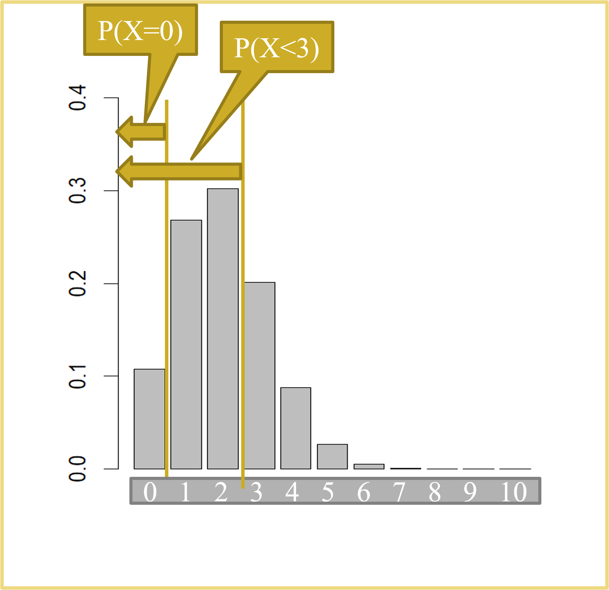
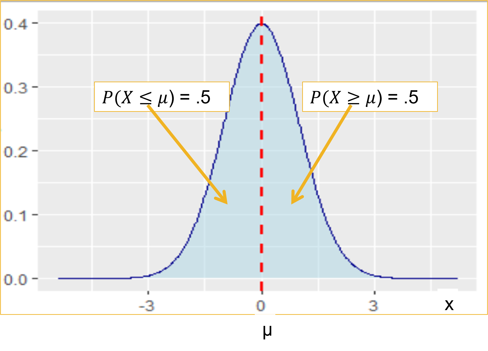
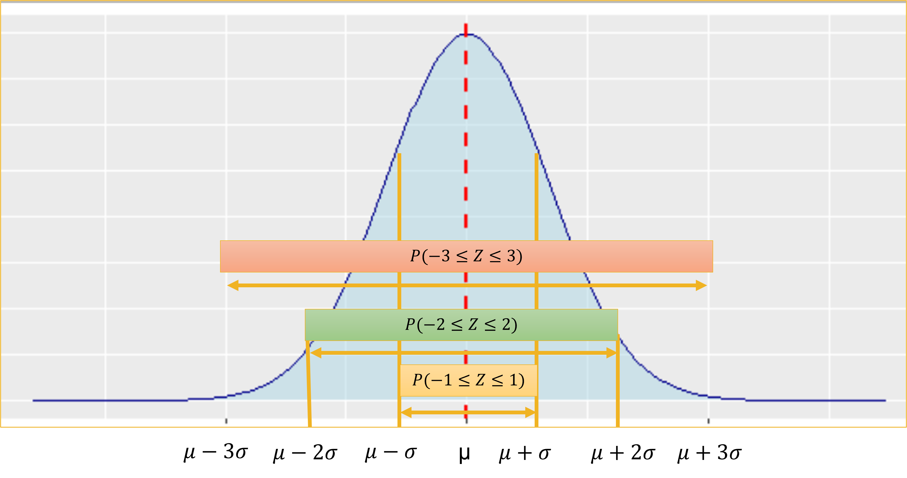
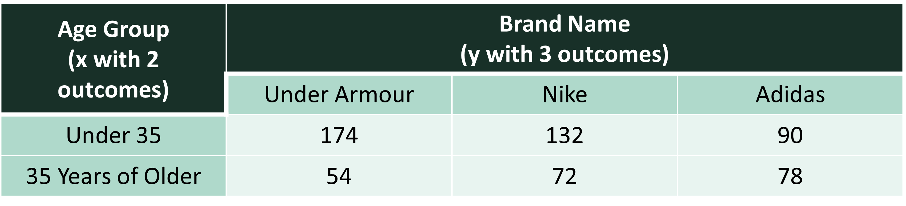
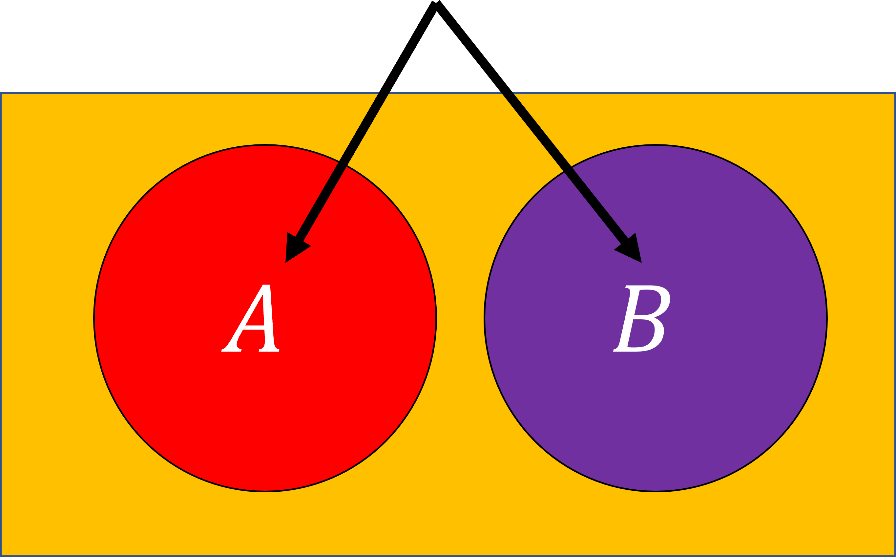
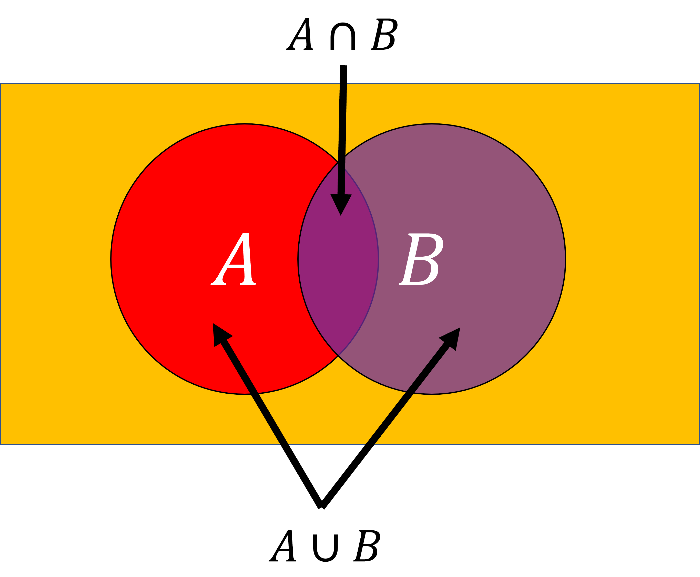
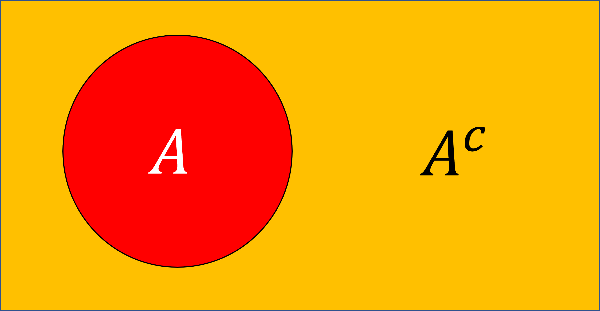
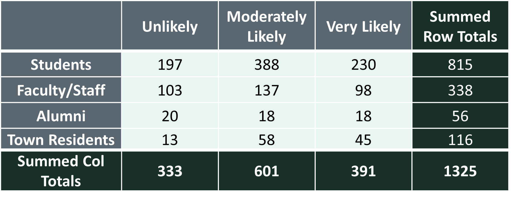
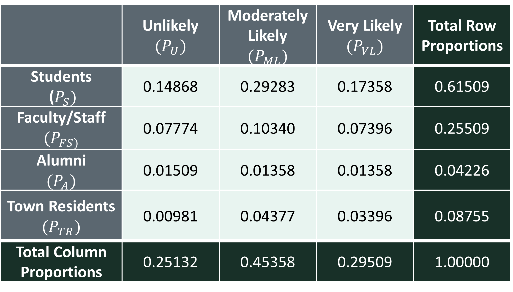

```{r setup, include=FALSE}
knitr::opts_chunk$set(echo=TRUE, tidy.opts = list(width.cutoff = 70), tidy = TRUE, message=FALSE, warning=FALSE)
```

This lesson covers the foundations of probability and statistical inference, moving from how probability is calculated for individual outcomes to how it is used to draw conclusions about populations. It is the bridge between descriptive statistics — summarizing what you have — and inferential statistics — making claims about what you do not have.

We begin with **probability distributions and random variables**. A probability distribution assigns a probability to every possible value of a variable. Discrete variables take countable values and are modeled with the **binomial distribution**, which calculates the probability of a specific number of successes in a fixed number of independent trials. Two key R functions — `dbinom()` for exact probabilities and `pbinom()` for cumulative probabilities — do the calculation once you know the number of trials and the probability of success.

Continuous variables require a different approach. For these, we use the **normal distribution** — the bell-shaped curve that underlies most of statistical inference. We find probabilities using `pnorm()` and work backwards from a probability to a value using `qnorm()`. We also cover **z-scores**, which standardize a value by expressing it as the number of standard deviations it lies from the mean, allowing observations from different distributions to be compared on a common scale. The **Central Limit Theorem (CLT)** is the most important theoretical result in this lesson: it tells us that the sampling distribution of the sample mean approaches normality as sample size grows, regardless of the shape of the underlying population — as long as $n \geq 30$. This is what allows us to use normal-distribution tools even when the raw data is not itself normal. The **standard error** (SE = $sd/\sqrt{n}$) measures how much the sample mean varies from sample to sample, and replaces the standard deviation in probability calculations involving sample means rather than individual observations.

When a variable is not normally distributed, we attempt **transformations** — square root, log, cube root, or reciprocal — to reshape it into approximate normality so that the normal distribution tools still apply. Some variables resist all transformations, which has its own practical implication.

The second half of the lesson moves to **contingency tables**, which organize frequency data for two categorical variables and enable the calculation of joint, marginal, and conditional probabilities. We then conduct two **chi-squared tests** — the test of independence (do two categorical variables have a statistically significant association?) and the goodness of fit test (do observed proportions match a set of expected proportions?). Both tests compare observed counts to expected counts and produce a chi-squared statistic and p-value that we interpret the same way as any other hypothesis test.

By the end of this lesson, you should be able to calculate binomial and normal probabilities in R, apply the CLT to problems involving sample means and proportions, attempt and evaluate variable transformations, compute probabilities from contingency tables, and conduct both chi-squared tests. Work through every code example in your own R script alongside the reading.

### At a Glance

-   In order to succeed in this lesson, you will need to learn the basic rules behind random events and how to calculate probability using distributions. We focus on the binomial distribution for discrete outcomes and the normal distribution for continuous data, and in doing so move from descriptive statistics to inferential statistics. You will also learn how the Central Limit Theorem justifies the use of normal-distribution tools even with non-normal populations, how to transform skewed variables, how to calculate probability from contingency tables, and how to conduct chi-squared hypothesis tests for two categorical variables.

### Lesson Objectives

-   Define probability distributions and distinguish discrete from continuous random variables.
-   Calculate exact and cumulative probabilities using `dbinom()` and `pbinom()`.
-   Calculate probabilities and quantiles for normally distributed variables using `pnorm()` and `qnorm()`.
-   Compute and interpret z-scores.
-   Apply the Central Limit Theorem to problems involving sample means and sample proportions.
-   Distinguish between standard deviation and standard error and use each in the correct context.
-   Attempt and evaluate variable transformations for non-normal data.
-   Calculate joint, marginal, and conditional probabilities from a contingency table.
-   Conduct and interpret a chi-squared test of independence.
-   Conduct and interpret a chi-squared goodness of fit test.

### Consider While Reading

-   As you work through this lesson, pay attention to two transitions: first, from discrete probability (binomial) to continuous probability (normal), and second, from single-variable probability to two-variable probability (contingency tables and chi-squared tests). Each section builds on the same core logic — comparing what we observe to what probability theory predicts.
-   The Central Limit Theorem is the most important concept in this lesson. Understanding why the sampling distribution of the mean is approximately normal — even when the population is not — is what justifies nearly all of the inferential statistics you will use going forward, including t-tests, ANOVA, and regression.
-   When you reach the chi-squared section, note that the test statistic and p-value interpretation follow the same three-step framework you will use throughout the course: specify hypotheses, compute the statistic, interpret the p-value against alpha. This makes the chi-squared test a natural first hypothesis test to practice on.

## Some Common Statistics Terms

-   *Statistical inference* is one of the foundational ideas in statistics. Since it is often impossible to collect information on every single person or organization, scientists take samples of people or organizations and examine the observations in the sample. Inferential statistics are then used to take the information from the sample and use it to understand (or infer to) the population. In conducting probability calculations, we can make inferences to understand the probability associated with the population.

-   Researchers often work with *samples* instead of *populations*, where samples are subsets of different populations. In the case of the state data on opioid policies that your book discusses, all states are included, so this is the entire population of states. Statisticians sample from the population to understand the probabilities associated with it.

-   When selecting a sample, we hope to select a *representative sample* from the population, and use properties of the normal distribution to understand what is likely happening in the whole population. A *normal distribution* is one of the most fundamental distributions to use in calculating probabilities. We will look at both discrete and normal distributions, but also seek to understand how a normal distribution and the central limit theorem can help us shed light on many statistics we are inferring.

## Probability Distribution

-   A probability distribution is the numeric or visual representation of the set of probabilities that each value or range of values of a variable occurs.

-   Two important characteristics:

    1.  The probability of each real value of some variable is non-negative. Instead, it is either 0 or positive. More specifically, the probability of each value x is a value between 0 and 1. Or equivalently. $0 <= P(X=x) <= 1$.
    2.  The sum of the probabilities of all possible values of a variable is 1.

-   Consider the probability distribution that reflects the number of credit cards that a bank's customers carry.

```{r, echo=FALSE}
NumberOfCards <- c(0,1,2,3,"4 or more")
Percentage <- c("2.5%", "9.8%","16.6%", "16.5%", "54.6")
data.frame(NumberOfCards, Percentage)
```

-   Given the characteristics of a probability distribution, we can ask whether this is a valid probability distribution.

    -   Yes, because $0 <= P(X=x) <= 1$ and the sum of the percentages is 1.

    ```{r}
    .025 + .098 + .166 + .165 + .546
    ```

-   Second, with the information in the table, we can calculate a number of things, like the probability that a reader carries no credit cards.

    -   $P(X=0)= .025$

-   The probability that a reader carries fewer than two credit cards.

    -   $P(X<2)= P(X=0)+P(X=1)= .025 +.098= .123$

-   The probability that a reader carries at least two credit cards.

    -   $P(X>=2) = P(X=2)+P(X=3)+P(X=4)  = .166+.165+.546= .877$
    -   Or $1-P(X<2) = 1-.123 = .877$

-   Because of the 2 characteristics of a probability distribution, sometimes there are a couple ways to calculate the correct answer, like we did above with either calculating probabilities associated with above a value, or beneath and equal to a value knowing that the total sum of all probabilities is 1.

-   When you produce a percentage, you multiple the calculated probability by 100, so instead of finding a value between 0 and 1, you find a percentage between 0% and 100%. This means that if you use the pnorm function to calculate a probability, you can multiple that probability by 100 to get the percentage.

-   When you want to convert a probability to an expected count, multiply the probability by the sample size (n).

### Random Variables

-   A Random Variable is a function that assigns numerical values to the outcomes of a random experiment.

-   Denoted by uppercase letters (e.g., $X$ ).

-   Corresponding values of the random variable: $x_1,x_2, x_3,...$

-   Random variables may be classified as:

    1.  Discrete - The random variable assumes a countable number of distinct values.

    -   Discrete probability distributions show probabilities for variables that can only have certain values, which includes categorical variables and variables that must be measured in whole numbers like number of people texting during class.
    -   The Binomial Distribution is a discrete distribution that evaluates the probability of a "yes" or "no" outcome occurring over a given number of trials

    2.  Continuous - The random variable is characterized by (infinitely) uncountable values within any interval.

    -   Continuous probability distributions show probabilities for values, or ranges of values, of a continuous variable that can take any value in some range.
    -   The Normal Distribution is a continuous distribution and is the most important of all probability distributions. Its graph is bell-shaped and this bell-shaped curve is used in almost all disciplines.

-   For example, consider an experiment in which two shirts are selected from the production line and each is either defective (D) or non-defective (N).

    -   Since only 2 shirts are selected, here is the sample space, which are all the available options: ${(D,D), (D,N), (N,D), (N,N)}$
    -   The random variable X is the number of defective shirts.
    -   The possible number of defective shirts is the set $X={0,1,2}$,
    -   Since these are the only countable number of possible outcomes, this is a discrete random variable.

### Useful Commands for Random Variables

-   set.seed() command is useful when conducting random sampling since it will result in the same sample to be taken each time the code is run, which makes sampling more reproducible.
    -   We briefly looked at this when making our density plot with random normal data using the rnorm() command.
-   sample_n() command can be used to take a sample. The arguments for sample_n() are size = which is where to put the size of the sample to take and replace = which is where you choose whether or not you want R to sample with replacement (replacing each value into the population after selection, so that it could be selected again) or without replacement (leaving a value out of the sampling after selection).
-   Let's look at an example using the pdmp_2017.csv file.

```{r, message=FALSE, warning=FALSE}
#Load tidyverse
library(tidyverse)
```

-   Below, I am using the read.csv() command to read in the data set and use strings as factors = TRUE to ensure character variables are coerced as factors. This helps bypass the need to coerce later on. We do need to note that it will change all string variables to factors with the TRUE parameter.

```{r, tidy=FALSE}
opioidpolicy  <- read.csv("data/pdmp_2017.csv", stringsAsFactors = TRUE) 
# Set a starting value for sampling
set.seed(3)
# Sample 25 states and save as sample and check summary
Sample <- sample_n(opioidpolicy, size=25, replace=FALSE) 
summary(Sample$Required.Use.of.Prescription.Drug.Monitoring.Programs)
```

-   You should have the same answers as I do above (8 No's, and 17 Yes's) because we set the same seed. If you don't, I mention the reason below at the end of this short sampling experiment.

```{r, tidy=FALSE}
# Sample another 25 states and check summary.
# Note the different answer than above. 
Sample <- sample_n(opioidpolicy, size=25, replace=FALSE) 
summary(Sample$Required.Use.of.Prescription.Drug.Monitoring.Programs)
```

```{r, tidy=FALSE}
# Sample another 25 states and check summary
# Again, note the differences in numbers each time. 
Sample <- sample_n(opioidpolicy, size=25, replace=FALSE) 
summary(Sample$Required.Use.of.Prescription.Drug.Monitoring.Programs)
```

```{r, tidy=FALSE}
# Sample another 25 states and check summary using same set seed as our first run (3). 
set.seed(3)
Sample <- sample_n(opioidpolicy, size=25, replace=FALSE) 
summary(Sample$Required.Use.of.Prescription.Drug.Monitoring.Programs)
```

-   Again, you should have the same numbers as I do above, and these numbers should be equivalent to our first run (8 No's, and 17 Yes's). If you don't have the same numbers as me is possible that your random number generator is on a different setting. Post R version 3.6.0 or later, we should be on Rejection sample.kind. The next line sets the RNGkind().

```{r, tidy=FALSE}
RNGkind(sample.kind = "Rejection")
# Run the same code again as above for replication results
set.seed(3)
Sample <- sample_n(opioidpolicy, size=25, replace=FALSE) 
summary(Sample$Required.Use.of.Prescription.Drug.Monitoring.Programs)
```

### Summary Measures for a Random Variable

#### Expected Value

-   We can calculate the expected value, or value we think is going to occur based on the type of distribution.
    -   Expected value is also known as the population mean $\mu$, and is the weighted average of all possible values of $X$.
    -   More specifically, $E(X)$ is the long-run average value of the random variable over infinitely many independent repetitions of an experiment.
    -   For a discrete random variable $X$ with values $x_1, x_2, x_3, ...$ that occur with probabilities $P(X=x_i)$, the expected value of $X$ is the probability weighted average of the values. In the case of one random variable, that means: $E(X) = \mu = \sum{x_iP(X=x_i)}$

#### Variance

-   Variance of a random variable is the average of the squared differences from the mean.
    -   For a discrete random variable $X$ with values $x_1, x_2, x_3, ...$ that occur with probabilities $P(X=x_i)$, the variance is defined as: $Var(X) = \sigma^2 = \sum{(x_i-\mu)^2*P(X=x_i)}$

#### Standard Deviation

-   Standard deviation is consistently the square root of the variance. $SD(X) = \sigma = \sqrt{\sigma^2} = \sqrt{\sum{(x_i-\mu)^2*P(X=x_i)}}$

### Example of Summary Measures for a Random Variable

```{r}
defectdata <- read.csv("data/defects.csv")
head(defectdata)
str(defectdata)

#Calculate the probability of the defective pixels per monitor for each member of the sample space [0, 1, 2, 3, 4, 5, 6, 7].
sampleSpace <- 0:7
frequency <- table(defectdata$NumDefects); frequency
proportions <- prop.table(frequency); proportions
cumulativeproportions <- cumsum(prop.table(proportions)); cumulativeproportions

```

-   Once we calculate vectors for the frequency table, we bind them together and transpose them into columns and combine them into a data frame.

```{r}

Defects <- t(rbind(sampleSpace, frequency, proportions, cumulativeproportions))
Defects <- as.data.frame(Defects)
str(Defects)
```

-   Next, we calculate summary statistics based on the formulas above.

```{r}

#How many defects should the manufacturer expect per monitor? E(X)?
ExDefects <- sum(Defects$sampleSpace * Defects$proportions)
ExDefects #3.714

#Variance of the number of defects per monitor?
deviations <- (Defects$sampleSpace - ExDefects) ^ 2 * Defects$proportions; deviations

varDefects <- sum(deviations); varDefects #4.876204

#Standard deviation of the number of defects per monitor?
stDefects <- sqrt(varDefects)
stDefects  #2.208213
```

# The Binomial Distribution

-   The binomial distribution is a discrete probability distribution and applies to probability for binary categorical variables with specific characteristics.

-   Properties of a binomial random variable:

    -   A variable is measured in the same way $n$ times, signifying that $n$ is the sample size.
    -   There are only two possible values of the variable, often called “success” and “failure”
    -   Each observed value is independent of the others.
    -   The probability of “success”, $p$, and the probability of "failure", $1-p$, is the same for each observation, so each time the trial is repeated, the probabilities of success and failure remain the same.
    -   The random variable is the number of successes in $n$ measurements.

## Summary Measures for a Binomial Random Variable

-   Expected value, variance, and standard deviation were introduced and defined in section 2. We can take derivatives of the formulas to simplify our calculations given knowing a $n$ and $p$.

-   The formula for the expected value of a binomial random variable expands from $\sum{x_iP(X=x_i)}$ to $= n*p$.

-   The variance of a binomial random variable expands from $\sum{(x_i-\mu)^2*P(X=x_i)}$ to $= n*p*(1-p)$

-   The standard deviation a binomial random variable expands from $\sqrt{\sum{(x_i-\mu)^2*P(X=x_i)}}$ to $= \sqrt{np*(1-p)}$

-   Example summary statistics of a binomial random variable

    -   A current WM student has a career free-throw percentage of 89.4%. Suppose he shoots six free throws in tonight’s game. What is the expected number of free throws that he will make?

    ```{r}
    ex <- 6*0.894; ex
    varx <- 6 * .894 * (1-.894); varx
    sdx <- sqrt(varx); sdx
    ```

-   If the student shoots 6 free throws and typically makes 89.4% of them, we can multiply those two values together for the expected value, 5.364. We also find that this data has a variance of .568584 and standard deviation of .754051.

## The Probability Mass Function

-   *The Probability Mass Function* for a discrete random variable X is a list of the values of X with the associated probabilities, that is, the list of all possible pairs: $(X, P(X=x))$
    -   A probability mass function computes the probability that an exact number of successes happens for a discrete random variable, given $n$ and $p$ defined above.
    -   Distribution of probabilities of different numbers of successes.
    -   A probability mass function is used to describe discrete random variables in a binomial distribution.
    -   Every random variable is associated with a probability distribution that describes the variable completely.
    -   Uses dbinom() command to calculate in R.
-   Example using the probability mass function: Approximately 20% of U.S. workers are afraid that they will never be able to retire. Suppose 10 workers are randomly selected. What is the probability that none of the workers is afraid that they will never be able to retire?
-   Again, we can use the dbinom() command to calculate this in R given x = none or 0, size = 10 workers, or just 10, and prob = 20% or .2. We write this command as listed below.\

```{r}
#P(X=0)
dbinom(0, 10, .2)
```

-   The answer suggests that there is a .107 or 10.737% chance that no workers think they won't be able to retire.

## Cumulative Distribution Function

-   Another way to look at a probability distribution is to examine its cumulative probability distribution. Here, you can determine the probability of getting some range of values, which is often more useful than finding the probability of one specific number of successes.
-   A cumulative distribution function may be used to describe either discrete or continuous random variables.
    -   The cumulative distribution function for X is defined as: $P(X<=x)$
    -   The less than and equal to sign is the standard way to look at the cumulative distribution function. You can calculate \>, \>=, \< from $P(X<=x)$ given the two rules of probability discussed above.
        1.  $0 <= P(X=x) <= 1$
        2.  The sum of the probabilities of all possible values of a variable is 1
    -   Uses pbinom() command to calculate in R with the default value of lower.tail = TRUE is for n or fewer successes
    -   Can change lower.tail parameter to lower.tail = FALSE is computing higher than n rather than n or higher.
-   Example using the cumulative distribution function, Approximately 20% of U.S. workers are afraid that they will never be able to retire. Suppose 10 workers are randomly selected. What is the probability that less than 3 of the workers are afraid that they will never be able to retire?
-   We can use the pbinom() command to calculate this in R given q = less than 3 or \<=2, size = 10 workers, or just 10, and prob = 20% or .2. We write this command as listed below.

```{r}
# P(X<3) or P(X<=2)
pbinom(2, 10, .2)
```

-   Or likewise, we could use multiple dbinom() commands to get individual probabilities and add them up. This statement is much longer, but does give you the same answer. Examine the figure below to see why.\

```{r}
dbinom(0, 10, .2) + dbinom(1, 10, .2) + dbinom(2, 10, .2)
```



## Variations in binom() Command

-   In order to find $P(X = 70)$ given 100 trials and .68 probability of success, we enter:

```{r}
#P(X = 70)
dbinom(70, 100, 0.68)
```

-   In order to find $P(X <= 70)$, given 100 trials and .68 probability of success, we enter:

```{r}
#P(X <= 70)
pbinom(70, 100, 0.68)
```

-   In order to find $P(X < 70)$, given 100 trials and .68 probability of success, we enter:

```{r}
#P(X < 70)
pbinom(69, 100, 0.68)
```

-   In order to find $P(X > 70)$, given 100 trials and .68 probability of success, we enter:

```{r}
#P(X > 70)
pbinom(70, 100, 0.68, lower.tail = FALSE)
```

-   In order to find $P(X >= 70)$, given 100 trials and .68 probability of success, we enter:

```{r}
#P(X >= 70)
pbinom(69, 100, 0.68, lower.tail = FALSE) #Or
1 - pbinom(69, 100, 0.68)
```

-   Examples of binomial distribution calculations in a word problems: A current WM student has a career free-throw percentage of 90.3%. Suppose he shoots five free throws in tonight’s game. What is the probability that he makes all five free throws?

```{r}
#P(X=5)
dbinom(5, 5, .903)
```

-   What is the percentage that he makes all five free throws?

```{r}
#P(X=5)
dbinom(5, 5, .903)*100 #60.04%
```

-   A current WM student has a career free-throw percentage of 80.5%. Suppose he shoots six free throws in tonight’s game. What is the probability that he makes five or more of his free throws?

```{r}
#P(X>=5) 
pbinom(4,6, .805, lower.tail = FALSE)
#Or 
dbinom(5, 6, .805) + dbinom(6, 6, .805)
```

-   What is the percentage that he makes five or more of his free throws?

```{r}
#P(X>=5) 
pbinom(4,6, .805, lower.tail = FALSE)* 100 # 66.76%
```

-   Thirty five percent of consumers with credit cards carry balances from month to month. Six consumers with credit cards are randomly selected. What is the probability that fewer than two consumers carry a credit card balance?

```{r}
#P(X<=2)
dbinom(0,6,.35) + dbinom(1,6,.35) 
#Or
pbinom(1,6,.35)
```

-   What is the percentage that fewer than two consumers carry a credit card balance?

```{r}
pbinom(1,6,.35)*100 #31.9%
```

## Follow Up Binomial Example

For a discrete binomial distribution with a sample size of 4 (i.e., the number of trials is 4), calculate the probability of each possible outcome (ranging from 0 to 4 successful outcomes) using a probability of success $p=0.3$.

```{r, echo=FALSE}
size <- 4  # number of trials
p <- 0.3   # probability of success
outcomes <- 0:size
probabilities <- dbinom(outcomes, size = size, prob = p)
data <- data.frame(outcomes, probabilities)
ggplot(data, aes(x = factor(outcomes), y = probabilities)) +
     geom_bar(stat = "identity", fill = "#789F90", color = "black") +
       geom_text(aes(label = round(probabilities, 3)), vjust = -0.5) + 
     labs(x = "Number of Successes", y = "Probability") +
     ggtitle("Binomial Distribution (n=4, p=0.3)") +
     theme_minimal()

```

```{r}
##dbinom (X=x) given size at 4 and p=.3
#P(X=0) = 0.2401
dbinom(0, 4, .3) 
#P(X=1) = 0.4116
dbinom(1, 4, .3) 
#P(X=2) = 0.2646
dbinom(2, 4, .3) 
#P(X=3) = 0.0756
dbinom(3, 4, .3) 
#P(X=4) = 0.0081
dbinom(4, 4, .3) 
```

-   Calculate the probability when the value is less than or equal to 2. All calculations below give same answer.
-   To confirm accuracy, sum the individual probabilities you calculated using dbinom() above. This total should match the value obtained using the pbinom() function in R, which gives the cumulative probability up to a specified number of successes.
-   Less than or equal to is the default state of the function in which we use the exact number given.

```{r}
###P(X<=2) =0.9163
pbinom(2, 4, .3) 
dbinom(0, 4, .3) + dbinom(1, 4, .3) + dbinom(2, 4, .3)
0.2401 + 0.4116 + 0.2646
```

-   Calculate the probability when the value is less than 2. All calculations below give same answer.
-   To calculate less than instead of less than or equal to, we go down 1 unit (or 1 integer) in our pbinom() function, i.e., using 1 instead of 2.

```{r}
##P(X<2) = 0.6517
pbinom(1, 4, .3) 
dbinom(0, 4, .3) + dbinom(1, 4, .3)
0.2401 + 0.4116
```

-   Calculate the probability when the value is greater than 2. All calculations below give same answer.
-   We use 2 inside the function because greater than is the opposite tail to less than or equal to. This means that the numbers should be the same as the numbers in a less than or equal to problem, but we need to include the lower.tail parameter at False.

```{r}
##P(X>2) = 0.0837
1-pbinom(2, 4, .3) 
pbinom(2, 4, .3, lower.tail = F)
dbinom(3, 4, .3) + dbinom(4, 4, .3) 
0.0756 + 0.0081
```

-   Calculate the probability when the value is greater than or equal to 2.
-   We use 1 inside the function because greater than or equal to is the opposite tail to less than. This means that the numbers should be the same as the numbers in a less than problem, but we need to include the lower.tail parameter at False.

```{r}
##P(X>=2) = 0.3483
1-pbinom(1, 4, .3) 
pbinom(1, 4, .3, lower.tail = FALSE)
dbinom(2, 4, .3) + dbinom(3, 4, .3) + dbinom(4, 4, .3) 
0.2646 + 0.0756 + 0.0081
```

------------------------------------------------------------------------

The binomial distribution works for discrete outcomes — a fixed number of trials each resulting in success or failure. Most real-world measurements, however, produce continuous data: heights, test scores, battery life, salary. For these, we use the continuous normal distribution, which introduces a different set of probability tools built around the area under the curve.

# The Continuous Distribution

-   Properties of a Continuous Random Variable
    -   The random variable is characterized by (infinitely) uncountable values within any interval.
    -   Because of the definition *infinite uncountable*, When computing probabilities for a continuous random variable, $P(X=x)=0$
    -   Therefore, we cannot assign a nonzero probability to each infinitely uncountable value and still have the probabilities sum to one.
    -   Thus, $P(X=a)$ and $P(X=b)$ both equal zero, and the following holds for continuous random variables: $P(a <= X <= b) = P(a < X < b) = P(a <= X < b) = P(a < X <= b)$.
-   This is important to consider and compare to discrete probability.

## Density Functions for Continuous Distributions

### Probability Density Function

-   The Probability Density Function is used to describe continuous random variables.
-   Probability Density Function $f(x)$ of a continuous random variable X describes the relative likelihood that $X$ assumes a value within a given interval (e.g., $P(a<=X<=b)$, where $f(x)>=0$ for all possible values of $X$ and the area under $f(x)$ over all values of $x$ equals one.

### Cumulative Density Function

-   The Cumulative Density Function $F(x)$ of a continuous random variable X suggests that for any value x of the random variable X, the cumulative distribution function $F(x)$ is computed as, $F(x) = P(X <= x)$ as a result, $P(a<=X<=b) = F(b)- F(a)$.

-   The goal of cumulative distributions is to find the area under the curve. The pnorm() function computes the probability at point q to find the area under the curve.

    -   Three arguments of the pnorm() command:

    1.  q is the value of interest;
    2.  The mean (mean);
    3.  The standard deviation (sd);

-   Also an optional lower.tail parameter, which is defaulted to TRUE signifying \< or \<=.

-   We can also work backwards to find a value given a probability. The qnorm() function computes the quantile value at p to find the value associated with a probability.

    -   Three arguments of the qnorm() command:

    1.  p is the cumulative probability;
    2.  The mean (mean);
    3.  The standard deviation (sd);

-   Also an optional lower.tail parameter, which is defaulted to TRUE signifying \< or \<=.

## The Normal Distribution

-   The normal distribution serves as the cornerstone of statistical inference.

-   Data is symmetric about its mean.

-   Mean=Median=Mode.

-   The distribution is bell-shaped.

-   The distribution is asymptotic, which means that the tails get closer and closer to the horizontal axis, but never touch it.

-   Closely approximates the probability distribution of a wide range of random variables, such as the following:

    -   Heights and weights of newborn babies.
    -   Scores on SAT.
    -   Cumulative debt of college graduates.

-   The normal distribution is completely described by two parameters: population mean $\mu$, which describes the central location of the distribution,and population variance $\sigma^2$, which describes the dispersion of the distribution.



-   A special case of the normal distribution:
    -   Mean is equal to zero (E(Z) = 0).
    -   Standard deviation is equal to one (SD(Z) = 1).

```{r}
# Solving the figure above using the pnorm() command in R. 
#P(Z<=0)
pnorm(q=0,mean=0,sd=1)
# Or the following because the default value of the mean and sd are 0 and 1. 
pnorm(0)
```

-   If we assume a mean of 0 and a standard deviation of 1, and we are looking for the probability when the mean is 0, we will get a .5 probability or 50 percent (.5\*100). This is because the curve is normal with identical sides.

-   We can also solve this backwards. Below is the qnorm() command, which solves the figure above looking at probability instead of values.

```{r}
#P(Z >= z) = .5
qnorm(.5, 0, 1)
#Or 
qnorm(.5)
```

## Empirical Rule

-   Chevyshev’s Theorem states that at least $1 - 1/z^2$% of the data lies between $z$ standard deviations from the mean. This result does not depend on the shape of the distribution.

-   With a normal distribution, we can assume approximately the following under the empirical rule:

    -   68% of values within one SD of the mean;
    -   95% of values within two SD of the mean;
    -   99.7% of values within three SD of the mean.



## Calculating z-scores

-   A z-score allows description and comparison of where an observation falls compared to the other observations for a normally distributed variable.

-   A z-score is calculated as the number of standard deviations an observation is away from the mean.

-   A normally distributed variable can be used to create z-scores.

-   Purpose: This formula calculates the z-score of an individual data point.

-   Interpretation: It tells us how many standard deviations a specific value $x$ is from the mean of the dataset.

-   The $x_i$ represents the value of variable $x$ for a single observation, $\mu_x$ is the mean of the $x$ variable, $\sigma_x$ is the standard deviation of the $x$ variable. So, $z_i$ is the difference between the observation value and the mean value for a variable and is converted by the denominator into standard deviations. The final z-score for an observation is the number of standard deviations it is from the mean. $$z_i = (x_i - \mu_x)/\sigma_x$$.

-   A z score or z value specifies by how many standard deviations the corresponding x value falls above (z \> 0) or below (z \< 0) the mean.

    -   A positive z indicates by how many standard deviations the corresponding x lies above mean.
    -   A zero z indicates that the corresponding x equals mean.
    -   A negative z indicates by how many standard deviations the corresponding x lies below mean.

-   Example of a z-score calculation: Scores on a management aptitude exam are normally distributed with a mean of 72 and a standard deviation of 8.

    -   What is the probability that a randomly selected manager will score above 60?
    -   First, we could transform the random variable X to Z score using the transformation formula:

```{r}
(60-72)/8 
```

-   Then, you can calculate the probability using the standard normal distribution, which has a mean of 0 and a standard deviation of 1.

```{r}
# P(Z > -1.5)
pnorm(-1.5, 0, 1, lower.tail=FALSE) 
# Or similarly, we could use the line below because of the default values associated with the pnorm() command
pnorm(-1.5, lower.tail = FALSE)
```

-   Also, because R handles the standard normal transformation on our behalf with its inclusion of parameters, we can use the pnorm() command with the mean and standard deviation provided above to calculate the probability in less steps.

```{r}
# Note the same answer as above.
# P(X > 60)
pnorm(60, 72, 8, lower.tail = FALSE)
```

-   To answer the question, there is a 0.933 probability or a 93.3% chance that a randomly selected manager will score above a 60 on the managerial aptitude exam.

-   In order to get the percentage in R, we simply multiply the answer by 100.

```{r}
pnorm(60, 72, 8, lower.tail = FALSE)*100
```

## Finding Utility in Calculating Probability

-   Example using pnorm() with Word Problems: Suppose the life of a particular brand of laptop battery is normally distributed with a mean of 6 hours and a standard deviation of 0.9 hours. Use R to calculate the probability that the battery will last more than 8 hours before running out of power and document that probability below.

```{r}
# P(X > 8)
pnorm(8, 6, .9, lower.tail = FALSE)
```

-   The time for a professor to grade a student’s homework in business statistics is normally distributed with a mean of 15 minutes and a standard deviation of 3.5 minutes. What is the probability that randomly selected homework will require less than 16 minutes to grade?

```{r}
# P(X < 16)
pnorm(16, 15, 3.5)
```

-   What percentage of randomly selected homeworks will require less than 16 minutes to grade?

```{r}
pnorm(16, 15, 3.5)*100
```

## Finding Probability Between Two Values

-   We mentioned above that in order to find probability between 2 values a and b, we could use the following equation: $P(a<=X<=b) = F(b)- F(a)$.
-   To use this formula, find P(−1.52 \<= Z \<= 1.96). This would equal P(Z\<=1.96)−P(Z\<=−1.52) given a standard normal random variable Z we get the commands below.

```{r}
# P(Z <= 1.96) - P(Z <= -1.52)
pnorm(1.96, 0, 1) - pnorm(-1.52, 0, 1)
```

## Finding Value Given a Probability

-   We use R’s pnorm() and qnorm() commands to solve problems associated with the normal distribution.
-   If we want to find a particular x value for a given cumulative probability (p), then we enter “qnorm(p, μ, σ)”.

```{r}
#P(X > x) = 0.10
qnorm(0.90, 7.49, 6.41)
#or
qnorm(.1, 7.49, 6.41, lower.tail = FALSE)
```

## Finding Utility in Calculating Values from Probability

-   Example of qnorm() with Word Problems: The stock price of a particular asset has a mean and standard deviation of \$58.50 and \$8.25, respectively. What is the 95th percentile of this stock price?

```{r}
# P(X<=x) =.95
qnorm(.95, 58.5, 8.25)
```

-   The salary of teachers in a particular school district is normally distributed with a mean of \$50,000 and a standard deviation of \$2,500. Due to budget limitations, it has been decided that the teachers who are in the top 2.5% of the salaries would not get a raise. What is the salary level that divides the teachers into one group that gets a raise and one that does not?

```{r}
# P(X>=x) =.025
qnorm(.025, 50000, 2500, lower.tail = FALSE)
```

-   You are planning a May camping trip to a National Park in Alaska and want to make sure your sleeping bag is warm enough. The average low temperature in the park for May follows a normal distribution with a mean of 32°F and a standard deviation of 8°F. Above what temperature must the sleeping bag be suited such that the temperature will be too cold only 5% of the time?

```{r}
# P(X<=x) =.05
qnorm(.05, 32, 8)
```

## Central Limit Theorem (CLT)

-   The Central Limit Theorem (CLT) is one of the most important concepts in statistics because it allows us to use the normal distribution to make inferences about populations — even when the underlying data is not normally distributed. In other words, as long as our sample is large enough (generally n ≥ 30), we can assume that the distribution of sample means will be approximately normal, regardless of the shape of the original data.

-   CLT refers to the fact that, in many situations, when independent random variables are summed up, their properly normalized sum tends toward a normal distribution even if the original variables themselves are not normally distributed. Therefore, CLT suggests that for any population X with expected value $\mu$ and standard deviation $\sigma$ the sampling distribution of $X$ will be approximately normal if the sample size $n$ is sufficiently large.

-   The CLT tells us that, regardless of the original distribution of a population, the sampling distribution of the sample mean approaches a normal distribution as the sample size gets larger. We use the CLT when we want to estimate population parameters (like the mean) from sample data and apply techniques that rely on normality, such as confidence intervals and hypothesis testing. This allows us to make inferences about the population using the normal distribution even when the population itself isn’t normally distributed.

-   The Central Limit Theorem (CLT) holds true for continuous variables, regardless of whether they are normally distributed or not. Generally, the normal distribution approximation is justified when the sample size is sufficiently large, typically $n≥30$. If the sample means are approximately normal, we can transform them into a standard normal form. The standard deviation of the sample means (also called the standard error) can be estimated using the population standard deviation and the sample size that makes up the distribution.

-   If $\bar{X}$ is approximately normal, then we can transform it using an updated formula of the z-score formula with standard error $𝑍=(𝑋- \mu)/(\sigma/\sqrt(n))$

-   Next, we want to create an experiment where we simulate why the CLT holds true. The rnorm() command pulls random data from a normal distribution. However, even when the sample is small, it can appear not normal - even though it is from a normal distribution.

```{r, fig.alt="Histogram rnorm 10 data points"}
set.seed(1)
#Sample of n = 10
hist(rnorm(10), xlim=c(-3,3))
```

-   If we increase the sample size, we should all see a nice normal bell shape distribution like the one below.

```{r, fig.alt="Histogram rnorm 1000 data points"}
set.seed(1)
#Sample of n = 1000
hist(rnorm(1000), xlim=c(-3,3))
```

-   The x limits are set from -3 to 3 because a normal distribution follows the empirical rule discussed above (almost all data is within 3 sd of the mean).

-   Relating this to the CLT, the CLT states that the sum or mean of a large number of independent observations from the same underlying distribution has an approximate normal distribution. If we were to take a 6 sided dice, in any given roll, we would expect the average. This means that the expected value E(X) will be the mean as discussed above.

```{r}
# Creating a sample
d<-1:6
# Calculating the expected value E(X) which equals the population mean
mean(d) #3.5
```

-   Rolling a dice only one time would not give us enough data to assume a normal distribution under the CLT. However, if we were to roll a higher number of times, and repeat that experiment $n$ number of times, we would expect that as $n$ grows, we would approach a normal distribution.

```{r, fig.alt="Histogram rnorm 1000 data points sampling dice roll"}
# First, let's  roll the dice 1000 times.
# We would expect the average like shown below.
set.seed(1)
NumberofRolls <- 1000
x<- sample(d, NumberofRolls, replace = TRUE)
# The mean(x) is 3.514 and our mean of 1 through 6 is 3.5. 
# We estimated about the average. 
mean(x)
hist(x)
```

-   Next, if we repeat the dice roll experiment that we ran 1,000 times above, we can see the normal distribution start to take shape. The example below has a loop for simulation purposes. This loop rolls x with allowed values 1 to 6 - 1,000 times - and then does that 100 times. The more we do this, the closer we get to approximating the mean (3.5) as our histogram starts to get more narrow.

```{r, fig.alt="Histogram rnorm 100 loops of 1000 dice rolls"}
set.seed(1)
t<-0
for(i in 1:100) {
NumberofRolls <- 1000
x<- sample(d, NumberofRolls, replace = TRUE)
t[i]<-mean(x)
} 
hist(t, xlim=c(3,4)) 
```

-   Important to note that for any sample size $n$, the sampling distribution of $\bar{x}$ is normal if the population X from which the sample is drawn is normally distributed, meaning, there is no need to use CLT.

## Standard Error (SE)

-   The $SE$ is the standard deviation of the sampling distribution for all samples of size $n$.

-   It is unusual to have the entire population for computing the population standard deviation, and it is also unusual to have a large number of samples from one population. A close approximation to this value is called the standard error of the mean. $SE=sd/\sqrt(n)$.

-   Standard Deviation vs. Standard Error

    -   SD: Measure of variability in the sample.
    -   SE: Estimate of how closely the sample represents the population.

-   Purpose: This is the standard error formula used to assess the distribution of sample means around the population mean.

-   Interpretation: This measures how much the sample mean, $\bar{X}$ is expected to vary from the population mean given the sample size $n$.

-   The standard deviation measures the spread of individual data points, while the standard error measures the spread of sample means.

-   The standard deviation and standard error are both measures of variability but are used in different contexts and serve different purposes. The standard deviation quantifies the spread of individual data points within a dataset. It is often used when analyzing the distribution of a single sample or population. On the other hand, the standard error is a measure of the precision of the sample mean in estimating the population mean. It tells us how much the sample mean is likely to vary from the true population mean if we were to take repeated samples. The standard error is derived from the standard deviation but is scaled by the square root of the sample size, meaning it decreases as the sample size increases. This makes it particularly useful in inferential statistics, where it helps assess the accuracy of estimates based on sample data.

-   Example using SD: Given that $\mu$ = 16 inches and $\sigma$ = 0.8 inches, determine the following: What is the probability that a randomly selected pizza is less than 15.5 inches?

```{r}
# P(X < 15.5)
pnorm(15.5, 16, .8)
```

-   Example using SE: What is the probability that 2 randomly selected pizzas average less than 15.5 inches?

    -   $P(\bar{X} < 15.5)$

    ```{r}
    pnorm(15.5, 16, .8/sqrt(2))
    ```

-   Additional Examples using SE:

    -   Anne wants to determine if the marketing campaign has had a lingering effect on the amount of money customers spend on coffee. Before the campaign, $\mu$ = \$4.18 and $\sigma$ = \$0.84. Based on 50 customers sampled after the campaign, $\mu$ = \$4.26.
    -   $P(\bar{X} > 4.26)$

    ```{r}
    pnorm(4.26, 4.18, .84/sqrt(50), lower.tail = FALSE)
    ```

    -   Over the entire six years that students attend an Ohio elementary school, they are absent, on average, 28 days due to influenza. Assume that the standard deviation over this time period is $\sigma$ = 9 days. Upon graduation from elementary school, a random sample of 36 students is taken and asked how many days of school they missed due to influenza. What is the probability that the sample mean is between 25 and 30 school days?

-   $P(\bar{X} < 30)-P(\bar{X} < 25)$

```{r}
pnorm(30,28,9/sqrt(36))-pnorm(25,28,9/sqrt(36))
```

-   According to the Bureau of Labor Statistics, it takes an average of 22 weeks for someone over 55 to find a new job. Assume that the probability distribution is normal and that the standard deviation is two weeks. What is the probability that eight workers over the age of 55 take an average of more than 20 weeks to find a job?
-   $P(\bar{X} >20)$

```{r}
pnorm(20, 22, 2/sqrt(8), lower.tail=FALSE)
```

## Sampling Distribution of the Sample Proportion

-   Estimator Sample proportion $\bar{P}$ is used to estimate the population parameter $p$.
-   Estimate: A particular value of the estimator $\bar{p}$.
-   The expected value of $\bar{P}=E(\bar{P})=𝑝$.
-   The standard deviation of $\bar{P}$ is referred to as the standard error of the sample proportion, which equals $se(\bar{P}) = \sqrt(p*(1-p)/n$.
-   Purpose: This formula calculates the z-score for a sample proportion $\hat{P}$ by comparing it to a population proportion, $P$.
-   Interpretation: It measures how far the sample proportion deviates from the population proportion in terms of the standard deviation (for proportions).
-   The Central Limit Theorem for the Sample Proportion.
    -   For any population proportion $p$, the sampling $\bar{P}$ is approximately normal if the sample size $n$ is sufficiently large.
    -   As a general guideline, the normal distribution approximation is justified when $n*p>=5$ and $n((1-p)>=5$.
    -   If $\bar{P}$ is normal, we can transform it into the standard normal random variable as $Z=(\hat{P}-E(\bar{P})/se(\bar{P})$ = $(\hat{P}-p)/(\sqrt(p*(1-p)/n))$.
    -   Using the pnorm() function, this would translate to the following: $pnorm(\hat{P}, E(\bar{P}), se(\bar{P})$ , where $se(\bar{P}) = \sqrt(p*(1-p)/n)$

### Examples Using Proportions

-   Anne wants to determine if the marketing campaign has had a lingering effect on the proportion of customers who are women and teenage girls. Before the campaign, p = 0.43 for women and p = 0.21 for teenage girls. Based on 50 women and 50 teenage girls sampled after the campaign, p = 0.46 and p = 0.34, respectively.
-   To calculate the probability that the marketing campaign had a lingering effect on women, we use $P(\hat{P} >= .46)$.

```{r}
pnorm(.46, .43, sqrt(.43*(1-.43)/50), lower.tail = FALSE)
```

-   The probability that the observed proportion is 0.46 or higher, assuming the true proportion remains 0.43, is approximately 0.3341.

-   To calculate the probability that the marketing campaign had a lingering effect on teenage girls, we use $P(\hat{P} >= .34)$.

```{r}
pnorm(.34, .21, sqrt(.21*(1-.21)/50), lower.tail = FALSE)
```

-   The probability that the observed proportion is 0.34 or higher, assuming the true proportion remains 0.21, is approximately 0.0120.

-   The result for teenage girls is statistically significant, while the result for women suggests no strong evidence of an effect.

-   The labor force participation rate is the number of people in the labor force divided by the number of people in the country who are of working age and not institutionalized. The BLS reported in February 2012 that the labor force participation rate in the United States was 63.7%. A marketing company asks 120 working-age people if they either have a job or are looking for a job, or, in other words, whether they are in the labor force. What is the probability that between 60% and 62.5% of those surveyed are members of the labor force?

-   Here we find $P(\hat{P} <= .625)-P(\hat{P} <= .6)$.

```{r}
pnorm(0.625, 0.637, sqrt(0.637*(1-0.637)/120)) - pnorm(0.6, 0.637, sqrt(0.637*(1-0.637)/120))
```

-   There is a 19.26% chance that 60% to 62.5% of those surveyed are members of the labor force.

-   Sometimes it is helpful to assign variables so that you can use the consistent functions. The example below does that.\

```{r}
##Between .625 and .6 - given sample size of 120 and a p of .637
p <- .637
n <- 120
phat1 <- .625
phat2 <- .6
Q1 <- pnorm(phat1, p, sqrt(p*(1-p)/n))-pnorm(phat2, p, sqrt(p*(1-p)/n)); Q1 #0.192639
```

------------------------------------------------------------------------

The normal distribution and its associated tools — z-scores, pnorm(), qnorm(), the CLT, and standard error — all assume that the variable in question is normally distributed. In practice, many variables are not. The next section introduces transformations: techniques for reshaping a skewed variable into something approximately normal, so that the probability tools above can still be applied.

# Transformations of Variables

-   If data is not normally distributed, we need to conduct a transformation. When we transform a variable, we hope to change the shape to normal so that we can continue to calculate under the rules of the normal distribution. For variables that are right skewed, a few transformations that could work to make the variable more normally distributed are: square root, cube root, reciprocal, and log.

-   Let's do an example with the opioid data set discussed earlier, this time using opioidFacility.csv.

-   First, read in the opioid data set from so we can see a variable that is considered not normal.\

```{r}
# Distance to substance abuse facility with medication-assisted treatment
dist.mat <- read.csv("data/opioidFacility.csv")
# Review the data
summary(dist.mat)
```

```{r, fig.alt = "Histogram Example of VALUE Variable"}
# Graph the distance variable which is called Value but represents miles. 
# Note that this graph does not look normal - instead, it looks right or positive skewed. 
dist.mat %>%
  ggplot(aes(VALUE)) +
  geom_histogram(fill = "#7463AC", color = "white") +
  theme_minimal() +
  labs(x = "Miles to nearest substance abuse facility", y = "Number of counties")
```

-   Next, transform the variable to the 4 recommended transformations to see which one works best. We cannot see that result yet until we graph these results.

    -   This requires 4 separate calculations using mutate() commands.

    ```{r}
    dist.mat.cleaned <- dist.mat %>%
      mutate(miles.cube.root = VALUE^(1/3)) %>%
      mutate(miles.log = log(x = VALUE)) %>%
      mutate(miles.inverse = 1/VALUE) %>%
      mutate(miles.sqrt = sqrt(x = VALUE))
    ```

-   Now, graph the variable with the 4 recommended transformations to see which is most normal (bell shaped).

```{r}
cuberoot <- dist.mat.cleaned %>%
  ggplot(aes(x = miles.cube.root)) +
  geom_histogram(fill = "#7463AC", color = "white") +
  theme_minimal() +
  labs(x = "Cube root of miles to nearest facility", y = "Number of counties")

logged <- dist.mat.cleaned %>%
  ggplot(aes(x = miles.log)) +
  geom_histogram(fill = "#7463AC", color = "white") +
  theme_minimal() +
  labs(x = "Log of miles to nearest facility", y = "")

inversed <- dist.mat.cleaned %>%
  ggplot(aes(x = miles.inverse)) +
  geom_histogram(fill = "#7463AC", color = "white") +
  theme_minimal() + xlim(0, 1) +
  labs(x = "Inverse of miles to nearest facility", y = "Number of counties")

squareroot <- dist.mat.cleaned %>%
  ggplot(aes(x = miles.sqrt)) +
  geom_histogram(fill = "#7463AC", color = "white") +
  theme_minimal() +
  labs(x = "Square root of miles to nearest facility", y = "")
```

-   We can show all 4 graphs at one time to directly compare. Ensure your plot window is large enough to see this.

```{r, message=FALSE, fig.alt = "Histogram of 4 Transformations"}
gridExtra::grid.arrange(cuberoot, logged, inversed, squareroot)
```

-   Finally, determine if any of the transformations help. In this example, we determined that the cuberoot had the most normal transformation. The cube root graph contains a nice bell shape curve.

-   Let's use that new variable in the analysis. Start by summarizing the descriptive statistics, including retrieving the mean and standard deviation for cube root of miles, which are values that are required in the probability calculations.

```{r}
dist.mat.cleaned %>%
  drop_na(miles.cube.root) %>%
  summarize(mean.tran.dist = mean(x = miles.cube.root),sd.tran.dist = sd(x = miles.cube.root))
```

-   2.66 and .79 are the values we pulled for mean and standard deviation. We can use that information to calculate probabilities based on the functions we mentioned above.
-   So, what happens if the cuberoot of X \< 3 or less than 27 miles from the facility?
-   We estimate that about 66% of counties fall in the shaded area, having to travel less than 27 miles to nearest facility (27 = 3\^3).
-   This means that (1- 0.6665403)\*100 is the percentage of countries having to travel more than 27 miles to the nearest facility.

```{r}
27^(1/3)
3^3

# P(X< cuberoot(27) = P(X < 3)
pnorm(3, 2.66, .79) ##about 66% likely

# P(X > 3) #about 33% likely
pnorm(3, 2.66, .79, lower.tail = FALSE)
1-pnorm(3, 2.66, .79)
```

-   We estimate that about 20% of counties fall in the shaded area, having to travel \< 8 miles to nearest facility (8 = 2\^3).

```{r}
pnorm(2, 2.66, .79)
```

-   We can use the equation to calculate the z-score for a county where you have to drive 15 miles to a facility.

```{r}
##z = (x-m)/sd since we are in cube root - we multiply x by ^1/3
(15^(1/3) - 2.66)/0.79
```

-   The transformed distance of a facility 15 miles away is .24 standard deviations LOWER than the mean transformed distance.

-   Next, we can calculate z for a county with residents who have to travel 50 miles to the nearest facility. In the transformed miles variable, this would be the cube root of 50, or a value of 3.68.

```{r}
(50^(1/3)-2.66)/0.79 #[1] 1.296242
```

-   This indicated that the transformed distance to a facility with MAT for this example county was 1.29 standard deviations above the mean transformed distance from a county to a facility with MAT.

## Transformation Second Example

-   Taking a second example, let us look at the PHYSHLTH variable from the gender dataset (brfss.csv). We worked with this dataset in an earlier lesson. In doing so, we cleaned the data.
-   I copied over that data preparation code in regards to the variable of interest (PHYSHLTH), and tidied it up for one example. To remind ourselves, the question being asked was the following, "Now thinking about your physical health, which includes physical illness and injury, for how many days during the past 30 days was your physical health not good?"
-   If ever you are using the MASS package and dplyr, the select function may have a conflict where R does not know which to use. If you get an error when using select, add dplyr:: in front of the statement to ensure you are using select from dplyr to select variables.

```{r}
# 
gender <- read.csv("data/brfss.csv")
# Review the data
summary(gender)

# PHYSHLTH example
gender.clean <- gender %>% 
     dplyr::select(PHYSHLTH) %>%
     drop_na() %>%
     # Turn the 77 values to NA, since 77 meant don't know or not sure from the brss codebook
     mutate(PHYSHLTH = na_if(PHYSHLTH, y=77)) %>%     
     # Turn the 99 values to NA, since 99 meant Refuled from the brss codebook. 
     mutate(PHYSHLTH = na_if(PHYSHLTH, y=99)) %>%
     # Recode the 88 values to 0 - since the number 88 meant 0 days of illness from the brss codebook. 
     mutate(PHYSHLTH = recode(PHYSHLTH, '88'=0L))
table(gender.clean$PHYSHLTH)


summary(gender.clean)
```

-   Once here, we graph PHYSHLTH.\

```{r, fig.alt="Histogram PHYSHLTH"}
gender.clean %>%
     ggplot(aes(PHYSHLTH)) +
     geom_histogram(fill = "#7463AC", color = "white") +
     theme_minimal() +
     labs(x = "Number of Days Sick", y = "Frequency")
```

-   We determined from the descriptive statistics lesson that this variable had severe skewness (positive). Most people had 0 days of illness.

-   Next, we run the 4 calculations by mutating the variable and saving all 4 transformation under new variable names.

```{r}
genderTransform <- gender.clean %>%
     mutate(phy.cube.root = PHYSHLTH^(1/3)) %>%
     mutate(phy.log = log(x = PHYSHLTH)) %>%
     mutate(phy.inverse = 1/PHYSHLTH) %>%
     mutate(phy.sqrt = sqrt(x = PHYSHLTH))
```

-   Next, we create the 4 graphs for each of the 4 transformations labelled above to see if one helps.

```{r}
cuberoot <- genderTransform %>%
     ggplot(aes(x = phy.cube.root)) +
     geom_histogram(fill = "#7463AC", color = "white",
                    binwidth = .5) +
     theme_minimal() +
     labs(x = "Cube root", y = "")
logged <- genderTransform %>%
     ggplot(aes(x = phy.log)) +
     geom_histogram(fill = "#7463AC", color = "white",
                    binwidth = .5) +
     theme_minimal() +
     labs(x = "Log", y = "")
inversed <- genderTransform %>%
     ggplot(aes(x = phy.inverse)) + xlim(0,1)+
     geom_histogram(fill = "#7463AC", color = "white",
                    binwidth = .05) +
     theme_minimal() +
     labs(x = "Inverse", y = "")
squareroot <- genderTransform %>%
     ggplot(aes(x = phy.sqrt)) +
     geom_histogram(fill = "#7463AC", color = "white",
                    binwidth = 1) +
     theme_minimal() +
     labs(x = "Square root", y = "")
```

-   Finally, we plot the graphs using gridExtra so that we can see all 4.

```{r, fig.alt="Transformations as Histograms of PHYSHLTH Variable"}
gridExtra::grid.arrange(cuberoot, logged, inversed, squareroot)
```

-   In this example, NOT ONE transformation helped. If this happens, something else would need to occur before correctly using the variable. Examples could be to run a non-linear model, or categorizing the data into bins, especially since there was a large frequency of people that were not ill.

------------------------------------------------------------------------

The probability work so far has focused on a single continuous (or discrete) variable at a time. Contingency tables shift the focus to two categorical variables simultaneously — for example, age group and brand preference — and give us tools for computing joint, marginal, and conditional probabilities from frequency data.

# Contingency Tables

-   A contingency table generally shows frequencies for two qualitative or categorical variables, x and y.
-   Each cell represents a mutually exclusive combination of the pair of x and y values.



-   Note that each cell in the contingency table represents a frequency.
    -   In the above table, 174 customers under the age of 35 purchased an Under Armour product.
    -   54 customers at least 35 years old purchased an Under Armour product.
-   The contingency table may be used to calculate probabilities using relative frequency.
    -   First obtain the row and column totals.
    -   Sample size is equal to the total of the row totals or column totals. In this case, n = 600.

## Probability Rules

-   The addition rule refers to the probability that event A or B occurs, or that at least one of these events occurs, is the following:\
    $$P(A \cup B) = (P(A) + P(B) - P(A \cap B)$$
-   The complement rule refers to the probability of the complement of an event, $P(A^c)$ is equal to one minus the probability of the event.\
    $$P(A^c) = 1-P(A)$$
-   Conditional probability refers to the probability of an event given that another event has already occurred.
    -   Given two events A and B, each with a positive probability of occurring, the probability that A occurs given that B has occurred (A conditioned on B) is equals to $P(A|B) = (P(A \cap B)/P(B)$. Similarly, the probability that B occurs given that A has occurred (B conditioned on A) is equal to $P(B|A) = (P(B \cap A)/P(A)$.
-   Marginal probability refers to the probability of an event occurring $(P(A))$, it may be thought of as an unconditional probability. It is not conditioned on another event.
-   The joint probability rule is determined by dividing each cell frequency by the grand total. Joint probability refers to the statistical measure that calculates the likelihood of two events occurring together and at the same point in time.\
    $$P(A \cap B)$$
    -   For example, the probability that a randomly selected person is under 35 years of age and makes an Under Armour purchase is $P(U35 \cap UA)=174/600= .29$
-   For example, this Venn Diagram illustrates the sample space for events A and B.
-   The union of two events ($A \cup B$) is the event consisting of all simple events in A or B.

 The intersection of two events ($A \cap B$) consists of all simple events in both A and B.



-   The complement of event A (i.e., $A^c$) is the event consisting of all simple events in the sample space S that are not in A.



## Summary Measures for a Random Variable

-   The Summary Measures of a Random Variable are consistent with our discussion of Probability in the last lesson. They are copied back here for ease of reference.

### Expected Value

-   We can calculate the expected value, or value we think is going to occur based on the type of distribution.
    -   Expected value is also known as the population mean $\mu$, and is the weighted average of all possible values of $X$.
    -   More specifically, $E(X)$ is the long-run average value of the random variable over infinitely many independent repetitions of an experiment.
    -   For a discrete random variable $X$ with values $x_1, x_2, x_3, ...$ that occur with probabilities $P(X=x_i)$, the expected value of $X$ is the probability weighted average of the values. In the case of one random variable, that means: $$E(X) = \mu = \sum{x_iP(X=x_i)} = n*p$$

### Variance

-   Variance of a random variable is the average of the squared differences from the mean.
    -   For a discrete random variable $X$ with values $x_1, x_2, x_3, ...$ that occur with probabilities $P(X=x_i)$, the variance is defined as: $$Var(X) = \sigma^2 = \sum{(x_i-\mu)^2*P(X=x_i)} = n*p*(1-p)$$

### Standard Deviation

-   Standard deviation is consistently the square root of the variance. $$SD(X) = \sigma = \sqrt{\sigma^2} = \sqrt{\sum{(x_i-\mu)^2*P(X=x_i)}}= \sqrt{np*(1-p)}$$

## Calculating Probability

-   We could calculate the statistics in this contingency table a couple of ways. First, we could manually calculate it like below.

```{r}
##Calculate Totals
TotalUnder35 <- 174+132+90; TotalUnder35 ##Total under 35 age group
Total35up <- 54+72+78; Total35up ## Total 35 and older
TotalUA <- 174+54; TotalUA ## Total Under Armour
TotalNike <- 132 + 72; TotalNike ## Total Nike
TotalAdidas <- 90 + 78; TotalAdidas ## Total Adidas
Total <- 174+132+90+54+72+78; Total ##Grand Total 
```

-   Alternatively, we could make this a matrix and use the matrix command to help us calculate the answer. This gives us all the statistics with a couple of functions and allows us to interpret from there after selecting the right information from the output.

```{r}
#Put observed values in a vector by row. 
x <- c(174, 132, 90, 54, 72, 78) 
# Turn the vector into a matrix. In this case, we had 2 rows, 3 columns, and entered the data by row. 
o <- matrix(x, 2, 3, byrow=TRUE); o
#Next, we could add the names of the columns and rows values using the dimnames() command. 
dimnames(o) <- list( c("Under 35", "35 and Older"), c("Under Armour", "Nike", "Adidas"))
o
# We can easily calculate the total from here. 
total <- sum(o); total
rowsums <- margin.table(o, 1); rowsums
colsums <- margin.table(o, 2); colsums
prob <- prop.table(o); prob # each cell represents a joint probability
rowprob <- margin.table(prob,1); rowprob #each value represents marginal probability
colprob <- margin.table(prob,2); colprob #each value represents marginal probability
```

-   Take note that when subsetting from the matrix we created above, the dimnames do not serve as a column or row. so the first number is in row 1, column 1. This is distinct from data.frames, which typically have the 1st column designated for the labels.

```{r}
prob[1,1] #corresponds to the joint probability value associated with Row 1 (Under 35), Col 1 (Under Armour)
```

-   Once we do our calculations our totals, we can ask probability questions.

-   When looking up an answer to the question, it makes it easier to reference the tables to ensure you are subsetting correctly.

```{r}
o; prob
```

-   If a person is under 35, what is the probability they will select Under Armour? $$P(UA|under35) = (P(UA \cap under35)/P(under35))$$

```{r}
# This is a conditional probability question.
174/396 #or
.29/.66  #or
prob[1,1]/rowprob[1]
```

-   What is the probability of a person 35 or older randomly selecting Nike? $$P(N|older35) = (P(N \cap older35)/P(older35))$$

```{r}
# This is a conditional probability question.
72/204  # or
.12/0.34 # or
prob[2,2]/rowprob[2]
```

-   If the chance the preference was the same regardless of condition, how many people would you expect to select Nike? $$Ex(Nike)$$

```{r}
# This is a expected value question.
TotalNike # or
colsums[2]
```

-   We can calculate summary measures based on a variable category.

```{r}
# E(X) of 35 Years or older (formula n*p)
n <- total; n  #600
p <- rowprob[2];p #.34

n*p #Or simply the frequency for the column 35 and older

#Var(X) (formula n*p*(1-p))
varx <- n*p*(1-p); varx #134.64

# SD(X) (formula sqrt of variance)
sdx <- sqrt(varx); sdx #11.60345 
```

## Larger Contingency Table

-   The survey question asked participants in multiple groups the following question, "How likely are you to participate in the event in the future?"
-   In order to answer this question, first, lets bring in some data and calculate totals.



```{r}
x <- c(197,388,230,103,137,98,20,18,18,13,58,45)
o <- matrix(x, 4, 3, byrow=TRUE); o

dimnames(o) <- list( c("Students", "Faculty/Staff", "Alumni", "Town Residents"),c("Unlikely", "Moderately Likely", "Very Likely"))
o
total <- sum(o); total
rowsums <- margin.table(o, 1); rowsums
colsums <- margin.table(o, 2); colsums
# Lets add the grand total to the colsums
colsums <- c(colsums, total); colsums
```

-   In this example, we can bind the data together so that it is a little easier to see. Examine the final table and compare that to the figure above.

```{r}
totals <- cbind(o, rowsums); totals
totals <- rbind(totals, colsums); totals
```



-   Next, let's calculate probabilities.

```{r}
prob <- prop.table(o); prob
TotalRowProb <- margin.table(prob,1); TotalRowProb
TotalColProb <- margin.table(prob,2); TotalColProb
TotalColProb <- c(TotalColProb, sum(TotalColProb)); TotalColProb
```

-   In this example, we can also bind the data together so that it is a little easier to see. Again, we are trying to get our R code in the best shape to be able to select the right information to calculate probability from it.

```{r}
proportions <- cbind(prob, TotalRowProb); proportions
proportions <- rbind(proportions, TotalColProb); proportions
```

-   Now that our tables have been tabulated, we can answer some probability questions.

-   What proportion of Students participated in the survey?\
    $P_S= 815/1325$ or $0.61509434$

-   What proportion of Faculty/Staff remarked that they were Unlikely to participate?\
    $P(U|FS) = P(U \cap FS) / P(FS) = 103/338 = 0.077735849/0.25509434 = 0.3047337$

-   If a person is a Town Resident, what is the probability that they will select Very Likely?\
    $P(VL|TR) = P(VL \cap TR) / P(TR) = 45/116 = 0.03396226/0.08754717 = 0.387931$

-   What proportion of people would you expect to select Moderately Likely?\
    $P_ML = 601/1325$ or $0.4535849$.

-   What is the expected number of people would you expect to select Moderately Likely? $E(ML) = 601$.

-   What is the probability that a randomly selected person is a Faculty/Staff or selects Very Likely?\
    $P_FS + P_VL - P_FS \cup P_VL = 0.25509434 + 0.2950943 − 0.07396226 = 0.4762264$

```{r}
# E(X) of Moderately Likely (formula n*p)
n = total; n #1325
p = TotalColProb[2];p #.45358

n*p #Or simply the frequency for the column Moderately Likely

#Var(X) (formula n*p*(1-p))
varx <- n*p*(1-p); varx #328.3955

# SD(X) (formula sqrt of variance)
sdx <- sqrt(varx); sdx #18.12
```

------------------------------------------------------------------------

Contingency tables let us calculate probabilities by hand, but they do not formally test whether the observed relationship between two categorical variables is statistically significant or simply due to chance. The chi-squared test of independence provides that test — comparing what we actually observed to what we would expect if the two variables had no relationship at all.

# Chi-Squared Test for Independence

-   Broadly, the test for independence tests whether or not two variables whose frequencies are represented in a contingency table have statistical independence from one another.

-   A test of independence – also called a chi-square test of a contingency table – is used to analyze the relationship between two qualitative variables.

-   Broadly, this test involves summing the squared differences between observed and expected values, combining the differences into an overall statistic, and then using that statistic to determine significance of the hypothesis test.\
    $\chi^2 = \frac{(observed-expected)^2}{expected}$

-   Squaring the differences before adding them up will result in a positive value that is larger when there are larger differences and smaller when there are smaller differences. This value captures the magnitude of the difference between observed and expected values.

-   In order to account for situations when the observed and expected values are very large, which could result in extremely large differences between observed and expected, the squared differences are divided by the expected value in each cell.

-   Visualizing the Chi-squared Distribution Chi-squared distribution has a single parameter, the degrees of freedom or $df$.\
    The standard deviation of the chi-squared distribution is $\sqrt{2 \cdot df}$. The degrees of freedom in a chi-squared test of independence are calculated as the Number of rows−1 multiplied by Number ofcolumns−1 or more formally: $df=(𝑟−1)∗(𝑐−1)$ The larger the contingency table, the more degrees of freedom, the wider the distribution and more normal it becomes.

```{r, echo=FALSE, message=FALSE, warning=FALSE}
library(tidyverse)
set.seed(1)
x1 <-data.frame(rchisq(10000, 1, ncp = FALSE))
colnames(x1) <- "value"
plot1 <- ggplot(data = x1, aes(x = value)) +
     geom_density(fill = "#789F90", color = "#B9975B",alpha=.5)+xlim(0,40)+labs(title = 'df = 1',y = 'Probability Density', x="")


set.seed(1)
x3 <-data.frame(rchisq(10000, 3, ncp = FALSE))
colnames(x3) <- "value"
plot2 <- ggplot(data = x3, aes(x = value)) +
     geom_density(fill = "#789F90", color = "#B9975B",alpha=.5)+xlim(0,40)+labs(title = 'df = 3', y="", x="" )


set.seed(1)
x5 <-data.frame(rchisq(10000, 5, ncp = FALSE))
colnames(x5) <- "value"
plot3 <- ggplot(data = x5, aes(x = value)) +
     geom_density(fill = "#789F90", color = "#B9975B",alpha=.5)+xlim(0,40)+labs(title = 'df = 5',y = 'Probability Density', x="Chi-squared Statistic")


set.seed(1)
x10 <-data.frame(rchisq(10000, 10, ncp = FALSE))
colnames(x10) <- "value"
plot4 <- ggplot(data = x10, aes(x = value)) +
     geom_density(fill = "#789F90", color = "#B9975B",alpha=.5)+xlim(0,40)+labs(title = 'df = 10',y="", x="Chi-squared Statistic")

gridExtra::grid.arrange(plot1, plot2, plot3, plot4)

```

-   The Chi-Squared Distribution is noted by:
    -   Right-Skewed:For low degrees of freedom, the chi-squared distribution is highly right-skewed. As the degrees of freedom increase, the skewness decreases.
    -   Non-Negative Values: The chi-squared distribution is defined only for non-negative values because it is the sum of squared values.
    -   Mean and Variance: The mean of a chi-squared distribution with k degrees of freedom is k. The variance is 2k.
-   The Chi-squared probability density function shows the probability of a value of chi-squared occurring when there is no relationship between the two variables contributing to the chi-squared, where a large chi-square indicates a relationship between variables.
-   The competing hypotheses can be expressed as:
    -   $H_0$: The two classifications are independent.
    -   $H_A$: The two classifications are dependent.

```{r, echo=FALSE}
set.seed(1)
x5 <-data.frame(rchisq(10000, 5, ncp = FALSE))
colnames(x5) <- "value"

plot5 <- ggplot(data = x5, aes(x = value)) +
     geom_density(fill = "#789F90", color = "#B9975B",alpha=.5)+xlim(0,40)+labs(title = 'To the right of the line indicates significance - or Reject H0',y = 'Probability Density', x="Chi-squared Statistic")+ 
     geom_vline(xintercept = 10, color="#B9975B", linetype = "longdash", lwd=1); plot5
```

## Steps to conduct Chi-Squared Test for Independence

-   Step 1: Write the null and alternate hypotheses.
-   Step 2: Compute the test statistic and calculate the probability.
-   Step 3: State a conclusion. If the probability that the null is true is very small, usually less than 5%, reject the null hypothesis OR If the probability that the null is true is not small, usually 5% or greater, retain the null hypothesis.

## Assumptions of the Chi-Squared Test of Independence

-   Assumption 1: The variables must be nominal or ordinal.

-   Assumption 2: The expected values should be 5 or higher in at least 80% of groups.

-   Assumption 3: The observations must be independent.

-   Note that there are a couple of ways observations can be non-independent.

    -   One way to violate this assumption would be if the data included the same set of people before and after some intervention or treatment.
    -   Another way to violate this assumption would be for the data to include siblings or parents and children or spouses or other people who are somehow linked to one another.
    -   Since people who are linked to each other often have similar characteristics, statistical tests need to be able to account for this and the chi-squared test does not.

## Example of a Test for Independence


-   Step 1: Set up the Hypothesis
    -   $H_0$: Age group and Brand Name are independent.
    -   $H_A$: Age group and Brand Name are dependent.
-   First, we bring in the data manually from the table by column. We had 3 columns, so we need to make three vectors as shown below.

```{r}
UA <- c(174, 54)
N <- c(132, 72)
A <- c(90, 78)
```

-   Then we convert these variables into a data frame. If you already have a data frame, you don't have to do this step.

```{r}
M <- data.frame(UA, N, A); M
```

-   Always make sure your data frame looks like the table.

-   Step 2: Compute the test statistic and calculate the probability.

-   Here, we run the chisq.test() command, which only includes the columns of interest.

```{r}
chisq.test(M)
```

-   Step 3: If the probability that the null is true is very small, usually less than 5%, reject the null hypothesis versus If the probability that the null is true is not small, usually 5% or greater, retain the null hypothesis.
-   Here, our p-value is 1.282e-05, so we reject the null, $H_0$, and conclude that Age group and Brand Names are dependent.

$df=(𝑟−1)∗(𝑐−1)$ or $(2−1)∗(3−1)=1∗2= 2df$

### Using a matrix instead of a data.frame

-   You can use either a matrix or a data.frame when solving a chi-squared problem.
-   In a Chi-squared test of independence, a matrix can be used to organize observed frequencies into categories along two dimensions. In the example, the matrix o contains data for different age groups ("Under 35" and "35 and older") and their brand preferences ("Under Armour," "Nike," and "Adidas"). By setting up the matrix with these dimensions, the test evaluates whether there is a significant association between age group and brand preference. The test compares the observed counts with expected counts under the assumption that the two variables are independent.

```{r}
x <- c(174, 132, 90, 54, 72, 78)
o <- matrix(x, nrow=2, ncol=3, byrow = TRUE)
##add some dimnames to o
dimnames(o) <- list(c("Under 35", "35 and older"), c("Under Armour", "Nike", "Adidas"))
o

chisq.test(o)
#	Pearson's Chi-squared test
#data:  o
#X-squared = 22.529, df = 2, p-value = 0.00001282
```

-   In either case, we should see the same result. The result includes the Chi-squared statistic (X-squared = 22.529), degrees of freedom (df = 2), and a very small p-value (0.00001282), indicating a strong association between age and brand preference.

## Example Using an Imported Dataset

-   Import the STEM data into a data frame (table) into R.
-   Step 1: Set up the Hypothesis:
    -   $H_0$: Stem field and Gender are independent.
    -   $H_A$: Stem field and Gender are dependent.

```{r}
STEM <- read.csv("data/stem.csv")
STEM
```

-   Step 2: Compute the test statistic and calculate the probability.
-   Again, we use Rs chisq.test() command to calculate the value of the test statistic, as well as the p-value. Within the chisq.test() function, we indicate that the relevant data are in columns 2 and 3 of the data frame.

```{r}
chisq.test(STEM[,2:3]) 
##test statistic: 66.795
##df: 3 --- 4 rows and 2 columns
(4-1)*(2-1) #3 df
##p-value is almost 0
```

-   Step 3: If the probability that the null is true is very small, usually less than 5%, reject the null hypothesis versus If the probability that the null is true is not small, usually 5% or greater, retain the null hypothesis.

-   Since the p-value is less than 0.05, we can reject the null hypothesis. At the 5% significance level, we can conclude that one’s sex does influence field choice within the STEM major.

-   When performing a Chi-squared test, the choice of including or excluding columns depends on which categories you want to analyze. In chisq.test(stem\[, -1\]), the first column is excluded, and the test is run on the remaining columns. This might be done if the first column represents data not relevant to the specific hypothesis you are testing (e.g., it could be an identifier or a control category).

-   On the other hand, chisq.test(stem\[, 2:3\]) only includes the second and third columns, focusing the analysis on specific categories of interest.

-   This is useful when you want to investigate the relationship between two particular variables, ignoring other columns that might be extraneous to the question you're asking. Including or excluding columns is guided by the research hypothesis and the variables you want to test for independence.

```{r}
chisq.test(STEM[, -1]) ### when we subset we use object[row, columns] --- so including the numbers 2:3 means we include variables in the 2nd and 3rd columns. Including the number -1 after the comma means that we exclude the first column. 

```

# Chi-Squared Goodness of Fit Test

-   There are a few other tests regarding a Chi-squared distribution, and one other is the goodness of fit test.

-   This test determines whether two or more population proportions equal each other or any predetermined set of values and like the test for independence, still involves the fit between observed and estimated values.

-   A multinomial experiment consists of a series of n independent trials such that:

-   On each there are k possible outcomes.

-   The probability of falling into category $i$ is the same on each trial.

-   The $k$ probabilities sum to $1:p_1 + p_2 +⋯+p_k = 1$

-   The null hypothesis: the population proportions are equal to one another or they are each equal to a specific value.

-   For example, are four candidates in an election equally favored by voters?

-   Equal Population proportions:\
    $H_0: P_1=P_2=P_3=P_4=.25;$\
    $H_A$:Not all populations are equal to .25

-   Or, do people rate food quality in a restaurant comparably to last year?

-   Unequal Population Proportions:\
    $H_0: P_1= .4, P_2=.3, P_3= .2, P_4=.1;$\
    $H_A:$ At least one $P_i$ differs from its hypothesized value.

## Example Using Raw Numbers

-   Last year the management at a restaurant surveyed its patrons to rate the quality of its food. The results were as follows: 15% Excellent; 30% Good; 45% Fair; and 10% Poor.

-   Based on this and other survey results, management made changes to the menu.

-   This year, the management surveyed 250 patrons, asking the same questions about food quality. Here are the results: 46 Excellent; 83 Good; 105 Fair; and 16 Poor.

-   We want to know if the current results agree with those from last year, or if there has been a significant change.

-   To do this, we compute an expected frequency for each category and compare it to what we actually observe. Then, we compute the difference between what was observed and expected for each category. If the results this year are consistent with last year, these differences will be relatively small.

-   The steps are same as the Chi-Squared Test of Independence.

-   Step 1: Set up the Hypothesis:

    -   $𝐻_0$: Each proportion equals a hypothesized value.
    -   $𝐻_A$: Not all proportions equal their hypothesized values.

-   Step 2: Compute the test statistic and calculate the probability.

-   We can use R’s chisq.test() function to calculate the value of the test statistic and corresponding p-value. Within this function, we use the option p to indicate the location of the hypothesized proportions.\

```{r}
#Chi Squared Test Goodness of Fit
o <- c(46, 83, 105, 16)
p <- c(.15, .3, .45, .1)

##quick check on p
sum(p) ##1: sum of all proportions should be 1

#run the test
chisq.test(o, p=p)
#test statistic: 6.52
##df: 3 ----- 4 proportions - 1 -- or 
4-1 ##3
#p-value is 0.08888 > .05
```

-   Note that p= is required here because it is not the second argument in the chisq.test() command.

-   Step 3: If the probability that the null is true is very small, usually less than 5%, reject the null hypothesis versus If the probability that the null is true is not small, usually 5% or greater, retain the null hypothesis.

-   At alpha = .05, we do not reject $H_0$ and cannot conclude that the proportions differ from the ones a year ago.

## Example Using an Imported Dataset

-   The steps are same as the Chi-Squared Test of Independence.
-   Step 1: Set up the Hypothesis:
    -   $𝐻_0$: Each proportion equals a hypothesized value.
    -   $𝐻_A$: Not all proportions equal their hypothesized values.
-   Step 2: Compute the test statistic and calculate the probability.
-   First, we import the stemGOF.csv data into a data frame (table) in R.
-   Then, again, we use Rs chisq.test function to calculate the value of the test statistic and the p-value. Within the chisq.test function, we use the option p to indicate the location of the hypothesized proportions.

```{r}
STEMGOF <- read.csv("data/stemGOF.csv")
STEMGOF
chisq.test(STEMGOF$RecentNumbers,p=STEMGOF$X2010Proportions) 
#Chi-squared test for given probabilities
#data:  stemGOF$RecentNumbers
#X-squared = 21.526, df = 5, p-value = 0.0006441
##df: 6 options so 6-1 is 5
#test statistic is back high: 21. 526

```

-   Step 3: If the probability that the null is true is very small, usually less than 5%, reject the null hypothesis versus If the probability that the null is true is not small, usually 5% or greater, retain the null hypothesis.
-   Since our p-value is 0.0006441, we reject $H_0$ and conclude that the proportions differ at the 5% significance level. In this case, that means that the recent stem numbers differ from the 2010 values.


# Summary and Review

## Using AI

-   Use the following prompts on a generative AI, like chatGPT, to learn more about probability and contingency tables.

-   What is a contingency table, and how is it used to represent the relationship between two categorical variables in probability calculations?

-   How do you calculate joint, marginal, and conditional probabilities using a contingency table, and what is the significance of each type of probability?

-   Can you explain how the chi-squared test for independence works, and how it is used to determine whether two categorical variables are independent or dependent?

-   What is the difference between the chi-squared test for independence and the chi-squared goodness of fit test, and how is each test applied?

-   Once you calculate the chi-squared test statistic, how do you interpret the p-value to determine whether to reject or fail to reject the null hypothesis?

-   Why are degrees of freedom important in a chi-squared test, and how do you calculate them for a contingency table?

-   How do you set up and execute a chi-squared test using the chisq.test() function in R, and what are the key outputs to focus on when interpreting the results?

-   What are the key characteristics of a probability distribution, and how do you determine whether a given set of values represents a valid probability distribution?

-   What is the difference between a discrete and a continuous random variable, and how do the probability distributions differ for each type?

-   How do you calculate the expected value and variance for a discrete random variable, and why are these summary measures important in understanding probability distributions?

-   What are the properties of a binomial distribution, and how is it used to calculate the probability of a certain number of successes in a fixed number of trials?

-   How do you use the dbinom() and pbinom() functions in R to calculate the probability of exact or cumulative successes in a binomial experiment?

-   What is a normal distribution, and how do you calculate z-scores to determine how far an observation is from the mean of a normally distributed variable?

-   How do you interpret and calculate cumulative probabilities for both discrete and continuous variables using the cumulative distribution function (CDF)"

-   What is the Central Limit Theorem (CLT), and why is it important when working with large samples and understanding the distribution of sample means?

-   When data is not normally distributed, what transformations can you apply to make the data more normally distributed, and how do you determine which transformation is most effective?

-   How do you apply probability functions such as pnorm() and qnorm() in R to solve real-world problems, such as calculating the likelihood of events based on normal distributions?


-   What is a contingency table, and how is it used to represent the relationship between two categorical variables in probability calculations?

-   How do you calculate joint, marginal, and conditional probabilities using a contingency table, and what is the significance of each type of probability?

-   Can you explain how the chi-squared test for independence works, and how it is used to determine whether two categorical variables are independent or dependent?

-   What is the difference between the chi-squared test for independence and the chi-squared goodness of fit test, and how is each test applied?

-   Once you calculate the chi-squared test statistic, how do you interpret the p-value to determine whether to reject or fail to reject the null hypothesis?

-   Why are degrees of freedom important in a chi-squared test, and how do you calculate them for a contingency table?

-   How do you set up and execute a chi-squared test using the chisq.test() function in R, and what are the key outputs to focus on when interpreting the results?

-   What are the key characteristics of a probability distribution, and how do you determine whether a given set of values represents a valid probability distribution?

-   What is the difference between a discrete and a continuous random variable, and how do the probability distributions differ for each type?

-   How do you calculate the expected value and variance for a discrete random variable, and why are these summary measures important in understanding probability distributions?

-   What are the properties of a binomial distribution, and how is it used to calculate the probability of a certain number of successes in a fixed number of trials?

-   How do you use the dbinom() and pbinom() functions in R to calculate the probability of exact or cumulative successes in a binomial experiment?

-   What is a normal distribution, and how do you calculate z-scores to determine how far an observation is from the mean of a normally distributed variable?

-   How do you interpret and calculate cumulative probabilities for both discrete and continuous variables using the cumulative distribution function (CDF)"

-   What is the Central Limit Theorem (CLT), and why is it important when working with large samples and understanding the distribution of sample means?

-   When data is not normally distributed, what transformations can you apply to make the data more normally distributed, and how do you determine which transformation is most effective?

-   How do you apply probability functions such as pnorm() and qnorm() in R to solve real-world problems, such as calculating the likelihood of events based on normal distributions?

## Probability Lab

**A quality control analyst** knows that 15% of units produced at a factory have a minor defect. In a batch of 10 randomly selected units, what is the probability that exactly 2 are defective? Write the R command and interpret the result.

::: {.callout-note collapse="true"}
### Show Answer

This is a binomial probability problem: $n = 10$, $p = 0.15$, $X = 2$.

$$P(X = 2) = \dbinom{10}{2}(0.15)^2(0.85)^8$$

``` r
dbinom(2, 10, 0.15)
```

The result is approximately **0.2759** — there is about a 27.6% chance that exactly 2 of the 10 randomly selected units are defective. Note the use of `dbinom()` (not `pbinom()`) because we want the probability of an *exact* count, not a cumulative probability.
:::

**Using the same defect scenario** (n = 10, p = 0.15), calculate the probability that **fewer than 3** units are defective. Write two R expressions that give the same answer — one using `pbinom()` and one using `dbinom()`.

::: {.callout-note collapse="true"}
### Show Answer

$P(X < 3) = P(X \leq 2)$

``` r
# Using pbinom — cumulative, P(X <= 2)
pbinom(2, 10, 0.15)

# Using dbinom — summing individual probabilities
dbinom(0, 10, 0.15) + dbinom(1, 10, 0.15) + dbinom(2, 10, 0.15)
```

Both give approximately **0.8202** — there is about an 82% chance that fewer than 3 units in the batch are defective. The `pbinom()` approach is more efficient; the `dbinom()` approach makes the logic explicit.
:::

**Scores on a professional certification exam** are normally distributed with a mean of 68 and a standard deviation of 9. What is the probability that a randomly selected candidate scores above 80? Calculate the z-score by hand first, then verify using `pnorm()`.

::: {.callout-note collapse="true"}
### Show Answer

**Z-score by hand:** $$z = \frac{80 - 68}{9} = \frac{12}{9} \approx 1.33$$

A score of 80 is approximately 1.33 standard deviations above the mean.

**Using pnorm():**

``` r
pnorm(80, 68, 9, lower.tail = FALSE)
```

Result: approximately **0.0912** — there is about a 9.1% chance that a randomly selected candidate scores above 80. The `lower.tail = FALSE` argument gives the upper-tail probability ($P(X > 80)$).
:::

**A student's exam score** of 74 comes from a distribution with $\mu = 68$ and $\sigma = 9$. A classmate's score of 82 comes from a different exam with $\mu = 78$ and $\sigma = 6$. Which student performed better *relative to their group*? Use z-scores to justify your answer.

::: {.callout-note collapse="true"}
### Show Answer

**Student 1** (score = 74, $\mu = 68$, $\sigma = 9$): $$z_1 = \frac{74 - 68}{9} = \frac{6}{9} \approx 0.67$$

**Student 2** (score = 82, $\mu = 78$, $\sigma = 6$): $$z_2 = \frac{82 - 78}{6} = \frac{4}{6} \approx 0.67$$

Both students have z-scores of approximately 0.67, meaning both scored about two-thirds of a standard deviation above their respective class means. They performed equally well relative to their groups, despite having different raw scores on different exams. This is exactly the value of z-scores — they put observations from different distributions on a common scale.
:::

**A distribution of customer service call times** is strongly right-skewed, with a mean of 4.2 minutes and a standard deviation of 2.8 minutes. A random sample of 49 calls is taken. What is the probability that the sample mean call time exceeds 5 minutes? Identify which formula applies and why the normal distribution can be used despite the skewed population.

::: {.callout-note collapse="true"}
### Show Answer

**Why the normal distribution applies:** By the Central Limit Theorem, the sampling distribution of the sample mean is approximately normal when $n \geq 30$. With $n = 49$, we can proceed even though the population is skewed.

**Standard error** (not standard deviation — we are working with a sample mean): $$SE = \frac{\sigma}{\sqrt{n}} = \frac{2.8}{\sqrt{49}} = \frac{2.8}{7} = 0.4$$

**Probability:**

``` r
pnorm(5, 4.2, 2.8/sqrt(49), lower.tail = FALSE)
```

$$P(\bar{X} > 5) = P\left(Z > \frac{5 - 4.2}{0.4}\right) = P(Z > 2.0) \approx 0.0228$$

There is approximately a **2.3% chance** that the sample mean exceeds 5 minutes. If instead we had incorrectly used the population SD (2.8) rather than the SE (0.4), we would have dramatically overestimated the probability — a common error.
:::

**A survey of 200 college students** cross-tabulates coffee preference (Coffee / No Coffee) by sleep duration (\< 7 hrs / ≥ 7 hrs):

|                | Coffee  | No Coffee | Total   |
|----------------|---------|-----------|---------|
| \< 7 hrs sleep | 80      | 20        | 100     |
| ≥ 7 hrs sleep  | 40      | 60        | 100     |
| **Total**      | **120** | **80**    | **200** |

Calculate: (a) the marginal probability of preferring coffee, (b) the joint probability of sleeping fewer than 7 hours *and* preferring coffee, and (c) the conditional probability of preferring coffee given that a student sleeps fewer than 7 hours. Then check whether sleep duration and coffee preference appear to be independent.

::: {.callout-note collapse="true"}
### Show Answer

**(a) Marginal probability of Coffee:** $$P(\text{Coffee}) = \frac{120}{200} = 0.60$$

**(b) Joint probability — \< 7 hrs and Coffee:** $$P(\text{< 7 hrs} \cap \text{Coffee}) = \frac{80}{200} = 0.40$$

**(c) Conditional probability — Coffee given \< 7 hrs:** $$P(\text{Coffee} \mid \text{< 7 hrs}) = \frac{P(\text{Coffee} \cap \text{< 7 hrs})}{P(\text{< 7 hrs})} = \frac{80/200}{100/200} = \frac{80}{100} = 0.80$$

**Independence check:** If the variables were independent, we would expect: $$P(\text{Coffee} \mid \text{< 7 hrs}) = P(\text{Coffee}) = 0.60$$

But the conditional probability (0.80) is higher than the marginal (0.60), suggesting the variables are *not* independent — students who sleep less than 7 hours are more likely to prefer coffee than the overall student population. A chi-squared test of independence would formally test this.
:::

**A campus event coordinator** wants to know whether students' likelihood of attending a future event has changed from last year's distribution: 25% Very Likely, 45% Moderately Likely, 30% Unlikely. This year, a survey of 200 students returns: 60 Very Likely, 82 Moderately Likely, 58 Unlikely. Set up the hypotheses and write the R code for the correct chi-squared test. Should the coordinator conclude that the distribution has changed?

::: {.callout-note collapse="true"}
### Show Answer

This is a **chi-squared goodness of fit test** — we are comparing observed proportions to a set of expected (hypothesized) proportions from last year.

**Hypotheses:**

-   $H_0$: The proportions match last year's distribution ($P_1 = 0.25$, $P_2 = 0.45$, $P_3 = 0.30$).
-   $H_A$: At least one proportion differs from last year's values.

``` r
observed <- c(60, 82, 58)
expected_props <- c(0.25, 0.45, 0.30)

# Quick check: expected_props must sum to 1
sum(expected_props)  # 1

chisq.test(observed, p = expected_props)
```

**Expected counts under** $H_0$: 200 × 0.25 = 50, 200 × 0.45 = 90, 200 × 0.30 = 60.

The observed counts (60, 82, 58) differ from the expected (50, 90, 60), particularly in the "Very Likely" category. Whether this difference is statistically significant depends on the p-value from `chisq.test()`. With degrees of freedom = $3 - 1 = 2$, if $p < 0.05$, the coordinator can conclude the distribution has shifted from last year.
:::


## Summary

This lesson covered probability distributions, inferential foundations, variable transformations, and chi-squared hypothesis tests:

| Topic | Key concepts |
|------------------------------------|------------------------------------|
| Probability distributions | Two properties: $0 \leq P(X=x) \leq 1$; all probabilities sum to 1 |
| Random variables | Discrete (countable) vs. continuous (uncountable); expected value, variance, standard deviation |
| Binomial distribution | Fixed $n$ trials, binary outcome, constant $p$; `dbinom()` for exact, `pbinom()` for cumulative |
| Continuous distribution | $P(X = x) = 0$ for continuous variables; use intervals, not exact values |
| Normal distribution | Bell-shaped, symmetric; mean = median = mode; described by $\mu$ and $\sigma^2$ |
| z-scores | $z = (x - \mu)/\sigma$; standardizes values to number of standard deviations from mean |
| pnorm() / qnorm() | `pnorm(x, mean, sd)` for probability; `qnorm(p, mean, sd)` for the value at a given probability |
| Empirical rule | 68% within 1 SD, 95% within 2 SD, 99.7% within 3 SD |
| Central Limit Theorem | Sampling distribution of $\bar{X}$ is approximately normal when $n \geq 30$, regardless of population shape |
| Standard error | $SE = sd/\sqrt{n}$; used in place of SD when working with sample means |
| Sample proportions | $se(\hat{P}) = \sqrt{p(1-p)/n}$; CLT applies when $np \geq 5$ and $n(1-p) \geq 5$ |
| Transformations | Square root, log, cube root, reciprocal; graph all four and select the most bell-shaped result |
| Contingency tables | Frequencies for two categorical variables; `prop.table()`, `margin.table()` |
| Probability rules | Addition rule, complement rule, conditional probability $P(A\|B)$, joint probability \$P(A |


