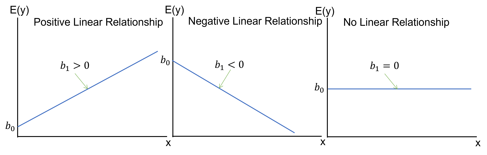
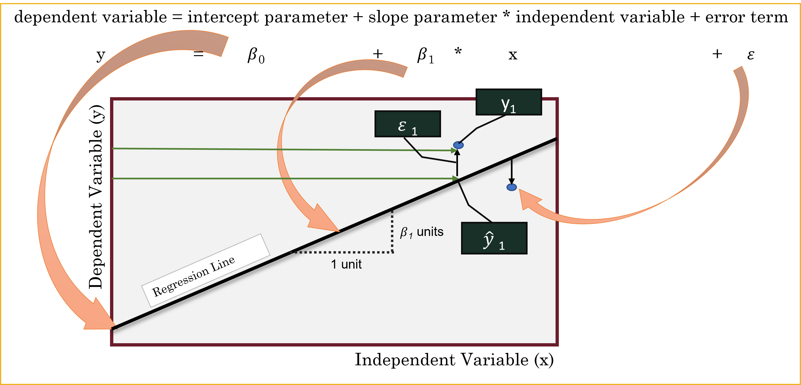
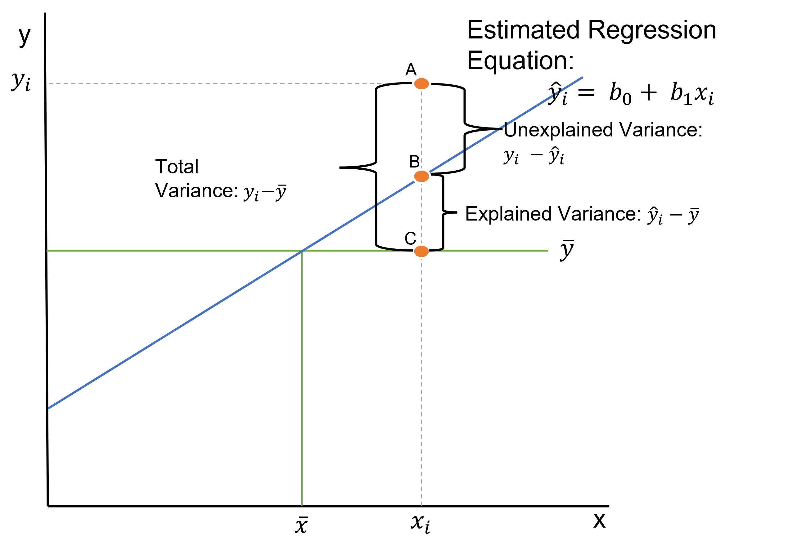

```{r setup, include=FALSE}
knitr::opts_chunk$set(echo=TRUE, tidy.opts = list(width.cutoff = 70), tidy = TRUE, message=FALSE, warning=FALSE)
```

This lesson covers simple and multiple linear regression — the foundational predictive modeling technique in business analytics. Building on the correlation analysis from the previous lesson, we move from describing relationships to modeling and forecasting them.

We begin with the **simple linear regression model**, which estimates a straight-line relationship between one explanatory variable and one continuous response variable. The key outputs are the slope and intercept — parameters that define the regression line — along with three goodness-of-fit measures: the Residual Standard Error (RSE), the coefficient of determination (R²), and the Adjusted R². The F-statistic tests whether the model as a whole explains a meaningful share of the variation in the outcome, and the t-statistics on each coefficient test each predictor individually.

We then extend to **multiple regression**, which adds two or more explanatory variables to the model. Multiple regression allows us to control for competing influences on the outcome, isolating the unique contribution of each predictor while holding the others constant. We cover the p-value method for variable selection — iteratively removing the least significant predictors while watching that the Adjusted R² does not meaningfully decline — and multicollinearity, which arises when predictors are highly correlated with each other and can distort or destabilize coefficient estimates.

The lesson closes with **regression using categorical variables**. When a predictor is categorical rather than continuous, R automatically converts it into dummy variables — a set of binary indicators, one per category, with one category held back as the reference. We work through examples with two-category and multi-category predictors, and combine continuous and categorical predictors in the same model.

By the end of this lesson, you should be able to fit and interpret simple and multiple regression models in R, evaluate goodness of fit, test predictor significance, build a regression equation for prediction, detect and address multicollinearity, and correctly include categorical variables using dummy coding. Work through every code example in your own R script alongside the reading.

### At a Glance

-   In order to succeed at this lesson, you will use a statistical model called linear regression to understand an outcome variable and make predictions. Correlation — covered in the previous lesson — establishes whether a linear relationship exists and how strong it is. Regression uses that relationship to estimate a slope and intercept, allowing us to quantify the effect of each predictor and forecast future values. Linear regression is one of the most commonly used models in business analytics and forms the foundation for more advanced techniques like machine learning.

### Lesson Objectives

-   Explore the statistical model for a line.
-   Compute the slope and intercept in a simple linear regression.
-   Interpret regression model significance and goodness-of-fit measures (RSE, R², Adjusted R²).
-   Extend to multiple regression with two or more predictors.
-   Apply the p-value method for variable selection.
-   Detect and interpret multicollinearity using VIF scores.
-   Include categorical predictors using dummy variables.

### Consider While Reading

-   In this lesson, we focus on building and interpreting regression models in R. This builds on the scatterplots introduced in the Data Visualization lesson — those visualizations help us assess linearity before running a model — and on the correlation analysis from the previous lesson, which told us whether a relationship was worth modeling in the first place.
-   As you read, note the connection between regression and ANOVA. The F-test in a regression output works the same way as in an ANOVA: it tests whether the variation in Y that is explained by the model is significantly greater than the unexplained variation. The sum-of-squares logic (SSR, SSE, SST) is identical.
-   Pay particular attention to the distinction between the overall F-test (is the model significant?) and the individual t-tests on each coefficient (is this specific predictor significant?). In simple regression these give the same p-value, but in multiple regression they can diverge.

```{r}
library(tidyverse)
```

In the previous lesson, we used correlation to measure the strength and direction of the linear relationship between two continuous variables. Regression takes the next step: it uses that relationship to build a predictive model. Where a correlation coefficient tells you *how strongly* two variables move together, a regression equation tells you *by how much* one variable changes for each unit change in the other — and lets you forecast values you have not yet observed.

# The Linear Regression Model

### Overview of the Linear Regression

-   Linear regression analysis is a predictive modelling technique used for building mathematical and statistical models that characterize relationships between a dependent (continuous) variable and one or more independent, or explanatory variables (continuous or categorical), all of which are numerical.
-   This technique is useful in forecasting, time series modelling, and finding the causal effect between variables.
-   Simple linear regression involves one *explanatory variable* and one *response variable*.
    -   Explanatory variable: The variable used to explain the dependent variable, usually denoted by X. Also known as an independent variable or a predictor variable.
    -   Response variable: The variable we wish to explain, usually denoted by Y. Also known as a dependent variable or outcome variable.
-   Multiple linear regression involves two or more *explanatory* variables, while still only one *response* variable.

### Examples of Independent and Dependent Variables

-   Example Question: Does increasing the marketing budget lead to higher sales revenue?
    -   Independent Variable: Marketing budget (how much money is spent on advertising and promotions).
    -   Dependent Variable: Sales revenue (how much income the business generates from sales).
-   Example Question: Does additional training improve employee productivity?
    -   Independent Variable: Hours of employee training.
    -   Dependent Variable: Employee productivity (e.g., units produced per hour or sales closed per month).
-   Example Question: Does being a member of a loyalty program increase the frequency of repeat purchases?
    -   Independent Variable: Participation in a loyalty program (whether a customer is a member or not).
    -   Dependent Variable: Number of repeat purchases by the customer.

### Estimating Using a Simple Linear Regression Model

-   While the correlation coefficient may establish a linear relationship, it does not suggest that one variable *causes* the other.
-   With regression analysis, we explicitly assume that the response variable is influenced by other explanatory variables.
-   Using regression analysis, we may *predict* the response variable given values for our explanatory variables.

### Inexact Relationships

-   If the value of the response variable is uniquely determined by the values of the explanatory variables, we say that the relationship is deterministic.
    -   But if, as we find in most fields of research, that the relationship is inexact due to omission of relevant factors, we say that the relationship is inexact.
    -   In regression analysis, we include a stochastic error term, that acknowledges that the actual relationship between the response and explanatory variables is not deterministic.

### Regression as ANOVA

-   ANOVA conducts an F - test to determine whether variation in Y is due to varying levels of X.
-   ANOVA is used to test for significance of regression:
    -   $H_0$: population slope coefficient $\beta_1$ $=$ 0
    -   $H_A$: population slope coefficient $\beta_1$ $\neq$ 0
-   R reports the p-value (Significant F).
-   Rejecting $H_0$ indicates that X explains variation in Y.



# The Simple Linear Regression Model

-   The simple linear regression model is defined as $y= \beta_0+\beta_1 𝑥+\varepsilon_1$, where $y$ and $x$ are the response and explanatory variables, respectively and $\varepsilon_1$ is the random error term. $\beta_0$ and $\beta_1$ are the unknown parameters to be estimated.
-   By fitting our data to the model, we obtain the equation $\hat{y} = b_0 + b_1*x$, where $\hat{y}$ is the estimated response variable, $b_0$ is the estimate of $\beta_0$ (Intercept) and $b_1$ is the estimate of $\beta_1$ (Slope).
-   Sometimes, this equation can be represented using different variable names like $y=mx+b$ This is the same equation as above, but different notation.
-   Since the predictions cannot be totally accurate, the difference between the predicted and actual value represents the residual $e=y-\hat{y}$.



### The Least Squares Estimates

-   The two parameters $\beta_0$ and $\beta_1$ are estimated by minimizing the sum of squared residuals.
    -   The slope coefficient $\beta_1$ is estimated as $b_1 = \sum(x_i-\bar{x}*y_i-\bar{y})/\sum(x_i-\bar{x})^2$
    -   The intercept parameter $\beta_0$ is estimated as $b_0 = \hat{y}-b_1*\bar{x}$
    -   And we use this information to make the regression equation given the formula above: $\hat{y} = b_0 + b_1*x$,

### Goodness of Fit

-   Goodness of fit refers to how well the data fit the regression line. I will introduce three measures to judge how well the sample regression fits the data.
    1.  Standard Error of the Estimate
    2.  The Coefficient of Determination ($R^2$)
    3.  The Adjusted $R^2$
-   In order to make sense of the goodness of fit measures, we need to go back to the idea of explained and unexplained variance we learned in the ANOVA lesson. Variance can also be known as a difference.\
-   Unexplained Variance = SSE or Sum of Squares Error: This equals the sum of squared difference between A and B, or between the sum of squares of the difference between observation ($y_i$) and our predicted value of y ($\hat{y}$).
    -   $SSE = \sum^n_{i=1}(y_i - \hat{y})^2$
-   Explained Variance = SSR or Sum of Squares Regression: This equals the sum of squared difference between B and C, or between the sum of squares of the difference between our predicted value ($\hat{y}$) and the mean of y ($\bar{y}$).
    -   $SSR = \sum^n_{i=1}(\hat{y} - \bar{y})^2$
-   Total Variance = SST or Total Sum of Squares: This equals the sum of squared difference between A and C, or between the sum of squares of the difference between observation ($y_i$) and the mean of y ($\bar{y}$).
    -   The SST can be broken down into two components: the variation explained by the regression equation (the regression sum of squares or SSR) and the unexplained variation (the error sum of squares or SSE).
    -   $SST = \sum^n_{i=1}(y_i - \bar{y})^2$



### The Standard Error of the Estimate

-   The Standard Error of the Estimate, also known as the Residual Standard Error (RSE) (and labelled such in R), is the variability between observed ($y_i$) and predicted ($\hat{y}$) values, targeting the unexplained variance in the figure above. This measure is a lack of fit of the model to the data.
-   To compute the standard error of the estimate, we first compute the SSE and the MSE.
    -   Sum of Squares Error: $SSE = \sum^n_{i=1}e^2_i = \sum^n_{i=1}(y_i - \hat{y})^2$
    -   Dividing SSE by the appropriate degrees of freedom, n – k – 1, yields the mean squared error:
        -   Mean Squared Error: $MSE = SSE/(n-k-1)$
    -   The square root of the MSE is the standard error of the estimate, se.
        -   Standard Error of Estimate: $se = \sqrt(MSE) = \sqrt(SSE/(n-k-1))$

### The Coefficient of Determination ($R^2$)

-   Coefficient of determination refers to the percentage of variance in one variable that is accounted for by another variable or by a group of variables.

-   This measure of R-squared is a measure of the “fit” of the line to the data.

-   The Coefficient of Determination, denoted as $R^2$, is a statistical measure that indicates the proportion of variance in the dependent variable ($y$) that is explained by the independent variable(s) (x) in a regression model. It is calculated as: SSR/SST or 1-SSE/SST. \*$R^2$ ranges from 0 to 1:

    -   $R^2$=0: None of the variance in $y$ is explained by the model.
    -   $R^2$=1: The model explains all the variance in y. A higher $R^2$ indicates a better fit of the model to the data.

-   $R^2$ = 1-SSE/SST where $SSE = \sum^n_{i=1}(y_i - \hat{y})^2$ and $SST = \sum^n_{i=1}(y_i - \bar{y})^2$

    -   $R^2$ can also be computed by SSR/SST, which provides the same answer as above.
    -   This measure of fit targets both the unexplained and the explained variance.
    -   $R^2$ can also be calculated using the formula for Pearson's r and squaring it. This gives us the same answer.

-   Pearson's $r$ is a statistic that indicates the strength and direction of the relationship between two numeric variables that meet certain assumptions.

    -   (Pearson's $r$)$^2$ = $r^2_{xy} = (cov_{xy}/(s_x*s_y))^2$.

-   You need to see how all these formulas relate to see why all these formulas give you the same answer.

#### Interpreting ($R^2$)

-   This measure is easier to interpret over standard error. In particular, the ($R^2$) quantifies the fraction of variation in the response variable that is explained by changes in the explanatory variables.
-   The ($R^2$) gives you a score between 0 and 1. A score of 1 indicates that your Y variable is perfectly explained by your X variable or variables (where we only have one in simple regression).
-   The $R^2$ measure has strength of determination like the correlation coefficient, only all measures are from 0 to 1.
    -   The closer you get to one, the more *explained variance* we achieve.
    -   A score of 0 indicates that no variance is explained by the X variable or variables. In this case, the variable would not be a significant predictor variable of Y.
    -   Again, the strength of the relationship varies by field, but generally, a .2 to a .5 is considered weak, a .5 to a .8 is considered moderate, and above a .8 is considered strong.

#### R Output

-   We do see the $R^2$ in our R output labelled Multiple R-squared.

#### Limitations of The Coefficient of Determination ($R^2$)

-   More explanatory variables always result in a higher $R^2$.
-   But some of these variables may be unimportant and should not be in the model.
-   This is only applicable with multiple regression, discussed below.

### The Adjusted $R^2$

-   The Adjusted Coefficient of Determination, denoted as Adjusted $R^2$ modifies $R^2$ to account for the number of predictors in the model relative to the number of data points. It is calculated as Adjusted $R^2 = 1-(1-R^2)*((n-1)/(n-k-1))$, where where n is the sample size and p is the number of predictors.

-   In simple linear regression, $R^2$ and Adjusted $R^2$ will be very similar since there is only one predictor variable. The Adjusted $R^2$ becomes more important in multiple regression, where adding more predictors can artificially inflate $R^2$.

-   The Adjusted $R^2$ tries to balance the raw explanatory power against the desire to include only important predictors.

    -   Adjusted $R^2 = 1-(1-R^2)*((n-1)/(n-k-1))$.
    -   The Adjusted $R^2$ penalizes the $R^2$ for adding additional explanatory variables.

#### R Output

-   With our other goodness-of-fit measures, we typically allow the computer to compute the Adjusted $R^2$ using commands in R.\
-   Therefore, we do see the Adjusted $R^2$ in our R output labelled Adjusted R-squared.

### Example of Simple Linear Regression in R

-   The broad steps are the same as we used in the hypothesis testing and ANOVA modules: 1. Set up the hypothesis. 2. Compute the test statistic and calculate probability. 3. Interpret results and write a conclusion.

-   Step 1: Set Up the Null and Alternative Hypothesis

-   $H_0$: The slope of the line is equal to zero.

-   $H_A$: The slope of the line is not equal to zero.

-   Step 2: Compute the Test Statistic and Calculate Probability

```{r, message=FALSE, warning=FALSE}
library(tidyverse)
library(ggplot2)
```

```{r}
Debt_Payments <- read.csv("data/DebtPayments.csv")
Simple <- lm(Debt~Income, data=Debt_Payments)
summary(Simple)
```

-   Step 3: Interpret the Probability and Write a Conclusion
-   We interpret the probability and write a conclusion after looking at the following:

1.  Goodness of Fit Measures
2.  The F-test statistic
3.  The p-value from the hypothesis

-   We then can interpret the hypothesis and make the regression equation if needed to make predictions.

#### Examining the Goodness of Fit Measures

-   Like the ANOVA, we need the summary() command to see the regression output.

-   This output includes the following:

    -   Standard Error of Estimate at 63.26
    -   a $R^2$ of 0.7526.
    -   an Adjusted $R^2$ of 0.7423

-   We do not really see a difference in $R^2$ and the Adjusted $R^2$ because we only have a simple linear regression, which includes one X. The other thing that could create a difference between these measures is having a small sample size. A small sample size could adjust the $R^2$ down (like it did a little here $n=28$). In both cases, a score around .75 indicates that we are explaining about 75% of the variance in Debt Payments, which is specifically stated as 75.26% in the $R^2$ value.

-   The Standard Error of Estimate - known in R as the RSE or Residual Standard Error at 63.26.

-   The RSE represents the average amount by which the observed values deviate from the predicted values

-   The RSE has the same units as the dependent variable y, making it directly interpretable in the context of the problem.

    -   The scale of income is in 1000s.
    -   Therefore, for every 1000 dollars difference in Income we could be off on our debt payments by 63.26 dollars.

-   Again, most statisticians interpret the $R^2$ and the adjusted $R^2$ over the RSE.

#### Examining the F-Test Statistic

-   The F-statistic is a ratio of explained information (in the numerator) to unexplained information (in the denominator). If a model explains more than it leaves unexplained, the numerator is larger and the F-statistic is greater than 1. F-statistics that are much greater than 1 are explaining much more of the variation in the outcome than they leave unexplained. Large F-statistics are more likely to be statistically significant.
-   We see a F-statistic in our output with a p-value of 9.66e-09, which is less than .05. This indicates that our overall model is significant, which in simple regression means that our one X predictor variable is also significant. If this F-statistic is significant, we can interpret the hypothesis.

#### Examining the Hypothesis

-   We see a p-value on the Income row of 9.66e-09 from a t-value. This is also significant at .05 level. This p-value is the same as the F-test statistic because we only have one X variable.
-   This significance means our predictor variable does influence the Y variable and that we can reject the null hypothesis and show support for our alternative hypothesis.
-   This means Income does influence Debt Payments.

#### Interpreting the Hypothesis

-   A $b_1$ estimate of 10.441 indicates that for 1000 dollars of Income (again our data is in 1000s), the payment of dept will increase by 10.441.
-   A $b_0$ estimate of 210.298 indicates where the regression line will start given a Y at 0.
    -   This gives us a regression equation at $\hat{y} = 210.298 + 10.441*Income$
    -   We can graph this regression line using the abline() command on our plot we did earlier.
    -   As you can see from the chart, there was no data at the Y intercept, but if I extend the chart out, it does hit the y axis at 210 like stated.
    -   Also from the chart, we note that for each unit of income we go to the right, we go up by 10.441 units in dept payments.

```{r, fig.alt="Scatterplot of Debt_Payments"}
plot(Debt~Income, data=Debt_Payments, xlim=c(0,120), ylim=c(0,1350))
abline(Simple)
```

### Predictions

-   We can calculate this using the regression equation or use the predict() command in order to calculate different values of y given values of x based on our regression equation we got in the step above.
-   The coef() function returns the model’s coefficients which are needed to make the regression equation.

```{r}
#What would be your debt payments if Income was 100 ( for 100,000)
coef(Simple)
210.298 + 10.441*(100)
predict(Simple, data.frame(Income=100))
```

# Multiple Regression

-   A key advantage of multiple regression over simple regression is that it allows us to *control* for other variables. When we include multiple predictors, each coefficient reflects the unique contribution of that variable *while holding all others constant*. This makes our model more realistic and our estimates more accurate — but it also means we need to be careful about which variables we include, since adding unnecessary predictors can introduce noise and obscure the relationships we care about.

-   Multiple regression allows us to explore how several *explanatory* variables influence the *response* variable.

-   Suppose there are $k$ explanatory variables. The multiple linear regression model is defined as: $y = \beta_0 + \beta_1x_1 + \beta_2x_2 + \ ⋯ + \beta_kx_k +\varepsilon$

-   Where:

    -   $y$ is the dependent variable,
    -   $x_1, ⋯, x_k$ are independent explanatory variables,
    -   $\beta_0$ is the intercept term,
    -   $\beta_1 ⋯, \beta_k$ are the regression coefficients for the independent variables,
    -   $\varepsilon$ is the random error term

-   We estimate the regression coefficients—called partial regression coefficients — $b_0, b_1, b_2,… b_k$, then use the model: $\hat{y} = b_0 + b_1x_1 + b_2x_2 + \ ... + b_kx_k$ .

-   The partial regression coefficients represent the expected change in the dependent variable when the associated independent variable is increased by one unit while the values of all other independent variables are held constant.

-   For example, if there are $k = 3$ explanatory variables, the value $b_1$ estimates how a change in $x_1$ will influence $y$ assuming $x_2$ and $x_3$ are held constant.

### Example of Multiple Linear Regression in R

-   The steps to multiple linear regression are the same as simple linear regression except we should have more than one hypothesis.

1.  Step 1: Set up the null and alternative hypotheses

-   Hypothesis 1: Income affects Debt Payments.
    -   $H_0$: The slope of the line in regards to Income is equal to zero.
    -   $H_A$: The slope of the line in regards to Income is not equal to zero.
-   Hypothesis 2: Unemployment affects Debt Payments.
    -   $H_0$: The slope of the line in regards to Unemployment is equal to zero.
    -   $H_A$: The slope of the line in regards to Unemployment is not equal to zero.

2.  Step 2: Compute the test statistic and calculate probability

```{r}
Debt_Payments <- read.csv("data/DebtPayments.csv")
Multiple <-lm(Debt~Income+Unemployment, data=Debt_Payments)
summary(Multiple)
```

3.  Step 3: Interpret the probability and write a conclusion

-   We interpret the probability and write a conclusion after looking at the following:
    -   Goodness of Fit Measures
    -   The F-test statistic
    -   The p-values from the hypotheses
-   We then can interpret the hypotheses and make the regression equation if needed to make predictions.

### Examining the Goodness of Fit Measures

-   Like the ANOVA, we need the summary() command to see the regression output.
-   This output includes the following:
    -   Standard error of estimate at 64.61 - was previously 63.26 with simple regression.
    -   a $R^2$ of 0.7527 - was previously 0.7526 with simple regression.
    -   an Adjusted $R^2$ of 0.7312 - was previously 0.7423 with simple regression.
-   Looking at the goodness of fit indices, they suggest that we are not explaining anything more by adding the unemployment variable over what we had with the Income variable. Our RSE and $R^2$ are about the same, and our adjusted $R^2$ has gone down - again paying the price for including an unnecessary variable.

### Examining the F-Test Statistic

-   We see a overall F-statistic in our output with a p-value of 1.054e-07, which is less than .05. This indicates that our overall model is significant - which in multiple regression means that *at least one* X predictor variable is significant. If this F-statistic is significant, we can interpret the hypotheses.

### Examining the Hypotheses

-   Hypothesis 1: The output shows a p-value on the Income row of 2.98e-07 from a t-value. This was significant in our simple regression model, and is still significant at .05 level here. This significance means our predictor variable does influence the Y variable and that we can reject the null hypothesis and show support for our alternative hypothesis.
-   Hypothesis 2: The output shows a p-value on the Unemployment row of 0.929 from a t-value. This is *NOT* significant at any appropriate level of alpha. This lack of significance means our predictor variable does *NOT* influence the Y variable and that we fail to reject the null hypothesis that there is a slope.

### Interpreting the Hypothesis

-   Because Unemployment is not significant, we should drop it from the model before creating the regression equation. The extra variable is only adding *noise* to our model and not adding anything useful in understanding debt payments.

## The P-value Method

-   When you have a lot of predictors, it can be difficult to come up with a good model.

-   A common criteria is to remove based on the highest p-value.

-   Remove indicators until all variables are significant, and none are insignificant.

-   As we drop variables, we also want to keep an eye on the adjusted R-Squared to make sure it does not significantly decrease. It should stay about the same if we drop variables that are not helpful in understanding the model, and could improve because we are decreasing the number of variables being evaluated.

```{r, warning=FALSE, message=FALSE}
library(ISLR)
data("Credit")
str(Credit)
library(tidyverse)

##Removing variables that are of no interest to the model based on what we have learned so far. 
# The following lines removes the categorical variables, Gender, Student, Married, and Ethnicity. It also removed the ID because that is not a helpful variable. 

Credit <- select(Credit, -Gender, -Student, - Married, -Ethnicity, -ID)

creditlm <- lm(Balance~., data=Credit)
summary(creditlm)
#Multiple R-squared:  0.8782, Adjusted R-squared:  0.8764 

```

-   Education has the highest p-value, so it is removed from analysis. We use the minus sign to remove the variable in the lm function.

```{r}
creditlm <- lm(Balance~.-Education, data=Credit)
summary(creditlm)
# Multiple R-squared: 0.8781, Adjusted R-squared:  0.8765 
```

-   Cards has the next highest p-value, so it is removed from analysis using the - minus sign format.

```{r}
creditlm <- lm(Balance~.-Education-Cards, data=Credit)
summary(creditlm)
# Multiple R-squared:  0.8772, Adjusted R-squared:  0.876 
```

-   Age is next to be removed because it has the next highest p-value at .06270.

```{r}
creditlm <- lm(Balance~.-Education-Cards-Age, data=Credit)
summary(creditlm)
# Multiple R-squared:  0.8762, Adjusted R-squared:  0.8753 
```

-   Finally Limit is the next to be removed because it has the next highest (and still insignificant) p-value at .059.

-   Age is next to be removed because it has the next highest p-value at .06270.

```{r}
creditlm <- lm(Balance~.-Education-Cards-Age-Limit, data=Credit)
summary(creditlm)
# Multiple R-squared:  0.8751,Adjusted R-squared:  0.8745 
```

-   In our original model with non-helpful insignificant predictors, we had an adjusted R-Squared at 0.8764. After removing insignificant predictors, we are only down to .8745. This means we can explain someones Balance best by understanding Income and Rating.
-   The interpretation is as follows:
-   A one unit change in Income causes a negative 7.67 change in Balance.
-   A one unit change in Rating causes a 3.949 change in Balance.

## Multicollinerity

-   Multicollinearity refers to the situation in which two or more predictor variables are closely related to another.
-   Collinearity can cause significant factors to be insignificant, or insignificant factors to seem significant. Both are problematic.
-   If sample correlation coefficient between 2 explanatory variables is more than .80 or less than -.80, we could have severe multicollinearity. Seemingly wrong signs of estimated regression coefficients may also indicate multicollinearity. A good remedy may be to simply drop one of the collinear variables if we can justify it as redundant.
-   Alternatively, we could try to increase our sample size.
-   Another option would be to try to transform our variables so that they are no longer collinear.
-   Last, especially if we are interested only in maintaining a high predictive power, it may make sense to do nothing.

```{r}
cor(Credit$Income, Credit$Rating) ##close to .8, but still under
```

-   The second way to tell if there is multicollinearity is to use the vif() command from the car package.
-   The vif() function in R is used to calculate the Variance Inflation Factor (VIF) for each predictor variable in a multiple regression model. The VIF quantifies how much the variance of a regression coefficient is inflated due to multicollinearity among the predictors. High VIF values indicate high multicollinearity, which can affect the stability and interpretability of the regression coefficients.
-   We want all scores to be under 10 to indicate the absence of problematic multicollinerity in our model.

```{r}

library(car) ##need to have car package installed first. 
#Place regression model object in the function to see vif scores. 
vif(creditlm)
```

-   While statisticians differ on what constitutes, the general consensus is that scores need to be under 5 or 10.
-   Both scores are under 10, so we do have an absence of multicollinerity in our final model.
    -   VIF = 1: No correlation between the predictor and the other predictors.
    -   1 \< VIF \< 5: Moderate correlation but not severe enough to require correction. Scores less than 5 pass assumption.
    -   5 \< VIF \< 10: High correlation, indicating potential multicollinearity problems. We keep an eye on this issue, but pass the assumption.
    -   VIF \>= 10: High correlation, indicating multicollinearity problems. Fail assumption.

######################################### 

# Regression with Categorical Variables

-   Simple and multiple regression both require a continuous dependent variable (y). However, the predictor variables (x) can be categorical or continuous. If you were to have a y/x pairing with a continuous y and a categorical x, you might as well choose to run an ANOVA from the last module or a t-test if there are only 2 categories. However, if you have a more complex model, or need to try a variety of models, multiple regression allows for you to seamlessly add and delete predictor variables (both categorical and continuous).

-   We often have categorical predictors in modeling settings. And it might not make sense to think about a "one unit increase" in a categorical variable. In regression settings, we can account for categorical variables by creating dummy variables, which are indicator variables for certain conditions happening. When considering categorical variables, one variable is taken to be the baseline or reference value. All other categories will be compared to it.

-   Regression analysis requires numerical data.

-   Ordinal variables can be represented by a number in one column when there is even distance between the categories.

    -   From strongly disagree to disagree to N/A to agree to strongly agree. Each 1 unit change considers the same distance between points.
    -   A weighted scale would go from strongly disagree to neither to agree to strongly agree to agree all the time.
    -   Need to manually code these and coerce into a number.
    -   Some ordinal variables need to use dummy coding in R (i.e., Seasonality). Need to always check rationale before blindly recoding to numbers, or using numbers that were provided.

-   Nominal categorical data can be included as independent variables, but must be coded numeric using dummy variables.

    -   R will create the dummy variables automatically in a regression using the lm() command.
    -   For variables with 2 categories, code as 0 and 1.

## Dummy Variables with More than 2 Categories

-   Like in an ANOVA test, a categorical variable may be defined by more than two categories.
-   Use multiple dummy variables to capture all categories, one for each category.
-   When a categorical variable has k \> 2 levels, we need to add k − 1 additional variables to the model.
-   Given the intercept term, we exclude one of the dummy variables from the regression.
    -   The excluded variable represents the reference category.
    -   Including all dummy variables creates perfect multicollinearity (which is an assumption discussed in your textbook).
-   Example: mode of transportation with three categories
    -   Public transportation, driving alone, or car pooling
        -   $d_1=1$ for public transportation and 0 otherwise
        -   $d_2=1$ for driving alone and 0 otherwise
        -   $d_1=d_2=0$ indicates car pooling
-   Slope estimates of categorical data cannot be evaluated the same way. In the example below, since Gender is nominal, and because we are using regression, we should use dummy variables to process this factor in the regression instead of the method above. We can use this technique for ordinal variables to recode them into numeric. Again, R does this coding on our behalf using the lm() command.

```{r}
# Take a vector representing gender 
gender <- c("MALE","FEMALE","FEMALE","UNKNOWN","MALE")
# One way is to convert the data into numerical in the column using ifelse statements. 
ifelse(gender == "MALE", 1, ifelse(gender == "FEMALE", 2, 99))
```

## Example Using Dummy Variables

-   Suppose that we are forecasting and we want to account for the month as a predictor.
-   Then the following dummy variables can be created the following way:

```{r}
sales <- read.csv("data/months.csv", stringsAsFactors = TRUE)
str(sales)
```

```{r message=FALSE}
library(tidyverse)
```

```{r, fig.alt="Boxplot of Sales Data Generated by R"}
ggplot(sales, aes(x=Month, y=Units))+geom_boxplot() 
```

-   I produced a boxplot of the monthly data across units above. April (Apr) is the first month listed (not Jan for January). It alphabetizes it from there from left to right.
-   Looking at the lm() command summary below, the hypotheses take on the format VariableCategory. So MonthAug corresponds to the Month variable with the Aug category, representing August. You will notice that there is no MonthApr listed. It is considered the referent category and held in the intercept.
-   The interpretation of each of the coefficients associated with the dummy variables is that it is a measure of the effect of that category relative to the omitted or referent category.
-   In the example to the left, the intercept coefficient is associated with April, so MonthAug measures the effect of August on the forecast variable (Units) compared to the effect of April.
    -   Since the data represents the difference in Units sold in months, we can interpret the predicted units sold for April as 49,580.8.
    -   August was significantly different than April because there is a p-value less than .05. Specifically, we can expect about 7701.6 more units to be sold in August over April. December, January, June, and November also had significantly different Units sold.
    -   February, July, March, May, October, and September are not different than April because the p-value is \> .05.
-   Never try to remove a categorical variable that is not significant because it means something else - that the category is not different than the referent category. More on this later.

```{r}
#Suppose that we are forecasting daily data and we want to account for the month as a predictor. 
##Then the following dummy variables can be created.
lmSales<-lm(Units~Month, data=sales)
summary(lmSales)
# The Intercept absorbs the referent category and so in this case, April is alphabetically first and the referent category.  
```

-   We can reset the levels by using the factor() command. Shown below, I reset the levels of the month in order from month 1 (Jan) to month 12 (Dec). This puts "Jan" in the referent category when we rerun the regression. This allows us to compare Jan to other months and to specifically, test what months are different from Jan (+ increase in sales from Jan, - a decrease in sales from Jan).
-   For example, March has 10612 more unit sales than Jan. If not significant, like MonthFeb, then you can interpret as not significantly different than the 42K in Jan.

```{r}
sales$Month<-factor(sales$Month,levels=c("Jan","Feb","Mar","Apr","May","Jun","Jul","Aug","Sep","Oct","Nov","Dec"))
ggplot(sales, aes(x=Month, y=Units))+geom_boxplot() 
lmSales<-lm(Units~Month, data=sales)
summary(lmSales)
# The interpretation of each of the coefficients associated with the dummy variables is that it is a measure of the effect of that category relative to the omitted category. In the example to the left, the intercept coefficient is associated with January, so MonthFeb measures the effect of Feb on the forecast variable (Units) compared to the effect of Jan. 
```

## Example Using a Continuous and Categorical Variable

-   Let's do an example with the GNP.csv data set to use GNP and quarterly data to predict Sales (in millions)

```{r, fig.alt="Boxplot of GNP variable Generated by R"}
GNP<-read.csv("data/GNP.csv")
str(GNP)

# #1, 2, 3, 4 represent the quarter and we want that data as categorical
 GNP$Quarter<-as.factor(GNP$Quarter) 

# #Evaluate Quarterly data of GNP in a boxplot. 
GNP %>% 
  ggplot(aes(x=Quarter, y=Sales))+geom_boxplot() 

# Run the linear regression considering GNP and Quarterly data
lmGNP<-lm(Sales~GNP+Quarter, data=GNP)
summary(lmGNP)

# Estimate y, where y and x are Sales and GNP, and 2 is a quarter 2 dummy, 3 is a Quarter 3 dummy, and 4 is a Quarter 4 dummy.

# All else equal, retail sales in quarter 1 are expected to be approximately $108,765 million less than sales in quarter 4.

# What are the predicted sales in quarter 2 if GNP is $18,000 (in billions)?
Quarter2<-18000
coef(lmGNP)
#Using the equation
-61669.57208 + 65.05476 * Quarter2 + 78278.963

#When you use the predict() command with a categorical variable, you need to include the predictors with what they equal as shown below. I pulled out the data.frame() command into a new variable named nd to simplify our predict() command later on.  
nd <- data.frame(GNP=18000, Quarter="2")
predict(lmGNP, nd)

# You can write the above 2 lines like shown below for the same answer.  
predict(lmGNP, data.frame(GNP=18000, Quarter="2"))
```

-   While you technically can keep adding categorical variables, you must be careful not to add too many because the intercept becomes increasingly difficult to interpret!

## Coffee Example

### Visualizing

-   Let's try a bigger example with the coffee dataset.

```{r}
library(tidyverse)
library(ggplot2)
library(dplyr)
coffee <- read.csv("data/coffee.csv", stringsAsFactors = TRUE)
str(coffee)
```

-   Sometimes, we are only interested in 2 or 3 category values. In the following example, I am filtering by Processing Method and creating a ggplot only holding the methods of interest to me.

```{r}
coffee %>%
     filter(Processing.Method == "Natural / Dry" | Processing.Method=="Washed / Wet"| Processing.Method=="Other") %>%
     ggplot(aes(x=Processing.Method, y=TotalScore))+geom_boxplot(color=rainbow(3))
```

-   Does not look like large group differences, good indication into what we will find.
-   In the next visualization, lets add in a scatterplot to show the difference between 2 continuous variables (Flavor and TotalScore) using Processing Method method as the color.

```{r}
coffee %>%
     filter(Processing.Method == "Natural / Dry" | Processing.Method=="Washed / Wet"| Processing.Method=="Other") %>%
     ggplot(aes(x=Flavor, y=TotalScore, color=Processing.Method)) + geom_point(aes(fill=Processing.Method))
```

-   In the chart above, flavor almost looks like a perfect predictor, strong and positive.

### 2 Categories

-   Suppose there are only 2 processing methods for coffee beans: Wet/Washed and Natural/Dry.\
    R takes Natural/Dry as the referent category value. Then we can create one dummy variable. A Dummy Variable is then assigned as either a 0 or 1. Let's save the filtering of 2 methods into a new smaller dataset first and then running the lm model.

```{r}
coffee2cat <- filter(coffee, Processing.Method == "Natural / Dry" | Processing.Method=="Washed / Wet")
head(coffee2cat$Processing.Method)
```

-   Next, lets run a lm model using the newly filtered data.

```{r}
lmModel <- lm(TotalScore~Processing.Method, data=coffee2cat)   
summary(lmModel)
```

-   We can make a prediction of Washed/Wet.

```{r}
predict(lmModel, data.frame(Processing.Method="Washed / Wet"))
coef(lmModel)
82.3541 - 0.3895
```

### Using More Than 2 Categories

-   A categorical variable may be defined by more than two categories.

-   Like mentioned above, we use multiple dummy variables to capture all categories, one for each category.

-   When a categorical variable has k \> 2 levels, we need to add k − 1 additional variables to the model.

-   Given the intercept term, we exclude one of the dummy variables from the regression.

-   The excluded variable represents the reference category. Example: Processing.Time Filtering by 3 categories: "Natural / Dry" "Washed / Wet“ or Other") $d_1=1$ for Other and 0 otherwise $d_2=1$ for Washed/Wet and 0 otherwise $d_1=d_2=0$ indicates Natural/Dry referent category

-   $Score_i=β_0+β_1(I(Other)_i)+β_2(I(Wet)_i)+ϵ_I$ $β_0$ represents the expected score for a coffee with 0 for the two dummy variables. That is, if it was a dry process coffee $β_1$ represents the expected difference in score for coffee with an Other roasting process, compared to the baseline level (dry process) $β_2$ represents the expected difference in score for Washed/Wet process coffee compared to dry process coffee. We have to estimate multiple "slopes" for this one variable - one corresponding to each non-reference level.

-   We can refilter the data to include the third category value.

```{r}
coffee3cat <- filter(coffee, Processing.Method == "Natural / Dry" | Processing.Method=="Washed / Wet"| Processing.Method=="Other")
head(coffee3cat)
```

-   We can make our new model object with the lm function.

```{r}
lmModel2 <- lm(TotalScore~Processing.Method, data=coffee3cat)   
summary(lmModel2)
```

-   The overall model is not significant here, but one group still shows differences. Means poor predictor, but that there are still group differences (even if small) between Washed/Wet and Natural/Dry
-   Finally, we can make our new prediction of what the score would be in the Processing.Method was Other.

```{r}
predict(lmModel2, data.frame(Processing.Method="Other"))
coef(lmModel2)
82.3541434 -1.0756819 
```

## Adding in a Numerical Variable

-   We can add in another variable like Flavor. Flavor is a much stronger predictor.

```{r}
lmModel3 <- lm(TotalScore~Flavor + Processing.Method, data=coffee3cat)   
summary(lmModel3)
```

```{r}
predict(lmModel3, data.frame(Flavor=10,Processing.Method="Other" ))
coef(lmModel3)
31.4116160 + 6.7151441 * 10 + -0.1274019 
```

-   After adjusting for aroma, and flavor, is there sufficient evidence to suggest a difference in mean score between dry vs. wet process beans? Explain, using a formal hypothesis test. \$H_0: Processing.Method\_{Washed / Wet} = Processing.Method\_{Dry} \$ \$H_A: Processing.Method\_{Washed / Wet}\neq Processing.Method\_{Dry} \$

```{r}
lmModel4 <- lm(TotalScore~Aroma + Flavor + Processing.Method, data=coffee2cat)   
summary(lmModel4)
```

-   We find evidence that there is a difference between Washed/Wet processed coffee beans and dry processed beans as evident by the significant p-value \< .05.

-   Adjusting for aroma, flavor, and process, which country has the highest expected score? The lowest?

```{r}
##calculate the predicted scores in the dataset
predicted_scores <- predict(lmModel4, newdata = coffee2cat)

# Create a new dataframe with Country and predicted scores
predicted_data <- data.frame(Country = coffee2cat$Country, Predicted_Score = predicted_scores)

# Find the country with the highest expected score
highest_expected_score <- filter(predicted_data, Predicted_Score == max(Predicted_Score)); highest_expected_score

# Find the country with the lowest expected score
lowest_expected_score <- 
  filter(predicted_data, Predicted_Score == min(Predicted_Score)); lowest_expected_score
```

-   We find that Ethiopia has the highest predicted score and Guatemala has the lowest predicted score based on Aroma, Flavor, and Processing Method.

-   What percentage of the variability in the total score is explained by a linear relationship with the predictors in your model?

```{r}
library(broom)
glance(lmModel4)
```

-   We can look at the R-squared value of .693 and adjusted R-squared value of .692 and state that about 69% of the variable in total score is explained by a linear relationship with the predictors in our model.

# Review and Practice

## Using AI

Use the following prompts in our chatbot blow to explore more about regression analysis in R.

-   Explain how to perform simple linear regression in R. Use the lm() function and discuss how to interpret the slope, intercept, and R-squared values from the regression output.

-   What is the coefficient of determination (R-squared) in regression analysis, and how does it relate to the goodness of fit? How can the residual standard error (RSE) and adjusted R-squared help in interpreting a model?

-   Describe how to perform multiple linear regression in R using the lm() function. How do you interpret the coefficients for multiple predictors, and what do the p-values tell you about their significance?

-   What does the F-statistic in a regression output indicate? How does it help in determining the significance of a regression model, and what role does it play when comparing multiple models?

-   Explain how ANOVA is related to regression analysis. How can the F-test be used to assess the significance of regression models? What are residuals in a regression model, and how can analyzing them help assess model fit? How is the sum of squared errors (SSE) related to residual analysis?

-   What is multicollinearity, and why is it problematic in multiple regression? How can you detect multicollinearity in R using the vif() function, and what steps can be taken to address it?

-   How can you use a fitted regression model to make predictions for new data in R? Explain how the predict() function works and provide an example using both simple and multiple regression.

-   Given the output from the summary() function for a regression model in R, explain how to interpret the coefficients, R-squared, adjusted R-squared, residual standard error, and p-values.

-   Describe how to use the p-value method for variable selection in multiple regression. How do you iteratively remove insignificant predictors while monitoring the R-squared and adjusted R-squared values?

## Regression Lab

**A dataset** has one continuous predictor variable (`Income`, in thousands) and one continuous outcome (`Debt`, in dollars). A student runs `lm(Debt ~ Income, data = df)` and gets the following summary output:

```         
Coefficients:
            Estimate Std. Error t value Pr(>|t|)    
(Intercept)  210.30      41.82    5.03  0.00004 ***
Income        10.44       1.19    8.77  9.66e-09 ***

Residual standard error: 63.26 on 26 degrees of freedom
Multiple R-squared:  0.7526,    Adjusted R-squared:  0.7423 
F-statistic: 76.86 on 1 and 26 DF,  p-value: 9.66e-09
```

Write out the regression equation, interpret the slope and intercept in plain English, and state what the $R^2$ tells you about model fit.

::: {.callout-note collapse="true"}
### Show Answer

**Regression equation:** $$\hat{y} = 210.30 + 10.44 \times \text{Income}$$

**Intercept (**$b_0 = 210.30$): When Income is zero (i.e., \$0 in thousands), the predicted debt payment is \$210.30. In this context, the intercept is a mathematical anchor for the line — there is likely no data at Income = 0, so it should not be interpreted as a meaningful real-world value on its own.

**Slope (**$b_1 = 10.44$): For every additional \$1,000 in income (one unit increase in Income), debt payments are predicted to increase by \$10.44. Income and debt move in the same direction — higher earners tend to carry higher debt payments.

$R^2 = 0.7526$: Income explains approximately **75.3%** of the variability in debt payments. The remaining 24.7% is explained by other factors not in the model. An $R^2$ above 0.5 is generally considered moderate-to-strong in business applications — this model fits the data reasonably well.
:::

**Using the regression output above**, make a prediction for a person with an income of \$85,000 (Income = 85) using both the regression equation and the `predict()` function in R. Show both approaches.

::: {.callout-note collapse="true"}
### Show Answer

**Using the equation:** $$\hat{y} = 210.30 + 10.44 \times 85 = 210.30 + 887.40 = 1097.70$$

Predicted debt payment: approximately **\$1,097.70**

**Using `predict()` in R:**

``` r
predict(Simple, data.frame(Income = 85))
```

Both approaches give the same answer. The `predict()` function is more convenient when making many predictions at once or when the model includes multiple predictors, since it handles all the coefficient multiplication automatically.
:::

**A multiple regression model** is built to predict `Balance` from `Income`, `Rating`, `Limit`, `Cards`, `Age`, and `Education`. The initial model returns the following Adjusted $R^2$ values as variables are removed one at a time using the p-value method:

| Step           | Variables removed    | Adjusted R² |
|----------------|----------------------|-------------|
| 0 (full model) | —                    | 0.8764      |
| 1              | Education (p = 0.71) | 0.8765      |
| 2              | Cards (p = 0.53)     | 0.8760      |
| 3              | Age (p = 0.06)       | 0.8753      |
| 4              | Limit (p = 0.059)    | 0.8745      |

Explain why Adjusted $R^2$ barely changes — and in step 1 actually *increases* — as variables are removed, and why this supports the variable-removal decisions.

::: {.callout-note collapse="true"}
### Show Answer

**Why Adjusted** $R^2$ barely changes: The variables being removed (Education, Cards, Age, Limit) were contributing almost nothing to the model's explanatory power. When a predictor is truly uninformative, removing it does not reduce how well the model fits the data — it just eliminates noise.

**Why it increased in step 1:** The Adjusted $R^2$ formula penalizes models for having extra predictors. The raw $R^2$ always increases or stays flat when you add a variable, but the Adjusted $R^2$ can actually *decrease* if a variable's marginal contribution is less than the penalty for including it. When Education (p = 0.71) was removed, the penalty relief from dropping one useless predictor outweighed the tiny loss in explained variance, nudging Adjusted $R^2$ slightly upward.

**Why this supports the decisions:** A good variable-selection strategy keeps Adjusted $R^2$ stable or improves it while reducing model complexity. Starting at 0.8764 and finishing at 0.8745 after removing four predictors means the simpler final model explains almost exactly as much variation as the full model — with fewer parameters, easier interpretation, and less risk of overfitting. The two remaining predictors (Income and Rating) are doing essentially all the work.
:::

**A researcher** includes `Ethnicity` as a predictor in a regression model. It has three categories: Asian.American, Black, and White. R automatically creates dummy variables and produces this output (condensed):

```         
Coefficients:
                    Estimate
(Intercept)           720.5     ← Asian.American baseline
EthnicityBlack        -18.3    (p = 0.12)
EthnicityWhite        -13.1    (p = 0.08)
```

Identify the reference category, interpret the intercept and each dummy coefficient, and explain why there is no `EthnicityAsian.American` row in the output.

::: {.callout-note collapse="true"}
### Show Answer

**Reference category:** Asian.American — it is the category that R excluded from the output and absorbed into the intercept.

**Intercept (720.5):** The predicted outcome for an Asian.American individual (when all other predictors are held at zero, or if this is the only predictor). It represents the baseline group mean.

**EthnicityBlack (−18.3):** Black respondents are predicted to have an outcome 18.3 units *lower* than Asian.American respondents, on average, all else equal. The p-value of 0.12 means this difference is **not statistically significant** at $\alpha = 0.05$ — we cannot conclude that the group means differ from the Asian.American baseline.

**EthnicityWhite (−13.1):** White respondents are predicted to score 13.1 units lower than the Asian.American baseline. Again, p = 0.08 is not significant at $\alpha = 0.05$.

**Why no Asian.American row:** Including all three dummy variables (Asian.American, Black, White) would create **perfect multicollinearity** — the three dummies would always sum to 1, making the model mathematically unsolvable. R automatically drops one category (alphabetically first by default, which is Asian.American here) to serve as the reference. Every other category is interpreted *relative to* that reference.

**Note:** A non-significant dummy coefficient does not mean you remove that category from the model — it means that category is not significantly *different from the reference*. You remove or keep the entire categorical variable together.
:::

**Explain** why multicollinearity is a problem in multiple regression, and interpret the following VIF output. Which predictors pass the assumption, and what would you do about the one(s) that do not?

```         
   Income    Rating     Limit 
    1.011     2.234    14.822
```

::: {.callout-note collapse="true"}
### Show Answer

**Why multicollinearity is a problem:** When two or more predictors are highly correlated with each other, the model cannot reliably separate their individual effects. This inflates the standard errors of the affected coefficients, making them appear non-significant even when they genuinely predict the outcome. It can also produce coefficient estimates with wrong signs — a predictor that should have a positive relationship might appear negative in the output. Predictions from the model may still be accurate, but individual coefficient interpretation becomes unreliable.

**Interpreting the VIF output:**

| Predictor | VIF    | Verdict                                            |
|-----------|--------|----------------------------------------------------|
| Income    | 1.011  | ✅ Passes — no correlation with other predictors   |
| Rating    | 2.234  | ✅ Passes — moderate but acceptable (well under 5) |
| Limit     | 14.822 | ❌ Fails — severe multicollinearity (VIF ≥ 10)     |

**What to do about Limit:** A VIF of 14.8 suggests `Limit` is highly correlated with one or more other predictors in the model (likely `Rating`, since credit limit and credit rating are often set together). Options:

1.  **Drop one of the correlated variables.** If `Limit` and `Rating` are largely redundant, remove whichever is less theoretically important.
2.  **Check the correlation matrix** — `cor(Credit$Limit, Credit$Rating)` — to confirm which variable is driving the problem.
3.  **Keep it if prediction is the goal.** If you only care about the model's overall predictions (not the individual coefficients), multicollinearity is less harmful. The Adjusted $R^2$ and predictions remain valid even when VIF is high.
:::

**A model predicting employee salary** (in \$000s) from `YearsExperience` and `Department` (Finance, Marketing, Operations — three categories) returns these coefficients:

```         
(Intercept)             52.1
YearsExperience          2.8
DepartmentMarketing     -4.5
DepartmentOperations    -9.2
```

Write the four prediction equations (one per department), then calculate the predicted salary for a Marketing employee with 7 years of experience and an Operations employee with 12 years of experience.

::: {.callout-note collapse="true"}
### Show Answer

**Reference category:** Finance (alphabetically first, omitted from output).

**Four prediction equations:**

-   **Finance:** $\hat{y} = 52.1 + 2.8 \times \text{Years}$
-   **Marketing:** $\hat{y} = 52.1 + 2.8 \times \text{Years} + (-4.5) = 47.6 + 2.8 \times \text{Years}$
-   **Operations:** $\hat{y} = 52.1 + 2.8 \times \text{Years} + (-9.2) = 42.9 + 2.8 \times \text{Years}$

All three lines have the **same slope** (2.8 — each additional year of experience adds \$2,800 regardless of department) but **different intercepts** (Finance starts highest, then Marketing, then Operations).

**Predictions:**

Marketing, 7 years: $47.6 + 2.8 \times 7 = 47.6 + 19.6 = \$67,200$

Operations, 12 years: $42.9 + 2.8 \times 12 = 42.9 + 33.6 = \$76,500$

``` r
predict(salary_model, data.frame(YearsExperience = 7,  Department = "Marketing"))
predict(salary_model, data.frame(YearsExperience = 12, Department = "Operations"))
```

Note that even though Operations has the lowest intercept, the Operations employee earns more here because they have significantly more experience — the slope effect eventually overtakes the department penalty.
:::

## Interactive R Lesson: Regression {#interactive-regression-lesson}

::: {.callout-note}
This lesson covers simple linear regression, qualitative predictors, multiple regression, and interaction terms. All examples use datasets from the ISLR package — `Hitters` for numeric regression, `Carseats` for qualitative predictors, and `Credit` for interaction terms.

**First-time load:** The interactive R environment may take 10–20 seconds to initialize. Once the Run Code buttons become active, you are ready to go.
:::

```{webr-r}
#| label: reg-setup
#| context: setup
Hitters  <- ISLR::Hitters
Carseats <- ISLR::Carseats
Credit   <- ISLR::Credit
# Remove rows with missing Salary in Hitters
Hitters <- na.omit(Hitters)
```

---

### Part 1: Simple Linear Regression — Hitters Dataset

Simple linear regression estimates a straight-line relationship between one predictor (X) and one continuous outcome (Y). The format is `lm(Y ~ X, data = dataset)`.

The `Hitters` dataset from ISLR contains performance statistics and salary data for 263 Major League Baseball players. `Salary` is our outcome variable throughout Parts 1 and 3.

::: {.callout-tip}
Key variables: `Salary` = 1987 annual salary in thousands of dollars, `Hits` = number of hits in 1986, `Years` = number of years in the major leagues, `HmRun` = home runs in 1986, `RBI` = runs batted in during 1986.
:::

**Explore the Hitters dataset:**

```{webr-r}
#| label: hitters-head
head(Hitters[, c("Salary", "Hits", "Years", "HmRun", "RBI", "Walks")])
summary(Hitters[, c("Salary", "Hits", "Years")])
```

**Does the number of hits predict salary?**

```{webr-r}
#| label: simple-lm-hits
firstLM <- lm(Salary ~ Hits, data = Hitters)
summary(firstLM)
confint(firstLM)
ggplot(Hitters, aes(x = Hits, y = Salary)) +
  geom_point(alpha = 0.4, color = "steelblue") +
  stat_smooth(method = "lm", color = "red") +
  labs(title = "Hits vs. Salary",
       x = "Hits (1986)", y = "Salary ($000s)")
```

::: {.callout-note}
Read the output: the **slope estimate** for Hits (positive — more hits, higher salary), the **p-value** (significant if < 0.05), the **R²** (proportion of salary variance explained by hits alone), and the **F-statistic p-value** (overall model significance). `confint()` gives the 95% confidence interval around the slope — if the entire interval is positive, the positive relationship is not a chance result.
:::

**Now try Years as a predictor:**

```{webr-r}
#| label: simple-lm-years
secondLM <- lm(Salary ~ Years, data = Hitters)
summary(secondLM)
ggplot(Hitters, aes(x = Years, y = Salary)) +
  geom_point(alpha = 0.4, color = "darkorange") +
  stat_smooth(method = "lm", color = "red") +
  labs(title = "Years of Experience vs. Salary",
       x = "Years in Major Leagues", y = "Salary ($000s)")
```

::: {.callout-note}
Compare R² for Hits vs. Years. Experience (Years) tends to explain more salary variance than a single season's hit count — players accumulate leverage and reputation over time. Both are significant but neither alone captures the full picture, which motivates multiple regression in Part 3.
:::

---

### Part 2: Regression with Qualitative Predictors

When a predictor is categorical, R automatically creates dummy variables — one binary indicator per category, with one category held back as the reference. You write the `lm()` command the same way.

**Does shelf location (Bad / Medium / Good) affect unit sales?**

```{webr-r}
#| label: qual-reg-shelveloc
summary(Carseats[, c("Sales", "ShelveLoc", "Price")])
qualReg <- lm(Sales ~ ShelveLoc, data = Carseats)
summary(qualReg)
ggplot(Carseats, aes(x = ShelveLoc, y = Sales, fill = ShelveLoc)) +
  geom_boxplot(show.legend = FALSE) +
  labs(title = "Sales by Shelf Location", x = "Shelf Location", y = "Sales (000s)")
```

::: {.callout-note}
R drops one category as the reference — here `Bad` is the reference (alphabetically first). The intercept represents mean sales when `ShelveLoc = Bad`. The coefficients for `ShelveLocGood` and `ShelveLocMedium` show how much sales *change* relative to Bad. With k = 3 categories, R creates k − 1 = 2 dummy variables.
:::

**Does gender affect credit limit? (2-category predictor):**

```{webr-r}
#| label: gender-credit
creditlm <- lm(Limit ~ Gender, data = Credit)
summary(creditlm)
ggplot(Credit, aes(x = Gender, y = Limit, fill = Gender)) +
  geom_boxplot(show.legend = FALSE) +
  labs(title = "Credit Limit by Gender", x = "Gender", y = "Limit")
```

::: {.callout-note}
With only 2 categories (Female / Male), R creates 1 dummy variable. Here the model is **not significant** — gender has no meaningful effect on credit limit. The boxplot confirms this: the distributions overlap substantially. A non-significant result is still a valid finding.
:::

---

### Part 3: Multiple Regression — Hitters

Multiple regression adds two or more predictors. Use `+` to add predictors; use `.` to include all variables; use `.- variable` to exclude one.

**Does salary depend on both Hits and Years?**

```{webr-r}
#| label: multiple-reg
multipleReg <- lm(Salary ~ Hits + Years, data = Hitters)
summary(multipleReg)
```

::: {.callout-note}
Compare the slopes here to the simple regressions in Part 1. Each slope now reflects a predictor's unique contribution *holding the other constant*. The coefficient on Hits may shrink when Years is added — because experienced players tend to have more hits, and the two predictors share variance. Adjusted R² tells you how much the second predictor genuinely helped beyond the first.
:::

**Run regression with all numeric Hitters predictors:**

```{webr-r}
#| label: reg-all
# Select only numeric columns for the full model
HittersNum <- Hitters[, sapply(Hitters, is.numeric)]
regAll <- lm(Salary ~ ., data = HittersNum)
summary(regAll)
```

**Remove non-significant predictors one at a time:**

```{webr-r}
#| label: reg-selection
# Drop the least significant predictor and refit
regAll2 <- lm(Salary ~ Hits + Years + RBI + Walks + CAtBat + CHits + CHmRun + CRuns + CRBI + CWalks + PutOuts + Assists, data = Hitters)
summary(regAll2)
```

::: {.callout-tip}
The p-value method for variable selection: remove the predictor with the highest non-significant p-value one at a time, rerun the model, and check whether Adjusted R² holds. Career statistics (prefixed with C) tend to be stronger predictors than single-season counts because they reflect accumulated performance.
:::

**Check for multicollinearity using VIF:**

::: {.callout-important}
**Run in RStudio — not in the browser**

The `car` package required for `vif()` cannot install in WebR. Run this in your local RStudio:

```r
library(car)
vif(regAll2)
```

Career statistics like `CHits`, `CAtBat`, and `CRuns` are highly correlated with each other — VIF values above 10 signal a multicollinearity problem. Remove the most redundant career stats until VIF values fall below 10.
:::

---

### Part 4: Regression with Interaction Terms

An interaction term tests whether the effect of one predictor on the outcome **depends on** the value of another predictor. Use `*` between two predictors — this automatically includes both direct effects and the interaction.

**Does the effect of Hits on Salary depend on Years of experience?**

```{webr-r}
#| label: interact-hitters
interact <- lm(Salary ~ Hits * Years, data = Hitters)
summary(interact)
coef(interact)
confint(interact)
```

::: {.callout-note}
The `Hits:Years` coefficient is the interaction term. A significant interaction means the effect of Hits on Salary is not the same at all levels of experience — it changes as Years increases. If positive, the salary boost from hitting well is even greater for experienced players. If negative, performance hits matter less for veterans who command salary based on accumulated reputation rather than current season output.
:::

**Interaction example — Income × Student status predicting Credit Balance:**

```{webr-r}
#| label: interact-credit
interact2 <- lm(Balance ~ Income * Student, data = Credit)
summary(interact2)
```

::: {.callout-note}
`Student` is a categorical predictor (Yes/No), so the interaction `Income:StudentYes` asks: does the effect of income on credit balance differ between students and non-students? If significant, the slope of income on balance is steeper for one group than the other — meaning they respond differently to the same income level. A non-significant interaction means the income effect is parallel across student status.
:::

---

## Scored Quiz: Regression {#regression-quiz}

```{=html}
<div id="ps512-reg-quiz" style="font-family: Georgia, serif; max-width: 720px; margin: 2rem auto; background: #fafaf8; border: 1px solid #ddd; border-radius: 8px; padding: 2rem;">

  <h3 style="margin-top:0; font-size:1.2rem; background:#2c6fad; color:#ffffff; padding:0.8rem 1.2rem; border-radius:6px 6px 0 0; margin:-2rem -2rem 1.5rem -2rem;">
    Regression Quiz
  </h3>

  <div id="rquiz-progress" style="font-size:0.85rem; color:#444; margin-bottom:1.5rem;">Question 1 of 11</div>

  <!-- Q1 -->
  <div class="rquiz-q" id="rq1" style="display:block">
    <p style="font-weight:600; color:#1a1a1a; margin-bottom:1rem;">1. In the Hitters simple regression of Salary on Hits, the slope is positive. This means:</p>
    <label class="rquiz-option"><input type="radio" name="rq1" value="a"> Players with fewer hits earn more salary.</label><br>
    <label class="rquiz-option"><input type="radio" name="rq1" value="b"> As the number of hits increases, predicted salary increases.</label><br>
    <label class="rquiz-option"><input type="radio" name="rq1" value="c"> Hits causes salary to increase.</label><br>
    <label class="rquiz-option"><input type="radio" name="rq1" value="d"> The relationship between Hits and Salary is non-linear.</label>
    <div class="rquiz-feedback" id="rfb1"></div>
  </div>

  <!-- Q2 -->
  <div class="rquiz-q" id="rq2" style="display:none">
    <p style="font-weight:600; color:#1a1a1a; margin-bottom:1rem;">2. The R² for the Hits → Salary model is, say, 0.24. This means:</p>
    <label class="rquiz-option"><input type="radio" name="rq2" value="a"> Hits and Salary have a correlation of 0.24.</label><br>
    <label class="rquiz-option"><input type="radio" name="rq2" value="b"> Hits explains about 24% of the variance in Salary.</label><br>
    <label class="rquiz-option"><input type="radio" name="rq2" value="c"> 24% of the observations fall on the regression line.</label><br>
    <label class="rquiz-option"><input type="radio" name="rq2" value="d"> The model predicts Salary with 24% accuracy.</label>
    <div class="rquiz-feedback" id="rfb2"></div>
  </div>

  <!-- Q3 -->
  <div class="rquiz-q" id="rq3" style="display:none">
    <p style="font-weight:600; color:#1a1a1a; margin-bottom:1rem;">3. What does <code>confint(firstLM)</code> produce?</p>
    <label class="rquiz-option"><input type="radio" name="rq3" value="a"> A confidence interval for the predicted values of Salary.</label><br>
    <label class="rquiz-option"><input type="radio" name="rq3" value="b"> A 95% confidence interval around the slope and intercept estimates.</label><br>
    <label class="rquiz-option"><input type="radio" name="rq3" value="c"> A test of whether the model is significant.</label><br>
    <label class="rquiz-option"><input type="radio" name="rq3" value="d"> The VIF scores for each predictor.</label>
    <div class="rquiz-feedback" id="rfb3"></div>
  </div>

  <!-- Q4 -->
  <div class="rquiz-q" id="rq4" style="display:none">
    <p style="font-weight:600; color:#1a1a1a; margin-bottom:1rem;">4. In the Carseats regression with ShelveLoc as the predictor, the intercept represents:</p>
    <label class="rquiz-option"><input type="radio" name="rq4" value="a"> The overall mean of Sales across all shelf locations.</label><br>
    <label class="rquiz-option"><input type="radio" name="rq4" value="b"> Mean Sales when ShelveLoc is Bad (the reference category).</label><br>
    <label class="rquiz-option"><input type="radio" name="rq4" value="c"> The total number of shelf locations.</label><br>
    <label class="rquiz-option"><input type="radio" name="rq4" value="d"> The difference between Good and Bad shelf locations.</label>
    <div class="rquiz-feedback" id="rfb4"></div>
  </div>

  <!-- Q5 -->
  <div class="rquiz-q" id="rq5" style="display:none">
    <p style="font-weight:600; color:#1a1a1a; margin-bottom:1rem;">5. ShelveLoc has 3 categories (Bad, Medium, Good). How many dummy variables does R create?</p>
    <label class="rquiz-option"><input type="radio" name="rq5" value="a"> 3 — one for each category.</label><br>
    <label class="rquiz-option"><input type="radio" name="rq5" value="b"> 2 — one less than the number of categories (k − 1).</label><br>
    <label class="rquiz-option"><input type="radio" name="rq5" value="c"> 1 — one binary variable for all categories.</label><br>
    <label class="rquiz-option"><input type="radio" name="rq5" value="d"> 0 — categorical variables cannot be used in lm().</label>
    <div class="rquiz-feedback" id="rfb5"></div>
  </div>

  <!-- Q6 -->
  <div class="rquiz-q" id="rq6" style="display:none">
    <p style="font-weight:600; color:#1a1a1a; margin-bottom:1rem;">6. In multiple regression, when Hits and Years are both included, the Hits slope changes compared to the simple regression. Why?</p>
    <label class="rquiz-option"><input type="radio" name="rq6" value="a"> A computational error — the slope should not change.</label><br>
    <label class="rquiz-option"><input type="radio" name="rq6" value="b"> Each slope in multiple regression reflects a predictor's unique contribution holding others constant — the shared variance between predictors shifts the estimates.</label><br>
    <label class="rquiz-option"><input type="radio" name="rq6" value="c"> Adding Years makes Hits more significant.</label><br>
    <label class="rquiz-option"><input type="radio" name="rq6" value="d"> The dataset changes when more predictors are added.</label>
    <div class="rquiz-feedback" id="rfb6"></div>
  </div>

  <!-- Q7 -->
  <div class="rquiz-q" id="rq7" style="display:none">
    <p style="font-weight:600; color:#1a1a1a; margin-bottom:1rem;">7. To run a regression on all predictors in HittersNum except Runs, you would write:</p>
    <label class="rquiz-option"><input type="radio" name="rq7" value="a"> <code>lm(Salary ~ all - Runs, data = HittersNum)</code></label><br>
    <label class="rquiz-option"><input type="radio" name="rq7" value="b"> <code>lm(Salary ~ . - Runs, data = HittersNum)</code></label><br>
    <label class="rquiz-option"><input type="radio" name="rq7" value="c"> <code>lm(Salary ~ ., data = HittersNum, exclude = "Runs")</code></label><br>
    <label class="rquiz-option"><input type="radio" name="rq7" value="d"> <code>lm(Salary - Runs ~ ., data = HittersNum)</code></label>
    <div class="rquiz-feedback" id="rfb7"></div>
  </div>

  <!-- Q8 -->
  <div class="rquiz-q" id="rq8" style="display:none">
    <p style="font-weight:600; color:#1a1a1a; margin-bottom:1rem;">8. A VIF score of 14.8 for a predictor means:</p>
    <label class="rquiz-option"><input type="radio" name="rq8" value="a"> The predictor explains 14.8% of the variance in Y.</label><br>
    <label class="rquiz-option"><input type="radio" name="rq8" value="b"> The predictor is highly correlated with other predictors — its coefficient estimate is unreliable.</label><br>
    <label class="rquiz-option"><input type="radio" name="rq8" value="c"> The predictor should be kept because it has a large effect.</label><br>
    <label class="rquiz-option"><input type="radio" name="rq8" value="d"> The predictor has 14.8 times more variance than the others.</label>
    <div class="rquiz-feedback" id="rfb8"></div>
  </div>

  <!-- Q9 -->
  <div class="rquiz-q" id="rq9" style="display:none">
    <p style="font-weight:600; color:#1a1a1a; margin-bottom:1rem;">9. In <code>lm(Salary ~ Hits * Years, data = Hitters)</code>, what does the <code>*</code> produce?</p>
    <label class="rquiz-option"><input type="radio" name="rq9" value="a"> Only the interaction term Hits:Years — not the direct effects.</label><br>
    <label class="rquiz-option"><input type="radio" name="rq9" value="b"> The direct effects of Hits and Years plus the interaction term Hits:Years.</label><br>
    <label class="rquiz-option"><input type="radio" name="rq9" value="c"> Hits multiplied by Years as a single new variable.</label><br>
    <label class="rquiz-option"><input type="radio" name="rq9" value="d"> A two-way ANOVA instead of a regression.</label>
    <div class="rquiz-feedback" id="rfb9"></div>
  </div>

  <!-- Q10 -->
  <div class="rquiz-q" id="rq10" style="display:none">
    <p style="font-weight:600; color:#1a1a1a; margin-bottom:1rem;">10. A negative interaction slope between two positive predictors means:</p>
    <label class="rquiz-option"><input type="radio" name="rq10" value="a"> One predictor cancels out the other entirely.</label><br>
    <label class="rquiz-option"><input type="radio" name="rq10" value="b"> As both predictors increase together, the effect each has on the outcome becomes smaller — the relationship flattens at the high end.</label><br>
    <label class="rquiz-option"><input type="radio" name="rq10" value="c"> The model is not significant.</label><br>
    <label class="rquiz-option"><input type="radio" name="rq10" value="d"> The interaction variable needs to be recoded before interpretation.</label>
    <div class="rquiz-feedback" id="rfb10"></div>
  </div>

  <!-- Q11 -->
  <div class="rquiz-q" id="rq11" style="display:none">
    <p style="font-weight:600; color:#1a1a1a; margin-bottom:1rem;">11. The Credit gender model returns a non-significant p-value. The correct conclusion is:</p>
    <label class="rquiz-option"><input type="radio" name="rq11" value="a"> Remove gender from the dataset — it is not a useful variable.</label><br>
    <label class="rquiz-option"><input type="radio" name="rq11" value="b"> Gender has no statistically significant effect on credit limit — we fail to reject the null that the slope is zero.</label><br>
    <label class="rquiz-option"><input type="radio" name="rq11" value="c"> The model failed to run correctly.</label><br>
    <label class="rquiz-option"><input type="radio" name="rq11" value="d"> A non-significant result means gender is negatively related to credit limit.</label>
    <div class="rquiz-feedback" id="rfb11"></div>
  </div>

  <!-- Navigation -->
  <div style="display:flex; gap:1rem; margin-top:1.5rem; align-items:center; flex-wrap:wrap;">
    <button id="rquiz-prev" onclick="rquizNav(-1)" style="display:none; padding:0.5rem 1.2rem; background:#6c757d; color:white; border:none; border-radius:5px; cursor:pointer; font-size:0.95rem;">← Previous</button>
    <button id="rquiz-next" onclick="rquizNav(1)" style="padding:0.5rem 1.2rem; background:#4a90d9; color:white; border:none; border-radius:5px; cursor:pointer; font-size:0.95rem;">Next →</button>
    <button id="rquiz-submit" onclick="rsubmitQuiz()" style="display:none; padding:0.5rem 1.4rem; background:#27ae60; color:white; border:none; border-radius:5px; cursor:pointer; font-size:0.95rem; font-weight:600;">Submit Quiz</button>
  </div>

  <div id="rquiz-score" style="display:none; margin-top:1.5rem; padding:1rem 1.5rem; border-radius:6px; font-size:1rem;"></div>
</div>

<style>
.rquiz-option { display:block; margin:0.4rem 0; cursor:pointer; padding:0.4rem 0.6rem; border-radius:4px; transition:background 0.15s; color:#1a1a1a; }
.rquiz-option:hover { background:#ddeeff; border:1px solid #2c6fad; }
.rquiz-feedback { margin-top:0.8rem; padding:0.6rem 1rem; border-radius:5px; font-size:0.9rem; display:none; }
.rcorrect-fb { background:#d4edda; color:#155724; border-left:4px solid #27ae60; }
.rincorrect-fb { background:#f8d7da; color:#721c24; border-left:4px solid #e74c3c; }
</style>

<script>
const rAnswers = {
  rq1:'b', rq2:'b', rq3:'b', rq4:'b', rq5:'b',
  rq6:'b', rq7:'b', rq8:'b', rq9:'b', rq10:'b', rq11:'b'
};
const rHints = {
  rq1:  "A positive slope means Y increases as X increases. In regression, the sign of the slope tells you the direction of the relationship. Correlation ≠ causation.",
  rq2:  "R² (coefficient of determination) is the proportion of variance in Y explained by X. 0.24 means 24% of the variability in Salary is accounted for by Hits alone.",
  rq3:  "confint() returns a confidence interval around each estimated coefficient — slope and intercept. It does not test significance; it quantifies precision.",
  rq4:  "The intercept in a regression with a categorical predictor is the predicted mean for the reference category — whichever level R excluded (here, Bad).",
  rq5:  "R creates k − 1 dummy variables to avoid perfect multicollinearity. With 3 categories, that is 2 dummies. The dropped category becomes the reference.",
  rq6:  "In multiple regression, each slope is a partial coefficient — the effect of that predictor holding all others constant. Hits and Years share variance (experienced players tend to have more career hits), so adding one shifts the other's slope.",
  rq7:  "The dot (.) includes all columns as predictors. Subtracting a variable with .- removes it. This is the standard syntax for backward selection one variable at a time.",
  rq8:  "VIF measures how much a predictor's variance is inflated by correlation with other predictors. VIF ≥ 10 indicates severe multicollinearity — coefficients become unstable.",
  rq9:  "The * operator in lm() expands to both main effects and the interaction: Hits + Years + Hits:Years. To include only the interaction term without main effects, use : instead.",
  rq10: "A negative interaction between two positive predictors means their combined effect diminishes — each variable's positive influence on Y weakens as the other increases.",
  rq11: "A non-significant p-value means we fail to reject H₀ that the slope equals zero. It is a valid finding — not an error. It means the data provides no evidence that gender predicts credit limit."
};
let rcurrent = 1;
const rtotal = 11;

function rquizNav(dir) {
  document.getElementById('rq' + rcurrent).style.display = 'none';
  rcurrent += dir;
  document.getElementById('rq' + rcurrent).style.display = 'block';
  document.getElementById('rquiz-progress').textContent = 'Question ' + rcurrent + ' of ' + rtotal;
  document.getElementById('rquiz-prev').style.display = rcurrent > 1 ? 'inline-block' : 'none';
  document.getElementById('rquiz-next').style.display = rcurrent < rtotal ? 'inline-block' : 'none';
  document.getElementById('rquiz-submit').style.display = rcurrent === rtotal ? 'inline-block' : 'none';
}

function rsubmitQuiz() {
  let score = 0;
  for (let i = 1; i <= rtotal; i++) {
    const sel = document.querySelector('input[name="rq' + i + '"]:checked');
    const fb  = document.getElementById('rfb' + i);
    document.getElementById('rq' + i).style.display = 'block';
    if (sel && sel.value === rAnswers['rq' + i]) {
      score++;
      fb.className = 'rquiz-feedback rcorrect-fb';
      fb.textContent = '✓ Correct! ' + rHints['rq' + i];
    } else {
      fb.className = 'rquiz-feedback rincorrect-fb';
      fb.textContent = '✗ ' + (sel ? 'Not quite. ' : 'No answer selected. ') + rHints['rq' + i];
    }
    fb.style.display = 'block';
  }
  document.getElementById('rquiz-prev').style.display = 'none';
  document.getElementById('rquiz-next').style.display = 'none';
  document.getElementById('rquiz-submit').style.display = 'none';
  document.getElementById('rquiz-progress').textContent = 'Quiz complete';
  const sd = document.getElementById('rquiz-score');
  const pct = Math.round((score / rtotal) * 100);
  sd.style.display = 'block';
  sd.style.background = pct >= 70 ? '#d4edda' : '#fff3cd';
  sd.style.borderLeft  = pct >= 70 ? '4px solid #27ae60' : '4px solid #f39c12';
  sd.style.color        = pct >= 70 ? '#155724' : '#856404';
  sd.innerHTML = '<strong>Your Score: ' + score + ' / ' + rtotal + ' (' + pct + '%)</strong><br>' +
    (pct === 100 ? 'Excellent work — perfect score!' :
     pct >= 70  ? 'Good work! Review any missed questions above.' :
                  'Keep reviewing the lesson material above, then try again.');
}
</script>
```

::: {.callout-note}
No need to submit this quiz anywhere. This exercise is for your benefit to help you learn R. 
:::


## Summary

This lesson covered simple linear regression, multiple regression, and regression with categorical variables:

| Topic | Key concepts |
|------------------------------------|------------------------------------|
| Simple linear regression | `lm()`, slope ($b_1$), intercept ($b_0$), regression equation $\hat{y} = b_0 + b_1 x$ |
| Goodness of fit | RSE (Residual Standard Error), R², Adjusted R² |
| Sum of squares | SSE (unexplained), SSR (explained), SST (total) |
| F-test | Overall model significance; ratio of explained to unexplained variance |
| Coefficient t-tests | Individual predictor significance; slope = 0 vs. slope ≠ 0 |
| Predictions | `predict()`, `coef()` |
| Multiple regression | Two or more predictors, partial regression coefficients, holding others constant |
| Variable selection | P-value method: remove highest p-value iteratively; monitor Adjusted R² |
| Multicollinearity | `vif()` from `car` package; VIF \< 5 passes, VIF ≥ 10 fails |
| Dummy variables | Categorical predictors as binary indicators; reference category held in intercept |
| Multi-category dummies | k − 1 dummy variables for k categories; R handles automatically in `lm()` |
| Predictions with categorical variables | `predict()` with `data.frame()` specifying category as character string |

**What comes next:** The final lesson in this course brings together the two threads that have run throughout — statistical reasoning and generative AI. You will learn how to evaluate data visualizations critically using Kaiser Fung's Trifecta Checkup, apply the same reasoning-error framework to AI-generated charts, and use prompt engineering to build and critique visualizations from the datasets you have worked with all semester. The regression concepts from this lesson appear directly in that work: R² and model fit, correlation vs. causation, and the distinction between a chart that describes a relationship and one that implies it causes something.
