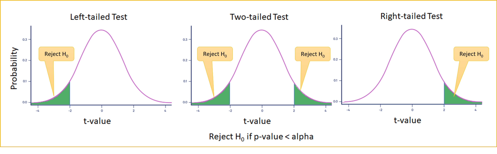
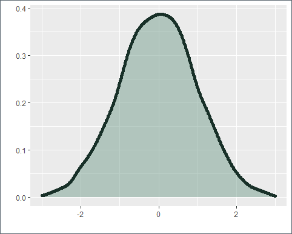
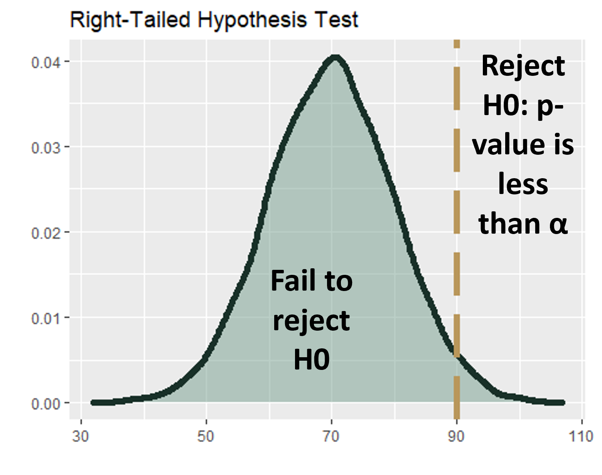
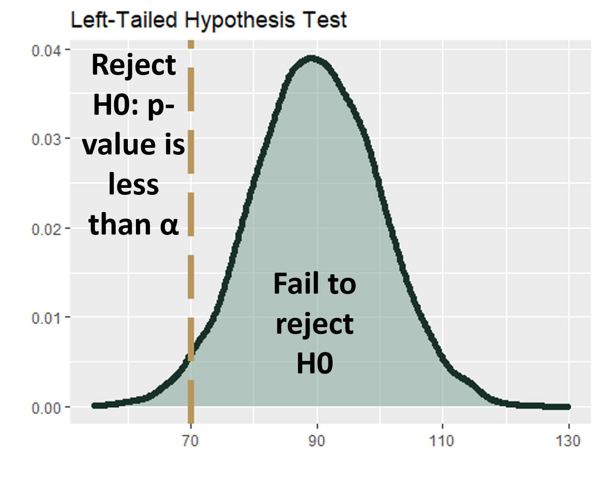
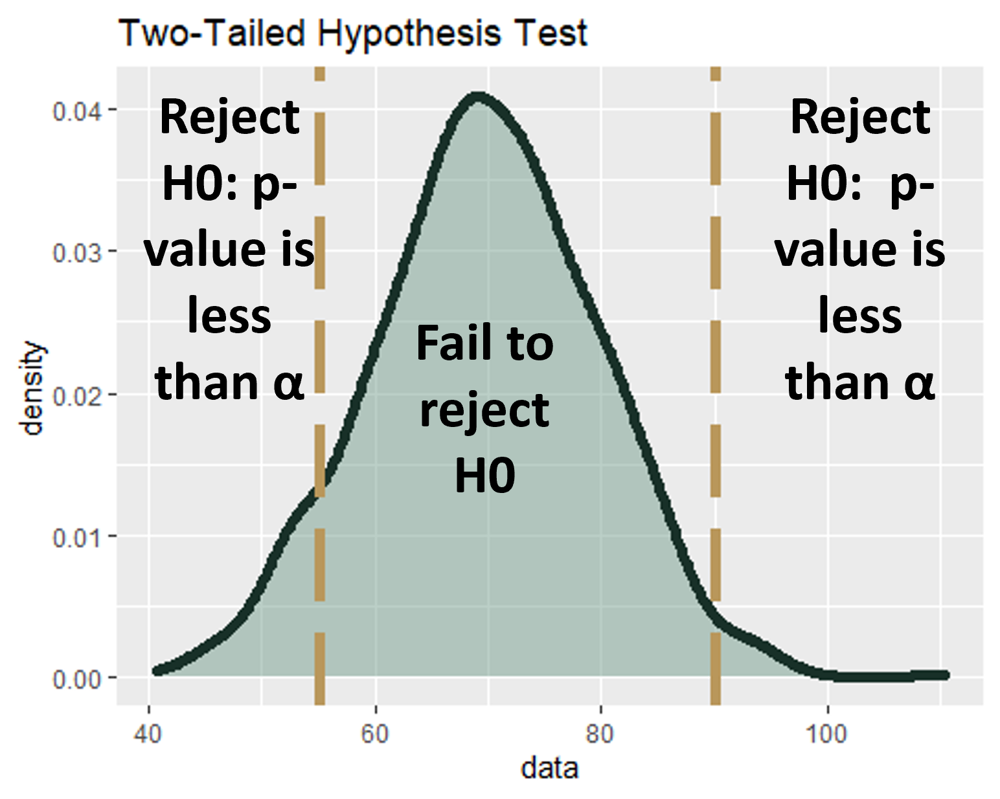
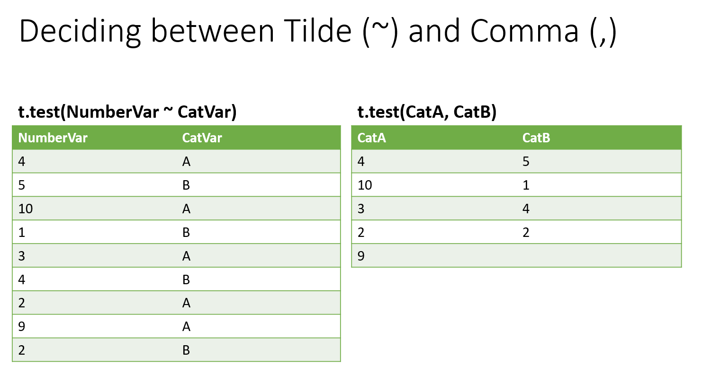
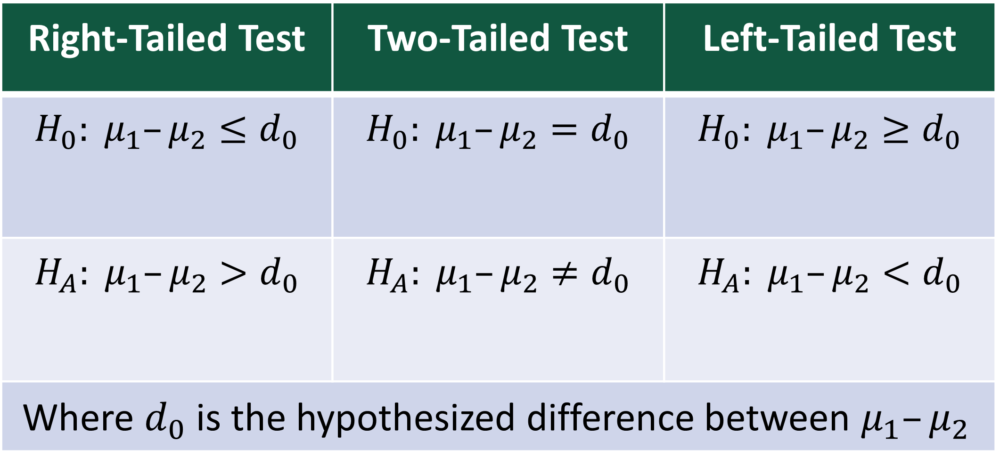
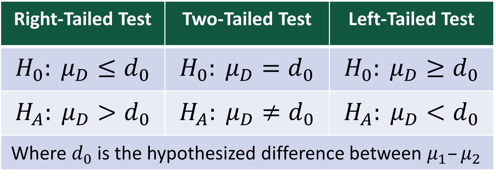

```{r setup, include=FALSE}
knitr::opts_chunk$set(echo=TRUE, tidy.opts = list(width.cutoff = 70), tidy = TRUE, message=FALSE, warning=FALSE)
```

This lesson introduces the logic and mechanics of statistical hypothesis testing, then applies that framework to three t-tests that will appear throughout the rest of the course.

We begin with the **foundations of hypothesis testing**: what a null and alternative hypothesis are, why we assume the null is true until the evidence says otherwise, and how the p-value approach works. A p-value is the probability of observing a result at least as extreme as the one calculated, *assuming the null hypothesis is true*. A small p-value means the observed data would be very unlikely if the null were true — giving us grounds to reject it. We set a decision rule in advance: reject $H_0$ if the p-value is less than alpha (typically 0.05). We also cover the three tail configurations — two-tailed ($\neq$), right-tailed ($>$), and left-tailed ($<$) — and how the direction of the alternative hypothesis determines which tail of the distribution we look at.

The lesson then works through three **t-tests**, each using R's `t.test()` function with different arguments. All three follow the same three-step procedure: specify hypotheses, compute the test statistic and p-value, interpret and conclude. The t-distribution is used instead of the z-distribution because we are estimating population parameters from sample data — specifically, we rarely know the population standard deviation. Where a z-score measures how many standard deviations a value is from the mean, a t-statistic measures how many standard errors the sample mean is from the hypothesized value. As sample size grows, the t-distribution approaches the normal distribution.

The **one-sample t-test** compares a single sample mean to a known or hypothesized value — for example, testing whether average study hours differ from 12. The **independent samples t-test** compares the means of two unrelated groups — for example, whether systolic blood pressure differs between males and females. The **dependent (paired) samples t-test** compares two related measurements, such as weight before and after an intervention, where each observation in one group is matched to a specific observation in the other. The key to choosing the right test is understanding how the data are structured.

By the end of this lesson, you should be able to set up and interpret any of the three t-tests in R, choose the correct test for a given research question, and write a formal conclusion from the output. Work through every code example in your own R script alongside the reading.

### At a Glance

-   In order to succeed in this section, you will need to understand how to set up and test a hypothesis, knowing that we can reuse this logic for many other types of models throughout the course. Pay close attention to why we use the t-distribution — and how it differs from the z-distribution — for one-sample, independent samples, and dependent samples tests. Additionally, note when the test is two-tailed, right-tailed, or left-tailed, and what that means for the interpretation of the results.

### Lesson Objectives

-   Explain the logic of hypothesis testing: null and alternative hypotheses, p-value interpretation, and the decision rule.
-   Distinguish between two-tailed, right-tailed, and left-tailed tests and set up each correctly.
-   Compare a sample mean to a hypothesized population value with a one-sample t-test.
-   Compare two unrelated sample means with an independent-samples t-test.
-   Compare two related sample means with a dependent-samples (paired) t-test.
-   Select the correct t-test for a given research question based on data structure.

### Consider While Reading

-   In this lesson, we introduce hypothesis testing — the formal statistical process for deciding whether sample evidence supports a claim about a population. This framework carries forward for the remainder of the course: ANOVA, regression, and correlation all follow the same fundamental logic of comparing a test statistic to a null distribution and interpreting the resulting p-value.
-   We cover three t-tests that use the `t.test()` command with different arguments. The differences between them come down to one question: what are you comparing? A sample mean to a benchmark, two independent groups, or two related measurements on the same subjects?
-   As you read, pay particular attention to how the alternative hypothesis determines the direction of the test — and therefore which side of the distribution you examine — and how `paired = TRUE` versus the tilde (`~`) syntax in `t.test()` changes the structure of the test.

## Hypothesis Testing

-   A hypothesis test resolves conflicts between two competing opinions (hypotheses).
-   In a hypothesis test, we define the null hypothesis as $H_0$, which is the presumed default state of nature or status quo. We define the alternative hypothesis as $H_A$, *a contradiction of the* default state of nature or status quo.
-   In statistics we use sample information to make inferences regarding the unknown population parameters of interest. We conduct hypothesis tests to determine if sample evidence contradicts $H_0$.
    -   On the basis of sample information, we either “Reject the null hypothesis” in which sample evidence is inconsistent with $H_0$. This means that we show support for our alternative hypothesis, $H_A$.
    -   Or we “Do not reject the null hypothesis.” in which the sample evidence is not inconsistent with $H_0$; or we do not have enough evidence to “accept” $H_0$. This means that there is no support for our alternative hypothesis, $H_A$.
-   General guidelines:
    -   Null hypothesis, $H_0$, states the status quo.
    -   Alternative hypothesis, $H_A$, states whatever we wish to establish (i.e., contests the status quo).
-   Use the following signs in hypothesis tests:
    -   $H_0$: $=$ or $>=$ or $<=$ to specify status quo.
    -   $H_A$: $\neq$ or $<$ or $>$ to contradict $H_0$.
-   Where $H_0$ always contains the equality sign.

### Hypothesis Testing Covers a Variety of Tests

-   We will cover the following:

1.  One-Sample t-test;
2.  Independent samples t-test;
3.  Dependent (or Paired) samples t-test.

### Using a t-Distribution

-   All of these hypothesis tests listed above use a t-distribution, which is like a z-distribution (i.e., z-score), but specifically accounts for some specific population information being unknown.
    -   The z-distribution shows how many sample standard deviations (SD) some value is away from the mean.
    -   The t-distribution shows how many standard errors (SE) some value is away from the mean.
-   All of these hypothesis tests in the assigned readings use the t.test() command to execute in R with different parameters set.

### Approaches to Hypothesis Testing

-   All approaches to scientific hypothesis testing enable us to determine whether the sample evidence is inconsistent with what is hypothesized under the null hypothesis, $H_0$.

-   Basic principle: First assume that $H_0$ is true and then determine if sample evidence contradicts this assumption.

-   This means that we can never assume our claim (against status quo) is supported without rejecting the null statistically through the scientific process.

-   There are two general approaches to hypothesis testing:

    -   The Critical Value Approach
    -   The p-value Approach

#### The Critical Value Approach: Not used here.

-   In this approach, we calculate the test statistic, which is also based on the type of test conducted. We then see whether the test statistic is past the critical value either looked up in a table or computed directly from a function in R.

#### The p-Value Approach: What we are using here.

-   The **p-value** is simply the probability of observing a result at least as extreme as the one we calculated, *assuming the null hypothesis is true*. A very small p-value means that what we observed would be very unlikely if the null were true — giving us reason to reject it. We compare the p-value to a pre-determined significance level (alpha, usually set at 0.05). If the p-value is less than alpha, we reject the null hypothesis. If it is greater than or equal to alpha, we fail to reject it. Note: failing to reject the null is **not** the same as proving it is true.

-   In this approach, we still calculate the test statistic, which is still based on the type of test conducted. However, in the p-value approach, this test statistic corresponds directly to a p-value, or probability value, that we use to make a decision on whether the hypothesis is supported or not.

    -   The *p-value* is the likelihood, or probability, of observing a sample mean that is at least as extreme as the one derived from the given sample, under the assumption that the null hypothesis is true.
    -   The calculation of the p-value depends on the specification of the alternative hypothesis.
    -   We set a decision rule to reject $H_0$ if p-value $< \alpha$, which is set apriori. Specifically, the p-value approach sets an $\alpha$ value (e.g., .05, .01, .001) and then determines if the p-value calculated is less than the set alpha value. The smaller the $\alpha$, the more difficult it is to find significance in your alternative hypothesis, where you reject $H_0$.
        -   We typically set a $\alpha < .05$ for a variety of tests.
        -   We can go lower (e.g. .01, .001), but we typically do not go higher than .05.

#### Why Use The p-Value Approach

-   The critical value approach has variance in the formulas and numbers looked up (based on distribution and sometimes degrees of freedom), while the p-value is used consistently, we reject the null if our p-value is less than an $\alpha$ set apriori.

#### Three Step Procedure Using The p-value Approach

1.  Specify null and alternative hypothesis.
2.  Compute the test statistic and calculate the p-value.\
3.  Interpret the probability and state the conclusion.

### Setting up Hypotheses Tests

-   There are three types of hypotheses tests that you can analyze:

1.  Two-tailed test: $H_0 =$ vs $H_A \neq$
2.  Right-tailed test: $H_0 <=$ vs $H_A >$
3.  Left-tailed test: $H_0 >=$ vs $H_A <$

-   In a two-tailed test, the null is set to the equality ($H_0 =$) vs an alternate set to the inequality ($H_A \neq$). In a right-tailed test, the null is set to less than or equal to ($H_0 <=$), while the alternative is set to greater than ($H_A >$). Finally, in a left-tailed test, the null is set to greater than or equal to ($H_0 >=$), while the alternative is set to less than ($H_A <$).

-   In the figure below, the green area is the *Rejection region* where we reject $H_0$ and show support for our alternative hypothesis $H_A$.

    -   The rest of the area under the curve is the *Failure to Reject* $H_0$ region in which we cannot show support for our alternative hypothesis $H_A$.



-   In a hypothesis test, you have to decide if a claim is true or not. Before you can figure out if you have a left-tailed test or right-tailed test, you have to make sure you have a single tail to begin with. A tail in hypothesis testing refers to the tail at either end of a distribution curve.

    -   Step 1: Write your null hypothesis statement and your alternate hypothesis statement.
    -   Step 2: Draw a normal distribution curve.
    -   Step 3: Shade in the related area under the normal distribution curve. The area under a curve represents 100%, so shade the area accordingly. The number line goes from left to right, so the first 25% is on the left and the 75% mark would be at the right tail. 

### Hypothesis Testing: Single Population: A Right-Tailed Test

-   A right-tailed test is where your hypothesis statement contains a greater than (\>) symbol. In other words, the inequality points to the right.
    -   For example, consider comparing the life of batteries before and after a manufacturing change. If you want to know whether the battery life is greater than the original 90 hours, your hypothesis statements might be:
    -   Null hypothesis: No change or less than ($H_0$ ≤ 90)
    -   Alternate hypothesis: Increased change ($H_A$ \> 90) 

### Hypothesis Testing: Single Population: A Left-Tailed Test

-   A left-tailed test is where your hypothesis statement contains a less than (\<) symbol. In other words, the inequality points to the left.
    -   For example, consider comparing the life of batteries before and after a manufacturing change. If you want to know whether the battery life is less than 70 hours, your hypothesis statements might be:
    -   Null hypothesis: No change or greater than ($H_0$ ≥ 70)
    -   Alternate hypothesis: Decreased change ($H_A$ \< 70)



### Hypothesis Testing: Single Population: A Two-Tailed Test

-   The two-tailed test is called a two-tailed test because the rejection region can be in either tail.
    -   For example, consider comparing the life of batteries before and after a manufacturing change. If you want to know whether the battery life is different from the mean value, your hypothesis statements might be:
    -   Null hypothesis: Equals mean ($H_0 = \mu$).
    -   Alternate hypothesis: Not equal to mean ($H_A \neq \mu$).



### Forming a Hypothesis

-   When forming a hypothesis, we need to do the following first.
    1.  Identify the relevant population parameter of interest (e.g., $\mu$).
    2.  Determine whether it is a one- or a two-tailed test.
    3.  Include some form of the equality sign in $H_0$ and use $H_A$ to establish a claim.
-   For an example in how to set up a hypothesis, we can look at a trade group that predicts that back-to-school spending will average \$606.40 per family this year. The group uses this information to set an economic model in making predictions. A different economic model will be needed if the prediction is wrong.
    1.  Parameter of interest is $\mu$ since we are interested in the average back-to-school spending.
    2.  Since we want to determine if the population mean differs from 606.4 (i.e, $\neq$), it is a two-tail test.
    3.  The hypothesis test is as follows: $H_0: \mu = 606.4$ versus $H_A: \mu \neq 606.4$

## t.test() Command

-   The t.test() command can be used in a variety of ways to test many different kinds of hypotheses. It is important to look up that command in your help and see all the different arguments you can change. The following screenshot shows a snippet of this.


-   We use the default S3 method in conducting the t.test:
    -   Default S3 method: t.test(x, y = NULL,alternative = c("two.sided", "less", "greater"), mu = 0, paired = FALSE, var.equal = FALSE, conf.level = 0.95, ...).
-   We change arguments as needed to satisfy the type of test that we are conducting.

------------------------------------------------------------------------

With the framework for hypothesis testing established, the next three sections apply it to three specific scenarios using R's `t.test()` function. The choice of test depends entirely on what you are comparing and how the data are structured: one group versus a known value, two unrelated groups, or two related measurements on the same subjects.

## One-Sample t-Test

-   A one-sample t-test compares a mean to a population or hypothesized value.
-   A one-sample t-test requires a normal distribution; however, if underlying distribution is not normal, then by the rules outlined in central limit theorem (CLT), the sampling distribution is the approximately normal only if $n >= 30$.

### t.test() Command for One-Sample t-Test

-   In base R, the t.test() command discussed above is useful for getting the t for a one-sample t-test. The command arguments include the name of the variable and the hypothesized or population value ($\mu$) to compare it to. We can also include the alternative statement to signify a right-tailed, left-tailed, or two-tailed test.

### One-Sample Step 1: Specify Null and Alternative Hypothesis

-   In order to set up the appropriate null and alternative hypothesis, we need to determine the type of test: two-tailed, right-tailed, or left-tailed.

#### Two-Tailed Test

-   Reject $H_0$ on either side of the hypothesized value of the population parameter.

    -   $H_0: \mu =\mu_0$ versus $H_A$: $\mu \neq \mu_0$.

-   The $\neq$ symbol in $H_A$ indicates that both tail areas in the distribution will be used to make the decision regarding the rejection of $H_0$.

-   A not equal to sign in the alternative signifies a two-tailed test.

    -   An example of a *two-tailed* problem: A Dean is interested if the hours of study time per week is different than 12 hours.
    -   $H_0$: Study hours is not different than 12 hours ($=$).
    -   $H_A$: Study hours is different than 12 hours. ($\neq$).

-   Example of command in R:

    -   *two.sided* for two-tailed. However, this is the default value so it could be left out of the statement for the same results.
    -   $\mu$ of interest is 12.

    ```{r}
    StudyHours <- read.csv("data/StudyHours.csv")
    summary(StudyHours)
    OneSample <- t.test(StudyHours$Hours, alternative="two.sided", mu=12); OneSample
    #This test is significant at the .01 level as indicated by the p-value of .001047. 
    #We are 95% confident that our true mean lies between  13.89281 and 18.85005
    ```

#### One-Tailed Test

-   Reject $H_0$ only on one side of the hypothesized value of the population parameter.

    -   $H_0$: $\mu <=\mu_0$ versus $H_A$: $\mu > \mu_0$ (right-tailed test).
    -   $H_0$: $\mu >=\mu_0$ versus $H_A$: $\mu < \mu_0$ (left-tailed test).

-   Note that the inequality in the alternative $H_A$ determines which tail area will be used to make the decision regarding the rejection of $H_0$, right (\>) or left (\<).

-   A greater than sign in the alternative signifies a right-tailed test.

    -   An example of a *right-tailed* problem: A Dean is interested if the hours of study time per week is greater than 10 hours.

    -   $H_0$: Study hours are less than or equal to than 10 hours a week. ($<=$) $H_A$: Study hours are greater than 10 hours a week. ($>$)

    -   Example of right-tailed command in R:

        -   *greater* for right-tailed.
        -   $\mu$ of interest is 10 for 10 hours a week.

```{r}

OneSampleRight <- t.test(StudyHours$Hours, alternative="greater", mu=10); OneSampleRight

#test statistic is 5.224
# p-value is very small, close to 0. This test is significant at the .001 level as indicated by the p-value of 4.398e-06. 
#Reject the null and find that the hours of study are greater than 10 hours. 
#We are 95% confident that the true mean is greater than 14.3091

```

-   A less than sign in the alternative signifies a left-tailed test.

    -   Example of a *left-tailed* problem: A Dean is interested if the hours of study time per week is less than 24 hours.

    -   $H_0$: Study hours are greater than or equal to than 24 hours a week. ($>=$)

    -   $H_A$: Study hours are less than 24 hours a week. ($<$)

    -   Example of left-tailed command in R:

        -   *less* for left-tailed.
        -   $\mu$ of interest is 24 for 24 hours a week.

```{r}
OneSampleLeft <- t.test(StudyHours$Hours, alternative="less", mu=24); OneSampleLeft
#This test is significant at the .001 level as indicated by the p-value of 2.015e-07. 
#test statistic: -6.2547
#p-value < .001 which means reject the null and find that true mean is less than 24
##We are 95% confident that the true mean is less than 18.43376
```

### One-Sample Step 2: Compute the Test Statistic and p-value

-   When the population standard deviation $\sigma$ is unknown, the test statistic for testing the population mean $\mu$ is assumed to follow the $t$ distribution with a computed degrees of freedom ($df$) based on whether population variances are assumed to be equal or not.
-   Formula for the Test Statistic: $t = (m_x-\mu_x)/(s_x/\sqrt(n_x))$
    -   In the One-sample t-test, $m_x$ represents the mean of the variable $x$, the variable to be tested, $\mu_x$ is the population mean or hypothesized value of the variable, $s_x$ is the sample standard deviation of $s$, and $n$ is the sample size.
-   R will compute the $df$ based on the parameters set in the t.test() command along with the test statistic, so we can rely on it to calculate this for us.

### One-Sample Step 3: Interpret and Conclude

-   Set alpha ($\alpha$) to a common level, like .05, and compare it to the calculated p-value from your output in R.
-   Reject $H_0$ if p-value is less than $\alpha$ value. This means we show support for our alternative hypothesis $H_A$, which is against status quo.
-   Interpret the results in plain English.

### Example of a One-Sample t-Test in R

-   To conduct a one-sample t-Test in R, first, let's read in a dataset nhanes2016.csv from your book files and go ahead and load the tidyverse. Tidyverse is loaded so that we can subset the dataset in the next example.

```{r, message=FALSE, warning=FALSE}
nhanes.2016 <- read.csv(file = "data/nhanes2016.csv")
library("tidyverse")
```

-   Second, lets select a variable to test. We are going to compare the mean of variable BPXSY1 to 120, which makes it a two-tailed test ($= vs \neq$) with the $\mu$ set to 120.

-   Once we have our problem idea, we can go through the steps listed above.

-   Step 1: Write null and alternative.

    -   H0: There is no difference between mean systolic BP and the cutoff for normal BP, 120 mmHG.
    -   HA: There is a difference between mean systolic BP and the cutoff for normal BP, 120 mmHG.

-   Step 2: Calculating test-statistic and p-value.

    -   Again, the t.test() command does both, the statement and output are listed below.

```{r}
t.test(x = nhanes.2016$BPXSY1, mu = 120, alternative="two.sided")
###p-value is 0.01435
####At an alpha of .05 - we reject the null. 
###At an alpha of .01 or .001 - we fail to reject the null. 

##We are 95$ confident that our true mean is in between  120.1077 and 120.9711
##sample mean of 120.5394 
```

-   Step 3: Interpret probability and results.

    -   We found a test statistic is 2.4491, and a corresponding p-value is .01435. If our alpha was set to .05, .01435 is smaller than that (p-value \< alpha) This indicates that we should reject the null ($H_0$) and support the alternative ($H_A$) that the true mean is not equal to 120. This is in regards to blood pressure.
    -   Therefore, the sample mean systolic BP not equal to 120, or more formally the mean systolic blood pressure in a sample of 7,145 people was 120.54 (sd = 18.62). And our one-sample t-test found this mean to be statistically significantly different from the hypothesized mean of 120 \[t(7144) = 2.449; p = 0.01435\].

-   This indicates that the sample likely came from a population with a mean systolic blood pressure not equal to 120, signifying that the true population is likely not equal to 120.

-   Take note that if we used a smaller alpha (like .01 or .001), we would not pass the test and instead fail to reject the null.

### Example of a One-Sample Using a Subset

-   Let's do another example using a subset of the data. In this example, let's create a subset of people 65+ years old to run the same two-tailed test. This allows us to see if the people 65 years and older had a different blood pressure than 120.
-   In the command below, we use tidyverse to set up a new data frame object named nhanes.2016.65plus to save the filtered data.\

```{r}
nhanes.2016.65plus <- nhanes.2016 %>%
  filter(RIDAGEYR >= 65)
```

-   Step 1: Write null and alternative.
    -   H0: There is no difference between mean systolic BP and the cutoff for normal BP, 120 mmHG when people are 65 or over.
    -   HA: There is a difference between mean systolic BP and the cutoff for normal BP, 120 mmHG when people are 65 or over.
-   Step 2: Calculating test-statistic and p-value.
-   Again, we can use one t.test() command to handle steps 2 and 3.

```{r}
t.test(x = nhanes.2016.65plus$BPXSY1, mu = 120)
###Reject Ho and find that Systolic BP is different for people 65 and older.
```

-   Step 3: Interpret probability and results.
    -   Based on our output, we found a test statistic is 29.238, and a corresponding p-value is .000. If our alpha was set to .05, .000 is smaller than that (p-value \< alpha). This indicates that we should reject the null and support the alternative that the true mean is not equal to 120 for people 65 and older. This again is in regards to blood pressure.
    -   The mean systolic blood pressure in a sample of 1233 NHANES participants who were age 65 and above was 136.60 (sd = 19.93). The mean systolic blood pressure was found to be statistically significantly different from the hypothesized mean of 120 via a one-sample t-test (t(1232) = 29.238, p \< 0.001). The true mean systolic blood pressure in the population of adults 65 and older is likely not equal to 120.

## Independent Samples t-Test

-   Independent samples t-test compares the means of two unrelated groups, so instead of just one population, we have 2 mutually exclusive groups.
-   More formally, two (or more) random samples are considered independent if the process that generates one sample is completely separate from the process that generates the other sample.
    -   The samples are clearly delineated.
    -   $\mu_1$ is the mean of the first population.
    -   $\mu_2$ is the mean of the second population.
-   The sampling distribution is assumed to be normal and the linear combination of normally distributed random variables is also normally distributed.
-   If underlying distribution is not normal, then by the CLT, the sampling distribution is approximately normal only if both $n_1 >= 30$ and $n_2 >= 30$.

### t.test() Command for Independent Samples t-Test

-   In base R, the t.test() command is useful for getting the t for the Independent samples t-test. This is the same t.test() command used above.

-   The command needs to be altered to handle the second group. In the command, the arguments include a formula which is formatted as t.test(continuous_variable \~ grouping_variable) or t.test(population1, population2). Deciding on the correct format of the argument depends on the shape of the data discussed later on.



-   Using the \~ symbol between variables: This method allows you to run the t-test without having to split the data manually if your data is not already split. You specify the numerical variable (your continuous measurement) on the left and the categorical variable (which identifies the two groups) on the right of the \~ symbol.

### Independent Samples Step 1: Specify Null and Alternative Hypothesis

-   When conducting hypothesis tests concerning $\mu_1  - \mu_2$ , the competing hypotheses will take one of the following forms:
    -   Two-tailed Test: $H_0: \mu_1  - \mu_2 =  d_0$ versus $H_A: \mu_1  - \mu_2 \neq  d_0$
    -   Right-tailed Test: $H_0: \mu_1  - \mu_2 <=  d_0$ versus $H_A: \mu_1  - \mu_2 >  d_0$
    -   Left-tailed Test: $H_0: \mu_1  - \mu_2 >=  d_0$ versus $H_A: \mu_1  - \mu_2 <  d_0$
-   Where $d_0$ is the hypothesized difference between $\mu_1  - \mu_2$.



-   A separate ($d_0$) value can be set here under the ($\mu$) parameter if the value is not equal to 0, however 0 is the most common which tests for differences between populations (i.e., is the mean of population 1 different than mean of population 2). The alternative statement can be set at "two.sided", "greater", or "less".

-   Example of a two-tailed test:

-   Does spending differ between men and women?

    -   $H_0$: No difference in spending between men and women. ($=$).

    -   $H_A$: There is a difference in spending between men and women ($\neq$).

    -   Example of a two-tailed command in R:

        -   The statement assumes that men's spending and women's spending are in 2 different columns in the data set. Therefore, the format t.test(var1, var2) should be used.

```{r}
Spend <- read.csv("data/Spend.csv")
summary(Spend)
```

```{r}
t.test(Spend$MenSpend, Spend$WomenSpend, alternative= "two.sided", mu=0) 
#This test is not significant as indicated by a p-value = 0.1259 which is greater than .05. 
##95% confident that the true mean difference is in between  -3.984055 and 31.317388
```

-   The alternative $H_A$ and $\mu$ are not changed off their default values, so the statement above could be simplified from what is provided to the statement below.

```{r}
t.test(Spend$MenSpend, Spend$WomenSpend)

#Take note of the order of the means present in the t-test function. 
mean(Spend$MenSpend) #100.9
mean(Spend$WomenSpend) #87.23333

```

-   Example of a right-tailed test: Is men's spending ($\bar{x}_1$) greater than that of women's spending ($\bar{x}_2$)?
    -   $H_0$: Men's spending is less than or equal to women's spending ($<=$).
    -   $H_A$: Men's spending is greater than women's spending ($>$).
    -   Example of a right-tailed command in R:
-   Again, the statement assumes that men's spending and women's spending are in 2 different columns in the data set. The alternative is changed off the default value, so the statement parameter is required.

```{r}
t.test(Spend$MenSpend, Spend$WomenSpend, alternative= "greater") 
#This test is not significant as indicated by a p-value = 0.06296 which is greater than .05. 
```

-   Example of a left-tailed test: Is men's spending ($\bar{x}_1$) less than that of women's spending ($\bar{x}_2$)?
    -   $H_0$: Men's spending is greater than or equal to women's spending ($>=$).
    -   $H_A$: Men's spending is less than women's spending ($<$).
    -   Example of a left-tailed command in R:
-   Again, the statement assumes that men's spending and women's spending are in 2 different columns in the data set. The alternative is changed off the default value, so the statement parameter is required.

```{r}
t.test(Spend$MenSpend, Spend$WomenSpend, alternative= "less") 
#This test is not significant as indicated by a p-value = 0.937 which is greater than .05. 
```

### Independent Samples Step 2: Compute the Test Statistic and p-value

Formula for the Test Statistic: $t = (m_1 - m_2)/\sqrt((s^2_1/n_1)+(s^2_2/n_2))$

-   In the independent samples t-test formula, $m_1$ is the mean of one group and $m_2$ is the mean of the other group; the difference between the means makes up the numerator. The larger the difference between the group means, the larger the numerator will be and the larger the t-statistic will be!

-   The denominator includes the variances for the first group, $s^2_1$, and the second group, $s^2_2$ along with the sample sizes for each group, $n_1$ and $n_2$.

-   For the independent samples t-test, degrees of freedom are approximated using the Welch-Satterthwaite equation (computed automatically by R).

-   There is a 95% confidence interval around the difference between the groups.

-   Calculate the p-value and Compare it to a Predetermined Alpha level

### Independent Samples Step 3: Interpret and Conclude

### Example of an Independent Samples t-Test in R

-   Using the nhanes data set, let's bring over some code from the last section so that we can work this example. This includes reading in the data set and creating the subset for the ages 65 and over.

```{r, message=FALSE}
nhanes.2016 <- read.csv(file = "data/nhanes2016.csv")
library("tidyverse")
nhanes.2016.65plus <- nhanes.2016 %>%
  filter(RIDAGEYR >= 65)
```

-   When conducting independent samples, grouping variables are common, so you can see if there is a difference between groups. In this example, we can test for a difference in blood pressure by sex (Male vs Female). This is coded as 1 and 2 in the data set, so we need to recode it before we begin the official test.

```{r}
nhanes.2016.cleaned <- nhanes.2016 %>%
  mutate(RIAGENDR = recode_factor(.x = RIAGENDR,
     '1' = 'Male',
     '2' = 'Female')) %>%
  rename(sex = RIAGENDR) %>%
  rename(systolic = BPXSY1)

```

-   We can do a quick check of the mean values before we begin by either using a tapply or tidyverse. The means seem close here, but that does not mean that we won't find significance. We need to do the t-test to formally confirm whether a mean difference is present or not.
-   The tapply uses tidyverse and the group_by uses tidyverse to calculate these mean differences.
-   tapply() is a base R function used to apply a function, such as mean or sum, to subsets of a vector that are defined by one or more grouping factors. It takes three main arguments: the vector to be analyzed, the grouping factor(s), and the function to apply. This function is useful for performing quick, grouped summaries in base R. However, while tapply() is concise, it is less flexible than tidyverse tools like dplyr when handling more complex data manipulations or when working with data frames.
-   In the tidyverse, the group_by() and summarise() functions from the dplyr package are commonly used together to calculate summary statistics like the mean for different groups within a dataset. The group_by() function is used to define the grouping variable(s), essentially splitting the data into subsets based on the unique values of that variable. Once the data is grouped, summarise() is used to apply a summary function, such as mean(), to each group.

```{r}
tapply(nhanes.2016.cleaned$systolic, nhanes.2016.cleaned$sex, mean, na.rm=TRUE)

nhanes.2016.cleaned %>%
  group_by(sex) %>%
  summarise(mean_systolic = mean(systolic, na.rm = TRUE))

```

-   Step 1: Write null and alternative.

    -   $H_0$: There is no difference between systolic blood pressure for males and females ($=$).
    -   $H_A$: There is a difference between systolic blood pressure for males and females ($\neq$).
    -   This is a two tailed test.

-   Step 2: Calculating test-statistic and p-value.

    -   The statement below assumes that the grouping variable (sex) is in one column, and the continuous variable (systolic) is in another column. In this case, instead of a comma between the two columns of sex (like above), we write the statement as t.test(continuousVar \~ groupingVar) like below.

    ```{r}
    # All other parameters can be left at default values
    t.test(nhanes.2016.cleaned$systolic ~ nhanes.2016.cleaned$sex)
    ```

-   Step 3: Interpret probability and results.

    -   We found a test statistic is 7.3135, and a corresponding p-value is .000. If our alpha was set to .05, .000 is smaller than that (p-value \< alpha). This indicates that we should reject the null and support the alternative that the men and women had different systolic blood pressure. Thus, there is a statistically significant difference in the mean blood pressure of males and females in the 2016 data set (t(7143) = 7.3135, p = .000).

### Example Independent t-test Using a Subset

-   Create a subset of the data frame of people 65+ years old to run the same test on blood pressure (two-tailed test).

```{r}
nhanes.2016.65plus.clean<- 
  nhanes.2016.65plus %>%
  drop_na(BPXSY1) %>%
  mutate(sex = recode_factor(.x = RIAGENDR,
     '1' = 'Male',
     '2' = 'Female')) %>%
  rename(systolic = BPXSY1)
```

-   Step 1: Write null and alternative.
    -   $H_0$: There is no difference between systolic blood pressure for males and females 65 years or older
    -   $H_A$: There is a difference between systolic blood pressure for males and females 65 years or older
    -   This is a two tailed test.
-   Step 2: Calculating test-statistic and p-value.

```{r}
t.test(nhanes.2016.65plus.clean$systolic ~ nhanes.2016.65plus.clean$sex)
```

-   Step 3: Interpret probability and results.
    -   We found a test statistic is -2.0141, and a corresponding p-value is 0.04422. If our alpha was set to .05, 0.04422 is smaller than that (p-value \< alpha). This indicates that we should reject the null and support the alternative that the men and women 65 or older had different systolic blood pressure. Thus, there is a statistically significant difference in the mean blood pressure of males and females over the age of 65 participating in the 2016 NHANES (t(1231) = -2.01, p = 0.044).

## Dependent Samples t-Test

-   Dependent samples or a Paired samples t-test compares the means of two related groups.
-   The *Dependent* means there is a deliberate Pairing, or more specifically *Matched Pairing* that generally come from 2 methods:
    -   "Before” and “after” studies characterized by a measurement, some type of intervention, and another measurement, all on the same subject.
        -   Example: Measuring the weight of clients before and after a diet plan.
    -   A pairing of observations, where it is not on the same subject that gets sampled twice.
        -   Example: Matching 20 adjacent plots of land using a nonorganic fertilizer on one half of the plot and an organic fertilizer on the other.
-   The parameter of interest is the mean difference D where $D = x_1 - x_2$ and the random variable $x_1$ and $x_2$ are a matched pair.
-   This works under the assumption regarding CLT that both $x_1$ and $x_2$ are normally distributed or $n >= 30$.

### t.test() Command for Dependent Samples t-Test

-   **Option 1**: Use the `paired = TRUE` parameter. The default for the command is `paired = FALSE`, which performs an independent samples t-test.
-   **Option 2**: Manually calculate the difference between the paired values and pass that as the single variable to `t.test()`. This is equivalent to the paired approach.
-   Summary: In a paired t-test, you're comparing two related sets of observations, such as measurements taken from the same subjects under different conditions. The key is that each observation in one group has a corresponding observation in the other group. In R, you can perform a paired t-test by either specifying paired = TRUE in the t.test function or by directly calculating the differences between the paired observations and running the t-test on those differences. If you choose the second approach, you subtract one set of values from the other and then use that result as the first argument in the t.test function (essentially calculating the $\mu_d$. This directly tests whether the mean of the differences is significantly different from zero, giving the same result as a paired t-test but with the differences calculated explicitly beforehand. Either method is fine.

### Paired Step 1: Specify Null and Alternative Hypothesis

-   When conducting hypothesis tests concerning $\mu_d$ , the competing hypotheses will take one of the following forms:
    -   Two-tailed Test: $H_0: \mu_d  = d_0$ versus $H_A: \mu_d \neq  d_0$
    -   Right-tailed Test: $H_0: \mu_d <= d_0$ versus $H_A: \mu_d>  d_0$
    -   Left-tailed Test: $H_0: \mu_d >= d_0$ versus $H_A: \mu_d< d_0$
-   Where $d_0$ typically is equal to 0, but not always. If $d_0$ is something other than 0, then you change the mu parameter in R in the t.test() command.



-   Example of a two-tailed test:

-   Is the weight before and after quitting smoking different from each other?

    -   The before and after signifies a paired test.
    -   $H_0$: No difference in weight before and after smoking ($=$).
    -   $H_A$: There is a difference in weight before and after smoking ($\neq$).
    -   Example of a two-tailed command in R for a paired test:

    ```{r}
    Smoke <- read.csv("data/Smoke.csv")
    #Other default values are left off this statement. Assumes a mu at 0. 
    t.test(Smoke$After, Smoke$Before, paired = TRUE )
    #This test is significant at the .001 level as indicated by the p-value of 2.695e-08.  
    ```

-   Example of a right-tailed test:

-   Is the weight after quitting smoking ($\mu_1$) greater than the weight before ($\mu_2$)?

    -   $H_0$: Weight after smoking is less than or equal to the weight before ($<=$).
    -   $H_A$: Weight after smoking is greater the weight to before ($>$).
    -   Example of a right-tailed command in R for a paired test:

    ```{r}
    # The paired statement is true (due to the before after)
    #If we bring WeightBeforeQuitting to the right side of the equation we get WeightAfterQuitting > WeightBeforeQuitting, which is what our hypothesis wants. 
    #Therefore, in the statement below, after comes first as m1 followed by a comma, followed by the before as m2. 
    #The alternative parameter is then set to "greater"
    #Other default values are left off this statement
    t.test(Smoke$After, Smoke$Before, paired = TRUE, alternative="greater" )
    #This test is significant at the .001 level as indicated by the p-value of 1.347e-08. 
    ```

-   Example of a left-tailed test:

-   Is the weight after quitting smoking ($\mu_1$) less than the weight before ($\mu_2$)?

    -   $H_0$: Weight after smoking is greater than or equal to the weight before ($>=$).
    -   $H_A$: Weight after smoking is less to the weight before ($<$).
    -   Example of a left-tailed command in R for a paired test:

    ```{r}
    #The alternative parameter switches to "less" leaving all else the same as above. 
    #Again, other default values are left off this statement
    t.test(Smoke$After, Smoke$Before, paired = TRUE, alternative="less" )
    #This test is not significant as indicated by a p-value of 1, which is greater than .05.
    ```

### Paired Step 2: Compute the Test Statistic and p-value

Formula for the Test Statistic: $t = (m_d-d_0)/\sqrt((s^2_d/n_d)$

-   Dependent samples t-test formula: The $m_d$ is the mean of the differences between the related measures, the $s^2_d$ is the variance of the mean difference between the measures, and $n_d$ is the sample size. The dependent samples t-test worked a little differently from the independent samples t-test. In this case, the formula uses the mean of the differences between the two related measures.

-   Calculate the p-value and Compare it to a Predetermined Alpha level

### Paired Step 3: Interpret and Conclude

-   The steps involved with setting up the null and alternative hypotheses and calculating the test statistic are based on different rules and formulas for all three t-tests, but the rest of the steps are the same.

### Example of an Dependent Samples t-Test in R

-   Given the nhanes.2016 dataset, let's ask the following research question: Is there a difference between measure 1 and 2 for systolic BP?

-   First, bring back in the data set from the last section.

```{r, message=FALSE}
nhanes.2016 <- read.csv(file = "data/nhanes2016.csv")
library("tidyverse")
```

-   Step 1: Write null and alternative.
    -   $H_0$: No difference between measures 1 and 2 for systolic BP. ($=$)
    -   $H_A$: There is a difference between measures 1 and 2 for systolic BP. ($\neq$).
    -   This is a two tailed test.
-   Use the nhanes.2016.cleaned from above but be sure to rename BPXSY2 to systolic2 (two-tailed test).

```{r}
nhanes.2016.cleaned <- nhanes.2016 %>%
  mutate(RIAGENDR = recode_factor(.x = RIAGENDR,
    '1' = 'Male',
    '2' = 'Female')) %>%
  rename(sex = RIAGENDR) %>%
  rename(systolic = BPXSY1) %>%
  rename(systolic2 = BPXSY2) %>%
  mutate(diff.syst = systolic - systolic2)
```

-   Step 2: Calculate test-statistic and p-value.

```{r}
t.test(nhanes.2016.cleaned$systolic,
       nhanes.2016.cleaned$systolic2,
       paired = TRUE)
```

-   Step 3: Interpret probability and results
    -   We found a test statistic is 9.3762, and a corresponding p-value is 0.000. If our alpha was set to .05, 0.000 is smaller than that (p-value \< alpha). This indicates that there is a difference in systolic blood pressure 1 and 2. Thus, there is a statistically significant difference in the mean blood pressure of reading 1 and 2 in the 2016 NHANES (t(7100) = 9.3762, p = 0.000).

### reshape function

-   The reshape function allows you to restructure a data frame by specifying a timevar (The variable in the data that defines the different time points or conditions), and idvar (The variable that uniquely identifies each subject or observational unit), and a direction ("wide" or "long")
-   The syntax is as follows: reshape(data, timevar, idvar, direction, ...)
-   The direction of reshaping, either "wide" to spread the data across columns or "long" to gather the data into rows.

```{r}
data("sleep")
summary(sleep)
sleep2 <- reshape(sleep, timevar ="group", idvar = "ID", direction="wide")
summary(sleep2)
t.test(sleep2$extra.1, sleep2$extra.2, paired=TRUE)

```

-   Using tidyverse, we could get the same effect using the filter, select, and rename functions which are a part of dplyr. This method involves dividing the dataset into two separate groups based on a categorical variable. You then run the t-test on these two groups. In the code below, we use filter to divide by group and then after selecting and renaming the columns we need, we join back together using a full_join.
-   Using full_join ensures that all IDs are included in the resulting dataset, even if they only appear in one of the groups. This can be useful if your data might have missing group entries for some IDs.

```{r}
data("sleep")
summary(sleep)
library(tidyverse)
group1 <- sleep %>%
     filter(group == 1) %>%
     select(ID, extra) %>%
     rename(extra.1 = extra)

group2 <- sleep %>%
     filter(group == 2) %>%
     select(ID, extra) %>%
     rename(extra.2 = extra)

sleep2 <- group1 %>%
     full_join(group2, by = "ID")
t.test(sleep2$extra.1, sleep2$extra.2, paired=TRUE)
```

-   In either case, we reject the null hypotheses and find that the type of drug does affect the sleep in patient

# Review and Practice

## Using AI

Use the following prompts with our chatbot (bottom right of this page) to explore these concepts further.

-   Can you explain the difference between the null hypothesis and the alternative hypothesis, and why is it important to set up both correctly before conducting a t-test?

-   What factors determine whether you should use a one-sample, independent samples, or dependent samples t-test, and how do the results differ based on the test chosen?

-   When should I use a two-tailed t-test compared to a right- or left-tailed test, and how does the alternative hypothesis guide this decision?

-   What are the key arguments in the t.test() function in R, and how do I modify these arguments to perform different types of t-tests, such as two-tailed or paired t-tests?

-   How do I interpret the p-value in the context of hypothesis testing, and how does it relate to rejecting or failing to reject the null hypothesis?

-   How does the confidence interval calculated during a t-test help in understanding the range of possible population parameters, and why is it important in hypothesis testing?

-   What is the difference between an independent samples t-test and a dependent (paired) samples t-test, and in what situations should each be used? \# Summary and Review

## t-Test Lab

**A campus dining service** claims that the average wait time at peak lunch hours is 8 minutes. A student researcher times 40 randomly selected visits and finds a mean wait of 9.4 minutes (sd = 3.1 minutes). Without running the code, set up the null and alternative hypotheses for a two-tailed test, and identify which t-test is appropriate and why.

::: {.callout-note collapse="true"}
### Show Answer

This is a **one-sample t-test** because we are comparing a single sample mean (9.4 minutes) to a known or claimed population value (8 minutes).

-   $H_0$: The mean wait time is equal to 8 minutes. ($\mu = 8$)
-   $H_A$: The mean wait time is not equal to 8 minutes. ($\mu \neq 8$)
-   Two-tailed because the researcher is testing for any difference, not a specific direction.

``` r
t.test(wait_times, mu = 8, alternative = "two.sided")
```
:::

**Identify** whether each scenario below calls for a one-sample, independent samples, or dependent samples t-test. Briefly justify each choice.

-   

    a.  A hospital compares the recovery times of patients assigned to two different physical therapy programs.

-   

    b.  A nutritionist records a client's sodium intake before and after a four-week dietary intervention.

-   

    c.  A manufacturer wants to know if the average output voltage of a new circuit board differs from the specification of 5.0 volts.

-   

    d.  A university compares the GPA of students who attended orientation versus those who did not.

::: {.callout-note collapse="true"}
### Show Answer

-   **a. Independent samples t-test.** Two separate, unrelated groups (different patients in different programs). Each patient appears in only one group.
-   **b. Dependent (paired) samples t-test.** The same clients are measured twice — before and after. Each "before" observation is directly linked to the same person's "after" observation.
-   **c. One-sample t-test.** One sample of circuit boards is being compared to a single known specification value (5.0 volts), not to another group.
-   **d. Independent samples t-test.** Two distinct, unrelated groups of students — those who attended orientation and those who did not. No natural pairing between individuals across groups.
:::

**A two-tailed one-sample t-test** returns a t-statistic of 2.31 with a p-value of 0.024. Alpha is set at 0.05. State the conclusion in plain English, including both the formal decision and a sentence that communicates the result to a non-statistician.

::: {.callout-note collapse="true"}
### Show Answer

**Formal decision:** Since the p-value (0.024) is less than alpha (0.05), we reject the null hypothesis.

**Plain English conclusion:** The sample provides statistically significant evidence that the true population mean is different from the hypothesized value. In other words, the difference we observed is unlikely to be due to random chance alone — there is real evidence that the actual average differs from what was claimed.

Note: If alpha had been set to 0.01, the p-value of 0.024 would be *greater* than alpha, and we would fail to reject the null. The conclusion depends on the alpha level chosen before running the test.
:::

**A researcher** wants to test whether employees who participate in a wellness program report fewer sick days than those who do not. She collects data on 45 participants and 45 non-participants. Write out the null and alternative hypotheses, identify the test, specify the `alternative` argument in R's `t.test()` function, and explain how the direction of the hypothesis affects which tail is examined.

::: {.callout-note collapse="true"}
### Show Answer

**Test:** Independent samples t-test — two separate, unrelated groups (participants vs. non-participants).

Let $\mu_1$ = mean sick days for wellness program participants and $\mu_2$ = mean sick days for non-participants.

-   $H_0: \mu_1 - \mu_2 \geq 0$ (participants have the same or more sick days)
-   $H_A: \mu_1 - \mu_2 < 0$ (participants have *fewer* sick days — left-tailed)

``` r
t.test(sick_days ~ group, alternative = "less")
```

**Why left-tailed?** The hypothesis is directional — the researcher specifically predicts that participants will have *fewer* sick days, meaning $\mu_1 < \mu_2$, which places the rejection region in the *left* tail of the distribution. If the data showed participants had *more* sick days, the test would not reject the null regardless of the magnitude of the difference.
:::

**A before-and-after study** measures employee productivity scores before and after a training program for 12 employees. The differences (after minus before) are:

`4, -1, 6, 3, 5, 2, 0, 7, 3, -2, 4, 5`

By hand: (a) calculate the mean difference $\bar{d}$, and (b) state what value of `mu` you would use in the `t.test()` call and why.

::: {.callout-note collapse="true"}
### Show Answer

**(a) Mean difference:**

$$\bar{d} = \frac{4 + (-1) + 6 + 3 + 5 + 2 + 0 + 7 + 3 + (-2) + 4 + 5}{12} = \frac{36}{12} = 3.0$$

The average productivity score increased by 3.0 points after training.

**(b) Value of `mu`:**

``` r
t.test(after, before, paired = TRUE, alternative = "two.sided", mu = 0)
```

We use `mu = 0` because the null hypothesis for a paired test is that the mean difference is zero — meaning training had no effect on productivity. We are testing whether the observed mean difference of 3.0 is significantly different from zero.
:::

**Interpret** the following R output from a dependent samples t-test. State the conclusion, identify the direction of the difference from the mean estimate, and explain what the confidence interval tells you.

```         
Paired t-test

t = 4.1832, df = 11, p-value = 0.001501
alternative hypothesis: true mean difference is not equal to 0
95 percent confidence interval:
 1.463852 4.536148
sample estimates:
mean of the differences 
                      3
```

::: {.callout-note collapse="true"}
### Show Answer

**Conclusion:** Since the p-value (0.0015) is less than alpha (0.05), we reject the null hypothesis. There is statistically significant evidence that the mean difference is not equal to zero — the training program did change productivity scores (t(11) = 4.18, p = 0.0015).

**Direction:** The mean difference is positive (3.0), meaning scores were higher *after* the training program than before. The program appears to have increased productivity on average.

**Confidence interval:** We are 95% confident that the true mean increase in productivity falls between 1.46 and 4.54 points. Because the entire interval is above zero (it does not include zero), this corroborates the significant p-value — we are confident the true effect is positive and meaningful, not just a chance fluctuation.
:::

## Interactive R Lesson: t-Tests {#interactive-ttest-lesson}

::: {.callout-note}
This lesson covers the one-sample, independent samples, and dependent (paired) samples t-test using built-in R datasets. All calculations use base R — no additional packages needed.

You can run real R code directly in the browser — no installation needed. Work through each section in order, then test yourself with the scored quiz at the bottom.

**First-time load:** The interactive R environment may take 10–20 seconds to initialize on your first visit. Once the Run Code buttons become active, you are ready to go.
:::

```{webr-r}
#| label: ttest-setup
#| context: setup
data("mtcars")
data("CO2")
data("sleep")
```

---

### Part 1: One-Sample t-Test

A one-sample t-test compares a single sample mean to a known or hypothesized population value. The null hypothesis always contains the equality sign; the alternative states the contradiction.

**Load and summarize `mtcars`:**

```{webr-r}
summary(mtcars)
```

**Test whether the true mean mpg is not equal to 25 (two-tailed):**

```{webr-r}
# H0: mu = 25   HA: mu ≠ 25  (default — two-tailed)
t.test(mtcars$mpg, mu = 25)
```

::: {.callout-note}
The p-value is well below 0.05 — we reject H₀ and conclude the true mean mpg is significantly different from 25. The sample mean is approximately 20, which is the direction driving the result.
:::

**Test whether the true mean mpg is less than 25 (left-tailed):**

```{webr-r}
# H0: mu >= 25   HA: mu < 25
t.test(mtcars$mpg, mu = 25, alternative = "less")
```

**Test whether the true mean mpg is greater than 25 (right-tailed):**

```{webr-r}
# H0: mu <= 25   HA: mu > 25
t.test(mtcars$mpg, mu = 25, alternative = "greater")
```

::: {.callout-tip}
When the true mean is about 20 and we hypothesize 25, the left-tailed test is highly significant and the right-tailed test returns a p-value near 1 — meaning it is almost certain the mean is *not* greater than 25. Flipping the tail flips the probability: p-value (greater) ≈ 1 − p-value (less).
:::

---

### Part 2: Independent Samples t-Test

An independent samples t-test compares the means of two unrelated groups. When the grouping variable is in its own column, use the formula syntax `Y ~ X`.

**Does the type of engine (vs) affect mpg?**

```{webr-r}
# H0: mu_vs0 = mu_vs1   HA: mu_vs0 ≠ mu_vs1
t.test(mtcars$mpg ~ mtcars$vs)
```

**Does transmission type (am: 0 = automatic, 1 = manual) affect mpg?**

```{webr-r}
t.test(mtcars$mpg ~ mtcars$am)
```

**Do automatics get significantly less mpg than manuals (left-tailed)?**

```{webr-r}
# automatics coded 0 = group 1; manuals coded 1 = group 2
# alternative="less" tests whether group 1 mean < group 2 mean
t.test(mtcars$mpg ~ mtcars$am, alternative = "less")
```

::: {.callout-note}
Both the two-tailed and left-tailed tests are significant — manual transmissions get significantly more miles per gallon than automatics. Notice that `alternative = "less"` tests whether the *first* group (automatics, coded 0) has a smaller mean than the second (manuals, coded 1). Which group is "first" depends on the coding, so always check the group means in the output.
:::

---

### Part 3: Independent Samples t-Test — CO2 Dataset

**Load and summarize `CO2`:**

```{webr-r}
summary(CO2)
```

**Does cold treatment (chilled vs. nonchilled) affect CO2 uptake?**

```{webr-r}
# H0: mu_nonchilled = mu_chilled   HA: they differ
t.test(CO2$uptake ~ CO2$Treatment)
```

**Do nonchilled plants have significantly greater uptake than chilled plants?**

```{webr-r}
# nonchilled is listed first in the group means = group 1
# alternative="greater" tests whether group 1 mean > group 2 mean
t.test(CO2$uptake ~ CO2$Treatment, alternative = "greater")
```

::: {.callout-tip}
Both tests are significant. Being chilled does cause plants to take up less CO₂. The group labeled first in the output is group 1 for the direction of the test — always check which group R lists as group 1 before specifying a directional alternative.
:::

---

### Part 4: Dependent (Paired) Samples t-Test

A paired samples t-test compares two related measurements — typically before/after or matched pairs. Each observation in group 1 is matched to a specific observation in group 2.

**Load and summarize `sleep`:**

```{webr-r}
summary(sleep)
```

**Reshape the data from long to wide so each patient has one row:**

```{webr-r}
sleep2 <- reshape(sleep, timevar = "group", idvar = "ID", direction = "wide")
sleep2
```

::: {.callout-note}
The `reshape()` function converts the data so that each of the 10 patients occupies one row, with `extra.1` (Drug 1) and `extra.2` (Drug 2) as separate columns. This structure is required for `paired = TRUE` in `t.test()`.
:::

**Test whether the drug affected sleep duration:**

```{webr-r}
# H0: mean difference = 0   HA: mean difference ≠ 0
t.test(sleep2$extra.1, sleep2$extra.2, paired = TRUE)
```

::: {.callout-note}
The p-value is below 0.05 — we reject H₀ and conclude that the type of drug significantly affects sleep duration. The mean of differences tells you the direction: a negative value means Drug 1 produced less extra sleep than Drug 2 on average.
:::

---

## Scored Quiz: t-Tests {#ttest-quiz}

```{=html}
<div id="ps512-tt-quiz" style="font-family: Georgia, serif; max-width: 720px; margin: 2rem auto; background: #fafaf8; border: 1px solid #ddd; border-radius: 8px; padding: 2rem;">

  <h3 style="margin-top:0; font-size:1.2rem; background:#2c6fad; color:#ffffff; padding:0.8rem 1.2rem; border-radius:6px 6px 0 0; margin:-2rem -2rem 1.5rem -2rem;">
    Hypothesis Testing and t-Tests Quiz
  </h3>

  <div id="ttquiz-progress" style="font-size:0.85rem; color:#444; margin-bottom:1.5rem;">Question 1 of 10</div>

  <!-- Q1 -->
  <div class="ttquiz-q" id="ttq1" style="display:block">
    <p style="font-weight:600; color:#1a1a1a; margin-bottom:1rem;">1. Which hypothesis always contains the equality sign?</p>
    <label class="ttquiz-option"><input type="radio" name="ttq1" value="a"> The alternative hypothesis H<sub>A</sub>.</label><br>
    <label class="ttquiz-option"><input type="radio" name="ttq1" value="b"> The null hypothesis H<sub>0</sub>.</label><br>
    <label class="ttquiz-option"><input type="radio" name="ttq1" value="c"> Both hypotheses use equality signs.</label><br>
    <label class="ttquiz-option"><input type="radio" name="ttq1" value="d"> Neither — only inequalities are used in hypothesis testing.</label>
    <div class="ttquiz-feedback" id="ttfb1"></div>
  </div>

  <!-- Q2 -->
  <div class="ttquiz-q" id="ttq2" style="display:none">
    <p style="font-weight:600; color:#1a1a1a; margin-bottom:1rem;">2. A p-value of 0.03 at alpha = 0.05 means:</p>
    <label class="ttquiz-option"><input type="radio" name="ttq2" value="a"> Fail to reject H₀ — the result is not significant.</label><br>
    <label class="ttquiz-option"><input type="radio" name="ttq2" value="b"> Reject H₀ — there is significant evidence in support of H<sub>A</sub>.</label><br>
    <label class="ttquiz-option"><input type="radio" name="ttq2" value="c"> Accept H₀ — the null is proven true.</label><br>
    <label class="ttquiz-option"><input type="radio" name="ttq2" value="d"> The test cannot be interpreted without the t-statistic.</label>
    <div class="ttquiz-feedback" id="ttfb2"></div>
  </div>

  <!-- Q3 -->
  <div class="ttquiz-q" id="ttq3" style="display:none">
    <p style="font-weight:600; color:#1a1a1a; margin-bottom:1rem;">3. To test whether the mean mpg is less than 25 using the mtcars dataset, you would write:</p>
    <label class="ttquiz-option"><input type="radio" name="ttq3" value="a"> <code>t.test(mtcars$mpg, mu = 25)</code></label><br>
    <label class="ttquiz-option"><input type="radio" name="ttq3" value="b"> <code>t.test(mtcars$mpg, mu = 25, alternative = "greater")</code></label><br>
    <label class="ttquiz-option"><input type="radio" name="ttq3" value="c"> <code>t.test(mtcars$mpg, mu = 25, alternative = "less")</code></label><br>
    <label class="ttquiz-option"><input type="radio" name="ttq3" value="d"> <code>t.test(mtcars$mpg ~ 25)</code></label>
    <div class="ttquiz-feedback" id="ttfb3"></div>
  </div>

  <!-- Q4 -->
  <div class="ttquiz-q" id="ttq4" style="display:none">
    <p style="font-weight:600; color:#1a1a1a; margin-bottom:1rem;">4. Why does <code>t.test(mtcars$mpg, mu = 25, alternative = "greater")</code> return a p-value near 1?</p>
    <label class="ttquiz-option"><input type="radio" name="ttq4" value="a"> Because the dataset is too small to detect significance.</label><br>
    <label class="ttquiz-option"><input type="radio" name="ttq4" value="b"> Because the sample mean (~20) is far below 25, making it extremely unlikely the true mean is greater than 25.</label><br>
    <label class="ttquiz-option"><input type="radio" name="ttq4" value="c"> Because t.test() defaults to two-tailed regardless of the alternative argument.</label><br>
    <label class="ttquiz-option"><input type="radio" name="ttq4" value="d"> Because mpg is a categorical variable.</label>
    <div class="ttquiz-feedback" id="ttfb4"></div>
  </div>

  <!-- Q5 -->
  <div class="ttquiz-q" id="ttq5" style="display:none">
    <p style="font-weight:600; color:#1a1a1a; margin-bottom:1rem;">5. When running an independent samples t-test and the grouping variable is in its own column, the correct syntax is:</p>
    <label class="ttquiz-option"><input type="radio" name="ttq5" value="a"> <code>t.test(Y, X)</code></label><br>
    <label class="ttquiz-option"><input type="radio" name="ttq5" value="b"> <code>t.test(Y ~ X)</code></label><br>
    <label class="ttquiz-option"><input type="radio" name="ttq5" value="c"> <code>t.test(X ~ Y)</code></label><br>
    <label class="ttquiz-option"><input type="radio" name="ttq5" value="d"> <code>t.test(Y, X, paired = TRUE)</code></label>
    <div class="ttquiz-feedback" id="ttfb5"></div>
  </div>

  <!-- Q6 -->
  <div class="ttquiz-q" id="ttq6" style="display:none">
    <p style="font-weight:600; color:#1a1a1a; margin-bottom:1rem;">6. In <code>t.test(mtcars$mpg ~ mtcars$am, alternative = "less")</code>, what does <code>alternative = "less"</code> test?</p>
    <label class="ttquiz-option"><input type="radio" name="ttq6" value="a"> Whether manual cars (am = 1) have less mpg than automatics.</label><br>
    <label class="ttquiz-option"><input type="radio" name="ttq6" value="b"> Whether the first group (automatics, am = 0) has a smaller mean mpg than the second group (manuals, am = 1).</label><br>
    <label class="ttquiz-option"><input type="radio" name="ttq6" value="c"> Whether the overall mean is less than zero.</label><br>
    <label class="ttquiz-option"><input type="radio" name="ttq6" value="d"> Whether the p-value is less than alpha.</label>
    <div class="ttquiz-feedback" id="ttfb6"></div>
  </div>

  <!-- Q7 -->
  <div class="ttquiz-q" id="ttq7" style="display:none">
    <p style="font-weight:600; color:#1a1a1a; margin-bottom:1rem;">7. What distinguishes a dependent (paired) samples t-test from an independent samples t-test?</p>
    <label class="ttquiz-option"><input type="radio" name="ttq7" value="a"> The paired test uses a larger sample size.</label><br>
    <label class="ttquiz-option"><input type="radio" name="ttq7" value="b"> In a paired test, each observation in one group is matched to a specific observation in the other — such as before/after measurements on the same subjects.</label><br>
    <label class="ttquiz-option"><input type="radio" name="ttq7" value="c"> The paired test compares more than two groups.</label><br>
    <label class="ttquiz-option"><input type="radio" name="ttq7" value="d"> The paired test does not use a p-value.</label>
    <div class="ttquiz-feedback" id="ttfb7"></div>
  </div>

  <!-- Q8 -->
  <div class="ttquiz-q" id="ttq8" style="display:none">
    <p style="font-weight:600; color:#1a1a1a; margin-bottom:1rem;">8. Why does the paired t-test on the sleep dataset require <code>reshape()</code> first?</p>
    <label class="ttquiz-option"><input type="radio" name="ttq8" value="a"> Because reshape() is needed to load the sleep dataset.</label><br>
    <label class="ttquiz-option"><input type="radio" name="ttq8" value="b"> Because the data is in long format with both drug measurements stacked in one column, and paired = TRUE requires each patient's two measurements to be in separate columns on the same row.</label><br>
    <label class="ttquiz-option"><input type="radio" name="ttq8" value="c"> Because t.test() cannot handle character variables without reshaping.</label><br>
    <label class="ttquiz-option"><input type="radio" name="ttq8" value="d"> Because reshape() removes missing values before the test.</label>
    <div class="ttquiz-feedback" id="ttfb8"></div>
  </div>

  <!-- Q9 -->
  <div class="ttquiz-q" id="ttq9" style="display:none">
    <p style="font-weight:600; color:#1a1a1a; margin-bottom:1rem;">9. The CO2 test <code>t.test(CO2$uptake ~ CO2$Treatment, alternative = "greater")</code> is significant. What is the correct conclusion?</p>
    <label class="ttquiz-option"><input type="radio" name="ttq9" value="a"> Chilled plants have significantly greater CO2 uptake than nonchilled plants.</label><br>
    <label class="ttquiz-option"><input type="radio" name="ttq9" value="b"> Nonchilled plants have significantly greater CO2 uptake than chilled plants.</label><br>
    <label class="ttquiz-option"><input type="radio" name="ttq9" value="c"> There is no significant difference in CO2 uptake between treatments.</label><br>
    <label class="ttquiz-option"><input type="radio" name="ttq9" value="d"> The treatment variable is not related to uptake.</label>
    <div class="ttquiz-feedback" id="ttfb9"></div>
  </div>

  <!-- Q10 -->
  <div class="ttquiz-q" id="ttq10" style="display:none">
    <p style="font-weight:600; color:#1a1a1a; margin-bottom:1rem;">10. Which research scenario calls for a paired samples t-test rather than an independent samples t-test?</p>
    <label class="ttquiz-option"><input type="radio" name="ttq10" value="a"> Comparing the average salary of employees in two different companies.</label><br>
    <label class="ttquiz-option"><input type="radio" name="ttq10" value="b"> Comparing blood pressure before and after a medication for the same 20 patients.</label><br>
    <label class="ttquiz-option"><input type="radio" name="ttq10" value="c"> Comparing exam scores between a control group and a treatment group of different students.</label><br>
    <label class="ttquiz-option"><input type="radio" name="ttq10" value="d"> Comparing the mean GPA of students across three majors.</label>
    <div class="ttquiz-feedback" id="ttfb10"></div>
  </div>

  <!-- Navigation -->
  <div style="display:flex; gap:1rem; margin-top:1.5rem; align-items:center; flex-wrap:wrap;">
    <button id="ttquiz-prev" onclick="ttquizNav(-1)" style="display:none; padding:0.5rem 1.2rem; background:#6c757d; color:white; border:none; border-radius:5px; cursor:pointer; font-size:0.95rem;">← Previous</button>
    <button id="ttquiz-next" onclick="ttquizNav(1)" style="padding:0.5rem 1.2rem; background:#4a90d9; color:white; border:none; border-radius:5px; cursor:pointer; font-size:0.95rem;">Next →</button>
    <button id="ttquiz-submit" onclick="ttsubmitQuiz()" style="display:none; padding:0.5rem 1.4rem; background:#27ae60; color:white; border:none; border-radius:5px; cursor:pointer; font-size:0.95rem; font-weight:600;">Submit Quiz</button>
  </div>

  <div id="ttquiz-score" style="display:none; margin-top:1.5rem; padding:1rem 1.5rem; border-radius:6px; font-size:1rem;"></div>
</div>

<style>
.ttquiz-option { display:block; margin:0.4rem 0; cursor:pointer; padding:0.4rem 0.6rem; border-radius:4px; transition:background 0.15s; color:#1a1a1a; }
.ttquiz-option:hover { background:#ddeeff; border:1px solid #2c6fad; }
.ttquiz-feedback { margin-top:0.8rem; padding:0.6rem 1rem; border-radius:5px; font-size:0.9rem; display:none; }
.ttcorrect-fb { background:#d4edda; color:#155724; border-left:4px solid #27ae60; }
.ttincorrect-fb { background:#f8d7da; color:#721c24; border-left:4px solid #e74c3c; }
</style>

<script>
const ttAnswers = {
  ttq1:'b', ttq2:'b', ttq3:'c', ttq4:'b', ttq5:'b',
  ttq6:'b', ttq7:'b', ttq8:'b', ttq9:'b', ttq10:'b'
};
const ttHints = {
  ttq1:  "H₀ always contains the equality sign (=, ≥, or ≤). The alternative H_A always uses an inequality (≠, >, or <).",
  ttq2:  "When p-value < alpha, we reject H₀. A p-value of 0.03 is less than 0.05, so we reject — we never 'accept' the null.",
  ttq3:  "alternative = 'less' specifies a left-tailed test, meaning H_A: mu < 25.",
  ttq4:  "The sample mean is approximately 20 — far below 25. The probability of the true mean being *greater* than 25 is nearly zero, so the p-value approaches 1.",
  ttq5:  "The tilde formula Y ~ X is used when the grouping variable is in its own column. Use Y, X (comma) only when each group is already a separate variable.",
  ttq6:  "In R, the first level of the grouping variable becomes group 1. Automatics are coded 0 and listed first, so alternative='less' tests whether automatics have less mpg than manuals.",
  ttq7:  "In a paired test, the same subjects or matched pairs appear in both conditions — each observation is linked. Independent samples have no such connection between groups.",
  ttq8:  "paired = TRUE requires each pair of measurements to be in the same row. The original sleep data is long format (one row per measurement), so reshape() converts it to wide format first.",
  ttq9:  "nonchilled plants are listed first in the output (group 1), and alternative='greater' tests whether group 1 > group 2. A significant result means nonchilled > chilled.",
  ttq10: "Paired tests are for matched or repeated measurements on the same subjects. Before/after on the same 20 patients is the classic paired design."
};
let ttcurrent = 1;
const tttotal = 10;

function ttquizNav(dir) {
  document.getElementById('ttq' + ttcurrent).style.display = 'none';
  ttcurrent += dir;
  document.getElementById('ttq' + ttcurrent).style.display = 'block';
  document.getElementById('ttquiz-progress').textContent = 'Question ' + ttcurrent + ' of ' + tttotal;
  document.getElementById('ttquiz-prev').style.display = ttcurrent > 1 ? 'inline-block' : 'none';
  document.getElementById('ttquiz-next').style.display = ttcurrent < tttotal ? 'inline-block' : 'none';
  document.getElementById('ttquiz-submit').style.display = ttcurrent === tttotal ? 'inline-block' : 'none';
}

function ttsubmitQuiz() {
  let score = 0;
  for (let i = 1; i <= tttotal; i++) {
    const sel = document.querySelector('input[name="ttq' + i + '"]:checked');
    const fb  = document.getElementById('ttfb' + i);
    document.getElementById('ttq' + i).style.display = 'block';
    if (sel && sel.value === ttAnswers['ttq' + i]) {
      score++;
      fb.className = 'ttquiz-feedback ttcorrect-fb';
      fb.textContent = '✓ Correct! ' + ttHints['ttq' + i];
    } else {
      fb.className = 'ttquiz-feedback ttincorrect-fb';
      fb.textContent = '✗ ' + (sel ? 'Not quite. ' : 'No answer selected. ') + ttHints['ttq' + i];
    }
    fb.style.display = 'block';
  }
  document.getElementById('ttquiz-prev').style.display = 'none';
  document.getElementById('ttquiz-next').style.display = 'none';
  document.getElementById('ttquiz-submit').style.display = 'none';
  document.getElementById('ttquiz-progress').textContent = 'Quiz complete';
  const sd = document.getElementById('ttquiz-score');
  const pct = Math.round((score / tttotal) * 100);
  sd.style.display = 'block';
  sd.style.background = pct >= 70 ? '#d4edda' : '#fff3cd';
  sd.style.borderLeft  = pct >= 70 ? '4px solid #27ae60' : '4px solid #f39c12';
  sd.style.color        = pct >= 70 ? '#155724' : '#856404';
  sd.innerHTML = '<strong>Your Score: ' + score + ' / ' + tttotal + ' (' + pct + '%)</strong><br>' +
    (pct === 100 ? 'Excellent work — perfect score!' :
     pct >= 70  ? 'Good work! Review any missed questions above.' :
                  'Keep reviewing the lesson material above, then try again.');
}
</script>
```

::: {.callout-note}
No need to submit this quiz anywhere. This exercise is for your benefit to help you learn R. 
:::

## Summary

This lesson covered the logic of hypothesis testing and three t-tests in R:

| Topic | Key concepts |
|------------------------------------|------------------------------------|
| Hypothesis testing logic | Null ($H_0$) vs. alternative ($H_A$), p-value interpretation, decision rule (p \< α = reject $H_0$) |
| Tail types | Two-tailed (\$ |
| eq$), right-tailed ($\>$), left-tailed ($\<\$); alternative hypothesis determines the tail |  |
| p-value approach | Compare p-value to pre-set alpha (typically 0.05); never "accept" $H_0$, only fail to reject |
| t-distribution | Used when population SD is unknown; approaches normal as $n$ increases; measured in standard errors |
| `t.test()` command | Core arguments: `alternative`, `mu`, `paired`, `var.equal`, `conf.level` |
| One-sample t-test | Compares sample mean to a known/hypothesized value; formula $t = (m_x - \mu_x)/(s_x/\sqrt{n})$ |
| Independent samples t-test | Compares means of two unrelated groups; use `~` when groups are in one column, `,` when in two |
| Dependent samples t-test | Compares two related measurements; use `paired = TRUE`; formula uses mean of differences $m_d$ |
| `reshape()` | Converts long-to-wide data for paired tests; tidyverse alternative uses `filter()` + `full_join()` |
| Confidence intervals | Output includes 95% CI around the estimate; interpreted alongside the p-value |

**What comes next:** The ANOVA lesson extends hypothesis testing beyond two groups. Where the independent samples t-test compares the means of two populations, a one-way ANOVA compares three or more. The F-statistic and p-value interpretation follow the same logic introduced here.
